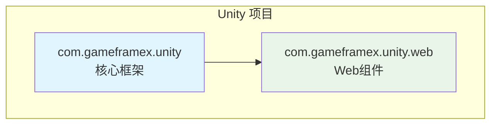
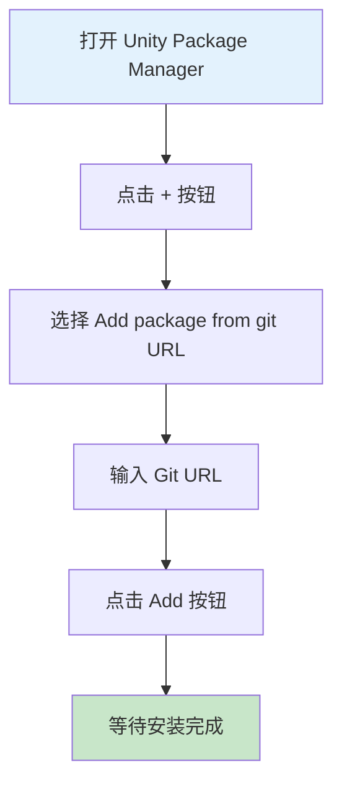
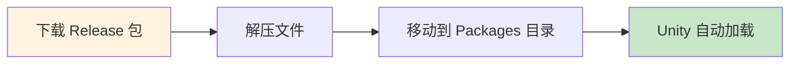

# 安装方式

GameFrameX Web 组件支持多种安装方式，以适应不同的项目需求和工作流程。本文将详细介绍三种推荐的安装方法。

## 概述

GameFrameX Web 是一个高性能的 Unity HTTP 网络请求库，基于 C# Task 异步模式构建，支持 GET、POST 请求，可处理字符串、JSON、二进制数据等多种格式。该组件依赖 GameFrameX 核心框架（com.gameframex.unity），安装时需要确保项目已正确配置核心框架。



## 安装前准备

在安装 GameFrameX Web 组件之前，请确保您的开发环境满足以下要求：

| 要求 | 最低版本 | 说明 |
|------|---------|------|
| Unity 编辑器 | 2019.4+ | LTS 版本推荐 |
| .NET Standard | 2.0+ | 脚本运行时版本 |
| Git | 任意版本 | 用于克隆或添加 Git URL |

> **提示**：建议使用 Unity 2020.3 LTS 或更高版本以获得最佳兼容性。

## 安装方式

### 方式一：通过 Git URL 安装（推荐）

这是最推荐的安装方式，可以轻松获取最新版本和更新。

**操作步骤：**

1. 在 Unity 编辑器中打开 **Package Manager** 窗口
2. 点击左上角的 **"+"** 按钮
3. 在下拉菜单中选择 **"Add package from git URL..."**
4. 在输入框中粘贴以下 URL：
   ```
   https://github.com/gameframex/com.gameframex.unity.web.git
   ```
5. 点击 **"Add"** 按钮等待安装完成



> **Source**: [README.md](https://github.com/GameFrameX/com.gameframex.unity.web/blob/main/README.md#L20-L27)

**优势：**
- 自动跟踪上游更新
- 简单快捷，一键安装
- 便于版本管理

### 方式二：通过 manifest.json 安装

适用于需要精确控制依赖版本或需要同时安装多个 GameFrameX 组件的场景。

**操作步骤：**

1. 找到并打开项目中的 `Packages/manifest.json` 文件
2. 在 `dependencies` 节点中添加以下内容：

```json
{
  "dependencies": {
    "com.gameframex.unity.web": "https://github.com/gameframex/com.gameframex.unity.web.git",
    "com.gameframex.unity": "https://github.com/gameframex/com.gameframex.unity.git"
  }
}
```

> **Source**: [README.md](https://github.com/GameFrameX/com.gameframex.unity.web/blob/main/README.md#L29-L40)

**说明：**
- 必须同时添加 `com.gameframex.unity` 作为核心依赖
- 可以指定具体版本号，例如：`"com.gameframex.unity.web": "1.3.0"`
- 修改 manifest.json 后，Unity 会自动解析并安装依赖

**版本格式说明：**

| 版本格式 | 示例 | 说明 |
|---------|------|------|
| 最新主版本 | `1.3.3` | 精确版本 |
| Git URL | `https://github.com/...git` | 始终获取最新 |
| 分支 | `#develop` | 获取指定分支 |

### 方式三：手动安装

适用于无法访问网络或需要离线使用的场景。

**操作步骤：**

1. 访问 GitHub releases 页面下载最新版本的发布包：
   - [Releases 页面](https://github.com/GameFrameX/com.gameframex.unity.web/releases)
2. 解压下载的发布包
3. 将解压后的文件夹移动到项目的 `Packages` 目录下
4. Unity 会自动识别并加载包



> **Source**: [README.md](https://github.com/GameFrameX/com.gameframex.unity.web/blob/main/README.md#L42-L46)

**注意事项：**
- 手动安装的包不会自动接收更新
- 需要手动下载新版本并替换
- 确保文件夹名称与包名匹配（com.gameframex.unity.web）

## 安装后验证

安装完成后，可以通过以下方式验证是否成功：

### 检查 Package Manager

在 Unity 中打开 **Window > Package Manager**，确认 `GameFrameX Web` 已出现在列表中，状态显示为 **"In Project"**。

### 检查程序集引用

创建一个简单的测试脚本，确认命名空间可以正常引用：

```csharp
using GameFrameX.Web.Runtime;

public class VerifyInstall : MonoBehaviour
{
    private IWebManager webManager;
    
    void Start()
    {
        // 尝试获取 Web 管理器实例
        webManager = GameFrameworkEntry.GetModule<IWebManager>();
        
        if (webManager != null)
        {
            Debug.Log("GameFrameX Web 安装成功！");
        }
    }
}
```

### 检查依赖项

确认以下依赖项已正确安装：

| 依赖包 | 必需 | 说明 |
|--------|------|------|
| com.gameframex.unity | ✅ 必需 | 核心框架 |
| GameFrameX.Network.Runtime | ✅ 必需 | 网络基础库 |
| ProtoBuffer.Runtime | ✅ 必需 | Protobuf 支持 |

## 卸载方式

如需卸载 GameFrameX Web 组件，请根据安装方式选择对应的卸载方法：

### 通过 Package Manager 卸载

1. 打开 **Window > Package Manager**
2. 在列表中找到 **Game Frame X Web**
3. 点击右侧的 **"Remove"** 按钮

### 通过 manifest.json 卸载

在 `Packages/manifest.json` 的 `dependencies` 中移除对应行：

```json
{
  "dependencies": {
    "com.gameframex.unity.web": "https://github.com/gameframex/com.gameframex.unity.web.git"
    // 移除上面这一行
  }
}
```

### 手动卸载

直接删除 `Packages/com.gameframex.unity.web` 文件夹即可。

## 常见问题

### Q1: 安装后提示缺少依赖怎么办？

这是因为核心框架未正确安装。请先安装 `com.gameframex.unity`：

```
https://github.com/gameframex/com.gameframex.unity.git
```

### Q2: Git URL 安装失败怎么解决？

1. 检查网络连接是否正常
2. 尝试使用代理或 VPN
3. 确认 Git 已正确安装且在系统 PATH 中

### Q3: 如何安装特定版本？

在 manifest.json 中指定版本号：

```json
{
  "dependencies": {
    "com.gameframex.unity.web": "1.3.3"
  }
}
```

## 相关链接

- [插件介绍](./01.overview)
- [快速开始 - 基础用法](./03.getting-started)
- [快速开始 - 使用 WebComponent](./08.web-component)
- [GitHub 仓库](https://github.com/GameFrameX/com.gameframex.unity.web.git)
- [官方文档](https://gameframex.doc.alianblank.com)
- [问题反馈](https://github.com/GameFrameX/com.gameframex.unity.web/issues)
