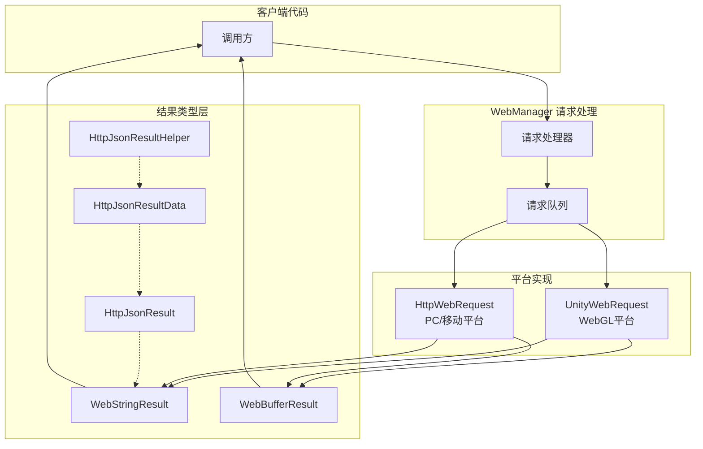

# 请求结果类型

GameFrameX Web 组件提供了多种请求结果类型，用于封装不同格式的 HTTP 响应数据。这些结果类型设计简洁，遵循统一的 API 设计模式，方便开发者根据业务需求选择合适的返回类型。

## 概述

在 GameFrameX Web 组件中，所有 HTTP 请求方法都返回特定的结果类型。根据请求方式和数据格式的不同，开发者可以选择获取字符串结果、字节数组结果或经过解析的 JSON 数据结构。

请求结果类型的设计遵循以下原则：
- **单一职责**：每种结果类型只负责封装一种特定格式的数据
- **用户数据传递**：支持通过 `UserData` 属性在请求和响应之间传递上下文数据
- **异常处理**：请求失败时通过异常机制传递错误信息，而非返回错误码

## 架构设计

请求结果类型在整体架构中扮演着数据封装层的角色，负责将底层 HTTP 响应转换为业务层可直接使用的对象。



### 各组件职责

| 组件 | 职责 |
|------|------|
| **WebStringResult** | 封装字符串格式的响应数据 |
| **WebBufferResult** | 封装二进制字节数组响应数据 |
| **HttpJsonResult** | 定义标准 JSON 响应结构（Code/Message/Data） |
| **HttpJsonResultData<T>** | 泛型结果包装器，带成功标志 |
| **HttpJsonResultHelper** | 提供 JSON 字符串到结果对象的转换方法 |

## 核心结果类型

### WebStringResult - 字符串结果

`WebStringResult` 用于封装返回字符串内容的 HTTP 响应，适用于处理纯文本、HTML 或非结构化文本数据的场景。

```csharp
namespace GameFrameX.Web.Runtime
{
    [UnityEngine.Scripting.Preserve]
    public sealed class WebStringResult
    {
        [UnityEngine.Scripting.Preserve]
        public WebStringResult(object userData, string result)
        {
            UserData = userData;
            Result = result;
        }

        /// <summary>
        /// 获取请求返回的字符串结果
        /// </summary>
        public string Result { get; }

        /// <summary>
        /// 获取用户自定义数据，在请求时传入的数据会原样返回
        /// </summary>
        public object UserData { get; }

        public override string ToString()
        {
            return $"[Result]:{Result}";
        }
    }
}
```

> Source: [WebStringResult.cs](https://github.com/GameFrameX/com.gameframex.unity.web/blob/main/Runtime/Web/WebStringResult.cs#L1-L40)

**属性说明：**

| 属性 | 类型 | 描述 |
|------|------|------|
| `Result` | string | HTTP 响应返回的字符串内容 |
| `UserData` | object | 发起请求时传入的自定义数据，用于在回调中识别请求上下文 |

### WebBufferResult - 二进制结果

`WebBufferResult` 用于封装返回字节数组的 HTTP 响应，适用于处理二进制数据，如图片、文件、Protocol Buffers 等场景。

```csharp
namespace GameFrameX.Web.Runtime
{
    public sealed class WebBufferResult
    {
        public WebBufferResult(object userData, byte[] result)
        {
            UserData = userData;
            Result = result;
        }

        /// <summary>
        /// 请求结果
        /// </summary>
        public byte[] Result { get; }

        /// <summary>
        /// 用户自定义数据
        /// </summary>
        public object UserData { get; }
    }
}
```

> Source: [WebBufferResult.cs](https://github.com/GameFrameX/com.gameframex.unity.web/blob/main/Runtime/Web/WebBufferResult.cs#L1-L21)

**属性说明：**

| 属性 | 类型 | 描述 |
|------|------|------|
| `Result` | byte[] | HTTP 响应返回的字节数组，可用于文件下载、图片加载等场景 |
| `UserData` | object | 发起请求时传入的自定义数据 |

### HttpJsonResult - JSON 响应结构

`HttpJsonResult` 定义了标准的 JSON 响应结构，适用于需要解析服务端统一返回格式的场景。很多后端 API 会返回统一的 JSON 格式，如 `{ "code": 0, "message": "success", "data": {...} }`。

```csharp
using Newtonsoft.Json;

namespace GameFrameX.Web.Runtime
{
    [UnityEngine.Scripting.Preserve]
    public sealed class HttpJsonResult
    {
        /// <summary>
        /// 响应码0 为成功
        /// </summary>
        [JsonProperty(PropertyName = "code")]
        public int Code { get; set; }

        /// <summary>
        /// 响应消息
        /// </summary>
        [JsonProperty(PropertyName = "message")]
        public string Message { get; set; }

        /// <summary>
        /// 响应数据.
        /// </summary>
        [JsonProperty(PropertyName = "data")]
        public string Data { get; set; }

        public override string ToString()
        {
            return JsonConvert.SerializeObject(this);
        }
    }
}
```

> Source: [HttpJsonResult.cs](https://github.com/GameFrameX/com.gameframex.unity.web/blob/main/Runtime/Extensions/HttpJsonResult.cs#L1-L34)

**属性说明：**

| 属性 | 类型 | JSON 字段 | 描述 |
|------|------|-----------|------|
| `Code` | int | code | 响应状态码，0 表示成功，其他值表示不同错误 |
| `Message` | string | message | 响应描述信息，通常用于错误提示 |
| `Data` | string | data | 响应数据内容，为 JSON 字符串格式 |

### HttpJsonResultData<T> - 泛型结果包装器

`HttpJsonResultData<T>` 是泛型结果类型，它在 `HttpJsonResult` 的基础上增加了成功标志和类型化的数据属性，方便直接获取强类型的结果数据。

```csharp
namespace GameFrameX.Web.Runtime
{
    public sealed class HttpJsonResultData<T>
    {
        /// <summary>
        /// 是否成功
        /// 表示请求是否成功执行，成功为true，失败为false。
        /// </summary>
        public bool IsSuccess { get; set; } = false;

        /// <summary>
        /// 响应码
        /// 表示请求的处理结果，为0表示成功，其他值表示不同的错误类型。
        /// </summary>
        public int Code { get; set; }

        /// <summary>
        /// 数据对象
        /// 包含请求成功时返回的数据，类型为T。
        /// 如果请求失败，可能为默认值或null。
        /// </summary>
        public T Data { get; set; }
    }
}
```

> Source: [HttpJsonResultData.cs](https://github.com/GameFrameX/com.gameframex.unity.web/blob/main/Runtime/Extensions/HttpJsonResultData.cs#L1-L29)

**属性说明：**

| 属性 | 类型 | 描述 |
|------|------|------|
| `IsSuccess` | bool | 请求是否成功完成的标志 |
| `Code` | int | 响应状态码，与 HttpJsonResult.Code 一致 |
| `Data` | T | 泛型数据对象，已完成 JSON 反序列化 |

### HttpJsonResultHelper - JSON 解析辅助类

`HttpJsonResultHelper` 提供了将 JSON 字符串转换为强类型 `HttpJsonResultData<T>` 对象的扩展方法，简化了从原始响应到业务对象的转换过程。

```csharp
using System;
using GameFrameX.Runtime;
using Newtonsoft.Json;

namespace GameFrameX.Web.Runtime
{
    public static class HttpJsonResultHelper
    {
        /// <summary>
        /// 将JSON字符串转换为HttpJsonResultData&lt;T&gt;对象。
        /// 该方法尝试反序列化给定的JSON字符串，并根据HTTP响应的状态码设置IsSuccess属性。
        /// 如果响应成功，Data属性将包含反序列化后的数据对象；否则，Data将为默认值。
        /// </summary>
        /// <typeparam name="T">要反序列化为的对象类型，必须是类并具有无参数构造函数。</typeparam>
        /// <param name="jsonResult">包含HTTP响应的JSON字符串。</param>
        /// <returns>HttpJsonResultData&lt;T&gt;对象，表示反序列化的结果。</returns>
        public static HttpJsonResultData<T> ToHttpJsonResultData<T>(this string jsonResult) where T : class, new()
        {
            HttpJsonResultData<T> resultData = new HttpJsonResultData<T>
            {
                IsSuccess = false,
            };
            try
            {
                var httpJsonResult = JsonConvert.DeserializeObject<HttpJsonResult>(jsonResult);
                if (httpJsonResult.Code != 0)
                {
                    resultData.Code = httpJsonResult.Code;
                    return resultData;
                }

                resultData.IsSuccess = true;
                resultData.Data = string.IsNullOrEmpty(httpJsonResult.Data) ? new T() : JsonConvert.DeserializeObject<T>(httpJsonResult.Data);
            }
            catch (Exception e)
            {
                Log.Error(e);
            }

            return resultData;
        }
    }
}
```

> Source: [HttpJsonResultHelper.cs](https://github.com/GameFrameX/com.gameframex.unity.web/blob/main/Runtime/Extensions/HttpJsonResultHelper.cs#L1-L50)

## 请求流程与结果处理

当调用 IWebManager 的请求方法时，整个请求到结果的流程如下：

```mermaid
sequenceDiagram
    participant Client as 客户端代码
    participant QM as WebManager
    participant Queue as 请求队列
    participant Platform as 平台层<br/>(UnityWebRequest/HttpWebRequest)
    participant Result as 结果类型

    Client->>QM: GetToString(url, userData)
    QM->>Queue: Enqueue(WebJsonData)
    Queue->>Platform: Process Request
    
    alt 请求成功
        Platform->>Result: new WebStringResult(userData, content)
        Result-->>Client: Task&lt;WebStringResult&gt; 完成
    else 请求失败
        Platform->>Client: SetException(Exception)
    end
```

### 结果类型选择指南

| 场景 | 推荐结果类型 | 说明 |
|------|-------------|------|
| 获取纯文本响应 | `Task<WebStringResult>` | 适用于 HTML、纯文本等非结构化数据 |
| 下载文件/图片 | `Task<WebBufferResult>` | 适用于二进制数据处理 |
| 统一 JSON API | `WebStringResult` + `HttpJsonResultHelper` | 适用于标准 JSON 响应格式 |
| 强类型 JSON 数据 | `WebStringResult` + `HttpJsonResultData<T>` | 适用于需要类型安全的场景 |

## 使用示例

### 基本字符串请求

```csharp
using GameFrameX.Web.Runtime;
using GameFrameX.Runtime;
using System.Threading.Tasks;

public async Task<string> GetStringResult()
{
    IWebManager webManager = GameFrameworkEntry.GetModule<IWebManager>();
    
    // 发送 GET 请求
    var result = await webManager.GetToString("https://api.example.com/text");
    
    // 获取字符串结果
    string content = result.Result;
    
    // 获取请求时传入的自定义数据
    object userData = result.UserData;
    
    return content;
}
```

> Source: [WebManager.cs](https://github.com/GameFrameX/com.gameframex.unity.web/blob/main/Runtime/Web/WebManager.cs#L140-L143)

### 二进制数据请求

```csharp
using GameFrameX.Web.Runtime;
using GameFrameX.Runtime;
using System.Threading.Tasks;

public async Task<byte[]> DownloadFile()
{
    IWebManager webManager = GameFrameworkEntry.GetModule<IWebManager>();
    
    // 发送 GET 请求获取字节数组
    var result = await webManager.GetToBytes("https://api.example.com/file/image.png");
    
    // 获取二进制数据
    byte[] data = result.Result;
    
    return data;
}
```

> Source: [WebManager.cs](https://github.com/GameFrameX/com.gameframex.unity.web/blob/main/Runtime/Web/WebManager.cs#L152-L155)

### JSON 响应解析

```csharp
using GameFrameX.Web.Runtime;
using GameFrameX.Runtime;
using Newtonsoft.Json;
using System.Threading.Tasks;

// 定义响应数据类型
public class UserInfo
{
    [JsonProperty("id")]
    public int Id { get; set; }
    
    [JsonProperty("name")]
    public string Name { get; set; }
    
    [JsonProperty("email")]
    public string Email { get; set; }
}

public async Task<UserInfo> GetUserInfo()
{
    IWebManager webManager = GameFrameworkEntry.GetModule<IWebManager>();
    
    // 获取原始 JSON 字符串
    var result = await webManager.GetToString("https://api.example.com/user/1");
    string jsonResponse = result.Result;
    
    // 使用辅助类转换为强类型结果
    var jsonResult = jsonResponse.ToHttpJsonResultData<UserInfo>();
    
    // 检查请求是否成功
    if (jsonResult.IsSuccess)
    {
        return jsonResult.Data;
    }
    else
    {
        Log.Error($"请求失败，错误码：{jsonResult.Code}");
        return null;
    }
}
```

> Source: [HttpJsonResultHelper.cs](https://github.com/GameFrameX/com.gameframex.unity.web/blob/main/Runtime/Extensions/HttpJsonResultHelper.cs#L20-L48)

### 带用户数据的请求追踪

```csharp
using GameFrameX.Web.Runtime;
using GameFrameX.Runtime;
using System.Threading.Tasks;
using System.Collections.Generic;

public class RequestContext
{
    public string RequestId { get; set; }
    public string RequestType { get; set; }
}

public async Task TrackRequestWithUserData()
{
    IWebManager webManager = GameFrameworkEntry.GetModule<IWebManager>();
    
    // 创建请求上下文
    var context = new RequestContext 
    { 
        RequestId = System.Guid.NewGuid().ToString(),
        RequestType = "UserInfo" 
    };
    
    // 将上下文作为 userData 传入
    var result = await webManager.GetToString(
        "https://api.example.com/user/1", 
        context  // 传入自定义数据
    );
    
    // 在回调中获取上下文信息
    var returnedContext = result.UserData as RequestContext;
    if (returnedContext != null)
    {
        Log.Info($"请求 {returnedContext.RequestId} 完成");
    }
}
```

### 错误处理

请求失败时，异常会通过 Task 的异常机制传播。需要在调用处进行 try-catch 处理：

```csharp
using GameFrameX.Web.Runtime;
using GameFrameX.Runtime;
using System;
using System.IO;
using System.Net;
using System.Threading.Tasks;

public async Task<string> SafeRequest(string url)
{
    IWebManager webManager = GameFrameworkEntry.GetModule<IWebManager>();
    
    try
    {
        var result = await webManager.GetToString(url);
        return result.Result;
    }
    catch (WebException ex) when (ex.Status == WebExceptionStatus.Timeout)
    {
        Log.Error($"请求超时：{url} - {ex.Message}");
        throw;
    }
    catch (IOException ex)
    {
        Log.Error($"网络IO错误：{url} - {ex.Message}");
        throw;
    }
    catch (Exception ex)
    {
        Log.Error($"请求失败：{url} - {ex.Message}");
        throw;
    }
}
```

> Source: [WebManager.cs](https://github.com/GameFrameX/com.gameframex.unity.web/blob/main/Runtime/Web/WebManager.cs#L298-L324)

## API 参考

### WebStringResult

```csharp
namespace GameFrameX.Web.Runtime
{
    public sealed class WebStringResult
    {
        public WebStringResult(object userData, string result);
        
        // 属性
        public string Result { get; }
        public object UserData { get; }
        
        public override string ToString();
    }
}
```

### WebBufferResult

```csharp
namespace GameFrameX.Web.Runtime
{
    public sealed class WebBufferResult
    {
        public WebBufferResult(object userData, byte[] result);
        
        // 属性
        public byte[] Result { get; }
        public object UserData { get; }
    }
}
```

### HttpJsonResult

```csharp
namespace GameFrameX.Web.Runtime
{
    public sealed class HttpJsonResult
    {
        [JsonProperty("code")]
        public int Code { get; set; }
        
        [JsonProperty("message")]
        public string Message { get; set; }
        
        [JsonProperty("data")]
        public string Data { get; set; }
    }
}
```

### HttpJsonResultData<T>

```csharp
namespace GameFrameX.Web.Runtime
{
    public sealed class HttpJsonResultData<T>
    {
        public bool IsSuccess { get; set; }
        public int Code { get; set; }
        public T Data { get; set; }
    }
}
```

### HttpJsonResultHelper

```csharp
namespace GameFrameX.Web.Runtime
{
    public static class HttpJsonResultHelper
    {
        public static HttpJsonResultData<T> ToHttpJsonResultData<T>(
            this string jsonResult
        ) where T : class, new();
    }
}
```

## 相关链接

- [WebManager 架构](./05.web-manager) - 了解 WebManager 的完整架构和请求处理流程
- [IWebManager 接口](./04.iwebmanager-interface) - 查看所有 HTTP 请求方法的详细 API
- [WebComponent 组件](./08.web-component) - 使用 WebComponent 的便捷封装
- [超时配置](./10.timeout-settings) - 配置请求超时时间
- [基础数据配置](./07.base-data) - 配置全局请求参数
