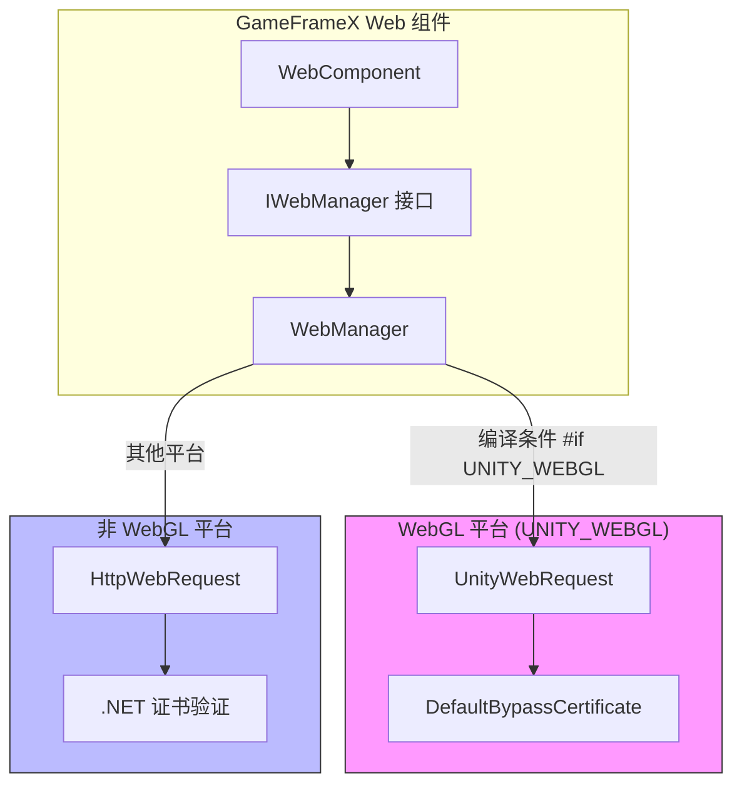
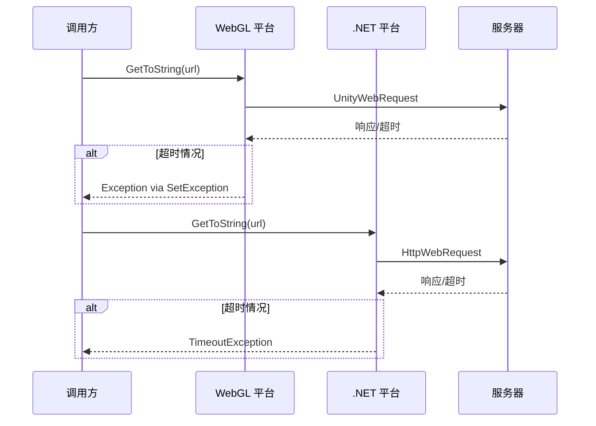

# 平台差异说明

本文档详细介绍 GameFrameX Web 组件在不同 Unity 平台上的实现差异，帮助开发者理解各平台的特点并正确使用组件。

## 概述

GameFrameX Web 组件支持三大平台类别：

- **WebGL 平台**：适用于浏览器环境发布的 WebGL 构建
- **非 WebGL 平台**：包括 PC（Windows、Mac、Linux）、iOS、Android 等原生平台

这两种平台在网络请求实现机制上存在本质差异，主要体现在：

| 特性 | WebGL 平台 | 非 WebGL 平台 |
|------|------------|---------------|
| 网络库 | UnityWebRequest | System.Net.HttpWebRequest |
| 异步模式 | 回调式（Callback） | 异步等待（async/await） |
| 多线程支持 | 不支持 | 支持 |
| 证书处理 | 自定义 CertificateHandler | .NET 标准证书验证 |

## 架构差异



### 设计意图

插件采用条件编译（`#if UNITY_WEBGL`）实现平台差异，这种设计带来了以下优势：

1. **统一接口**：上层调用代码无需关心底层实现细节
2. **性能优化**：每个平台都能使用最适合的网络库
3. **功能一致**：尽管实现不同，对外提供的 API 完全一致

## 核心实现差异

### 请求发送方式

**WebGL 平台实现：**

在 WebGL 平台上，请求通过 `UnityWebRequest` 发送，使用事件回调处理完成通知。

```csharp
// Source: Runtime/Web/WebManager.cs#L213-L258
#if UNITY_WEBGL
UnityWebRequest unityWebRequest;
if (webJsonData.IsGet)
{
    unityWebRequest = UnityWebRequest.Get(webJsonData.URL);
}
else
{
    unityWebRequest = UnityWebRequest.Post(webJsonData.URL, string.Empty);
}

unityWebRequest.certificateHandler = new DefaultBypassCertificate();
unityWebRequest.timeout = (int)RequestTimeout.TotalSeconds;
// ... 设置请求头和请求体

var asyncOperation = unityWebRequest.SendWebRequest();
asyncOperation.completed += (asyncOperation2) =>
{
    m_SendingNormalList.Remove(webJsonData);
    if (unityWebRequest.isNetworkError || unityWebRequest.isHttpError || unityWebRequest.error != null)
    {
        webJsonData.UniTaskCompletionStringSource.TrySetException(new Exception(unityWebRequest.error));
        return;
    }
    webJsonData.UniTaskCompletionStringSource.SetResult(new WebStringResult(webJsonData.UserData, unityWebRequest.downloadHandler.text));
};
#endif
```

**非 WebGL 平台实现：**

在非 WebGL 平台上，请求通过 `HttpWebRequest` 发送，支持真正的异步等待。

```csharp
// Source: Runtime/Web/WebManager.cs#L260-L328
#else
try
{
    HttpWebRequest request = WebRequest.CreateHttp(webJsonData.URL);
    request.Method = webJsonData.IsGet ? WebRequestMethods.Http.Get : WebRequestMethods.Http.Post;
    request.Timeout = (int)RequestTimeout.TotalMilliseconds;
    // ... 设置请求头和请求体

    using (HttpWebResponse response = (HttpWebResponse)await request.GetResponseAsync())
    {
        using (StreamReader reader = new StreamReader(response.GetResponseStream()))
        {
            string content = await reader.ReadToEndAsync();
            webJsonData.UniTaskCompletionStringSource.SetResult(new WebStringResult(webJsonData.UserData, content));
        }
    }
}
catch (WebException e)
{
    if (e.Status == WebExceptionStatus.Timeout)
    {
        webJsonData.UniTaskCompletionStringSource.SetException(new TimeoutException(e.Message));
        return;
    }
    webJsonData.UniTaskCompletionStringSource.SetException(e);
}
finally
{
    m_SendingNormalList.Remove(webJsonData);
}
#endif
```

### 证书处理差异

**WebGL 平台：**

WebGL 平台使用自定义的证书处理器来绕过证书验证，这对于开发调试和自签名证书环境非常有用。

```csharp
// Source: Runtime/Web/DefaultBypassCertificate.cs
public sealed class DefaultBypassCertificate : CertificateHandler
{
    protected override bool ValidateCertificate(byte[] certificateData)
    {
        return true;
    }
}
```

> Source: [DefaultBypassCertificate.cs](https://github.com/GameFrameX/com.gameframex.unity.web/blob/main/Runtime/Web/DefaultBypassCertificate.cs#L41-L44)

WebGL 平台在创建请求时应用此证书处理器：

```csharp
// Source: Runtime/Web/WebManager.cs#L224
unityWebRequest.certificateHandler = new DefaultBypassCertificate();
```

**非 WebGL 平台：**

非 WebGL 平台使用 .NET 标准证书验证机制，在生产环境中提供更安全的 HTTPS 保护。

### 超时处理差异



两个平台对超时异常的处理方式略有不同：

- **WebGL**：通过检测 `unityWebRequest.error` 判断超时和其他错误
- **非 WebGL**：通过捕获 `WebExceptionStatus.Timeout` 异常并转换为 `TimeoutException`

## 各平台使用注意事项

### WebGL 平台

1. **单线程限制**：WebGL 不支持多线程，所有网络请求都在主线程通过回调处理
2. **跨域请求（CORS）**：浏览器环境强制执行同源策略，确保服务器正确配置 CORS 头
3. **HTTPS 证书**：使用默认的证书绕过处理器，生产环境需考虑替换
4. **异步模式**：虽然接口返回 `Task`，但内部实现是回调式的

### 非 WebGL 平台（PC/iOS/Android）

1. **真异步支持**：使用 .NET 的 `async/await` 模式，真正实现非阻塞
2. **标准证书验证**：使用系统默认的证书验证机制，更安全可靠
3. **超时精度**：使用毫秒级超时控制
4. **连接池管理**：通过 `MaxConnectionPerServer` 配置控制并发连接数

## 平台检测与条件编译

在开发过程中，如果需要根据平台执行不同逻辑，可以使用以下方式：

```csharp
#if UNITY_WEBGL
    // WebGL 平台特定代码
    Debug.Log("Running on WebGL platform");
#else
    // 其他平台代码
    Debug.Log("Running on native platform");
#endif
```

### 脚本定义符号

插件提供了两个用于调试的脚本定义符号：

| 符号 | 说明 |
|------|------|
| `ENABLE_GAMEFRAMEX_WEB_SEND_LOG` | 启用请求发送日志 |
| `ENABLE_GAMEFRAMEX_WEB_RECEIVE_LOG` | 启用响应接收日志 |

> Source: [WebLogScriptingDefineSymbols.cs](https://github.com/GameFrameX/com.gameframex.unity.web/blob/main/Editor/WebLogScriptingDefineSymbols.cs#L42-L43)

可以通过 Unity 菜单 `GameFrameX/Scripting Define Symbols` 快速开关这些日志。

## 常见平台问题

### WebGL 平台 CORS 错误

**问题**：浏览器控制台显示 "Access to fetch ... has been blocked by CORS policy"

**解决方案**：
1. 确保服务器正确设置 CORS 响应头：
   ```
   Access-Control-Allow-Origin: *
   Access-Control-Allow-Methods: GET, POST, OPTIONS
   Access-Control-Allow-Headers: Content-Type, Authorization
   ```
2. 服务器需要处理 OPTIONS 预检请求

### 超时设置不生效

**问题**：设置的超时时间在 WebGL 平台似乎无效

**原因分析**：
- WebGL 平台的 `UnityWebRequest.timeout` 属性设置的是整秒数
- 非 WebGL 平台使用毫秒级精度

**建议**：在 WebGL 平台使用较长超时时间（建议 10 秒以上）

### HTTPS 证书警告

**问题**：WebGL 平台请求 HTTPS 地址时出现证书警告

**原因**：使用了默认的证书绕过处理器

**解决方案**：生产环境建议实现自定义 `CertificateHandler` 进行实际证书验证

## 相关链接

- [插件介绍](./01.overview)
- [基础用法](./03.getting-started)
- [WebComponent 组件](./08.web-component)
- [IWebManager 接口](./04.iwebmanager-interface)
- [超时配置](./10.timeout-settings)
- [常见问题](./11.troubleshooting)
