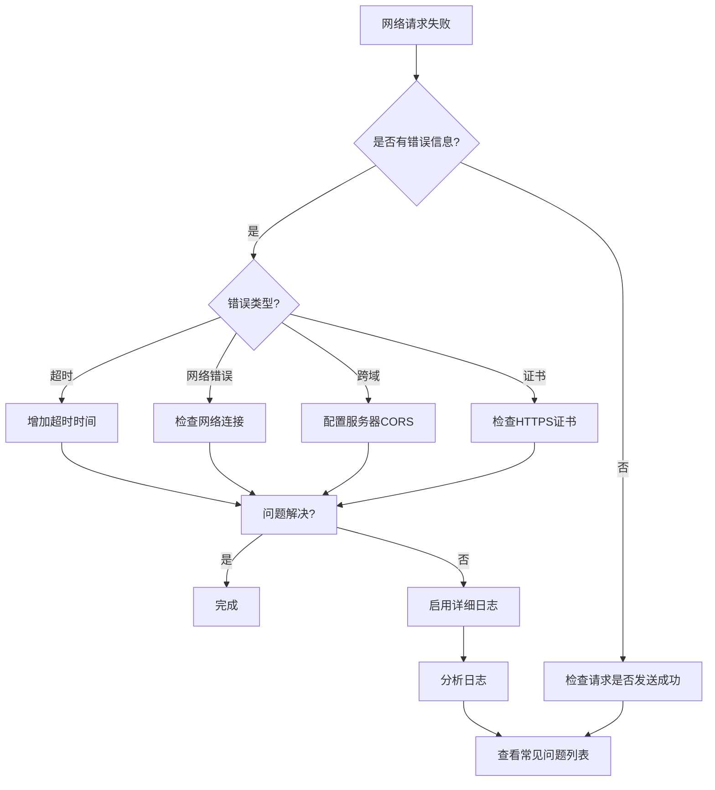

# 常见问题

本文档汇总了 GameFrameX Unity Web 插件在使用过程中常见的 问题、原因分析以及对应的解决方案。

## 概述

GameFrameX Web 组件是一个高性能的 Unity HTTP 网络请求库，支持 GET、POST 请求，可处理字符串、JSON、二进制数据等多种格式。在实际使用过程中，开发者经常会遇到一些问题，本文档将帮助你快速定位和解决这些问题。

## 常见问题列表

### 1. WebGL 平台请求失败

**问题描述**：
在 WebGL 平台上发送网络请求时，请求没有响应或直接报错。

**可能原因**：
- WebGL 平台存在跨域限制
- 服务器未正确配置 CORS 头信息
- WebGL 不支持多线程，所有请求在主线程处理

**解决方案**：

1. **确保服务器配置 CORS**
   服务器需要返回以下 CORS 响应头：
   ```http
   Access-Control-Allow-Origin: *
   Access-Control-Allow-Methods: GET, POST, OPTIONS
   Access-Control-Allow-Headers: Content-Type, Authorization
   ```

2. **处理 OPTIONS 预检请求**
   对于非简单请求（带自定义头或 Content-Type 不是 application/x-www-form-urlencoded），服务器必须支持 OPTIONS 预检请求。

3. **使用异步等待而非阻塞调用**
   WebGL 不支持多线程，建议使用 `await` 异步等待而不是 `.Wait()` 或 `.Result` 阻塞调用：

   ```csharp
   // ✅ 推荐：异步等待
   private async void Start()
   {
       var webManager = GameFrameworkEntry.GetModule<IWebManager>();
       var result = await webManager.GetToString("https://api.example.com/data");
       Debug.Log(result.Result);
   }
   
   // ❌ 避免：阻塞调用（WebGL 上会卡死）
   private void Start()
   {
       var webManager = GameFrameworkEntry.GetModule<IWebManager>();
       var result = webManager.GetToString("https://api.example.com/data").Result; // 会导致死锁
   }
   ```

---

### 2. 请求超时

**问题描述**：
网络请求长时间没有响应，最终抛出超时异常。

**可能原因**：
- 网络连接不稳定或网络不可达
- 服务器响应缓慢
- 超时时间设置过短

**解决方案**：

1. **调整超时时间**
   
   ```csharp
   // 方法一：通过 WebComponent 组件设置超时
   var webComponent = gameObject.GetOrAddComponent<WebComponent>();
   webComponent.Timeout = 60f; // 设置为 60 秒
   
   // 方法二：通过 IWebManager 接口设置超时
   var webManager = GameFrameworkEntry.GetModule<IWebManager>();
   webManager.Timeout = 60f; // 设置为 60 秒
   ```

   > Source: [WebComponent.cs](https://github.com/GameFrameX/com.gameframex.unity.web/blob/main/Runtime/Web/WebComponent.cs#L66-L70)

2. **实现重试机制**
   
   ```csharp
   public async Task<T> RetryRequest<T>(Func<Task<T>> requestFunc, int maxRetries = 3)
   {
       for (int i = 0; i < maxRetries; i++)
       {
           try
           {
               return await requestFunc();
           }
           catch (TimeoutException)
           {
               if (i == maxRetries - 1) throw;
               await Task.Delay(1000 * (i + 1)); // 指数退避
           }
       }
       throw new Exception("重试次数耗尽");
   }
   ```

3. **启用详细日志排查**
   开启日志有助于定位超时原因：

   - 在 Unity 菜单中选择 **GameFrameX → Scripting Define Symbols → Enable Web Send Logs** 开启发送日志
   - 选择 **GameFrameX → Scripting Define Symbols → Enable Web Receive Logs** 开启接收日志

---

### 3. HTTPS 证书验证失败

**问题描述**：
在移动设备上发送 HTTPS 请求时，出现证书验证失败错误。

**可能原因**：
- 设备时间不正确
- 服务器证书过期或无效
- 自签名证书
- 证书链不完整

**解决方案**：

1. **使用默认证书绕过（仅用于开发测试）**
   
   插件已内置 `DefaultBypassCertificate` 类用于绕过证书验证：
   
   ```csharp
   // 插件已自动处理，非必要无需手动配置
   unityWebRequest.certificateHandler = new DefaultBypassCertificate();
   ```
   
   > Source: [WebManager.cs](https://github.com/GameFrameX/com.gameframex.unity.web/blob/main/Runtime/Web/WebManager.cs#L224)

2. **生产环境建议**
   - 确保服务器使用受信任 CA 签发的有效证书
   - 移动设备时间设置正确
   - 在正式发布时移除证书绕过代码

---

### 4. 请求队列阻塞

**问题描述**：
发送多个请求后，部分请求一直处于等待状态，长时间没有响应。

**可能原因**：
- 并发连接数限制（`MaxConnectionPerServer` 默认值为 8）
- 请求队列已满
- 前面的请求出现阻塞

**解决方案**：

1. **调整并发连接数**
   
   ```csharp
   var webManager = GameFrameworkEntry.GetModule<IWebManager>();
   // 设置为 16 个并发连接
   ((WebManager)webManager).MaxConnectionPerServer = 16;
   ```
   
   > Source: [WebManager.cs](https://github.com/GameFrameX/com.gameframex.unity.web/blob/main/Runtime/Web/WebManager.cs#L71)

2. **合理设计请求**
   - 区分高优先级和低优先级请求
   - 大文件下载使用单独的连接
   - 批量请求时分批发送

---

### 5. 基础数据未生效

**问题描述**：
通过 `AddBaseForm`、`AddBaseHeader` 等方法设置的基础数据，在实际请求中没有被包含。

**可能原因**：
- 基础数据在请求发送前未正确添加
- 添加后被清空
- 合并逻辑问题

**解决方案**：

1. **确保在请求前添加基础数据**
   
   ```csharp
   var webManager = GameFrameworkEntry.GetModule<IWebManager>();
   
   // 添加基础请求头（每次请求都会自动包含）
   webManager.AddBaseHeader("Authorization", "Bearer your-token");
   webManager.AddBaseHeader("X-App-Version", "1.0.0");
   
   // 添加基础表单数据
   webManager.AddBaseForm("platform", "android");
   webManager.AddBaseForm("deviceId", SystemInfo.deviceUniqueIdentifier);
   
   // 添加基础查询参数
   webManager.AddBaseQueryString("lang", "zh-CN");
   
   // 发送请求
   var result = await webManager.GetToString("https://api.example.com/data");
   ```
   
   > Source: [IWebManager.cs](https://github.com/GameFrameX/com.gameframex.unity.web/blob/main/Runtime/Web/IWebManager.cs#L147-L198)

2. **检查数据是否被意外清空**
   
   确保没有调用以下方法：
   - `ClearBaseForm()` - 清空基础表单
   - `ClearBaseHeader()` - 清空基础请求头
   - `ClearBaseQueryString()` - 清空基础查询参数

---

### 6. 返回结果解析错误

**问题描述**：
请求成功返回，但解析响应数据时出现异常。

**可能原因**：
- 响应数据格式与预期不符
- JSON 序列化/反序列化失败
- 数据为空或 null

**解决方案**：

1. **正确处理返回结果**
   
   ```csharp
   var webManager = GameFrameworkEntry.GetModule<IWebManager>();
   var result = await webManager.GetToString("https://api.example.com/data");
   
   // 检查是否有错误
   if (result != null && !string.IsNullOrEmpty(result.Result))
   {
       try
       {
           var data = JsonUtility.FromJson<MyDataClass>(result.Result);
           Debug.Log($"解析成功: {data.name}");
       }
       catch (Exception e)
       {
           Debug.LogError($"JSON解析失败: {e.Message}");
       }
   }
   else
   {
       Debug.LogWarning("响应数据为空");
   }
   ```
   
   > Source: [WebStringResult.cs](https://github.com/GameFrameX/com.gameframex.unity.web/blob/main/Runtime/Web/WebStringResult.cs#L15-L38)

2. **使用字节数组接收二进制数据**
   
   ```csharp
   var bufferResult = await webManager.GetToBytes("https://api.example.com/file");
   if (bufferResult != null && bufferResult.Result != null)
   {
       byte[] data = bufferResult.Result;
       Debug.Log($"接收数据大小: {data.Length} bytes");
   }
   ```
   
   > Source: [WebBufferResult.cs](https://github.com/GameFrameX/com.gameframex.unity.web/blob/main/Runtime/Web/WebBufferResult.cs#L1-L20)

---

### 7. 平台差异导致的行为不一致

**问题描述**：
同一个请求在 Editor/PC 上正常工作，但在 WebGL 或移动平台上失败。

**可能原因**：
- 不同平台使用不同的网络库
- WebGL 使用 `UnityWebRequest`，其他平台使用 `HttpWebRequest`
- 平台特定的功能限制

**解决方案**：

1. **理解平台差异**
   
   ```csharp
   // WebGL 平台使用 UnityWebRequest
   #if UNITY_WEBGL
       UnityWebRequest unityWebRequest;
       // WebGL 特定实现
   #else
       // 其他平台使用 HttpWebRequest
       HttpWebRequest request = WebRequest.CreateHttp(url);
   #endif
   ```
   
   > Source: [WebManager.cs](https://github.com/GameFrameX/com.gameframex.unity.web/blob/main/Runtime/Web/WebManager.cs#L213-L329)

2. **使用条件编译处理平台特定代码**
   
   ```csharp
   public async Task<string> GetDataAsync(string url)
   {
       try
       {
           return await webManager.GetToString(url);
       }
       catch (Exception e)
       {
   #if UNITY_WEBGL
           // WebGL 特定错误处理
           Debug.LogError($"WebGL错误: {e.Message}");
   #else
           // 其他平台错误处理
           Debug.LogError($"网络错误: {e.Message}");
   #endif
           throw;
       }
   }
   ```

---

### 8. 调试技巧

**问题描述**：
需要排查网络请求问题，但不知道如何获取详细信息。

**解决方案**：

1. **启用详细日志**
   
   在 Unity 编辑器中：
   - 菜单：**GameFrameX → Scripting Define Symbols → Enable Web Send Logs**
   - 菜单：**GameFrameX → Scripting Define Symbols → Enable Web Receive Logs**

   日志宏定义：
   ```csharp
   // 发送日志
   #if ENABLE_GAMEFRAMEX_WEB_SEND_LOG
       Log.Debug($"Web Request: {webJsonData.URL} \n Header: {...}");
   #endif
   
   // 接收日志
   #if ENABLE_GAMEFRAMEX_WEB_RECEIVE_LOG
       Log.Debug($"Web Response: {webJsonData.URL} \n Content: {...}");
   #endif
   ```
   
   > Source: [WebLogScriptingDefineSymbols.cs](https://github.com/GameFrameX/com.gameframex.unity.web/blob/main/Editor/WebLogScriptingDefineSymbols.cs#L42-L79)

2. **在 Player Settings 中启用调试**
   - 打开 **Edit → Project Settings → Player**
   - 勾选 **Development Build**
   - 勾选 **Script Debugging**

3. **使用 Unity Profiler 监控网络**
   - 打开 **Window → Analysis → Profiler**
   - 添加 **Network** 面板监控网络请求

---

### 9. 请求返回异常类型

**问题描述**：
不清楚请求失败时会抛出哪些异常类型。

**解决方案**：

插件会根据不同错误情况抛出以下异常：

| 异常类型 | 触发条件 | 处理建议 |
|---------|---------|---------|
| `TimeoutException` | 请求超时 | 增加超时时间或检查网络 |
| `WebException` | 网络错误 | 检查网络连接和服务器状态 |
| `IOException` | IO 错误 | 检查数据读写问题 |
| `Exception` | 其他错误 | 查看具体错误信息 |

```csharp
try
{
    var result = await webManager.GetToString(url);
}
catch (TimeoutException ex)
{
    Debug.LogError($"请求超时: {ex.Message}");
}
catch (WebException ex)
{
    Debug.LogError($"网络错误: {ex.Message}, 状态: {ex.Status}");
}
catch (IOException ex)
{
    Debug.LogError($"IO错误: {ex.Message}");
}
catch (Exception ex)
{
    Debug.LogError($"未知错误: {ex.Message}");
}
```
> Source: [WebManager.cs](https://github.com/GameFrameX/com.gameframex.unity.web/blob/main/Runtime/Web/WebManager.cs#L298-L324)

---

## 诊断流程图



---

## 相关链接

- [插件介绍](./01.overview)
- [安装方式](./02.installation)
- [基础用法](./03.getting-started)
- [使用 WebComponent](./08.web-component)
- [WebManager 架构](./05.web-manager)
- [请求结果类型](./06.result-types)
- [IWebManager 接口](./04.iwebmanager-interface)
- [WebComponent 组件](./08.web-component)
- [超时配置](./10.timeout-settings)
- [基础数据配置](./07.base-data)
- [平台差异说明](./09.platform-differences)
