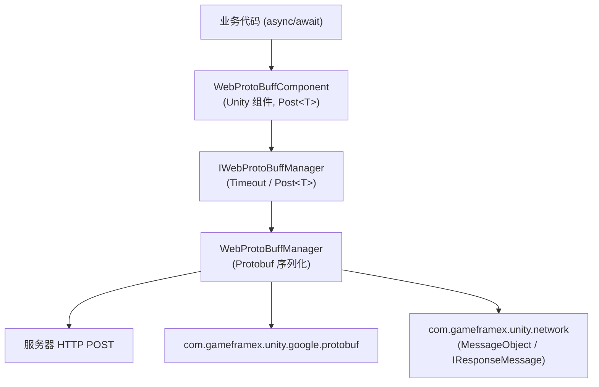

# Web ProtoBuff 组件简介:它能帮你做什么

Web ProtoBuff 是 GameFrameX 的 HTTP Protobuf 请求组件:它让你用一行 `await` 就能把 Protocol Buffer 消息通过 HTTP POST 发给服务器,并把响应直接反序列化为指定类型的 `T`(继承 `MessageObject` 并实现 `IResponseMessage`)。它基于 `Task<T>` 异步 API,支持自定义超时,兼容 Unity WebGL 及其他原生平台。

## 快速开始

1. **安装包**。编辑 Unity 项目的 `Packages/manifest.json`,添加 `scopedRegistries` 并声明依赖:

   ```json
   {
     "scopedRegistries": [
       {
         "name": "GameFrameX",
         "url": "https://gameframex.upm.alianblank.uk",
         "scopes": [
           "com.gameframex"
         ]
       }
     ],
     "dependencies": {
       "com.gameframex.unity.web.protobuff": "1.1.3"
     }
   }
   ```

   Source: [README.zh-CN.md](https://github.com/GameFrameX/com.gameframex.unity.web.protobuff/blob/main/README.zh-CN.md#L47-L63)

   也可以改用 Git URL 方式:`"com.gameframex.unity.web.protobuff": "https://github.com/gameframex/com.gameframex.unity.web.protobuff.git"`,或在 Package Manager 中通过 Git URL 添加。

2. **添加宏定义**。在 Unity 的 **Player Settings** → **Scripting Define Symbols** 中加入:

   `ENABLE_GAME_FRAME_X_WEB_PROTOBUF_NETWORK`

   未启用该宏时,`Post<T>` 相关 API 不会编译进工程。

3. **挂组件并调用**。在场景中的 GameFramework 物体上添加 **GameFrameX/Web ProtoBuff** 组件(`WebProtoBuffComponent`,默认超时 5 秒),然后发送请求:

   ```csharp
   using GameFrameX.Web.ProtoBuff.Runtime;

   // 发送请求并等待结果
   LoginResponse response = await WebComponent.Post<LoginResponse>(url, request);
   ```

   Source: [README.zh-CN.md](https://github.com/GameFrameX/com.gameframex.unity.web.protobuff/blob/main/README.zh-CN.md#L108-L113)

## 核心 API

组件暴露的请求入口与管理器接口如下:

```csharp
public Task<T> Post<T>(string url, GameFrameX.Network.Runtime.MessageObject message)
    where T : GameFrameX.Network.Runtime.MessageObject, GameFrameX.Network.Runtime.IResponseMessage
```

Source: [WebProtoBuffComponent.cs](https://github.com/GameFrameX/com.gameframex.unity.web.protobuff/blob/main/Runtime/Web/WebProtoBuffComponent.cs#L105-L108)

| 名称 | 签名/类型 | 说明 |
|------|-----------|------|
| `Post<T>` | `Task<T> Post<T>(string url, MessageObject message)` | 发送 Protobuf POST 请求并把响应解析为 `T`;`T` 必须继承 `MessageObject` 且实现 `IResponseMessage`,仅在 `ENABLE_GAME_FRAME_X_WEB_PROTOBUF_NETWORK` 宏下可用 |
| `Timeout` | `float { get; set; }` | POST 请求超时时间(秒),默认 5 秒,可在 Inspector 中配置 |
| `WebProtoBuffComponent` | Unity 组件 | 组件菜单 `GameFrameX/Web ProtoBuff`,单物体仅允许一个,需 `GameFrameXWebProtoBuffCroppingHelper` |
| `IWebProtoBuffManager` | 接口 | 管理器接口,`WebProtoBuffComponent` 内部通过 `GameFrameworkEntry.GetModule<IWebProtoBuffManager>()` 获取实现 |

Source: [IWebProtoBuffManager.cs](https://github.com/GameFrameX/com.gameframex.unity.web.protobuff/blob/main/Runtime/Web/IWebProtoBuffManager.cs#L9-L29)

运行时依赖两个包,安装时由 UPM 自动解析:

| 依赖包 | 版本 |
|--------|------|
| `com.gameframex.unity.network` | 2.6.10 |
| `com.gameframex.unity.google.protobuf` | 3.4.2 |

Source: [package.json](https://github.com/GameFrameX/com.gameframex.unity.web.protobuff/blob/main/package.json#L25-L26)

## 工作原理速览

调用链很简单:你调用组件上的 `Post<T>`,组件把请求交给管理器,管理器负责 Protobuf 序列化/反序列化与 HTTP 发送。



## 常见错误

- **`Post<T>` 不存在 / 编译报错**:未在 Scripting Define Symbols 中添加 `ENABLE_GAME_FRAME_X_WEB_PROTOBUF_NETWORK`。该 API 由 `#if ENABLE_GAME_FRAME_X_WEB_PROTOBUF_NETWORK` 条件编译控制。
- **泛型约束不满足**:`T` 必须同时继承 `MessageObject` 并实现 `IResponseMessage`,请求消息参数必须继承 `MessageObject`。
- **请求长时间无响应卡住**:检查组件 Inspector 上的超时时间(单位秒,默认 5),或通过 `Timeout` 属性调整。

## 接下来

- 官方文档:https://gameframex.doc.alianblank.com
- 发送请求与处理响应的具体用法,见本站任务页
- 版本历史,见 [CHANGELOG.md](https://github.com/GameFrameX/com.gameframex.unity.web.protobuff/blob/main/CHANGELOG.md)
- 多语言 README:[简体中文](https://github.com/GameFrameX/com.gameframex.unity.web.protobuff/blob/main/README.zh-CN.md) · [English](https://github.com/GameFrameX/com.gameframex.unity.web.protobuff/blob/main/README.md)
