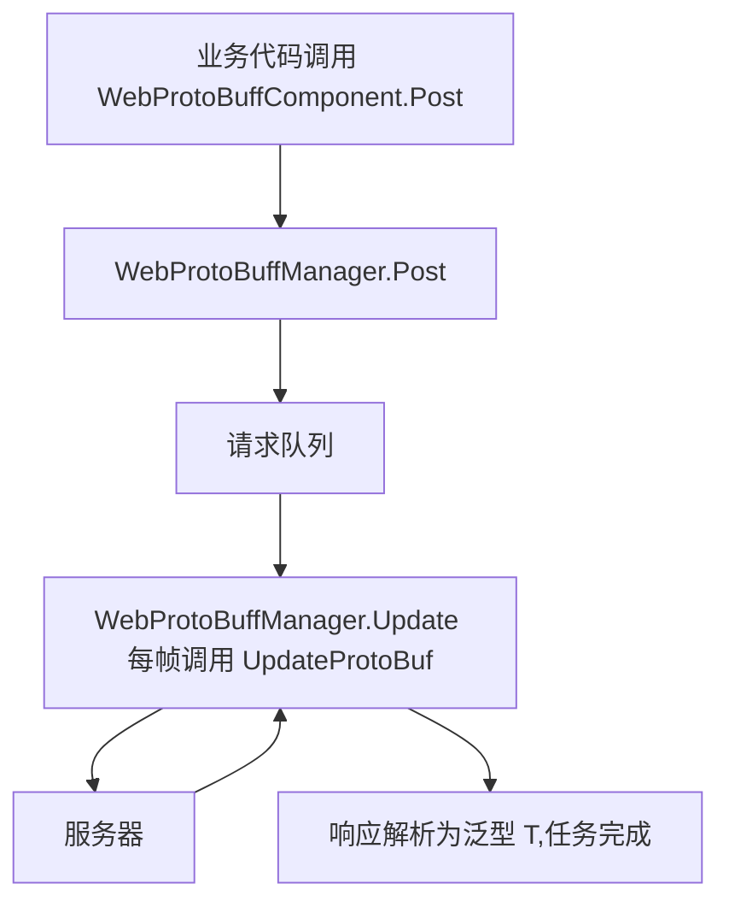

# 工作原理:组件、管理器与请求流水线

本页解释 `WebProtoBuffComponent`(Unity 组件入口)与 `WebProtoBuffManager`(框架模块)如何协作完成一次 Protobuf HTTP 请求:组件在 `Awake` 中从 `GameFrameworkEntry` 取出 `IWebProtoBuffManager` 模块并同步超时配置,业务代码调用 `Post<T>` 后由管理器处理请求队列,并在每帧 `Update` 中推进队列直到响应被解析为泛型 `T`。

## 组件与管理器:职责一览

| 类型 | 角色 | 关键成员/说明 |
|------|------|---------------|
| `WebProtoBuffComponent` | Unity 场景入口组件(MonoBehaviour) | `Post<T>(url, message)`、`Timeout`;挂载菜单 `GameFrameX/Web ProtoBuff`,自动依赖 `GameFrameXWebProtoBuffCroppingHelper` |
| `IWebProtoBuffManager` | 管理器接口 | `Task<T> Post<T>(string url, MessageObject message)`(需宏 `ENABLE_GAME_FRAME_X_WEB_PROTOBUF_NETWORK`)、`float Timeout { get; set; }` |
| `WebProtoBuffManager` | 框架模块实现(partial 类) | 构造时 `MaxConnectionPerServer = 8`、`Timeout = 5f`;每帧 `Update` 调用 `UpdateProtoBuf` 处理请求队列;`Shutdown` 调用 `ShutdownProtoBuf` |

`WebProtoBuffManager` 是 partial 类,`UpdateProtoBuf` / `ShutdownProtoBuf` 等 Protobuf 相关实现分布在分部文件 [WebProtoBuffManager.ProtoBuf.cs](https://github.com/GameFrameX/com.gameframex.unity.web.protobuff/blob/main/Runtime/Web/WebProtoBuffManager.ProtoBuf.cs) 与 [WebProtoBuffManager.WebProtoBufData.cs](https://github.com/GameFrameX/com.gameframex.unity.web.protobuff/blob/main/Runtime/Web/WebProtoBuffManager.WebProtoBufData.cs) 中。

## 请求流水线



按执行顺序拆解:

1. **业务层调用组件**:`WebProtoBuffComponent.Post<T>(url, message)` 直接把参数转交给 `m_WebProtoBuffManager.Post<T>(url, message)`,组件本身不做任何网络处理。此方法与接口方法一样,仅在定义了 `ENABLE_GAME_FRAME_X_WEB_PROTOBUF_NETWORK` 宏时编译。
2. **管理器接收请求**:`WebProtoBuffManager` 实现 `IWebProtoBuffManager.Post<T>`;按接口文档,请求消息体由参数 `message` 提供,响应会被解析为指定的泛型类型 `T`(约束为 `MessageObject` 且实现 `IResponseMessage`)。
3. **每帧驱动队列**:框架模块的 `Update(elapseSeconds, realElapseSeconds)` 在 `lock (m_StringBuilder)` 保护下调用 `UpdateProtoBuf`,注释明确其职责是"更新处理请求队列"。
4. **超时控制**:`Timeout`(秒)赋值时会同步换算 `RequestTimeout = TimeSpan.FromSeconds(value)`,超时即生效。
5. **关闭清理**:`Shutdown()` 调用 `ShutdownProtoBuf()` 清理资源。

## 初始化与生命周期

组件 `Awake` 的关键动作(读取源码原文):

```csharp
protected override void Awake()
{
    ImplementationComponentType = Utility.Assembly.GetType(componentType);
    InterfaceComponentType = typeof(IWebProtoBuffManager);
    base.Awake();
    m_WebProtoBuffManager = GameFrameworkEntry.GetModule<IWebProtoBuffManager>();
    if (m_WebProtoBuffManager == null)
    {
        Log.Fatal("Web manager is invalid.");
        return;
    }

    m_WebProtoBuffManager.Timeout = m_Timeout;
}
```

Source: [WebProtoBuffComponent.cs](https://github.com/GameFrameX/com.gameframex.unity.web.protobuff/blob/main/Runtime/Web/WebProtoBuffComponent.cs#L77-L90)

要点:

- 管理器实例不是组件自己 new 的,而是通过 `GameFrameworkEntry.GetModule<IWebProtoBuffManager>()` 获取;取不到时直接 `Log.Fatal("Web manager is invalid.")` 并返回。
- Inspector 上配置的 `m_Timeout`(默认 `5f`,Tooltip"超时时间.单位:秒")在 `Awake` 末尾同步给管理器。
- 组件带有 `[RequireComponent(typeof(GameFrameXWebProtoBuffCroppingHelper))]`,挂载时会自动添加裁剪辅助组件;同时是 `[DisallowMultipleComponent]`,同一 GameObject 只能有一个。

## 接口契约速查

| 成员 | 签名 | 说明 |
|------|------|------|
| `Post<T>` | `Task<T> Post<T>(string url, GameFrameX.Network.Runtime.MessageObject message) where T : MessageObject, IResponseMessage` | 发送 Protobuf 消息的 POST 请求,响应解析为 `T`;仅 `ENABLE_GAME_FRAME_X_WEB_PROTOBUF_NETWORK` 宏下可用 |
| `Timeout` | `float Timeout { get; set; }` | POST 请求超时时间(秒),组件默认 `5f` |

接口原文参考 [IWebProtoBuffManager.cs](https://github.com/GameFrameX/com.gameframex.unity.web.protobuff/blob/main/Runtime/Web/IWebProtoBuffManager.cs#L9-L29):

```csharp
public interface IWebProtoBuffManager
{
#if ENABLE_GAME_FRAME_X_WEB_PROTOBUF_NETWORK
    Task<T> Post<T>(string url, GameFrameX.Network.Runtime.MessageObject message) where T : GameFrameX.Network.Runtime.MessageObject, GameFrameX.Network.Runtime.IResponseMessage;
#endif
    float Timeout { get; set; }
}
```

Source: [IWebProtoBuffManager.cs](https://github.com/GameFrameX/com.gameframex.unity.web.protobuff/blob/main/Runtime/Web/IWebProtoBuffManager.cs#L9-L29)

`WebProtoBuffManager` 自身的公开配置项:

| 成员 | 类型/默认值 | 说明 |
|------|-------------|------|
| `MaxConnectionPerServer` | `int`,构造时设为 `8` | 每个服务器的最大连接数 |
| `RequestTimeout` | `TimeSpan` | 请求超时时间,由 `Timeout`(秒)换算而来 |

```csharp
public WebProtoBuffManager()
{
    MaxConnectionPerServer = 8;
    Timeout = 5f;
}
```

Source: [WebProtoBuffManager.cs](https://github.com/GameFrameX/com.gameframex.unity.web.protobuff/blob/main/Runtime/Web/WebProtoBuffManager.cs#L26-L31)

## 背景

- **组件/模块分离**:`WebProtoBuffComponent` 只做参数转发与 Inspector 序列化(超时值),真正的队列驱动在 `WebProtoBuffManager.Update` 中完成——这就是为什么请求能在 Unity 主循环里被逐帧推进,而业务侧拿到的却是 `Task<T>` 异步结果。
- **URL 组装**:`UrlHandler(string url, Dictionary<string, string> queryString)` 负责把查询参数字典拼到 URL 上,键值经 `Uri.EscapeDataString` 转义;复用一个 `StringBuilder(256)` 减少 GC。
- 源码中未找到 `UpdateProtoBuf` / `ShutdownProtoBuf` 分部实现的更多细节(读取预算限制,且分部文件未展开),需要时可直接查看 [WebProtoBuffManager.ProtoBuf.cs](https://github.com/GameFrameX/com.gameframex.unity.web.protobuff/blob/main/Runtime/Web/WebProtoBuffManager.ProtoBuf.cs)。

## 相关链接

- [WebProtoBuffComponent.cs](https://github.com/GameFrameX/com.gameframex.unity.web.protobuff/blob/main/Runtime/Web/WebProtoBuffComponent.cs) — Unity 组件入口,`Awake` 初始化与 `Post<T>` 转发
- [IWebProtoBuffManager.cs](https://github.com/GameFrameX/com.gameframex.unity.web.protobuff/blob/main/Runtime/Web/IWebProtoBuffManager.cs) — 管理器接口契约
- [WebProtoBuffManager.cs](https://github.com/GameFrameX/com.gameframex.unity.web.protobuff/blob/main/Runtime/Web/WebProtoBuffManager.cs) — 管理器主分部:超时、每帧 `Update`、URL 标准化
- [WebProtoBuffManager.ProtoBuf.cs](https://github.com/GameFrameX/com.gameframex.unity.web.protobuff/blob/main/Runtime/Web/WebProtoBuffManager.ProtoBuf.cs) — Protobuf 请求队列实现分部
- [WebProtoBuffManager.WebProtoBufData.cs](https://github.com/GameFrameX/com.gameframex.unity.web.protobuff/blob/main/Runtime/Web/WebProtoBuffManager.WebProtoBufData.cs) — 请求/响应数据结构分部
- [GameFrameXWebProtoBuffCroppingHelper.cs](https://github.com/GameFrameX/com.gameframex.unity.web.protobuff/blob/main/Runtime/GameFrameXWebProtoBuffCroppingHelper.cs) — 组件自动依赖的裁剪辅助类
- 官方文档:https://gameframex.doc.alianblank.com/
