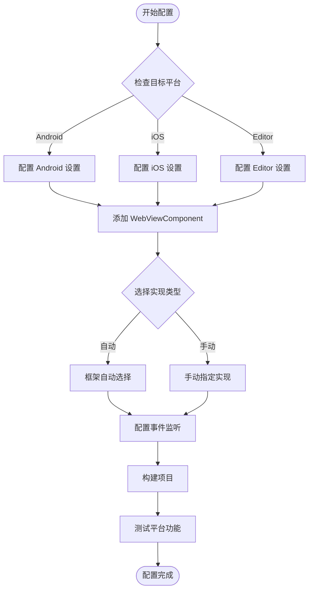

# 平台配置

本文档介绍 GameFrameX WebView 组件在不同平台上的配置方法，包括平台选择机制、可用的平台实现以及配置选项。

## 概述

GameFrameX WebView 组件采用平台无关的架构设计，通过 `IWebViewManager` 接口定义统一的 WebView 操作 API。框架根据运行时平台自动选择合适的实现，也支持手动配置特定平台的管理器。

### 支持的平台

| 平台 | 支持状态 | 说明 |
|------|----------|------|
| Android | ✅ 支持 | 基于 gree/unity-webview 的 Android 实现 |
| iOS | ✅ 支持 | 基于 gree/unity-webview 的 iOS 实现 |
| WebGL | ⚠️ 有限支持 | WebGL 平台上的 WebView 功能受限 |
| Windows/Mac Editor | ✅ 支持 | 编辑器环境下可进行调试 |

## 架构设计

```mermaid
flowchart TD
    subgraph Client["客户端层"]
        WC[WebViewComponent]
    end

    subgraph Interface["接口层"]
        IWM[IWebViewManager 接口]
    end

    subgraph Abstract["抽象层"]
        BWM[BaseWebViewManager]
    end

    subgraph Implementations["平台实现层"]
        AndroidWM[AndroidWebViewManager]
        iOSWM[iOSWebViewManager]
        EditorWM[EditorWebViewManager]
    end

    subgraph Native["原生层"]
        AndroidNative[Android WebView]
        iOSNative[UIWebView/WKWebView]
    end

    WC --> IWM
    IWM <|.. BWM
    BWM <|-- AndroidWM
    BWM <|-- iOSWM
    BWM <|-- EditorWM
    AndroidWM --> AndroidNative
    iOSWM --> iOSNative
```

### 组件职责

| 组件 | 职责 |
|------|------|
| `WebViewComponent` | Unity 组件入口，处理生命周期并转发调用 |
| `IWebViewManager` | 定义 WebView 操作的统一接口 |
| `BaseWebViewManager` | 提供抽象基类，继承 GameFrameworkModule |
| 平台实现类 | 实现特定平台的 WebView 功能 |

## 平台选择机制

### 自动选择

框架通过 GameFrameX 的模块系统自动选择平台实现。当调用 `GameFrameworkEntry.GetModule<IWebViewManager>()` 时，框架会根据当前运行时平台查找并加载对应的实现。

```csharp
// Runtime/WebViewComponent.cs
_webViewManager = GameFrameworkEntry.GetModule<IWebViewManager>();
```
> Source: [WebViewComponent.cs](https://github.com/GameFrameX/com.gameframex.unity.webview/blob/main/Runtime/WebViewComponent.cs#L28)

### 手动配置

在某些场景下，您可能需要手动指定特定的平台实现。通过 Unity Editor 的 Inspector 面板可以配置：

1. 在场景中创建包含 `WebViewComponent` 的 GameObject
2. 在 Inspector 中找到 **Implementation Type** 下拉菜单
3. 选择 desired 的平台实现类

```csharp
// WebViewComponent 继承自 GameFrameworkComponent
// componentType 属性存储用户选择的实现类型
ImplementationComponentType = Utility.Assembly.GetType(componentType);
```
> Source: [WebViewComponent.cs](https://github.com/GameFrameX/com.gameframex.unity.webview/blob/main/Runtime/WebViewComponent.cs#L24-L25)

## 平台特定配置

### Android 平台配置

Android 平台使用原生 WebView 组件，需要确保以下配置：

**AndroidManifest.xml 权限：**
```xml
<!-- 需要添加网络权限 -->
<uses-permission android:name="android.permission.INTERNET" />
```

**gradle 配置：**
```gradle
// 在 PlayerSettings > Publishing Settings > Build
// 确保已包含 unity-webview 的 Android 库
```

### iOS 平台配置

iOS 平台使用 `WKWebView`（iOS 13+）或 `UIWebView`（兼容性模式）：

**Info.plist 配置：**
```xml
<!-- 允许加载任意 URL（根据需求配置） -->
<key>NSAppTransportSecurity</key>
<dict>
    <key>NSAllowsArbitraryLoads</key>
    <true/>
</dict>
```

**PlayerSettings 配置：**
- **Resolution and Presentation**: 设置合适的 WebView 渲染模式
- **Other Settings**: 确保 IL2CPP 和 ABI 配置正确

### 编辑器调试配置

在 Unity Editor 环境下运行时，可以使用编辑器专用的 WebView 实现进行调试：

```csharp
// 编辑器实现提供了模拟的 WebView 环境
// 方便在开发阶段进行功能测试
```

## 配置流程



## 事件系统配置

WebView 组件通过事件系统通知应用程序各种状态变化。不同平台的事件行为一致：

| 事件 | 说明 | 适用平台 |
|------|------|----------|
| `WebViewCloseEventArgs` | WebView 关闭事件 | 所有平台 |
| `WebViewReceivedMessageEventArgs` | 收到 JavaScript 消息 | 所有平台 |

### 事件配置示例

```csharp
using GameFrameX.Event.Runtime;
using GameFrameX.WebView.Runtime;

// 订阅 WebView 关闭事件
EventManager.Register<WebViewCloseEventArgs>(OnWebViewClosed);

// 订阅收到消息事件
EventManager.Register<WebViewReceivedMessageEventArgs>(OnMessageReceived);

private void OnWebViewClosed(object sender, WebViewCloseEventArgs e)
{
    Debug.Log("WebView 已关闭");
}

private void OnMessageReceived(object sender, WebViewReceivedMessageEventArgs e)
{
    Debug.Log($"收到消息: {e.Message}");
}
```
> Source: [WebViewReceivedMessageEventArgs.cs](https://github.com/GameFrameX/com.gameframex.unity.webview/blob/main/Runtime/EventArgs/WebViewReceivedMessageEventArgs.cs#L30-L35)

## API 参考

### IWebViewManager 接口

所有平台实现都遵循统一的接口规范：

```csharp
public interface IWebViewManager
{
    /// <summary>
    /// 初始化 WebView 管理器
    /// </summary>
    void Initialize();

    /// <summary>
    /// 显示 WebView 并加载指定 URL
    /// </summary>
    /// <param name="url">要加载的网页地址</param>
    void Show(string url);

    /// <summary>
    /// 将 WebView 设置为全屏模式
    /// </summary>
    void MakeFullScreen();

    /// <summary>
    /// 执行 JavaScript 代码
    /// </summary>
    /// <param name="javaScript">要执行的 JavaScript 代码</param>
    void ExecuteJavaScript(string javaScript);

    /// <summary>
    /// 隐藏 WebView
    /// </summary>
    void Hide();
}
```
> Source: [IWebViewManager.cs](https://github.com/GameFrameX/com.gameframex.unity.webview/blob/main/Runtime/IWebViewManager.cs#L12-L40)

### 基础抽象类

```csharp
public abstract partial class BaseWebViewManager : GameFrameworkModule, IWebViewManager
{
    /// <summary>
    /// 初始化
    /// </summary>
    public abstract void Initialize();

    /// <summary>
    /// 显示WebView
    /// </summary>
    /// <param name="url">加载的url</param>
    public abstract void Show(string url);

    /// <summary>
    /// 全屏
    /// </summary>
    public abstract void MakeFullScreen();

    /// <summary>
    /// 执行JavaScript
    /// </summary>
    /// <param name="javaScript">javaScript代码</param>
    public abstract void ExecuteJavaScript(string javaScript);

    /// <summary>
    /// 隐藏
    /// </summary>
    public abstract void Hide();
}
```
> Source: [BaseWebViewManager.cs](https://github.com/GameFrameX/com.gameframex.unity.webview/blob/main/Runtime/BaseWebViewManager.cs#L11-L39)

## 常见问题

### Q: 如何为特定平台使用不同的 WebView 实现？

A: 在 Inspector 面板中手动选择实现类型，或通过代码在运行时动态切换：

```csharp
// 运行时动态设置实现类型
var webView = GetComponent<WebViewComponent>();
// 通过反射或配置系统设置 componentType
```

### Q: WebView 在真机上显示空白怎么办？

A: 检查以下配置：
1. 确认已添加 INTERNET 权限（Android）
2. 检查 Info.plist 中的 App Transport Security 配置
3. 确保 URL 可公开访问

### Q: 如何在不同平台使用不同的 URL？

A: 使用平台条件编译或运行时检测：

```csharp
#if UNITY_ANDROID
webView.Show("https://android.example.com");
#elif UNITY_IOS
webView.Show("https://ios.example.com");
#else
webView.Show("https://default.example.com");
#endif
```

## 相关链接

- [概述](./1-overview) - 项目整体介绍
- [快速入门](./3-getting-started) - 快速开始使用
- [API 参考](./4-api-reference) - 完整的 API 文档
- [事件系统](./6-events) - 事件机制详解
- [常见问题](./7-troubleshooting) - 问题排查指南
- [GameFrameX 官网](https://gameframex.doc.alianblank.com)
- [gree/unity-webview](https://github.com/gree/unity-webview) - 原生 WebView 插件
