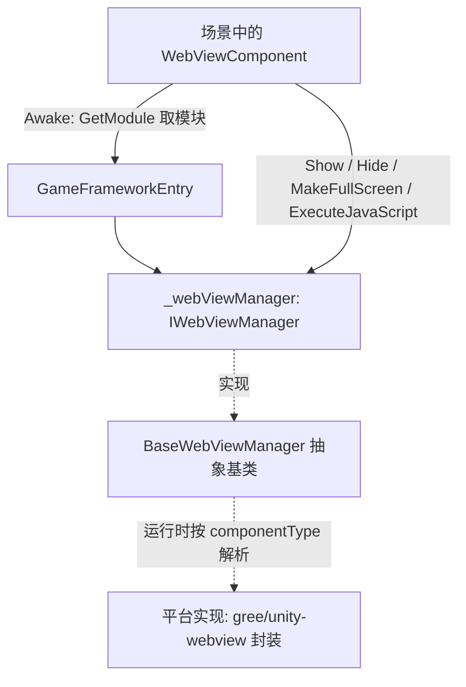

# 工作原理:组件如何驱动 WebView

`WebViewComponent` 是挂在场景上的 GameFrameworkComponent 壳,它在 `Awake` 中通过 `GameFrameworkEntry.GetModule<IWebViewManager>()` 拿到管理器,并把 `Show` / `Hide` / `MakeFullScreen` / `ExecuteJavaScript` 全部转发给它。本包只定义接口(`IWebViewManager`)、抽象基类(`BaseWebViewManager`)和组件壳;具体平台实现是对 [gree/unity-webview](https://github.com/gree/unity-webview) 的封装,运行时按 `componentType` 解析装配。

## 组件分层

| 层 | 真实类型 | 所在文件 | 职责 |
|----|----------|----------|------|
| 组件壳 | `WebViewComponent : GameFrameworkComponent` | `Runtime/WebViewComponent.cs` | Unity 场景入口,负责装配模块并转发调用 |
| 接口 | `IWebViewManager` | `Runtime/IWebViewManager.cs` | 定义 `Initialize` / `Show` / `MakeFullScreen` / `ExecuteJavaScript` / `Hide` 五个方法 |
| 抽象基类 | `BaseWebViewManager : GameFrameworkModule, IWebViewManager` | `Runtime/BaseWebViewManager.cs` | 平台实现的基类,五个方法均为 `abstract` |
| 具体实现 | 运行时按 `componentType` 解析(不在本仓库) | — | 基于 gree/unity-webview 的平台 Web View 能力 |

## 调用链



## 启动时序

1. `Awake` 设置实现类型与接口类型,再从 `GameFrameworkEntry` 取模块;取不到则记 Fatal 日志并放弃后续初始化:

```csharp
protected override void Awake()
{
    ImplementationComponentType = Utility.Assembly.GetType(componentType);
    InterfaceComponentType = typeof(IWebViewManager);
    base.Awake();
    if (!IsRuntimeComponentReady)
    {
        return;
    }

    _webViewManager = GameFrameworkEntry.GetModule<IWebViewManager>();
    if (_webViewManager == null)
    {
        Log.Fatal("Web View manager is invalid.");
        return;
    }
}
```

Source: [WebViewComponent.cs](https://github.com/GameFrameX/com.gameframex.unity.webview/blob/main/Runtime/WebViewComponent.cs#L22-L38)

2. `Start` 里调用一次 `_webViewManager.Initialize()`,完成管理器初始化;若 `Awake` 未能取得模块,这里直接返回:

```csharp
private void Start()
{
    if (_webViewManager == null)
    {
        return;
    }

    _webViewManager.Initialize();
}
```

Source: [WebViewComponent.cs](https://github.com/GameFrameX/com.gameframex.unity.webview/blob/main/Runtime/WebViewComponent.cs#L40-L48)

## 对外 API 如何转发

组件的四个公开方法都是一行转发,不包含任何平台逻辑:

```csharp
public void Show(string url)
{
    _webViewManager.Show(url);
}

public void MakeFullScreen()
{
    _webViewManager.MakeFullScreen();
}

public void ExecuteJavaScript(string javaScript)
{
    _webViewManager.ExecuteJavaScript(javaScript);
}

public void Hide()
{
    _webViewManager.Hide();
}
```

Source: [WebViewComponent.cs](https://github.com/GameFrameX/com.gameframex.unity.webview/blob/main/Runtime/WebViewComponent.cs#L51-L83)

管理器一侧的契约(`BaseWebViewManager` 将其声明为 `abstract`,由平台子类实现):

```csharp
public interface IWebViewManager
{
    void Initialize();
    void Show(string url);
    void MakeFullScreen();
    void ExecuteJavaScript(string javaScript);
    void Hide();
}
```

Source: [IWebViewManager.cs](https://github.com/GameFrameX/com.gameframex.unity.webview/blob/main/Runtime/IWebViewManager.cs#L12-L40)

## 用户代码如何触达组件

按 README 提供的用法,在场景中放置 `WebViewComponent` 后直接调用:

```csharp
using GameFrameX.WebView.Runtime;
using UnityEngine;

public class Example : MonoBehaviour
{
    void Start()
    {
        var webView = FindObjectOfType<WebViewComponent>();
        webView.Show("https://gameframex.doc.alianblank.com");
    }
}
```

Source: [README.zh-CN.md](https://github.com/GameFrameX/com.gameframex.unity.webview/blob/main/README.zh-CN.md#L102-L116)

## 源码文件速查

| 文件 | 说明 |
|------|------|
| [WebViewComponent.cs](https://github.com/GameFrameX/com.gameframex.unity.webview/blob/main/Runtime/WebViewComponent.cs) | 组件壳:装配模块、初始化、转发四个公开方法;`[DisallowMultipleComponent]` + `[AddComponentMenu("Game Framework/WebView")]` |
| [IWebViewManager.cs](https://github.com/GameFrameX/com.gameframex.unity.webview/blob/main/Runtime/IWebViewManager.cs) | 管理器接口,五个方法的契约 |
| [BaseWebViewManager.cs](https://github.com/GameFrameX/com.gameframex.unity.webview/blob/main/Runtime/BaseWebViewManager.cs) | 抽象基类,继承 `GameFrameworkModule` 并实现接口 |
| [WebViewComponentInspector.cs](https://github.com/GameFrameX/com.gameframex.unity.webview/blob/main/Editor/WebViewComponentInspector.cs) | Editor 目录下的组件 Inspector(本页未展开其实现) |
| [WebViewCloseEventArgs.cs](https://github.com/GameFrameX/com.gameframex.unity.webview/blob/main/Runtime/EventArgs/WebViewCloseEventArgs.cs) / [WebViewReceivedMessageEventArgs.cs](https://github.com/GameFrameX/com.gameframex.unity.webview/blob/main/Runtime/EventArgs/WebViewReceivedMessageEventArgs.cs) | Runtime/EventArgs 下的关闭 / 收到消息事件参数定义(字段细节请查看源码) |
| [GameFrameXWebViewCroppingHelper.cs](https://github.com/GameFrameX/com.gameframex.unity.webview/blob/main/Runtime/GameFrameXWebViewCroppingHelper.cs) | Runtime 目录下的裁切辅助类(本页未展开其实现) |

## 相关链接

- [README.zh-CN.md](https://github.com/GameFrameX/com.gameframex.unity.webview/blob/main/README.zh-CN.md) — 安装方式、使用示例与依赖说明(依赖 `com.gameframex.unity` 1.0.0)
- [Game Frame X 官方文档](https://gameframex.doc.alianblank.com)
- [gree/unity-webview](https://github.com/gree/unity-webview) — 本组件封装的底层 Web View 实现,支持 Android 与 iOS
