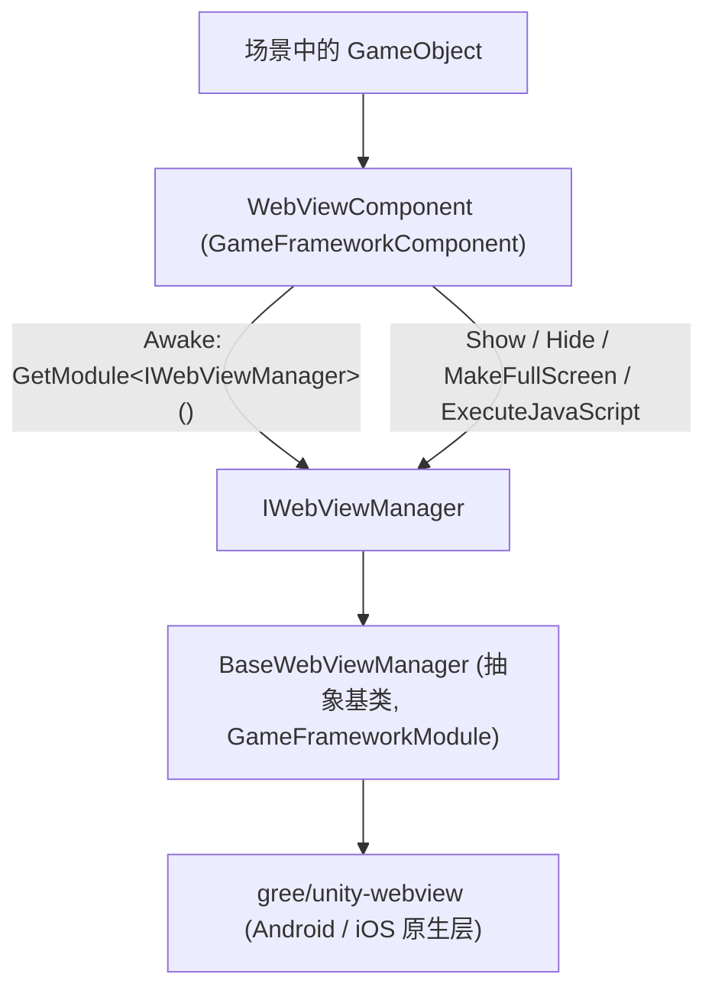

# 项目概述:Unity 内嵌网页组件

Game Frame X Web View 是 Game Frame X 框架下的 Unity 内嵌网页组件,封装了 [gree/unity-webview](https://github.com/gree/unity-webview),让你在 Android / iOS 游戏中用一个组件即可展示网页、执行 JavaScript,并通过统一接口 `IWebViewManager` 接入框架的模块体系。

## 快速开始

### 1. 安装包

任选一种方式把 `com.gameframex.unity.webview` 加入 Unity 工程:

**方式 A:scoped registry(推荐)** —— 编辑 `Packages/manifest.json`:

```json
{
  "scopedRegistries": [
    {
      "name": "GameFrameX",
      "url": "https://gameframex.upm.alianblank.uk",
      "scopes": [
        "com.gameframex"
      ]
    }
  ],
  "dependencies": {
    "com.gameframex.unity.webview": "1.0.0"
  }
}
```

**方式 B:Git URL** —— `manifest.json` 的 `dependencies` 中直接写:

```json
{
  "dependencies": {
    "com.gameframex.unity.webview": "https://github.com/gameframex/com.gameframex.unity.webview.git"
  }
}
```

Source: [README.md](https://github.com/GameFrameX/com.gameframex.unity.webview/blob/main/README.md#L43-L70)

也可以在 Unity **Package Manager** 中用 **Add package from git URL** 输入 `https://github.com/gameframex/com.gameframex.unity.webview.git`,或直接把仓库克隆到 `Packages` 目录自动加载。

> 依赖:`com.gameframex.unity` 1.0.0 需一并可用(见 [README.md](https://github.com/GameFrameX/com.gameframex.unity.webview/blob/main/README.md#L126-L131))。

### 2. 挂载组件

在场景中的 GameFramework 物体(或任意物体)上通过 **Add Component → Game Framework → WebView** 添加 `WebViewComponent`。组件在 `Start` 时自动完成管理器初始化:

```csharp
private void Start()
{
    if (_webViewManager == null)
    {
        return;
    }

    _webViewManager.Initialize();
}
```

Source: [WebViewComponent.cs](https://github.com/GameFrameX/com.gameframex.unity.webview/blob/main/Runtime/WebViewComponent.cs#L40-L48)

### 3. 显示网页

```csharp
using GameFrameX.WebView.Runtime;
using UnityEngine;

public class Example : MonoBehaviour
{
    void Start()
    {
        var webView = FindObjectOfType<WebViewComponent>();
        webView.Show("https://gameframex.doc.alianblank.com");
    }
}
```

Source: [README.md](https://github.com/GameFrameX/com.gameframex.unity.webview/blob/main/README.md#L102-L116)

### 4. 常用 API 一览

| 名称 | 签名 | 说明 |
|------|------|------|
| 显示网页 | `Show(string url)` | 显示 WebView 并加载指定 URL |
| 隐藏 | `Hide()` | 隐藏 WebView |
| 全屏 | `MakeFullScreen()` | 将 WebView 设为全屏 |
| 执行脚本 | `ExecuteJavaScript(string javaScript)` | 在网页中执行 JavaScript 代码 |

以上方法均为 `WebViewComponent` 上的公开方法,直接转发给 `IWebViewManager` 实现(见 [WebViewComponent.cs](https://github.com/GameFrameX/com.gameframex.unity.webview/blob/main/Runtime/WebViewComponent.cs#L51-L83) 与 [IWebViewManager.cs](https://github.com/GameFrameX/com.gameframex.unity.webview/blob/main/Runtime/IWebViewManager.cs#L12-L40))。

## 工作原理速览

组件分层很简单:场景中的 `WebViewComponent`(继承自 `GameFrameworkComponent`)只做转发,真正的行为由实现 `IWebViewManager` 的管理器(`BaseWebViewManager` 为抽象基类)完成,底层由封装的 gree/unity-webview 承担原生 WebView 渲染。



关键调用链(源码核实):

1. `WebViewComponent.Awake()` 通过 `GameFrameworkEntry.GetModule<IWebViewManager>()` 取得模块实例,失败则 `Log.Fatal("Web View manager is invalid.")`([WebViewComponent.cs](https://github.com/GameFrameX/com.gameframex.unity.webview/blob/main/Runtime/WebViewComponent.cs#L22-L38))。
2. `Start()` 中调用 `_webViewManager.Initialize()` 完成初始化([WebViewComponent.cs](https://github.com/GameFrameX/com.gameframex.unity.webview/blob/main/Runtime/WebViewComponent.cs#L40-L48))。
3. `BaseWebViewManager` 以抽象方法形式声明 `Initialize / Show / MakeFullScreen / ExecuteJavaScript / Hide`([BaseWebViewManager.cs](https://github.com/GameFrameX/com.gameframex.unity.webview/blob/main/Runtime/BaseWebViewManager.cs#L11-L39))。

仓库还包含 `Runtime/EventArgs/` 下的 `WebViewCloseEventArgs`、`WebViewReceivedMessageEventArgs` 事件参数,以及 `Editor/WebViewComponentInspector.cs` 自定义 Inspector、`GameFrameXWebViewCroppingHelper.cs` 裁剪辅助类,用于消息回调与编辑器扩展。

## 接下来

- 使用细节与文档站:[Game Frame X Documentation](https://gameframex.doc.alianblank.com)([README.md](https://github.com/GameFrameX/com.gameframex.unity.webview/blob/main/README.md#L132-L134))
- 各接口完整签名:[IWebViewManager.cs](https://github.com/GameFrameX/com.gameframex.unity.webview/blob/main/Runtime/IWebViewManager.cs#L12-L40)
- 组件生命周期与转发实现:[WebViewComponent.cs](https://github.com/GameFrameX/com.gameframex.unity.webview/blob/main/Runtime/WebViewComponent.cs#L13-L84)
- 抽象基类扩展点:[BaseWebViewManager.cs](https://github.com/GameFrameX/com.gameframex.unity.webview/blob/main/Runtime/BaseWebViewManager.cs#L11-L39)
- 版本历史:[CHANGELOG.md](https://github.com/GameFrameX/com.gameframex.unity.webview/blob/main/CHANGELOG.md) 与 [Releases](https://github.com/GameFrameX/gameframex/com.gameframex.unity.webview/releases)
