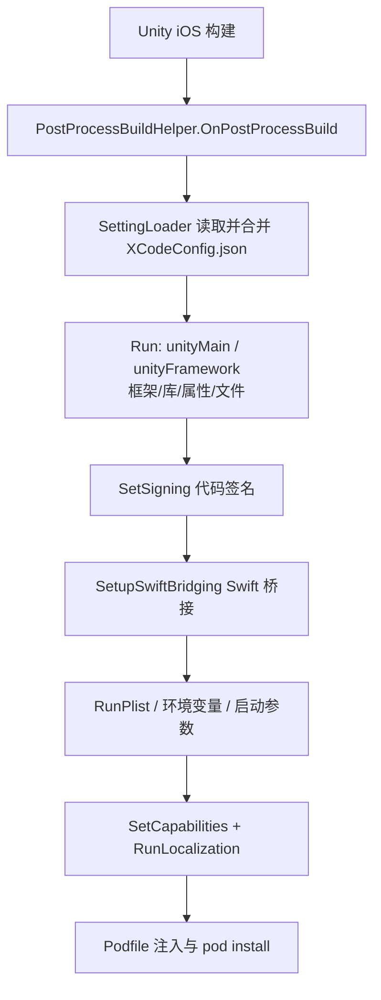

# Xcode 打包配置包概览

GameFrameX Xcode 配置包(com.gameframex.unity.xcode)让你用一份 `XCodeConfig.json` 就能自动完成 iOS 打包后的 Xcode 工程设置:Info.plist、系统框架/库、Build Settings、Capabilities、本地化、CocoaPods、代码签名、Swift 桥接等,全部无需手改 Xcode 工程。Unity 构建 iOS 平台后,它通过 `PostProcessBuild` 回调自动执行,适合本地与 CI 自动化构建。

## 快速开始

### 1. 安装包

编辑 Unity 项目的 `Packages/manifest.json`,添加 scoped registry 并声明依赖(当前版本 `1.11.1`):

```json
{
  "scopedRegistries": [
    {
      "name": "GameFrameX",
      "url": "https://gameframex.upm.alianblank.uk",
      "scopes": [
        "com.gameframex"
      ]
    }
  ],
  "dependencies": {
    "com.gameframex.unity.xcode": "1.11.1"
  }
}
```

Source: [README.zh-CN.md](https://github.com/GameFrameX/com.gameframex.unity.xcode/blob/main/README.zh-CN.md#L49-L63)

也可以不建 registry,直接在 `dependencies` 下写 Git 地址 `https://github.com/gameframex/com.gameframex.unity.xcode.git`,或用 Package Manager 的 `Git URL` 方式添加,或把仓库下载后放进 `Packages` 目录。

### 2. 创建配置文件

在项目中新建 `XCodeConfig.json`——文件名固定,可放在项目任意位置,支持多个文件并存(自动深度递归合并),还支持 `XCodeConfig.{渠道名}.json` 渠道专属配置最后覆盖合并。

```json
{
  "swiftBridging": true,
  "signing": {},
  "plist": {},
  "environmentVariables": {},
  "launcherArgs": [],
  "podSource": [],
  "podfile": "",
  "podInstall": true,
  "localizations": [],
  "capabilities": {},
  "unityFramework": {},
  "unityMain": {}
}
```

Source: [README.zh-CN.md](https://github.com/GameFrameX/com.gameframex.unity.xcode/blob/main/README.zh-CN.md#L81-L96)

| 字段 | 类型 | 说明 |
| :--- | :--- | :--- |
| `swiftBridging` | bool | Swift 桥接头文件自动生成(默认 `true`) |
| `signing` | object | 代码签名:Team ID、Bundle ID、签名身份、描述文件 |
| `plist` | object | Info.plist 键值对,值支持字符串/布尔/整数/数组/字典并递归写入 |
| `environmentVariables` | object | XcScheme 环境变量 |
| `launcherArgs` | string[] | XcScheme 启动参数 |
| `podSource` | string[] | CocoaPods 源地址,替换 Podfile 默认源 |
| `podfile` | string | 自定义 Podfile 路径(优先级高于 `pods` 字段) |
| `podInstall` | bool | Podfile 处理完自动执行 `pod install`(默认 `true`) |
| `localizations` | array | 自动生成 `.lproj/InfoPlist.strings` |
| `capabilities` | object | 内购、Game Center、推送、Sign In with Apple 等 13 项能力 |
| `unityFramework` | object | UnityFramework target 配置 |
| `unityMain` | object | Unity-iPhone(主)target 配置 |

### 3. 写最常用的配置

`unityMain` / `unityFramework` 结构相同,`libs` 用 `+`/`-` 增删系统库,`frameworks` 增删框架,`properties` 用 `=`/`+`/`-` 设置、追加、移除 Build Settings:

```json
{
  "unityMain": {
    "libs": {
      "+": ["libz.tbd", "libicucore.tbd"],
      "-": ["libstdc++.tbd"]
    },
    "frameworks": {
      "+": ["WebKit.framework", "UserNotifications.framework"],
      "-": []
    },
    "properties": {
      "=": { "ENABLE_BITCODE": "NO" },
      "+": { "OTHER_CFLAGS": ["-flag1", "-flag2"] },
      "-": { "UNUSED_FLAG": [""] }
    }
  },
  "signing": {
    "teamId": "XXXXXXXXXX",
    "bundleId": "com.company.app",
    "codeSignIdentity": "Apple Development",
    "codeSignStyle": "Automatic",
    "provisioningProfileSpecifier": ""
  }
}
```

Sources: [README.zh-CN.md](https://github.com/GameFrameX/com.gameframex.unity.xcode/blob/main/README.zh-CN.md#L133-L140) · [README.zh-CN.md](https://github.com/GameFrameX/com.gameframex.unity.xcode/blob/main/README.zh-CN.md#L245-L255)

### 4. 构建 iOS 并验证

在 Unity 中执行 iOS 平台构建。构建结束时包内 `PostProcessBuildHelper.OnPostProcessBuild`(`[PostProcessBuild(888)]`)会自动运行:找不到任何配置文件会输出 `未找到任何 XCodeConfig 相关配置文件, 跳过设置`;正常时按文件输出 `[MergeConfig] 正在合并配置: {路径}`,再依次输出 `[PBXProject] 正在应用最终合并配置...`、`[OtherSettings] 正在应用最终合并配置...`。在 Console 中看到这些日志即说明配置已写入 Xcode 工程:

```csharp
[PostProcessBuild(888)]
public static void OnPostProcessBuild(BuildTarget target, string path)
{
    if (target != BuildTarget.iOS)
    {
        return;
    }
    //读取配置文件
    var jsonPaths = SettingLoader.LoadSettingsData("XCodeConfig.json");
    // 如果没有找到任何匹配的文件，直接返回
    if (jsonPaths.Count == 0)
    {
        LogHelper.Error("未找到任何 XCodeConfig 相关配置文件, 跳过设置");
        return;
    }
```

Source: [Editor/PostProcessBuildHelper.cs](https://github.com/GameFrameX/com.gameframex.unity.xcode/blob/main/Editor/PostProcessBuildHelper.cs#L14-L31)

## 工作原理速览

整个流程由 `OnPostProcessBuild` 驱动:合并配置 → 写 PBXProject → 写 plist/scheme/capabilities/本地化 → 处理 Podfile。



两阶段处理说明:`unityMain`/`unityFramework`/`signing`/`swiftBridging` 先写入并保存 `project.pbxproj`;随后 Plist、环境变量、启动参数、Capabilities、本地化、Podfile 在第二阶段应用。Capabilities 由 `ProjectCapabilityManager` 独立写盘,因此会重新读取工程文件后再继续,以保证其修改不被覆盖:

```csharp
// 保存 PBXProject
File.WriteAllText(projectPath, project.WriteToString());
// 第二阶段：应用其他配置 (Plist, Env, Args, Pod, Capabilities)
LogHelper.Log("[OtherSettings] 正在应用最终合并配置...");
```

Source: [Editor/PostProcessBuildHelper.cs](https://github.com/GameFrameX/com.gameframex.unity.xcode/blob/main/Editor/PostProcessBuildHelper.cs#L103-L107)

配置合并的优先级是:渠道配置(`XCodeConfig.{channel}.json`)> 普通 `XCodeConfig.json` > 空,多个普通文件按扫描顺序依次深度合并。包内实现按功能拆分为多个 partial 文件,便于按需阅读源码。

## 常见错误

| 现象 | 原因 | 修复 |
|------|------|------|
| Console 报 `未找到任何 XCodeConfig 相关配置文件, 跳过设置` | 配置文件未命名为 `XCodeConfig.json` 或不在项目内 | 确认文件名与位置;渠道文件须为 `XCodeConfig.{渠道名}.json` |
| 某配置项没生效 | 存在多个 `XCodeConfig.json` 或渠道文件覆盖了它 | 后合并者覆盖同键值;检查合并日志 `[MergeConfig]` 中各文件顺序 |
| `folders` 复制报错 | 目标文件夹在 Xcode 工程中已存在(`folders` 不做覆盖) | 改用 `files` 单文件复制,或先清掉构建输出目录 |
| Swift 混编在 CI 上弹窗 | 未启用 Swift 桥接 | 保持 `swiftBridging: true`(默认),自动创建桥接头并设置 `SWIFT_VERSION` 为 `5.0` |

## 接下来

- 配置文件全部字段与各子项写法,见仓库 [README.zh-CN.md](https://github.com/GameFrameX/com.gameframex.unity.xcode/blob/main/README.zh-CN.md#L75-L484) 的"配置文件结构"章节。
- 版本历史见 [CHANGELOG.md](https://github.com/GameFrameX/com.gameframex.unity.xcode/blob/main/CHANGELOG.md)。
- 源码入口:`Editor/PostProcessBuildHelper.cs`(主流程)、`Editor/PostProcessBuildHelper.BuildProperties.cs`(Build Settings)、`Editor/PostProcessBuildHelper.Capabilities.cs`(Capabilities)、`Editor/PostProcessBuildHelper.File.cs`(文件复制)。
- 官方文档与交流群见 [README.zh-CN.md](https://github.com/GameFrameX/com.gameframex.unity.xcode/blob/main/README.zh-CN.md#L16)。
