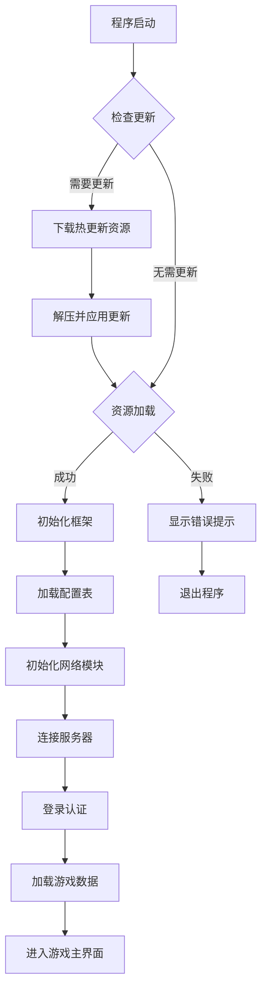
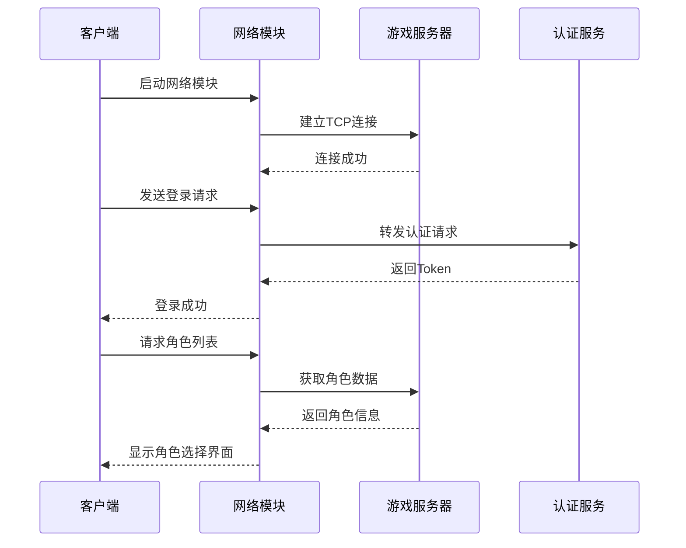
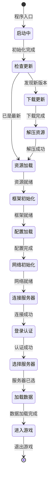
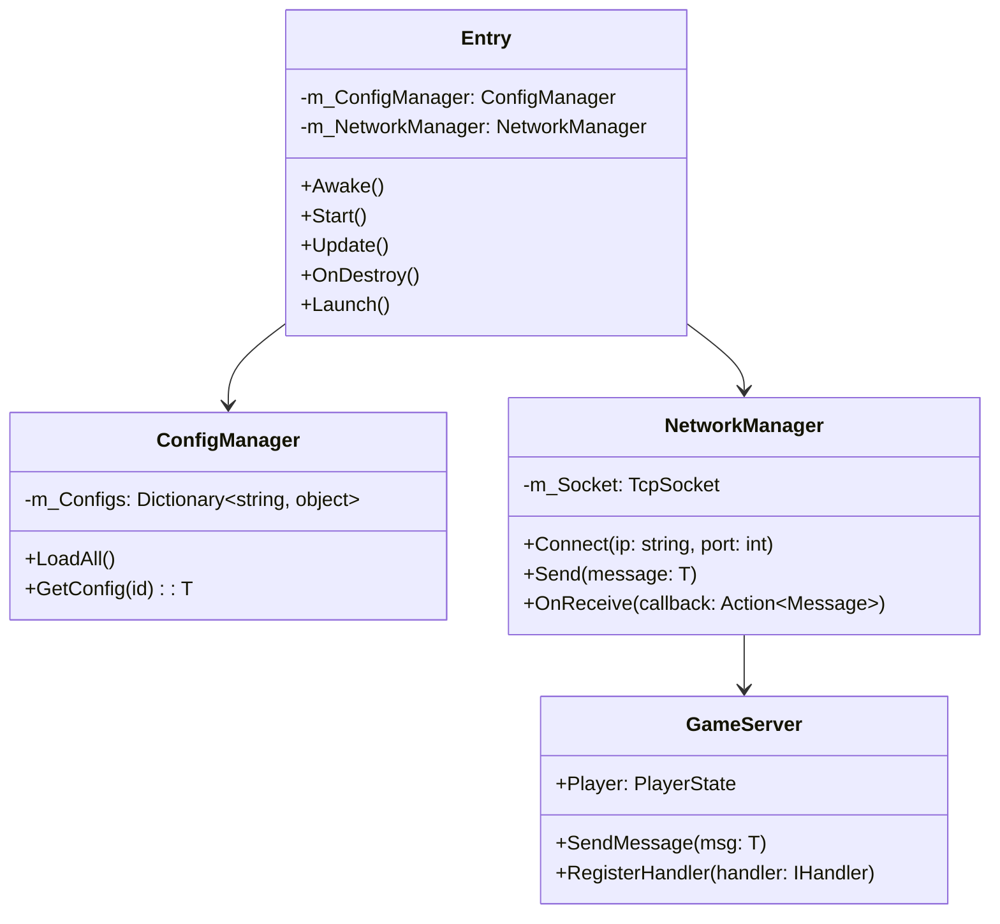
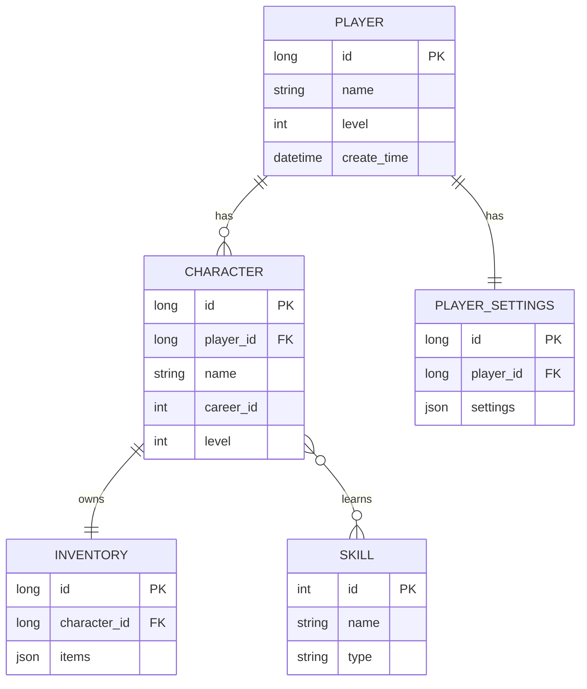
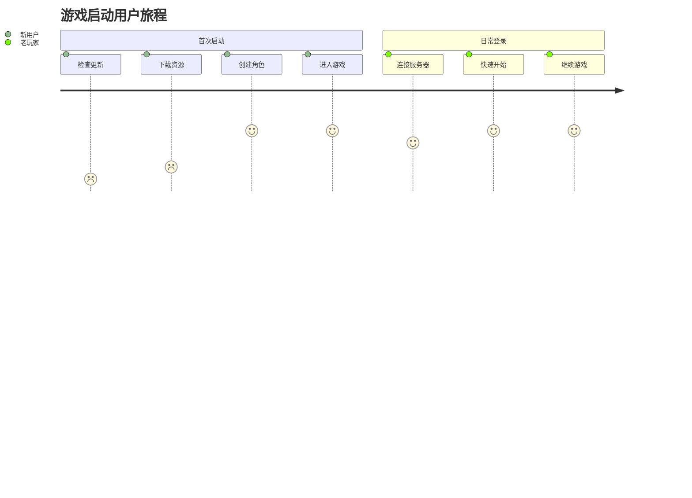

# 启动流程

---

[[toc]]

## 客户端基础启动流程

本文档使用 Mermaid 展示游戏客户端的启动流程。

### 流程图 (Flowchart)

### 时序图 (Sequence Diagram)

### 状态图 (State Diagram)

### 类图 (Class Diagram)

### 甘特图 (Gantt Chart)

```mermaid
gantt
    title Unity 客户端启动流程
    dateFormat  X
    axisFormat %sms

    section 初始化
    检查更新           :done,    init1, 0, 500ms
    下载热更新         :active,   init2, after init1, 2000ms
    解压资源          :done,    init3, after init2, 500ms

    section 加载
    加载配置表         :done,    load1, after init3, 300ms
    加载资源Bundle    :active,   load2, after load1, 1500ms
    初始化ILRuntime   :done,    load3, after load1, 400ms

    section 连接
    连接网关服务器     :active,   conn1, after load3, 200ms
    登录认证          :crit,    conn2, after conn1, 150ms
    获取角色数据       :crit,    conn3, after conn2, 100ms
```

### 实体关系图 (ER Diagram)

### 用户旅程图 (User Journey)

## 总结

使用 Mermaid 图表可以清晰地展示：
- **流程图**：展示程序执行逻辑
- **时序图**：展示模块间交互顺序
- **状态图**：展示对象状态变化
- **类图**：展示系统架构和类关系
- **甘特图**：展示任务执行时间线
- **ER图**：展示数据模型关系
- **用户旅程**：展示用户体验流程
