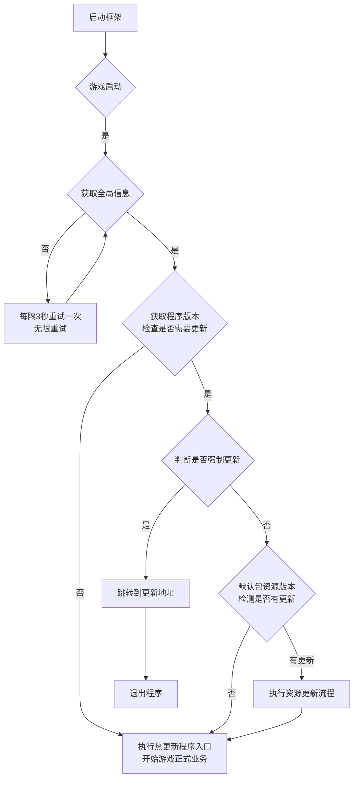
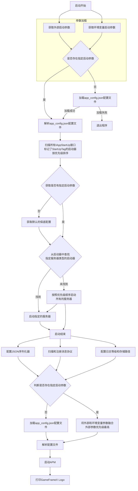

# 客户端启动流程

---

[[toc]]

## 客户端启动流程图

```mermaid
flowchart TD
    A[启动框架] --> B{游戏启动}
    B -->|是| C{获取全局信息}
    C -->|否| D[每隔3秒重试一次<br/>无限重试]
    D --> C
    C -->|是| E{获取程序版本<br/>检查是否需要更新}
    E -->|否| G[执行热更新程序入口<br/>开始游戏正式业务]
    E -->|是| F{判断是否强制更新}
    F -->|是| H[跳转到更新地址]
    F -->|否| I{默认包资源版本<br/>检测是否有更新}
    I -->|否| G
    I -->|有更新| J[执行资源更新流程]
    J --> G
    H --> K[退出程序]
```

## 服务器启动流程图

```mermaid
flowchart TD
    A[启动开始] --> B[获取外部启动参数]
    A --> C[获取环境变量启动参数]

    subgraph 参数加载
        B --> D{是否存在指定启动参数}
        C --> D
    end

    D -->|否| E[加载app_config.json配置文件]
    D -->|是| F[解析app_config.json配置文件]
    E -->|加载成功| F
    E -->|加载失败| G[退出程序]
    F --> H[扫描所有IAppStartUp接口<br/>标记了StartUpTag的启动器<br/>按优先级排序]

    H --> I{获取是否有指定启动参数}

    I -->|否| J[获取默认的保底配置]
    J --> K{从启动器中查找<br/>指定服务器类型的启动器}

    I -->|是| K

    K -->|找到| L[启动指定的服务器]
    K -->|未找到| M[按照优先级顺序启动<br/>所有的服务器]
    M --> L

    L --> N[启动结束]
    M --> N

    N --> O[配置JSON序列化器]
    N --> P[扫描和注册消息协议]
    N --> Q[配置日志等级和存储路径]

    O --> R{判断是否存在指定启动参数}
    P --> R
    Q --> R

    R -->|否| S[加载app_config.json配置文件]
    R -->|是| T[将外部和环境变量参数融合<br/>外部参数优先级最高]

    S --> U[解析配置文件]
    T --> U

    U --> V[启动APM]
    V --> W[打印GameFrameX Logo]
```

## 总结

### 客户端启动要点

| 阶段 | 说明 |
|------|------|
| 全局信息获取 | 获取游戏配置信息，失败则每3秒重试 |
| 版本检测 | 检查程序版本和资源版本 |
| 更新策略 | 强制更新跳转商店，可选更新执行资源更新 |

### 服务器启动要点

| 阶段 | 说明 |
|------|------|
| 参数加载 | 支持外部参数、环境变量、配置文件三种方式 |
| 启动器扫描 | 自动扫描并排序所有启动器 |
| 配置融合 | 外部参数优先级最高 |
| 服务启动 | 支持指定服务器或全部启动 |
