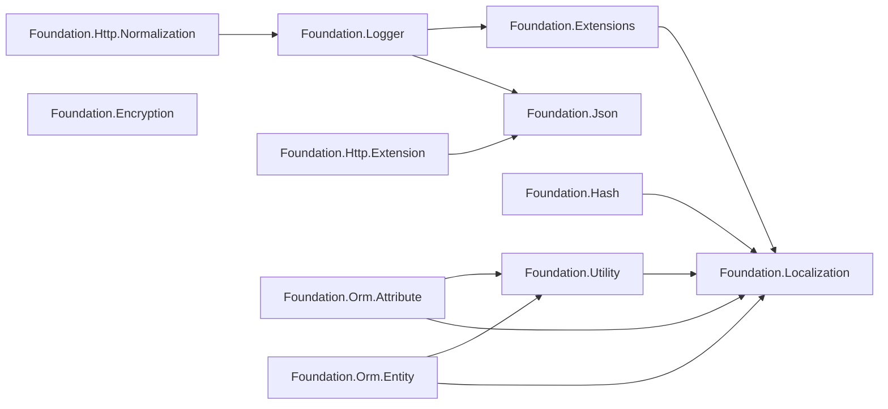

# 包总览与依赖关系

GameFrameX.Foundation 是一个按职责拆分的 .NET 类库集合,每个子目录都是一个独立的 NuGet 包,包之间通过 `ProjectReference` 串联。本页给出所有包的清单、依赖方向以及选择哪个包开始接入的依据。

## 包清单

仓库根目录下每个一级文件夹对应一个 NuGet 包,所有包统一使用 `../Version.props` 中的版本号,并通过 `../gameframex.key.snk` 强命名。

| 包名 | 主要职责 | 关键第三方依赖 |
|------|----------|----------------|
| GameFrameX.Foundation.Encryption | 加密解密(AES、RSA 等) | — |
| GameFrameX.Foundation.Extensions | 常用扩展方法集合 | Localization |
| GameFrameX.Foundation.Hash | 哈希算法(xxHash、BCrypt、BouncyCastle) | Standart.Hash.xxHash 4.0.5、BouncyCastle.Cryptography 2.7.0、BCrypt.Net-Next.StrongName 4.2.1 |
| GameFrameX.Foundation.Http.Extension | HTTP 客户端统一接口(GET/POST) | Json |
| GameFrameX.Foundation.Http.Normalization | HTTP 请求/响应规范化 | Logger |
| GameFrameX.Foundation.Json | JSON 序列化/反序列化统一接口 | — |
| GameFrameX.Foundation.Localization | 多语言本地化抽象 | Microsoft.Extensions.Localization.Abstractions 10.0.11 |
| GameFrameX.Foundation.Logger | Serilog 结构化日志,支持 Loki、MongoDB | MongoDB.Driver 3.11.0、Serilog.AspNetCore 10.0.0、Serilog.Sinks.Grafana.Loki 9.0.2、Serilog.Sinks.MongoDB 7.2.0 |
| GameFrameX.Foundation.Options | 配置选项扩展 | — |
| GameFrameX.Foundation.Orm.Attribute | ORM 实体特性(Attribute) | Utility、Localization |
| GameFrameX.Foundation.Orm.Entity | ORM 实体基类 | Utility、Localization |
| GameFrameX.Foundation.Utility | 通用工具类 | Localization |

Source: [GameFrameX.Foundation.Http.Extension.csproj](https://github.com/GameFrameX/GameFrameX.Foundation/blob/main/GameFrameX.Foundation.Http.Extension/GameFrameX.Foundation.Http.Extension.csproj#L24-L26),[GameFrameX.Foundation.Json.csproj](https://github.com/GameFrameX/GameFrameX.Foundation/blob/main/GameFrameX.Foundation.Json/GameFrameX.Foundation.Json.csproj#L1-L26),[GameFrameX.Foundation.Hash.csproj](https://github.com/GameFrameX/GameFrameX.Foundation/blob/main/GameFrameX.Foundation.Hash/GameFrameX.Foundation.Hash.csproj#L14-L33),[GameFrameX.Foundation.Localization.csproj](https://github.com/GameFrameX/GameFrameX.Foundation/blob/main/GameFrameX.Foundation.Localization/GameFrameX.Foundation.Localization.csproj#L29-L32),[GameFrameX.Foundation.Logger.csproj](https://github.com/GameFrameX/GameFrameX.Foundation/blob/main/GameFrameX.Foundation.Logger/GameFrameX.Foundation.Logger.csproj#L26-L36)

## 依赖关系图



Source: [GameFrameX.Foundation.Extensions.csproj](https://github.com/GameFrameX/GameFrameX.Foundation/blob/main/GameFrameX.Foundation.Extensions/GameFrameX.Foundation.Extensions.csproj#L15-L17),[GameFrameX.Foundation.Hash.csproj](https://github.com/GameFrameX/GameFrameX.Foundation/blob/main/GameFrameX.Foundation.Hash/GameFrameX.Foundation.Hash.csproj#L14-L16),[GameFrameX.Foundation.Utility.csproj](https://github.com/GameFrameX/GameFrameX.Foundation/blob/main/GameFrameX.Foundation.Utility/GameFrameX.Foundation.Utility.csproj#L15-L17),[GameFrameX.Foundation.Orm.Entity.csproj](https://github.com/GameFrameX/GameFrameX.Foundation/blob/main/GameFrameX.Foundation.Orm.Entity/GameFrameX.Foundation.Orm.Entity.csproj#L23-L32),[GameFrameX.Foundation.Logger.csproj](https://github.com/GameFrameX/GameFrameX.Foundation/blob/main/GameFrameX.Foundation.Logger/GameFrameX.Foundation.Logger.csproj#L34-L36),[GameFrameX.Foundation.Http.Extension.csproj](https://github.com/GameFrameX/GameFrameX.Foundation/blob/main/GameFrameX.Foundation.Http.Extension/GameFrameX.Foundation.Http.Extension.csproj#L24-L26),[GameFrameX.Foundation.Http.Normalization.csproj](https://github.com/GameFrameX/GameFrameX.Foundation/blob/main/GameFrameX.Foundation.Http.Normalization/GameFrameX.Foundation.Http.Normalization.csproj#L23-L25)

## 快速开始

1. **确定要用的功能,只引入对应的包**——避免把所有 Foundation 包都拖进来。例如只需要 JSON 序列化,就只引用 `GameFrameX.Foundation.Json`。
2. **若使用扩展方法、工具类、ORM 等,会传递依赖 Localization**——`Microsoft.Extensions.Localization.Abstractions 10.0.11` 会随之引入,需要在 DI 中注册本地化服务。
3. **若使用日志包**——除了 Serilog 主包,还会引入 MongoDB.Driver 3.11.0,确保 MongoDB 驱动版本与业务侧不冲突。
4. **若使用 Hash 包**——会一次性引入 xxHash、BouncyCastle、BCrypt 三个第三方库,可按需裁剪未引用的 `using`。
5. **使用强命名程序集**——所有包都通过 `gameframex.key.snk` 签名,消费方项目需允许使用强名称或与项目自身的签名一致。

## 如何选择入口包

| 场景 | 推荐包 |
|------|--------|
| 仅做 JSON 读写 | GameFrameX.Foundation.Json |
| 仅做 HTTP 调用 | GameFrameX.Foundation.Http.Extension |
| 结构化日志 + 远程汇聚 | GameFrameX.Foundation.Logger |
| 密码/数据哈希 | GameFrameX.Foundation.Hash |
| 加密/解密 | GameFrameX.Foundation.Encryption |
| ORM 实体与特性 | GameFrameX.Foundation.Orm.Entity + GameFrameX.Foundation.Orm.Attribute |
| 配置选项扩展 | GameFrameX.Foundation.Options |

## 版本与签名

所有包共享一个版本号文件:

```xml
<Import Project="../Version.props" Label="版本号定义"/>
<AssemblyOriginatorKeyFile>../gameframex.key.snk</AssemblyOriginatorKeyFile>
```

Source: [GameFrameX.Foundation.Http.Extension.csproj](https://github.com/GameFrameX/GameFrameX.Foundation/blob/main/GameFrameX.Foundation.Http.Extension/GameFrameX.Foundation.Http.Extension.csproj#L1-L7)

升级版本只需修改 `Version.props` 一次,各包构建时会自动取用最新版本号。

## 相关链接

- 关于本地化,见《Localization》
- 关于日志,见《Logger》
- 关于 JSON 与 HTTP,见《Http.Extension》