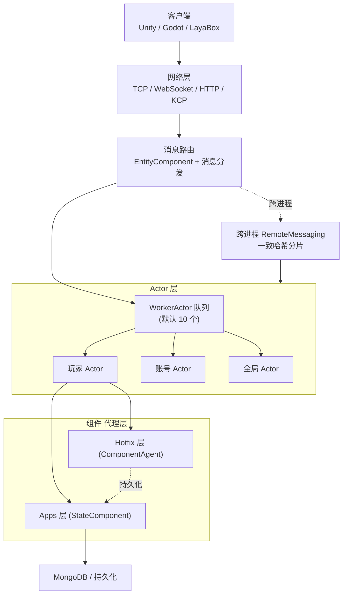

# 架构速览:Actor 模型与多进程拓扑

GameFrameX 以 Actor 模型为核心组织游戏服务器的运行时单元,Actor 之间通过消息传递而非共享状态进行协作;多个游戏进程之间依靠一致的 ActorId 编码和 ActorType 分段来路由消息,形成可横向扩展的多进程拓扑。

## 快速开始

1. 启动 `GameFrameX.Server.Start` 主进程,它会加载 `GameFrameX.Apps`(持久化状态层)与 `GameFrameX.Hotfix`(可热更业务层)双程序集。
2. 客户端通过 TCP/WebSocket/HTTP/KCP 中的任意一种接入网络层,消息被路由到对应的 Actor 处理器。
3. 服务器根据 ActorId 计算出所在进程,跨进程时走 `RemoteMessaging` 投递,进程内则投递到 `WorkerActor` 队列。

```csharp
// 通过 ActorId 获取玩家组件代理(进程内典型用法)
var agent = await ActorManager.GetComponentAgent<PlayerComponentAgent>(actorId);

[Actor.cs#L38-L100](https://github.com/GameFrameX/GameFrameX.Server.Source/blob/main/GameFrameX.Core/Actors/Actor.cs#L38-L100)
```

## 工作原理速览

GameFrameX 把"游戏实体"封装成 `IActor`,把"待执行消息"封装成 `IWorkerActor`,用 TPL DataFlow 实现无锁串行化;进程之间通过 `ActorId` 的高位段(`ActorType` + 进程/数据中心标识)做一致哈希分片。



- **Actor = 状态容器**:`IActor` 拥有 `Id`、`Type`、`ScheduleIdSet` 和 `WorkerActor`,每个 Actor 内部的消息由它独占的 `WorkerActor` 串行处理,无需加锁。详见 [IActor.cs](https://github.com/GameFrameX/GameFrameX.Server.Source/blob/main/GameFrameX.Core/Abstractions/IActor.cs#L38-L100)。
- **WorkerActor = 消息泵**:基于 TPL DataFlow,把入站消息转成可序列化的任务项依次执行,默认 `ActorManager` 启动 10 个 `WorkerActor` 作为分片。详见 [ActorManager.cs](https://github.com/GameFrameX/GameFrameX.Server.Source/blob/main/GameFrameX.Core/Actors/ActorManager.cs#L53-L100)。
- **进程内 vs 跨进程**:`ActorManager` 用 `ConcurrentDictionary<long, Actor>` 维护本进程 Actor 表;跨进程时通过 `RemoteMessaging` + 一致哈希定位目标进程。
- **类型分段**:`ActorType` 用 `ushort` 编码,小于 `Separator` 的值表示"单实例全局型",大于 `Separator` 的值表示"多实例型"(如玩家、公会),由雪花 ID 拼接 ActorType 形成唯一 ActorId。详见 [ActorType.cs](https://github.com/GameFrameX/GameFrameX.Server.Source/blob/main/GameFrameX.Apps/ActorType.cs#L38-L60)。

## 接下来

- 关于某个 Actor 的内部细节,见 `GameFrameX.Core/Actors/Actor.cs`。
- 关于跨进程消息收发,见 `GameFrameX.NetWork.Abstractions` 与 `NetWorkSenderFactory`。
- 关于 ActorId 编码与雪花算法,见 `GameFrameX.Utility/ActorIdGenerator.cs`。
- 关于组件代理与热更新边界,见《组件-代理层与热更新》页。

## 相关链接

- [IActor.cs](https://github.com/GameFrameX/GameFrameX.Server.Source/blob/main/GameFrameX.Core/Abstractions/IActor.cs#L38-L100)
- [IWorkerActor.cs](https://github.com/GameFrameX/GameFrameX.Server.Source/blob/main/GameFrameX.Core/Abstractions/IWorkerActor.cs)
- [ActorManager.cs](https://github.com/GameFrameX/GameFrameX.Server.Source/blob/main/GameFrameX.Core/Actors/ActorManager.cs#L53-L100)
- [Actor.cs](https://github.com/GameFrameX/GameFrameX.Server.Source/blob/main/GameFrameX.Core/Actors/Actor.cs)
- [WorkActor.cs](https://github.com/GameFrameX/GameFrameX.Server.Source/blob/main/GameFrameX.Core/Actors/Impl/WorkActor.cs)
- [ActorType.cs](https://github.com/GameFrameX/GameFrameX.Server.Source/blob/main/GameFrameX.Apps/ActorType.cs#L38-L60)
- [ActorIdGenerator.cs](https://github.com/GameFrameX/GameFrameX.Server.Source/blob/main/GameFrameX.Utility/ActorIdGenerator.cs)
- [NetWorkSenderFactory.cs](https://github.com/GameFrameX/GameFrameX.Server.Source/blob/main/GameFrameX.NetWork/NetWorkSenderFactory.cs)