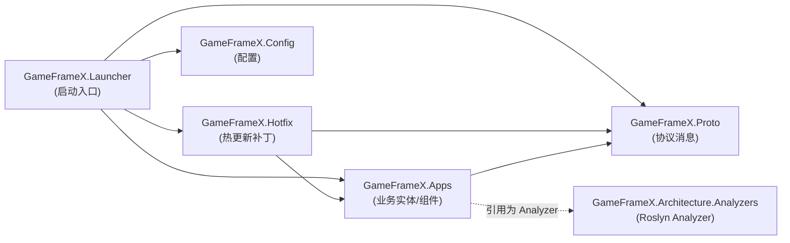

# 项目结构与分层(Apps / Hotfix / Proto / Config)速览

GameFrameX.Server 解决方案把服务器工程拆成四个职责单一的 C# 类库(以及 Launcher、Analyzers、Hotfix.Tests),让"协议 → 业务逻辑 → 热更新补丁 → 配置加载 → 启动入口"各自独立维护。下面这一屏可以看到每个工程装什么、谁引用谁。

## 快速开始

打开 `Server.sln`,你会看到以下工程(均位于仓库根目录):

| 工程 | csproj 路径 | 目标框架 | 主要职责 |
|------|-------------|----------|----------|
| `GameFrameX.Launcher` | [GameFrameX.Launcher/GameFrameX.Launcher.csproj](https://github.com/GameFrameX/GameFrameX.Server/blob/main/GameFrameX.Launcher/GameFrameX.Launcher.csproj) | — (待补充) | 程序启动入口 |
| `GameFrameX.Hotfix` | [GameFrameX.Hotfix/GameFrameX.Hotfix.csproj](https://github.com/GameFrameX/GameFrameX.Server/blob/main/GameFrameX.Hotfix/GameFrameX.Hotfix.csproj) | — (待补充) | 热更新业务逻辑补丁 |
| `GameFrameX.Config` | [GameFrameX.Config/GameFrameX.Config.csproj](https://github.com/GameFrameX/GameFrameX.Server/blob/main/GameFrameX.Config/GameFrameX.Config.csproj) | — (待补充) | 运行时配置项 |
| `GameFrameX.Proto` | [GameFrameX.Proto/GameFrameX.Proto.csproj](https://github.com/GameFrameX/GameFrameX.Server/blob/main/GameFrameX.Proto/GameFrameX.Proto.csproj) | — (待补充) | 网络协议 / 消息定义 |
| `GameFrameX.Apps` | [GameFrameX.Apps/GameFrameX.Apps.csproj](https://github.com/GameFrameX/GameFrameX.Server/blob/main/GameFrameX.Apps/GameFrameX.Apps.csproj) | `net10.0` | 业务实体、组件、状态(下文有引用关系示例) |
| `GameFrameX.Architecture.Analyzers` | [GameFrameX.Architecture.Analyzers/GameFrameX.Architecture.Analyzers.csproj](https://github.com/GameFrameX/GameFrameX.Server/blob/main/GameFrameX.Architecture.Analyzers/GameFrameX.Architecture.Analyzers.csproj) | — (待补充) | 编译期架构约束分析器(以 Roslyn Analyzer 形式被其他工程引用) |
| `GameFrameX.Hotfix.Tests` | [GameFrameX.Hotfix.Tests/GameFrameX.Hotfix.Tests.csproj](https://github.com/GameFrameX/GameFrameX.Server/blob/main/GameFrameX.Hotfix.Tests/GameFrameX.Hotfix.Tests.csproj) | — (待补充) | Hotfix 层的单元测试 |

> 表中的"待补充"列表示该 csproj 的具体内容本次未直接读取;具体信息以各 csproj 实际文件为准。

要"跑通"整个工程,在仓库根目录执行:

```bash
# 还原并编译整个解决方案
dotnet restore Server.sln
dotnet build  Server.sln -c Debug
```

## 工作原理速览

四个核心工程在编译期就通过 `ProjectReference` 形成一条单向依赖链,避免循环引用:



依赖方向只有一条主线(Launcher → Hotfix/Apps → Proto),Config 单独挂在 Launcher 侧,Analyzer 作为编译期约束挂在 Apps 上,不参与运行时调用链。

### 各分层职责

- **Proto(协议层)**:`GameFrameX.Proto` 工程集中放客户端-服务器、服务器-服务器之间的消息结构定义,被 Apps、Hotfix、Launcher 共同引用,保证全工程使用同一份协议契约。
- **Apps(业务实现层)**:`GameFrameX.Apps` 工程承载账号、玩家、游戏房间等业务实体(Entity)、组件(Component)、状态(State)与领域事件(EventArgs)。它的 csproj 直接引用 Proto:

  ```xml
  <ProjectReference Include="..\GameFrameX.Proto\GameFrameX.Proto.csproj" />
  <ProjectReference Include="..\GameFrameX.Architecture.Analyzers\GameFrameX.Architecture.Analyzers.csproj"
                    OutputItemType="Analyzer" ReferenceOutputAssembly="false" />
  ```

  `OutputItemType="Analyzer"` 表示该引用是 **编译期 Roslyn 分析器**,不参与运行时依赖,只在 `dotnet build` 时给 Apps 下的代码做架构规则检查。

  Source: [GameFrameX.Apps/GameFrameX.Apps.csproj#L10-L11](https://github.com/GameFrameX/GameFrameX.Server/blob/main/GameFrameX.Apps/GameFrameX.Apps.csproj#L10-L11)

- **Hotfix(热更新层)**:`GameFrameX.Hotfix` 依赖 Apps 与 Proto,承载可被运行时热替换的业务补丁;`GameFrameX.Hotfix.Tests` 对其进行单元测试。
- **Config(配置层)**:`GameFrameX.Config` 集中管理服务器启动、连接、数据库等配置项的读取与校验。
- **Launcher(启动入口)**:`GameFrameX.Launcher` 是解决方案中的可执行入口(在 `.sln` 中被列为 `Project("{9A19103F-16F7-4668-BE54-9A1E7A4F7556}")`,即 SDK 风格的可执行项目),它在启动时初始化 Config、加载 Proto、向 Hotfix 注册补丁。
- **Architecture.Analyzers(架构约束)**:`GameFrameX.Architecture.Analyzers` 以 Roslyn Analyzer 形式被 Apps 引用,在编译期约束代码必须按既定分层组织,避免业务逻辑写错层。

### 解决方案组成(逐项核对自 `Server.sln`)

下面 7 条 `Project(...)` 行直接来自 `Server.sln`,是工程分层的"权威清单":

| 工程 GUID | 工程名 |
|-----------|--------|
| `{835335CB-D99B-4CB9-99D3-A7883306E723}` | GameFrameX.Launcher |
| `{E47F7B43-E435-4B9E-AD10-1FE0D19F45CF}` | GameFrameX.Hotfix |
| `{08B73D90-AB00-4B9D-AE3C-AB19E6D594F9}` | GameFrameX.Config |
| `{12AA7D1B-E3EB-4DC4-BEAA-0C7BC5047B0C}` | GameFrameX.Proto |
| `{EAA64025-FD7E-4E0F-92D1-AEBAC1A552BF}` | GameFrameX.Apps |
| `{B973B133-20C6-4E43-AE76-99D845F93E6E}` | GameFrameX.Architecture.Analyzers |
| `{B216586B-DCF1-4492-90E3-34F0BE57BCD9}` | GameFrameX.Hotfix.Tests |

Source: [Server.sln#L6-L26](https://github.com/GameFrameX/GameFrameX.Server/blob/main/Server.sln#L6-L26)

## Apps 工程目录约定

在 `GameFrameX.Apps/GameFrameX.Apps.csproj` 中显式声明了三个顶层业务目录(`Account\`、`Player\`、`Server\`),业务代码必须落在这些目录下:

```xml
<Folder Include="Account\" />
<Folder Include="Player\" />
<Folder Include="Server\" />
```

Source: [GameFrameX.Apps/GameFrameX.Apps.csproj#L15-L17](https://github.com/GameFrameX/GameFrameX.Server/blob/main/GameFrameX.Apps/GameFrameX.Apps.csproj#L15-L17)

实际目录样例(`GameFrameX.Apps/` 下已存在的文件,可作为后续编码的参考):

| 一级目录 | 示例文件 |
|----------|----------|
| `Account/` | [Login/Component/LoginComponent.cs](https://github.com/GameFrameX/GameFrameX.Server/blob/main/GameFrameX.Apps/Account/Login/Component/LoginComponent.cs)、[Login/Entity/LoginState.cs](https://github.com/GameFrameX/GameFrameX.Server/blob/main/GameFrameX.Apps/Account/Login/Entity/LoginState.cs) |
| `Game/` | [RockPaperScissors/Component/RockPaperScissorsGameComponent.cs](https://github.com/GameFrameX/GameFrameX.Server/blob/main/GameFrameX.Apps/Game/RockPaperScissors/Component/RockPaperScissorsGameComponent.cs)、[Room/Component/RoomComponent.cs](https://github.com/GameFrameX/GameFrameX.Server/blob/main/GameFrameX.Apps/Game/Room/Component/RoomComponent.cs) |
| `Common/Event/` | [EventAttribute.cs](https://github.com/GameFrameX/GameFrameX.Server/blob/main/GameFrameX.Apps/Common/Event/EventAttribute.cs)、[EventId.cs](https://github.com/GameFrameX/GameFrameX.Server/blob/main/GameFrameX.Apps/Common/Event/EventId.cs) |
| `Common/EventData/` | [AttributeChangedEventArgs.cs](https://github.com/GameFrameX/GameFrameX.Server/blob/main/GameFrameX.Apps/Common/EventData/AttributeChangedEventArgs.cs)、[PlayerSendItemEventArgs.cs](https://github.com/GameFrameX/GameFrameX.Server/blob/main/GameFrameX.Apps/Common/EventData/PlayerSendItemEventArgs.cs) |
| `Common/Session/` | [Session.cs](https://github.com/GameFrameX/GameFrameX.Server/blob/main/GameFrameX.Apps/Common/Session/Session.cs)、[SessionManager.cs](https://github.com/GameFrameX/GameFrameX.Server/blob/main/GameFrameX.Apps/Common/Session/SessionManager.cs) |
| 根目录 | [AppsHandler.cs](https://github.com/GameFrameX/GameFrameX.Server/blob/main/GameFrameX.Apps/AppsHandler.cs)、[ActorType.cs](https://github.com/GameFrameX/GameFrameX.Server/blob/main/GameFrameX.Apps/ActorType.cs)、[BsonClassMapHelper.cs](https://github.com/GameFrameX/GameFrameX.Server/blob/main/GameFrameX.Apps/BsonClassMapHelper.cs)、[CacheStateTypeManager.cs](https://github.com/GameFrameX/GameFrameX.Server/blob/main/GameFrameX.Apps/CacheStateTypeManager.cs) |

> 表中文件均通过 `ListFiles` 在 `GameFrameX.Apps/**/*.cs` 下扫描得到;`Player/` 与 `Server/` 两个目录在 csproj 中已声明,但本次未直接列举其下文件。

## 接下来

- 想在 `Account/`、`Player/`、`Server/` 下加业务逻辑,见《如何在 Apps 层新增一个业务模块》(待补)。
- 想新增协议消息,见《Proto 协议消息定义规范》(待补)。
- 想给 Hotfix 加可热更新的补丁,见《Hotfix 热更新编写指南》(待补)。
- 想加配置项,见《Config 配置加载与校验》(待补)。
- 想启动整个服务器,见《Launcher 启动流程》(待补)。
