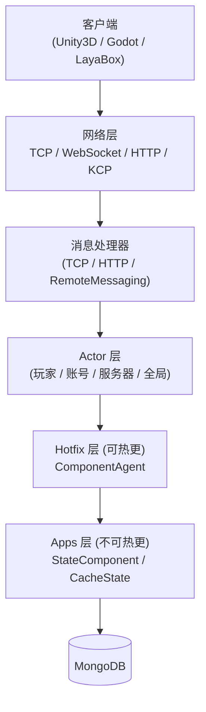

# 概述

GameFrameX Server 是基于 C# .NET 10.0 开发的高性能、跨平台游戏服务器框架，采用 Actor 模型与无锁消息队列，支持热更新机制，专为多人在线游戏设计，可对接 Unity3D、Godot、LayaBox 等多种客户端。

## 快速开始

### 环境要求

- [.NET 10.0 SDK](https://dotnet.microsoft.com/download/dotnet/10.0)（不支持 .NET 8/9）
- MongoDB 4.x+
- Visual Studio 2022 或 JetBrains Rider

### 启动流程

1. 启动 MongoDB：

```bash
docker run -d -p 27017:27017 --name mongo mongo:8.2
```

Source: [README.zh-CN.md](https://github.com/GameFrameX/GameFrameX.Server.Source/blob/main/README.zh-CN.md#L192-L199)

2. 还原并构建项目：

```bash
dotnet restore
dotnet build
```

Source: [README.zh-CN.md](https://github.com/GameFrameX/GameFrameX.Server.Source/blob/main/README.zh-CN.md#L182-L189)

3. 启动服务器（以 Game 类型为例）：

```bash
dotnet run --project GameFrameX.Launcher -- \
    --ServerType=Game \
    --ServerId=1000 \
    --OuterPort=29100 \
    --HttpPort=28080 \
    --DataBaseUrl=mongodb://127.0.0.1:27017 \
    --DataBaseName=gameframex
```

Source: [README.zh-CN.md](https://github.com/GameFrameX/GameFrameX.Server.Source/blob/main/README.zh-CN.md#L201-L210)

4. 验证启动：访问 `http://localhost:28080/game/api/health` 检查健康状态，查看控制台日志确认 `Actor` 与监听端口初始化成功。

Source: [README.zh-CN.md](https://github.com/GameFrameX/GameFrameX.Server.Source/blob/main/README.zh-CN.md#L212-L214)

## 工作原理速览

GameFrameX Server 由四层组成：网络层接收客户端消息，Actor 层基于 TPL DataFlow 无锁串行处理，业务逻辑由可热更的 Hotfix 层实现，状态数据由不可热更的 Apps 层管理并通过批量持久化写入 MongoDB。



Source: [README.zh-CN.md](https://github.com/GameFrameX/GameFrameX.Server.Source/blob/main/README.zh-CN.md#L92-L127)

### 核心特性

| 类别 | 能力 |
|------|------|
| 并发模型 | Actor 模型 + 全异步 async/await、零锁设计、批量持久化、雪花 ID |
| 热更新 | 零停机加载新程序集，状态逻辑分离，旧程序集 10 分钟宽限期卸载，支持 HTTP 指定版本 |
| 网络协议 | TCP（SuperSocket）、WebSocket、HTTP/HTTPS（Kestrel + Swagger）、KCP（实验性）、跨进程 RemoteMessaging |
| 数据库 | MongoDB 主库，含健康状态机、连接池、OpenTelemetry 指标 |
| 可观测性 | OpenTelemetry Metrics/Tracing/Logging、Prometheus 导出、Serilog 控制台/文件/Loki 输出 |

Source: [README.zh-CN.md](https://github.com/GameFrameX/GameFrameX.Server.Source/blob/main/README.zh-CN.md#L50-L89)

### 项目结构

```
Server/
├── GameFrameX.Launcher/              # 应用入口点
├── GameFrameX.StartUp/               # 启动编排和初始化
├── GameFrameX.Core/                  # 核心框架（Actor、组件、事件、热更新管理）
├── GameFrameX.Apps/                  # 状态数据层（不可热更）
├── GameFrameX.Hotfix/                # 业务逻辑层（可热更）
├── GameFrameX.Config/                # 游戏配置表（LuBan 生成）
├── GameFrameX.NetWork/               # 网络核心（消息对象、发送器、WebSocket）
├── GameFrameX.NetWork.HTTP/          # HTTP 服务器（Swagger、Kestrel）
├── GameFrameX.NetWork.Kcp/           # KCP 协议支持
├── GameFrameX.NetWork.RemoteMessaging/ # 跨进程远程消息（断路器、一致性哈希）
├── GameFrameX.DataBase.Mongo/        # MongoDB 实现
├── GameFrameX.Monitor/               # OpenTelemetry + Prometheus 集成
├── GameFrameX.Utility/               # 工具集（日志、压缩、对象池、Mapster）
├── GameFrameX.AppHost/               # .NET Aspire 应用主机
└── Tests/GameFrameX.Tests/           # xUnit 测试套件
```

Source: [README.zh-CN.md](https://github.com/GameFrameX/GameFrameX.Server.Source/blob/main/README.zh-CN.md#L131-L162)

## 接下来

- 想先跑起来：按上文「快速开始」走完克隆 → 构建 → 启动。
- 想了解各配置项默认值：见《配置参考》（按 `--ServerType` / `--OuterPort` / `--DataBaseUrl` 等维度列出）。
- 想写第一个业务 Handler：见《如何实现业务 Handler》（基于 `ComponentAgent` + `StateComponent` 的示例）。
- 启动后报错：见《启动失败怎么办》（含 MongoDB 连接、端口占用、Actor 超时等常见症状）。
- 想了解 Actor 与组件：见《核心概念：Actor / 组件 / 代理》。
