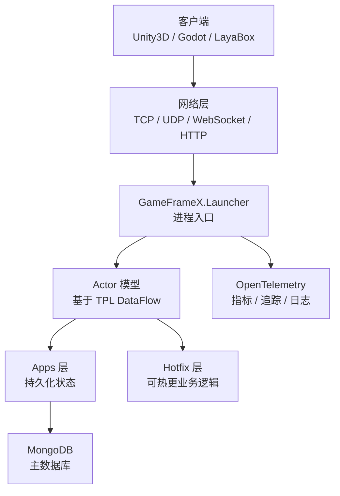

# 快速上手:搭建你的第一个游戏服务器

按本页步骤,你可以在本地把 GameFrameX Server 拉起来,跑通一个能监听 TCP / HTTP / WebSocket 的游戏服务器进程,并通过健康检查接口确认启动成功。框架基于 .NET 10.0,使用 Actor 模型,默认连接 MongoDB 做状态持久化。

## 前置条件

| 依赖 | 版本 | 说明 |
|------|------|------|
| .NET SDK | 10.0 | 框架以 .NET 10.0 为目标;在 [dotnet 官网](https://dotnet.microsoft.com/download/dotnet/10.0) 下载 |
| MongoDB | 4.x 及以上 | 主数据库,用于状态持久化;本地默认 `mongodb://127.0.0.1:27017` |
| Docker(可选) | 最新版 | 不想装 MongoDB 时可用仓库根目录的 `docker-compose.yml` 一键起 |
| IDE | 任意 | Rider / VS 2022(17.10+)/ VS Code 均可 |

## 快速开始

### 1. 获取源码

```bash
git clone https://github.com/GameFrameX/GameFrameX.Server.Source.git
cd GameFrameX.Server.Source
```

### 2. 准备数据库(任选其一)

**方式 A:使用仓库自带的 Docker Compose**

```bash
docker-compose up -d mongodb
```

**方式 B:自行启动 MongoDB**,确保监听 `127.0.0.1:27017`。

### 3. 构建解决方案

```bash
dotnet build GameFrameX.Launcher -c Debug
```

### 4. 启动服务器

最小启动命令(`Launcher` 是进程入口):

```bash
dotnet run --project GameFrameX.Launcher -- \
    --ServerType=Game \
    --ServerId=1000 \
    --OuterPort=29100 \
    --HttpPort=28080 \
    --DataBaseUrl=mongodb://127.0.0.1:27017 \
    --DataBaseName=gameframex
```

所有配置项通过 `--Key=Value` 命令行参数传入,定义在 `StartupOptions` 中。常用项见下表:

| 配置项 | 是否必填 | 默认值 | 说明 |
|--------|----------|--------|------|
| `ServerType` | 是 | 无 | 服务器类型,如 `Game`、`Social` |
| `ServerId` | 是 | 无 | 服务器唯一标识 ID |
| `DataBaseUrl` | 是 | 无 | MongoDB 连接字符串 |
| `DataBaseName` | 是 | 无 | 数据库名称 |
| `OuterPort` | 否 | `29100` | 对客户端的 TCP 端口 |
| `HttpPort` | 否 | `8080` | HTTP / 健康检查端口 |
| `IsEnableHttp` | 否 | `true` | 是否启用 HTTP 服务 |
| `HttpIsDevelopment` | 否 | `false` | 开发模式(启用 Swagger) |
| `IsEnableWebSocket` | 否 | `false` | 是否启用 WebSocket |

### 5. 验证启动

启动后做两件事确认服务正常:

1. **健康检查接口**(默认 API 根路径为 `/game/api/`):
   ```bash
   curl http://localhost:28080/game/api/health
   ```
2. **查看控制台日志**,出现类似 `Server started, listening on 0.0.0.0:29100` 即表示启动成功。

## 工作原理速览



- **Launcher**:进程入口,接收命令行参数,启动网络层与 Actor 容器。
- **Apps 层**:定义 `StateComponent` 与 `BaseCacheState`,负责状态持久化,不可热更。
- **Hotfix 层**:实现 `StateComponentAgent`,放业务逻辑,支持运行时热更新。
- **Actor 模型**:无锁高并发,内部状态通过消息队列串行化访问。
- **网络层**:TCP(基于 SuperSocket)、WebSocket、HTTP/Kestrel 多协议并行。

## 写一个最小的登录组件

框架的核心模式是**状态-逻辑分离**。下面用一个登录示例演示完整链路。

**1. 状态(Apps 层,不可热更)**

`GameFrameX.Apps/Account/Login/Entity/LoginState.cs` 已存在,字段包括账号、Token、登录时间等。

**2. 组件(Apps 层,不可热更)**

```csharp
public class LoginComponent : StateComponent<LoginState>
{
    protected override async Task OnInit()
    {
        await base.OnInit();
        // 初始化组件状态
    }
}
```

**3. 业务逻辑(Hotfix 层,可热更)**

`GameFrameX.Hotfix/Logic/Account/Login/ReqLoginHandler.cs` 已存在,作为 HTTP / 消息处理器调用 `LoginComponent` 写入 Token。

**4. 跨层调用**

```csharp
// 通过 ActorManager 获取组件代理
var loginAgent = await ActorManager.GetComponentAgent<LoginComponentAgent>(actorId);
var result = await loginAgent.Login(account, password);
```

完整业务开发流程与组件代理模式,见《业务逻辑开发》章节;Hotfix 程序集替换机制见《热更新机制》章节。

## 接下来

- **配置项全集**:见《配置参考》——所有 `--Key=Value` 参数、默认值与示例。
- **业务开发**:见《如何编写一个 Actor 组件》——状态、组件、代理三件套。
- **热更新**:见《如何热更新业务逻辑》——Hotfix 程序集零停机替换。
- **Docker 部署**:见《Docker 部署》——根目录 `docker-compose.yml` / `docker-compose.multi.yml` 多进程联调。
- **监控**:见《监控与可观测性》——Prometheus、Grafana Loki、OpenTelemetry 接入。
