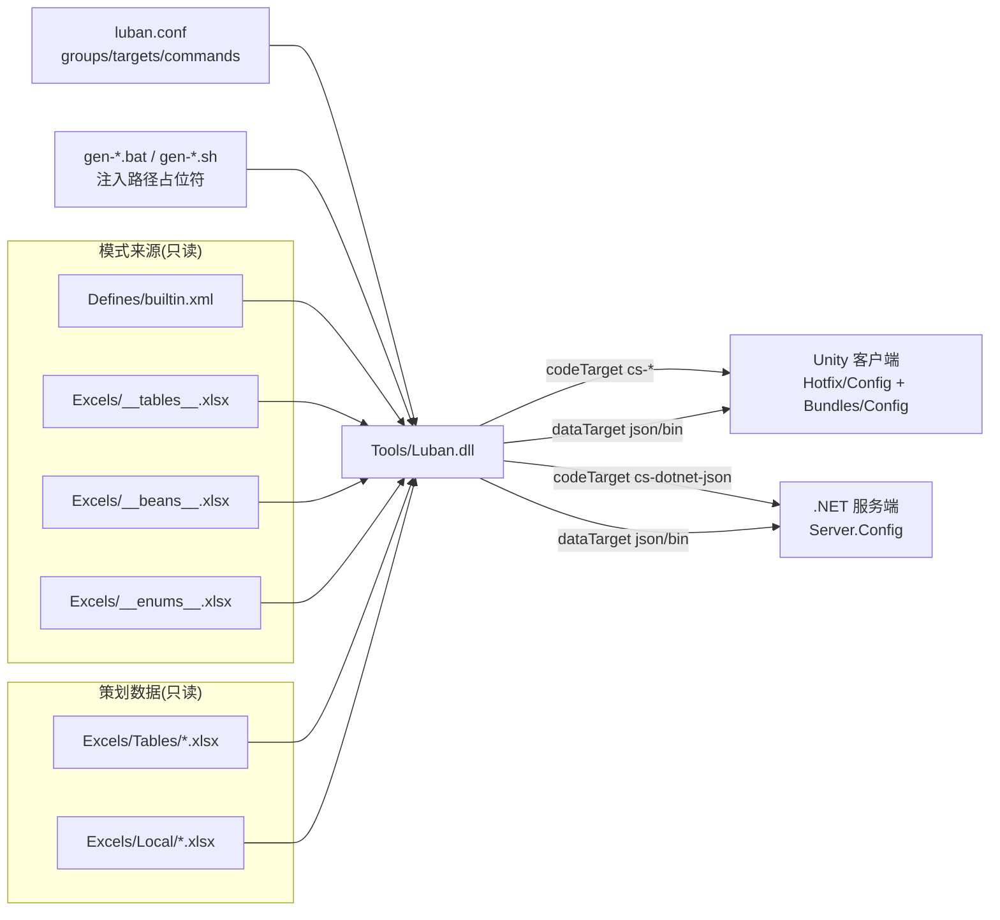

# Config 工具的工作原理

GameFrameX.Config 是一个基于 [Luban](https://github.com/GameFrameX/luban) 的配置表工具：它读取 `Excels/` 下的 Excel 工作簿（数据表 + 本地化表 + 高级定义表），结合 `Defines/builtin.xml` 与 `luban.conf` 中的配置，把它们一次性生成成客户端、服务端两侧都可以直接加载的 C# 代码与数据文件。

## 一句话工作流

运行 `gen-*.bat` 或 `gen-*.sh` 脚本 → 工具读取 `luban.conf` → 按 `targets` 列表里的命令逐个调用 `Tools/Luban.dll` → 在 Unity 工程的 `Hotfix/Config/Generate/`（代码）与 `Bundles/Config/`（数据）下产出文件，同时在 `Server.Config/` 下产出服务端版本。

## 配置驱动：`luban.conf` 决定生成什么

`luban.conf` 是工具的"中央配置"，一切行为都从这里来。来源:[luban.conf](https://github.com/GameFrameX/GameFrameX.Config/blob/main/luban.conf)

| 字段 | 含义 | 示例 |
|------|------|------|
| `groups` | 标记分组，`c` = 客户端、`s` = 服务端 | `"names": ["c"]`、``"names": ["s"]` |
| `schemaFiles` | 数据模式定义来源（含字段类型、枚举、bean、表格骨架） | `Defines`、`Excels/__tables__.xlsx`、`Excels/__beans__.xlsx`、`Excels/__enums__.xlsx` |
| `dataDir` | 业务数据所在目录 | `Excels` |
| `targets` | 一次生成要产出的目标集合（每个目标有自己的命名空间、manager、groups） | `server`、`client`、`all` |
| `commands` | 真正传给 Luban 的命令行，每个目标对应多条（json / bin 等不同格式） | `--target server --dataTarget json --codeTarget cs-dotnet-json …` |
| `toolPath` | Luban 工具 dll 路径 | `/../Config/Tools/Luban.dll` |
| `UNITY_ASSETS_PATH` / `SERVER_PATH` | 客户端与服务端工程位置占位符，会在命令里展开 | 由运行脚本注入 |

每条 `commands` 通过占位符 `%UNITY_ASSETS_PATH%` 和 `%SERVER_PATH%` 决定代码与数据写到哪个工程目录。

## 三层数据：行为 / 模式 / 数据

工具把工作内容分成三层来源:

1. **行为层**(`luban.conf`)：决定生成格式、目标、命名空间。
2. **模式层**(`Defines/builtin.xml` + `Excels/__*__.xlsx`)：定义字段类型、枚举、结构体、表格骨架。
3. **数据层**(`Excels/Tables/*.xlsx`、`Excels/Local/*.xlsx`)：策划实际填的数据。

来源示例 — `Defines/builtin.xml` 把同一份"坐标"在客户端映射到 Unity 类型、服务端映射到 .NET 类型:

```xml
<bean name="vec3" valueType="1" sep="," group="*">
    <var name="x" type="float"/>
    <var name="y" type="float"/>
    <var name="z" type="float"/>
    <mapper target="client" codeTarget="cs-bin,cs-simple-json">
        <option name="type" value="UnityEngine.Vector3"/>
        <option name="constructor" value="ExternalTypeUtil.NewVector3"/>
    </mapper>
    <mapper target="server" codeTarget="cs-bin,cs-dotnet-json">
        <option name="type" value="System.Numerics.Vector3"/>
        <option name="constructor" value="ExternalTypeUtil.NewVector3"/>
    </mapper>
</bean>
```

来源:[Defines/builtin.xml](https://github.com/GameFrameX/GameFrameX.Config/blob/main/Defines/builtin.xml#L14-L26)

也就是说：策划用一份 Excel，工具自动按目标输出对应语言/引擎的代码；不需要为客户端、服务端各写一份。

## 三类生成目标

来源:[luban.conf](https://github.com/GameFrameX/GameFrameX.Config/blob/main/luban.conf#L35-L60)

| 目标名 | `topModule`（命名空间） | `manager` | 何时启用 |
|--------|-----------------------|-----------|----------|
| `server` | `GameFrameX.Config` | `TablesComponent` | 服务端代码/数据，groups = `s` |
| `client` | `Hotfix.Config` | `TablesComponent` | Unity 客户端代码/数据，groups = `c` |
| `all` | `cfg` | `Tables` | 通用导出，groups = `c,s` |

`commands` 列表里每条命令又可以独立切 `dataTarget`（`json` 或 `bin`）、`codeTarget`（`cs-dotnet-json` / `cs-simple-json` / `cs-bin`）以及 `validationFailAsError`。

## 一次完整生成的步骤

1. 策划填写 `Excels/Tables/*.xlsx` 与 `Excels/Local/*.xlsx`（命名遵守 `字母-英文名-中文名`）。
2. 在仓库根目录运行 `gen-client-json.bat / .sh`（或 `gen-server-bin.bat / .sh` 等），脚本内部会把 `UNITY_ASSETS_PATH`、`SERVER_PATH` 注入占位符。
3. 工具读取 `luban.conf`，按 `commands` 顺序启动 `Tools/Luban.dll`，对应每个 target 一条命令。
4. Luban 解析模式文件 (`Defines/`、`__tables__.xlsx`、`__beans__.xlsx`、`__enums__.xlsx`)，与 `Excels/` 数据一一校验。
5. 按 `codeTarget` 生成 C# 源码到 `%UNITY_ASSETS_PATH%/Hotfix/Config/Generate/` 或 `%SERVER_PATH%/Server.Config/Config/`。
6. 按 `dataTarget` 生成数据文件到 `Bundles/Config/`（运行时打包到首包）或 `Server.Config/Json/`（服务端读取）。
7. 终端成功输出，文件已落地即可在工程里直接调用 `tables.TbXxx.Get(id)`。

## 架构关系图



## 设计意图（背景）

- **配置即中心**: `luban.conf` 把"谁生成、生成到哪、用什么格式"全部外置成 JSON；要新增目标或切换 json/bin，不用改工具本体。
- **一份数据两侧用**: 在 `Defines/builtin.xml` 里把同一个 bean 用 `<mapper target="client" ...>` 与 `<mapper target="server" ...>` 分别映射到 Unity 与 .NET 类型，让 Unity 服务端共享同一份业务表。
- **分组合并**: 同样的英文表名（例 `D-ItemConfig-道具表-1001.xlsx` 与 `D-ItemConfig-道具表-2001.xlsx`）会被合并成一张表，方便按需拆分大表。

## 相关链接

- [Defines/builtin.xml](https://github.com/GameFrameX/GameFrameX.Config/blob/main/Defines/builtin.xml)
- [luban.conf](https://github.com/GameFrameX/GameFrameX.Config/blob/main/luban.conf)
- [README.zh-CN.md](https://github.com/GameFrameX/GameFrameX.Config/blob/main/README.zh-CN.md)
- 上游工具 [GameFrameX/luban](https://github.com/GameFrameX/luban)
