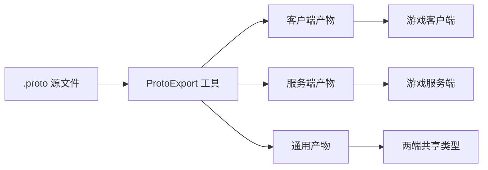

# 项目简介

GameFrameX.Protobuf 是 GameFrameX 框架的统一网络协议定义仓库,所有客户端与服务端共享的通信协议都用 Protocol Buffers 3(`proto3`)写在这里。仓库按业务模块组织 `.proto` 文件,每个文件以数字模块 ID 命名,既用于消息路由,也用于生成错误码。

## 快速开始

1. **拉取协议产物**:直接从 [Releases/latest](https://github.com/GameFrameX/GameFrameX.Protobuf/releases/latest) 下载编译好的多语言代码;每次 `push` 后 CI 会自动重新生成并发布到该 Release,无需本地工具链。
2. **查阅协议模块**:确认你需要的业务在仓库的哪个 `.proto` 文件里(见下表"协议模块")。
3. **修改或新增协议**:在仓库根目录新建/编辑 `_<ModuleID:0000>_<Domain>.proto` 文件,遵循 `proto3` 与模块命名规范。
4. **触发导出**:可通过三种方式之一生成代码——CI 自动、Docker 镜像、本地脚本(详见"导出工具")。

```protobuf
// 文件名:_0010_Basic.proto
syntax = "proto3";
package Basic;
option module = 10;

// 请求心跳
message ReqHeartBeat
{
  int64 Timestamp = 1; // 时间戳
}
```

```text
Source: https://github.com/GameFrameX/GameFrameX.Protobuf/blob/main/_0010_Basic.proto#L1-L9
```

## 协议模块

| Proto 文件 | 模块 ID | 说明 |
|------------|---------|------|
| `_0002_InnerBasic.proto` | 2 | 内部基础协议 |
| `_0010_Basic.proto` | 10 | 基础协议(心跳等) |
| `_0020_Common.proto` | 20 | 通用协议(错误码、共享类型) |
| `_0100_Bag.proto` | 100 | 背包协议 |
| `_0120_Social.proto` | 120 | 社交协议 |
| `_-0120_Inner_Social.proto` | -120 | 内部社交协议(服务端) |
| `_0300_User.proto` | 300 | 用户 / 账号协议 |
| `_0310_Attribute.proto` | 310 | 玩家属性同步协议 |
| `_0400_Room.proto` | 400 | 房间协议 |
| `_0410_RockPaperScissors.proto` | 410 | 石头剪刀布小游戏协议 |
| `_0500_Mail.proto` | 500 | 邮件系统协议 |

> 规则:文件名 `_<ModuleID:0000>_<Domain>.proto`,数字正数表示对外协议(客户端 ↔ 服务端),负数表示内部协议(服务端 ↔ 服务端);内部协议以 `Inner` 前缀开头。

## 导出工具

代码生成由 [GameFrameX.Tools `ProtoExport`](https://github.com/GameFrameX/GameFrameX.Tools) 驱动,可选三种工作流:

| 方式 | 适用场景 | 操作 |
|------|---------|------|
| **CI(零配置)** | 推荐 | 推送后 CI 自动导出全部语言,产物发布到 [Releases/latest](https://github.com/GameFrameX/GameFrameX.Protobuf/releases/latest),直接下载 |
| **Docker** | 不愿配本地工具链 | `docker run gameframex/gameframex-tools:latest ...` |
| **本地脚本** | 自定义构建 | 构建 `Tools/ProtoExport`(.NET 10),把产物放入 `Tools/` 目录,执行 `Proto2*Export.sh` / `.bat` |

仓库内提供的脚本(以 C# 为例):

- `Proto2CsExport_All.bat` / `Proto2CsExport_All.sh` — 同时启动客户端与服务端导出
- `Proto2CsExport_Client.bat` / `Proto2CsExport_Client.sh` — 仅导出客户端
- `Proto2CsExport_Server.bat` / `Proto2CsExport_Server.sh` — 仅导出服务端

另有 `Proto2CppExport`、`Proto2GoExport` 等对应其他语言的脚本。

```bat
@echo off
start Proto2CsExport_Client.bat
start Proto2CsExport_Server.bat
```

```text
Source: https://github.com/GameFrameX/GameFrameX.Protobuf/blob/main/Proto2CsExport_All.bat#L1-L3
```

## 工作原理速览



- 仓库只保存 `.proto` 源文件,作为协议的唯一真实来源。
- 工具读取 `option module` 决定路由号,读取文件名前缀决定模块归属。
- 产物按"客户端 / 服务端 / 通用"分目录生成,避免内部协议泄露给客户端。

## 接下来

- 关于"如何新增一个协议模块",见《如何新增协议》
- 关于"协议命名与错误码规则",见《协议规范》
- 关于"下载或自构建产物",见《导出工具使用》
- 完整文档站点:[GameFrameX 文档站](https://gameframex.doc.alianblank.com/protobuf/require)
