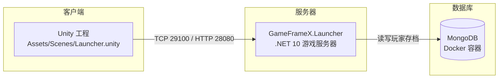

# 入门

欢迎来到 GameFrameX！

这套入门教程是为**第一次接触游戏服务器开发的新手**准备的。跟着做完，你会从「电脑上什么都没装」一路走到「用 Unity 客户端登录进自己本地跑的游戏服务器」，全程大约 10~15 分钟。

## 学习路线

按顺序读完这 5 篇，你就完成了入门：

| 步骤 | 章节 | 你会得到什么 |
|------|------|-------------|
| ① | [什么是 GameFrameX](./introduce.md) | 知道它是什么、能帮你省掉哪些麻烦 |
| ② | [项目结构详解](./project-structure.md) | 看懂每个文件夹是干嘛的、数据怎么流动 |
| ③ | [环境准备](./environment.md) | 装好 .NET、Unity、Docker，并逐个验证 |
| ④ | [快速上手：五步跑通](./quick-start.md) | 服务器 + 数据库 + 客户端全链路跑起来 |
| ⑤ | [跑通之后](./next-steps.md) | 学会日常开发三件事，知道下一步学什么 |

::: tip 时间紧？
只想尽快跑起来：直接跳到 [环境准备](./environment.md) → [快速上手](./quick-start.md)，遇到看不懂的目录再回头查 [项目结构详解](./project-structure.md)。
:::

## 一张图看懂全链路

跑通之后，你电脑上会运行着这样的三件东西：

- **客户端（Unity）**：玩家看到和操作的部分，登录、主城界面都在这里
- **服务器**：游戏的「大脑」，处理登录、校验数据、转发消息
- **数据库**：玩家的账号、角色、背包等数据的存放地

三件东西各自独立运行、互相配合。入门教程的目标就是让你亲手把这三件东西全部跑起来并连成一条线。

## 按需选路

| 你的情况 | 建议路线 |
|---------|---------|
| 纯新手，想完整体验 | ① → ⑤ 全部做完 |
| 只想跑服务器，暂时不碰 Unity | ③ → ④ 的第 1~3 步（数据库 + 服务器），用 `http://localhost:29090/health` 验证即可 |
| 客户端开发者，服务器交给别人 | ③（装 Unity 即可）→ ④ 的第 4 步 |
| 已经跑通了，想继续开发 | 直接看 [跑通之后](./next-steps.md) |

## 卡住了怎么办

- 每一步都有「验证」小节，先对照检查自己是否达成
- 常见报错集中在 [快速上手](./quick-start.md) 最后的「卡住了？速查表」
- 还解决不了？加 QQ 群 **467608841** 提问
