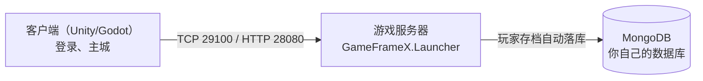

# 跑通之后

全链路跑通了，然后呢？这一篇回答两个问题：**日常开发怎么改东西**，以及**下一步往哪个方向深入**。

## 你刚跑通了什么

回顾一下，你电脑上现在运行着三件配合工作的东西：



日常开发就是在改这条链路上的零件。最常改的是下面三件事。

## 日常开发三件事

### ① 改数值 / 加道具 → 改 Excel 配置

策划表都在 `Config/Excels/Tables/` 里，Excel 直接改，然后重新生成：

| 你改了 | 跑哪个命令 | 产物去哪 |
|--------|-----------|---------|
| 服务端要读的表 | `cd Config && sh gen-server-bin.sh`（Windows 双击 `gen-server-bin.bat`） | `Server/GameFrameX.Config/` |
| 客户端要读的表 | `cd Config && sh gen-client-json.sh` | `Unity/Assets/` |

::: tip 表文件名有讲究
格式是 `字母-英文名-中文名.xlsx`（如 `D-ItemConfig-道具表-道具-1001.xlsx`），Excel 里前 4 行是表头，第 5 行起才是数据。完整规则见 [配置文件文档](../config/)。
:::

### ② 客户端和服务器加新消息 → 改 .proto 协议

协议文件在 `Protobuf/*.proto`，改完导出成两端代码：

```shell
# 导出工具不随仓库分发，第一次要先构建（只需一次）
cd Tools
dotnet build ProtoExport/ProtoExport.csproj -c Release

# 之后每次改完 .proto 跑这两条
cd ../Protobuf
sh Proto2CsExport_Server.sh    # 服务端代码 → Server/GameFrameX.Proto/
sh Proto2CsExport_Client.sh    # 客户端代码 → Unity/Assets/Hotfix/Proto/
```

协议有硬规则（只支持 proto3、消息命名 `Req/Resp/Notify` 前缀、字段编号 < 800 等），详见 [协议文档](../protobuf/)。

### ③ 改界面 → 改 FairyGUI UI

1. 用 FairyGUI 编辑器（≥5.0）打开 `FairyGUIProject/Game.fairy`（Godot 客户端对应 `Godot/FairyGUIProject/`）
2. 改完 **文件 → 发布**，**务必勾选「生成代码」**
3. 产物自动写入 `Unity/Assets/`（或 Godot 工程），回到引擎等编译完就能看到

::: warning 新人最常见问题
发布完 Unity 里报「找不到类」→ 十有八九是发布时没勾**「生成代码」**，回去重新发布一次。
:::

## 深入方向导航

跑通之后，按你的角色选方向继续：

| 想深入什么 | 去哪看 |
|-----------|--------|
| 服务器：启动参数、消息处理、Actor 模型 | [服务器文档](../server/) |
| Unity 客户端：组件清单、构建打包 | [Unity 客户端文档](../client/unity/) |
| Godot 客户端：工程结构、迁移说明 | [Godot 客户端文档](../client/godot/) |
| 配置表：完整规则、进阶用法 | [配置文件文档](../config/) |
| 协议：导出工具、命名规则 | [协议文档](../protobuf/) |
| 用 Docker 部署整套服务 | [Docker 文档](../docker/) |
| 写一个自己的玩法功能（加状态 + 逻辑） | [服务器文档](../server/) 中的开发指南 |

## 三个好习惯

1. **改源仓库，不改聚合仓**——你的提交才会被保留（规则见[项目结构详解](./project-structure.md)）
2. **生成产物提交前跑一遍检查**——改 Excel / proto 后先生成、再编译、再跑通，别提交跑不起来的代码
3. **数据库数据可以随时清空重来**——本地学习阶段，删掉 `docker/mongo/database/` 下的文件再重启容器，就是一个全新的库

## 交流 & 反馈

- 建议、需求、BUG：QQ 群 **467608841**
- 提 Issue / PR：https://github.com/GameFrameX
