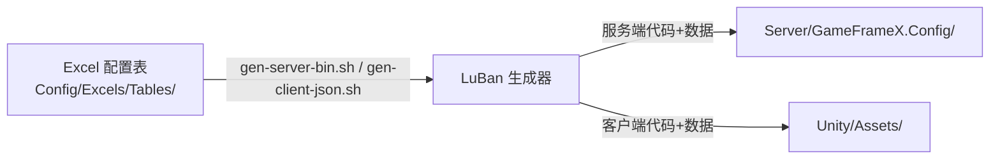
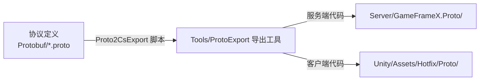
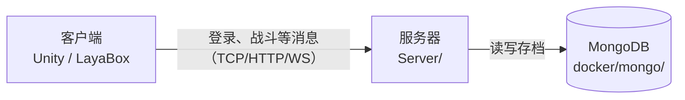

# 项目结构详解

下载 GameFrameX 后你会得到一大堆文件夹。这一篇把它们一个个讲清楚：**是什么、干什么用、你什么时候会碰到它**。

## 先搞懂一件事：这是「聚合仓」

你下载的 GameFrameX 主仓库是一个**聚合发布仓**——它每天自动把 7 个源仓库的最新代码同步到同名文件夹里。好处是：

1. **下载一次就拿到所有零件**，不用挨个 clone 七八个仓库
2. **文件夹天生就在正确位置**——配置生成、协议导出都靠相对路径互相找到对方
3. 下载下来的快照**自带全部生成产物**（配置代码、协议代码都已就位），直接就能跑

由此带来三条新手必须知道的规则：

::: warning 聚合仓三规则
1. **别改名、别挪位置**——`Config`、`Protobuf`、`Tools` 之间靠相对路径互相找，挪了就跑不动
2. **直接改本仓库里的代码是没用的**——每天自动同步会把改动覆盖掉
3. **要改代码、提 PR，请去对应的源仓库**（见文末表格）
:::

## 顶层目录一览

```
GameFrameX/                   # 项目根目录
├── Server/                   # 游戏服务器（.NET 10，Actor 模型 + 热更新）
├── Unity/                    # Unity 客户端工程（含 HybridCLR 热更、YooAsset 资源）
├── LayaBox/                  # LayaAir 客户端工程（可选客户端）
├── Config/                   # LuBan 配置表：Excel 在这改，一键生成两端代码
├── Protobuf/                 # 通讯协议：.proto 在这改，一键导出各端代码
├── FairyGUIProject/          # UI 编辑工程（FairyGUI 编辑器打开 Game.fairy）
├── Tools/                    # 辅助工具（协议导出 CLI / GUI）
├── docker/                   # 本地数据库一键启动（mongo / postgres）
├── Admin/                    # 管理后台相关
├── Foundation/               # 服务器底层基础库源码（正常开发无需关心）
├── scripts/                  # 聚合同步脚本（无需关心）
└── Docs/                     # 文档站源码（就是你现在看的这个站点）
```

| 目录 | 是什么 | 你什么时候会碰到 |
|------|--------|----------------|
| `Server/` | 游戏服务器本体，玩家的登录、战斗、存档逻辑都在这跑 | 跑服务器、写服务器逻辑 |
| `Unity/` | Unity 客户端工程，双击用 Unity 打开的就是它 | 跑客户端、写客户端逻辑 |
| `LayaBox/` | LayaAir 版客户端，和 Unity 二选一 | 只有用 LayaAir 时才碰 |
| `Config/` | 配置表工程，Excel 都放这 | 改数值、加道具、加关卡 |
| `Protobuf/` | 通讯协议定义，`.proto` 文件都放这 | 客户端和服务器之间加新消息 |
| `FairyGUIProject/` | UI 编辑工程，界面在这里面画 | 改界面、加界面 |
| `Tools/` | 协议导出工具（命令行 + 图形界面） | 改完 `.proto` 后导出代码时 |
| `docker/` | 本地数据库的 Docker 配置 | 入门第 1 步启动 MongoDB |
| `Admin/` | 管理后台相关 | 上线运营阶段才需要 |
| `Foundation/` | 服务器底层库源码（以 NuGet 包形式被 Server 引用，构建时自动还原） | 进阶：读框架源码时 |

## 三条数据流：目录之间怎么配合

理解了这三条流，你就理解了整个项目的工作方式。

### ① 配置流：Excel → 两端代码

策划在 Excel 里改数值，工具生成代码给客户端和服务器用：



### ② 协议流：.proto → 两端代码

客户端和服务器要说同一种「语言」，协议定义一处修改、两端同步：



### ③ 运行时流：三件东西各司其职



## 服务器内部再看一眼

`Server/` 是你接触最多的目录，它内部长这样（挑重要的说）：

| 子目录 / 文件 | 作用 |
|--------------|------|
| `GameFrameX.Launcher/` | **服务器入口**。启动参数、默认端口都在这配置 |
| `GameFrameX.Hotfix/` | 可热更的业务逻辑（写 gameplay 逻辑主要在这） |
| `GameFrameX.Apps/` | 持久化状态定义（玩家身上有哪些数据） |
| `GameFrameX.Core/` | 框架层：Actor 系统、组件、消息处理器 |
| `GameFrameX.Config/` | LuBan 生成的服务端配置（改 Excel 后重新生成） |
| `GameFrameX.Proto/` | 协议导出生成的服务端代码（改 .proto 后重新导出） |
| `bin/app_debug/` | 编译输出，**服务器要从这个目录启动**（热更程序集在这加载） |
| `hotfix/` | 热更程序集的运行时目录 |

::: tip 新手阶段怎么理解？
服务器代码分两层：**Apps 层管「数据长什么样」**（不可热更），**Hotfix 层管「逻辑怎么跑」**（可热更）。现在只需记住：加功能基本都写在 Hotfix 层。
:::

## 聚合仓之外的仓库

这几个不在聚合仓里，按需自取：

| 仓库 | 说明 |
|------|------|
| [GameFrameX.Foundation](https://github.com/GameFrameX/GameFrameX.Foundation) | 服务器底层库，以 NuGet 包形式被 Server 引用，构建时自动还原，**无需 clone** |
| [GameFrameX.Admin](https://github.com/GameFrameX/GameFrameX.Admin) | 管理后台（部分源码不开源），[在线演示](https://game.admin.web.vue.alianblank.com) |
| [GameFrameX.Godot](https://github.com/GameFrameX/GameFrameX.Godot) / [GameFrameX.CocosCreator](https://github.com/GameFrameX/GameFrameX.CocosCreator) | 其他引擎的客户端 |
| [GameFrameX.Docs](https://github.com/GameFrameX/GameFrameX.Docs) | 文档站源码 |

## 改代码去哪个仓库？

| 聚合仓里的目录 | 对应源仓库（提 PR / Issue 请去这） |
|---------------|--------------------------------|
| `Server/` | https://github.com/GameFrameX/GameFrameX.Server |
| `Unity/` | https://github.com/GameFrameX/GameFrameX.Unity |
| `LayaBox/` | https://github.com/GameFrameX/GameFrameX.LayaBox |
| `Config/` | https://github.com/GameFrameX/GameFrameX.Config |
| `Protobuf/` | https://github.com/GameFrameX/GameFrameX.Protobuf |
| `FairyGUIProject/` | https://github.com/GameFrameX/GameFrameX.FairyGUIProject |
| `Tools/` | https://github.com/GameFrameX/GameFrameX.Tools |

## 下一步

→ 目录认全了，去 [环境准备](./environment.md) 把工具装齐。
