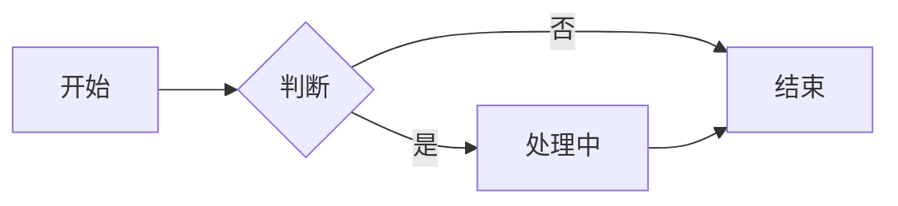
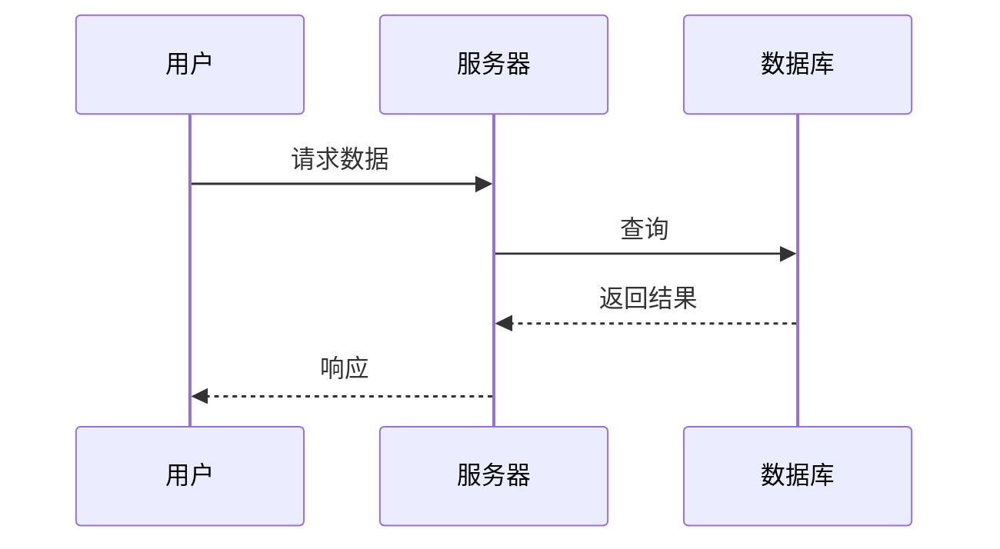
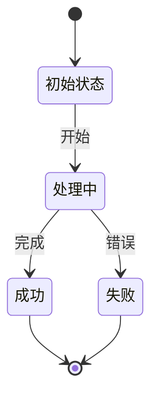
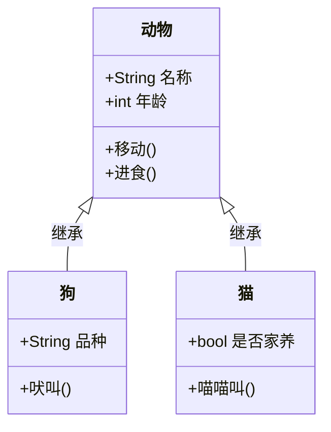

# Mermaid 主题预览

本文档展示了不同的 Mermaid 图表主题风格。

## 切换主题

当前主题配置保存在 `.vitepress/mermaid-themes.ts` 中，查看源码了解更多。

## 可用主题

| 主题名称 | 风格描述 |
|---------|---------|
| `cyberpunk` | 赛博朋克 - 青色+紫色霓虹 |
| `scifi` | 科幻深空 - 蓝色+银白 |
| `neon` | 炫彩霓虹 - 彩虹色渐变 |
| `documentation` | 文档风格 - 简洁专业白底 |
| `retroTerminal` | 复古终端 - 经典绿色 CRT |
| `darkHacker` | 暗夜极客 - 红色警告风格 |
| `amber` | 琥珀复古 - 暖色怀旧 |
| `aurora` | 极光北欧 - 冰蓝+紫罗兰 |

## 流程图示例

## 时序图示例

## 状态图示例

## 类图示例

