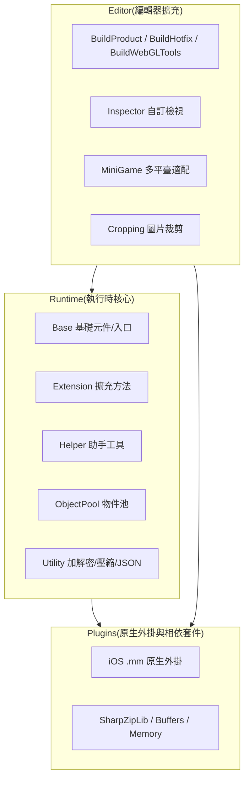

# 框架三層結構速覽

GameFrameX 是一個面向獨立遊戲開發者的 Unity 框架,採用 **Runtime / Plugins / Editor** 三層模組化架構。三層之間職責清晰、相互協作:Runtime 提供執行時核心功能,Plugins 提供原生平臺能力與第三方相依套件,Editor 提供編輯器擴充與建置流水線。本頁用一張圖和一張表帶你快速建立全域認知。

## 工作原理速覽



## 三層職責速查

| 層 | 目錄 | 關鍵檔案 | 主要職責 |
|----|------|----------|----------|
| **Runtime** | `Runtime/` | [GameEntry.cs](/Runtime/Base/GameEntry.cs#L46-L60)、[GameFrameworkComponent.cs](/Runtime/Base/GameFrameworkComponent.cs#L43-L45) | 框架入口、元件管理、事件池、引用池、物件池、變數系統、加密壓縮、JSON、擴充方法、助手工具 |
| **Plugins** | `Plugins/` | [GameFrameX.mm](/Plugins/iOS/GameFrameX/GameFrameX.mm)、`ICSharpCode.SharpZipLib.dll`、`System.Memory.dll` | iOS 原生能力、ZIP 壓縮函式庫、.NET 記憶體與執行時支援 |

## 接下來

- 想了解 Runtime 內部 Base / Extension / Helper / Utility 等子模組分工,見《Runtime 模組詳解》。
- 想了解 Plugins 的 iOS 原生外掛與 DLL 相依套件清單,見《Plugins 模組詳解》。
- 想了解 Editor 建置流水線、小遊戲多平臺適配與 Inspector 擴充,見《Editor 模組詳解》。
- 想從零跑通一個最小工程,見《快速開始》。## Runtime 層(執行時核心)

Runtime 是框架的全部 C# 程式碼,目錄按職責劃分為 7 個子模組。

| 子模組 | 關鍵內容 | 說明 |
|--------|----------|------|
| **Base** | [GameEntry.cs](/Runtime/Base/GameEntry.cs#L46-L56)、[GameFrameworkComponent.cs](/Runtime/Base/GameFrameworkComponent.cs#L43-L45)、`EventPool/`、`ReferencePool/`、`TaskPool/`、`Variable/` | 框架入口與元件基礎類別、事件池、引用池、工作池、可繫結變數、單例 |
| **Extension** | `BinaryExtension`、`StringExtensions`、`CollectionExtensions`、`UnityEngine.Transform` 擴充等 | 通用與 Unity 類型擴充方法 |
| **Helper** | `ApplicationHelper`、`FileHelper`、`PathHelper`、`MathHelper`、`TimerHelper`、`ZipHelper` 等 | 應用、檔案、路徑、數學、計時、壓縮等執行時助手 |
| **ObjectPool** | [ObjectPoolComponent.cs](/Runtime/ObjectPool/ObjectPoolComponent.cs) | `GameFrameworkComponent` 子類別,負責物件複用與記憶體最佳化 |
| **Property** | `BindableProperty` | MVVM 風格的可繫結屬性 |
| **ReferencePool** | `ReferencePoolComponent` | 引用類型物件池,降低 GC 壓力 |
| **Utility** | `Utility.Encryption`(AES/RSA/DSA)、`Utility.Compression`、`Utility.Json`、`Utility.Hash`(MD5/SHA1/HMAC)、`Utility.Verifier`(CRC32/CRC64) | 加密、壓縮、JSON、雜湊、校驗等純靜態工具 |

入口類型範例:

```csharp
using GameFrameX.Runtime;

// 框架入口,提供遊戲框架元件的統一存取點
public static class GameEntry { /* ... */ }

// 所有掛載到 GameEntry 的元件都繼承自該基礎類別
public abstract class GameFrameworkComponent : MonoBehaviour { /* ... */ }
```

Source: [GameEntry.cs](/Runtime/Base/GameEntry.cs#L46-L60), [GameFrameworkComponent.cs](/Runtime/Base/GameFrameworkComponent.cs#L43-L45)

## Plugins 層(原生外掛與相依套件)

Plugins 層只放不能在 Unity C# 層完成的事情:原生平臺外掛與第三方 .NET DLL。

| 子模組 | 檔案 | 說明 |
|--------|------|------|
| **iOS 外掛** | [GameFrameX.mm](/Plugins/iOS/GameFrameX/GameFrameX.mm)、`GameFrameXTrackingAuthorization.mm` | iOS 原生能力(如 ATT 追蹤權限) |
| **壓縮函式庫** | `ICSharpCode.SharpZipLib.dll` | ZIP 壓縮/解壓縮,被 `Utility.Compression` 呼叫 |
| **記憶體與緩衝區** | `System.Buffers.dll`、`System.Memory.dll`、`System.IO.Pipelines.dll` | 高效能記憶體與 IO 管道 |
| **執行時支援** | `Microsoft.NET.StringTools.dll`、`System.Runtime.CompilerServices.Unsafe.dll` | 字串最佳化與不安全的程式碼支援 |

## Editor 層(編輯器擴充)

Editor 層僅在 Unity 編輯器內生效,提供建置流水線與開發輔助。

| 子模組 | 關鍵檔案 | 說明 |
|--------|----------|------|
| **BuildProduct** | `BuildProductHelper`、`BuildPostProcessHelper`、`IBuilderPreHookHandler`、`IBuilderPostHookHandler` | 通用建置助手與建置前/後勾點 |
| **BuildHotfix** | `BuildHotfixHelper`、`HotFixAssemblyDefinitionHelper` | HybridCLR 熱更新組件建置 |
| **BuildWebGLTools** | `BuildWebGLToolsWithHybridCLR` | WebGL 平臺 + HybridCLR 聯合建置 |
| **MiniGame** | [MiniGameDefineSymbolHelper.WeChat.cs](/Editor/MiniGame/DomesticMiniGames/MiniGameDefineSymbolHelper.WeChat.cs) 等 21 個平臺巨集定義 | 微信、支付寶、抖音、快手、百度、京東、美團、淘寶等平臺一鍵切換 |
| **Inspector** | `BaseComponentInspector`、`ObjectPoolComponentInspector`、`ReferencePoolComponentInspector` | 自訂檢視面板,執行時觀察池狀態 |
| **Cropping** | `CroppingWindow` | 圖片裁剪工具 |
| **InspectorLockShortcut** | `InspectorLockShortcut` | Inspector 鎖定快捷鍵 |

建置勾點使用範例(虛擬碼,真實簽章見原始檔):

```csharp
using GameFrameX.Editor;

public sealed class MyPreBuildHook : IBuilderPreHookHandler
{
    public void OnBeforeBuild(BuildContext ctx) { /* ... */ }
}
```