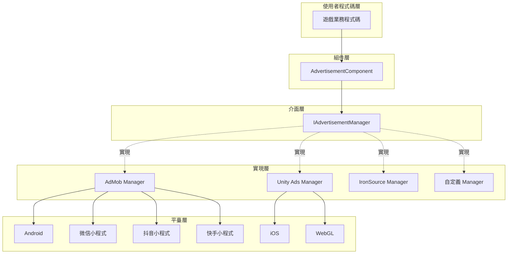
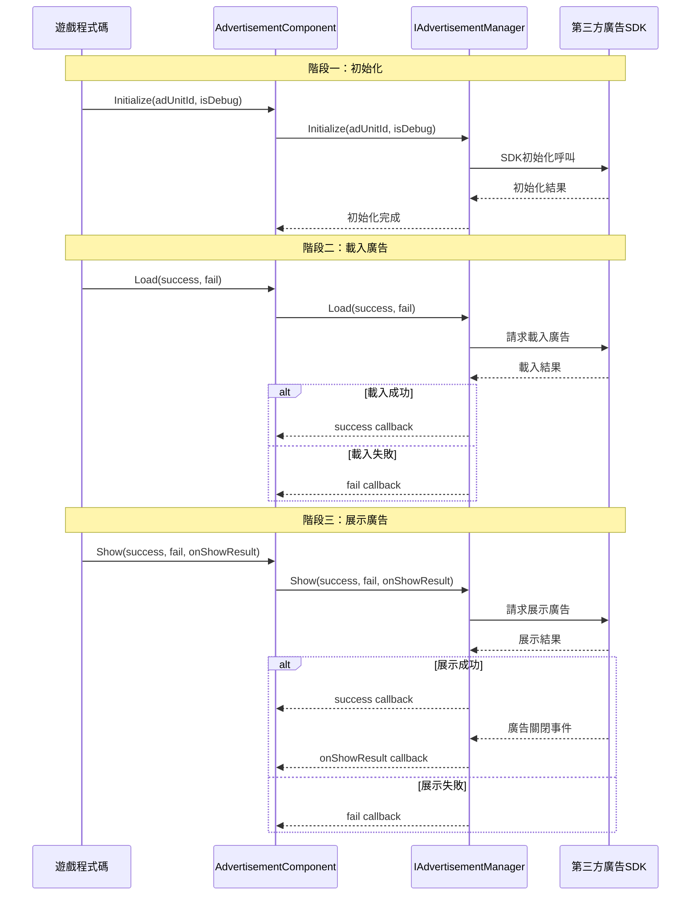

# 概述

Game Frame X Advertisement 是 Game Frame X 框架的廣告組件，為 Unity 專案提供統一的廣告功能抽象層。該組件採用策略模式設計，使開發者能夠輕鬆整合各種廣告 SDK（如 AdMob、Unity Ads、IronSource 等），而無需修改核心業務程式碼。

## 專案簡介

`com.gameframex.unity.advertisement` 是 Game Frame X 框架的核心模組之一，專門用於解決 Unity 專案中廣告整合的複雜性。該組件提供了一套標準化的廣告操作介面，開發者只需編寫一次廣告呼叫程式碼，即可在不同的廣告平臺之間切換。

該組件支援 Unity 2017.1 及更高版本，當前最新版本為 1.4.0。採用 Apache License 2.0 開源許可證，允許在商業和非商業專案中免費使用。

## 架構設計

該組件採用分層架構設計，將廣告業務邏輯與具體平臺實現分離。這種設計遵循了依賴倒置原則，上層模組（AdvertisementComponent）依賴於抽象介面（IAdvertisementManager），而不關心具體實現細節。

## 核心組件

該組件包含四個核心類，它們各自承擔不同的職責，協同完成廣告功能的完整封裝。

### AdvertisementComponent

 AdvertisementComponent 是使用者直接互動的主要入口，它繼承自 GameFrameworkComponent，是一個 Unity MonoBehaviour 組件。開發者需要將此組件新增到場景中的任意 GameObject 上，然後透過程式碼呼叫其方法來載入和展示廣告。

> Source: [AdvertisementComponent.cs](https://cnb.cool/GameFrameX/com.gameframex.unity.advertisement/blob/main/Runtime/Advertisement/AdvertisementComponent.cs#L1-L169)

該組件的核心職責包括：根據當前執行平臺自動選擇對應的廣告位 ID、在 Unity 生命週期中初始化廣告管理器、以及提供 Load、Show、Play 三個主要方法供業務程式碼呼叫。

### IAdvertisementManager

 IAdvertisementManager 是廣告管理器的核心介面，定義了所有廣告操作的標準方法。任何具體的廣告 SDK 實現都必須實現此介面，從而保證不同廣告平臺之間的行為一致性。

> Source: [IAdvertisementManager.cs](https://cnb.cool/GameFrameX/com.gameframex.unity.advertisement/blob/main/Runtime/Advertisement/IAdvertisementManager.cs#L1-L55)

該介面定義了四個核心方法：Initialize 用於初始化廣告管理器，SetExtraData 用於設定額外引數，Load 用於預載入廣告，Show 用於展示廣告。介面設計採用了回呼模式，透過 Action 委託處理非同步操作的成功、失敗和結果回呼。

### BaseAdvertisementManager

 BaseAdvertisementManager 是一個抽象基類，繼承自 GameFrameworkModule 並實現了 IAdvertisementManager 介面。它為開發者提供了一個建立自定義廣告管理器的起點，封裝了通用的回呼處理邏輯。

> Source: [BaseAdvertisementManager.cs](https://cnb.cool/GameFrameX/com.gameframex.unity.advertisement/blob/main/Runtime/Advertisement/BaseAdvertisementManager.cs#L1-L109)

該基類定義了四個受保護的回呼屬性：OnShowResult、OnLoadSuccess、OnLoadFail，分別對應廣告展示結果、廣告載入成功和廣告載入失敗的情況。子類可以這些回呼屬性來觸發相應的業務邏輯。

### AdvertisementComponentInspector

 AdvertisementComponentInspector 是 Unity 編輯器的自定義檢視面板，繼承自 ComponentTypeComponentInspector。它為 AdvertisementComponent 提供了友好的圖形化配置介面，開發者可以在 Inspector 視窗中直接設定各平臺的廣告位 ID。

> Source: [AdvertisementComponentInspector.cs](https://cnb.cool/GameFrameX/com.gameframex.unity.advertisement/blob/main/Editor/Inspector/AdvertisementComponentInspector.cs#L1-L72)

這個編輯器整合大大簡化了配置流程，開發者無需編寫程式碼即可完成廣告位 ID 的設定。

## 工作流程

廣告的標準工作流程分為三個主要階段：初始化、載入和展示。這個流程設計遵循了最佳實踐，確保廣告能夠平穩載入並及時展示。

初始化階段在 AdvertisementComponent 的 Start 方法中自動執行，使用 Inspector 中配置的廣告位 ID。載入階段是可選的，但建議在展示廣告前預先呼叫 Load 方法，以減少使用者等待時間。展示階段透過 Show 方法觸發，展示完成後會透過 onShowResult 回呼通知開發者廣告是否被完整觀看，這對於激勵影片廣告尤為重要。

## 平臺支援

該組件支援多種平臺和釋出目標，能夠滿足不同遊戲專案的釋出需求。

| 平臺 | 配置欄位 | 說明 |
|------|----------|------|
| Android | m_adUnitIdAndroid | Google Play 和其他 Android 應用商店 |
| iOS | m_adUnitIdiOS | Apple App Store |
| WebGL | m_adUnitIdWebGL | 標準 WebGL 釋出 |
| 微信小程式 | m_adUnitIdWebGLWeChat | 微信小遊戲平臺 |
| 抖音小程式 | m_adUnitIdWebGLDouYin | 抖音小遊戲平臺 |
| 快手小程式 | m_adUnitIdWebGLKuaiShou | 快手小遊戲平臺 |

組件會根據編譯時的平臺宏自動選擇對應的廣告位 ID。開發者需要在對應平臺的釋出設定中配置正確的編譯宏，例如 ENABLE_WECHAT_MINI_GAME、ENABLE_DOUYIN_MINI_GAME、ENABLE_KUAISHOU_MINI_GAME 等。

## 激勵影片支援

該組件特別最佳化了激勵影片廣告的支援，這是移動遊戲中最常見的變現方式之一。激勵影片允許玩家主動選擇觀看廣告以獲取遊戲內獎勵，這種廣告形式具有較高的使用者接受度和轉化率。

激勵影片的核心流程是：玩家觸發觀看廣告的動作 -> 廣告展示 -> 玩家完整觀看或中途關閉 -> 回呼通知開發者是否應該發放獎勵。onShowResult 回呼的布林值引數指示廣告是否被完整觀看：true 表示使用者觀看了完整的廣告，應該發放獎勵；false 表示使用者跳過了廣告或因其他原因未完整觀看，不應該發放獎勵。

這種設計確保了獎勵發放的公平性，防止玩家透過關閉廣告或使用其他方式跳過廣告而獲取不應得的獎勵。

## 設計理念

該組件的設計遵循了幾個核心原則，以確保其易用性、可擴充套件性和可靠性。

首先是開閉原則，系統對擴充套件開放、對修改關閉。當需要支援新的廣告平臺時，只需建立新的 IAdvertisementManager 實現類，無需修改現有程式碼。這種設計使得新增廣告平臺變得簡單可控，不會影響現有功能的穩定性。

其次是依賴倒置原則，高層模組不應該依賴於低層模組，兩者都應該依賴於抽象。AdvertisementComponent 依賴於 IAdvertisementManager 介面，而不關心具體是哪個廣告平臺的實現。這使得可以在不修改業務程式碼的情況下切換廣告平臺。

最後是單一職責原則，每個類都有明確的職責邊界。AdvertisementComponent 負責與 Unity 生命週期整合和分發呼叫，IAdvertisementManager 定義介面契約，具體實現類負責與各自的 SDK 互動。這種分離使得程式碼更容易理解和維護。

## 應用場景

該組件適用於各種需要廣告變現的 Unity 遊戲專案，特別是那些需要釋出到多個平臺的專案。透過統一的介面抽象，開發者可以一次性編寫廣告邏輯程式碼，然後根據需要選擇不同的廣告平臺實現。

對於需要在多個小程式平臺釋出的專案，該組件的跨平臺廣告位 ID 配置功能尤為重要。開發者可以分別為微信、抖音、快手等平臺配置不同的廣告位，無需修改程式碼即可實現多平臺釋出。

## 相關連結

- [安裝指南](./2-installation) - 瞭解如何在專案中安裝和配置組件
- [快速開始](./3-getting-started) - 快速上手使用廣告功能
- [核心概念](./4-core-concepts) - 深入瞭解組件的設計原理
- [平臺配置](./5-platforms) - 各平臺的詳細配置說明
- [API 參考](./6-api-reference) - 完整的介面文件
- [常見問題](./7-troubleshooting) - 常見問題解答

## 更新日誌

當前版本為 1.4.0，該版本為快手小遊戲平臺新增了 WebGL 廣告位 ID 支援。組件持續迭代更新，每次更新都會帶來新的平臺支援、功能增強和錯誤修復。

> Source: [CHANGELOG.md](https://cnb.cool/GameFrameX/com.gameframex.unity.advertisement/blob/main/CHANGELOG.md#L1-L70)
