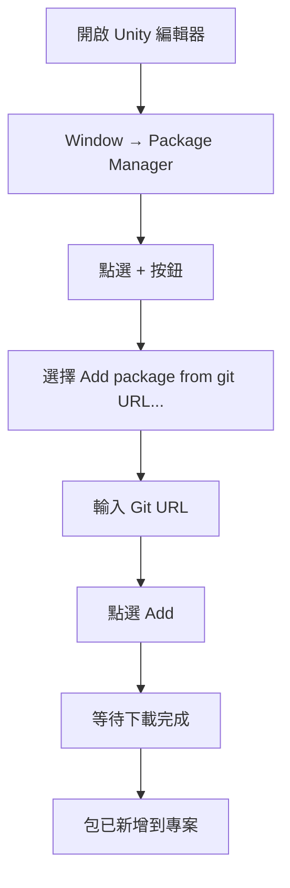
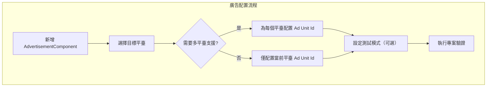

# 安裝指南

本指南將幫助您將 Game Frame X Advertisement 組件安裝到 Unity 專案中，並完成基本配置。

## 概述

Game Frame X Advertisement 是 Game Frame X 框架的廣告組件，提供統一的廣告功能抽象層。該組件支援多種廣告平臺，包括 AdMob、Unity Ads、IronSource 等，允許開發者在不修改核心程式碼的情況下切換不同的廣告 SDK。

> **重要提示**：本組件 (`com.gameframex.unity.advertisement`) 提供廣告顯示的抽象層和核心邏輯。您需要專案中包含一個具體的 `IAdvertisementManager` 介面實現，該實現負責與特定的廣告 SDK 進行互動。

## 前置要求

在安裝本組件之前，請確保滿足以下條件：

| 要求 | 說明 |
|------|------|
| Unity 版本 | 2017.1 或更高版本 |
| Game Frame X 核心 | 需要已安裝 GameFrameX.Runtime 和 GameFrameX.Event.Runtime |
| 廣告 SDK | 需要整合具體的廣告平臺 SDK（如 AdMob、Unity Ads 等） |

## 安裝步驟

### 方式一：透過 Unity Package Manager 安裝（推薦）

1. 開啟 Unity 編輯器
2. 選擇選單 `Window` → `Package Manager`
3. 在 Package Manager 視窗中，點選左上角的 `+` 按鈕
4. 選擇 `Add package from git URL...`
5. 輸入以下 Git URL：
   ```
   https://github.com/GameFrameX/com.gameframex.unity.advertisement.git
   ```
6. 點選 `Add` 按鈕開始安裝
7. 等待 Package Manager 下載並匯入包



### 方式二：透過 npm/cnpm 安裝

如果您的網路環境訪問 GitHub 較慢，可以使用 CNPM 映象：

1. 在 `Packages/manifest.json` 檔案中新增依賴：
   ```json
   {
     "dependencies": {
       "com.gameframex.unity.advertisement": "https://npm.cnb.cool/GameFrameX/com.gameframex.unity.advertisement.git"
     }
   }
   ```
2. 儲存檔案後，Unity 會自動下載並匯入包

### 方式三：手動安裝

1. 從 GitHub 倉庫克隆或下載原始碼：
   ```
   https://github.com/GameFrameX/com.gameframex.unity.advertisement.git
   ```
2. 將下載的資料夾複製到 Unity 專案的 `Packages` 目錄下
3. 重新命名資料夾為 `com.gameframex.unity.advertisement`
4. 重新開啟 Unity 編輯器

## 依賴配置

本組件依賴以下 Game Frame X 模組，需要確保這些模組已正確安裝：

```json
// GameFrameX.Advertisement.Runtime.asmdef
{
    "references": [
        "GameFrameX.Runtime",
        "GameFrameX.Event.Runtime"
    ]
}
```

### 安裝 Game Frame X 核心模組

如果尚未安裝 Game Frame X 核心模組，請按以下步驟安裝：

1. 在 Package Manager 中新增 GameFrameX 核心包：
   ```
   https://github.com/GameFrameX/com.gameframex.unity.runtime.git
   ```

## 場景配置

### 新增 AdvertisementComponent

1. 在 Unity 編輯器中，開啟需要整合廣告的場景
2. 在 Hierarchy 面板中，右鍵點選並選擇 `Create Empty` 建立一個空 GameObject
3. 選擇該 GameObject，在 Inspector 面板中點選 `Add Component`
4. 搜尋並新增 `Advertisement Component`（或 `GameFrameX/Advertisement`）
5. 組件已新增到場景中

```csharp
// 也可以透過程式碼方式新增組件
using GameFrameX.Advertisement.Runtime;
using UnityEngine;

public class AdSetup : MonoBehaviour
{
    void Start()
    {
        // 確保場景中有 AdvertisementComponent
        var adComponent = GetComponent<AdvertisementComponent>();
        if (adComponent == null)
        {
            adComponent = gameObject.AddComponent<AdvertisementComponent>();
        }
    }
}
```

### 配置廣告位 ID

在 Inspector 面板中配置各平臺的廣告位 ID：

| 平臺 | 欄位名稱 | 說明 |
|------|----------|------|
| Android | Ad Unit Id (Android) | Google Play 平臺廣告位 ID |
| iOS | Ad Unit Id (iOS) | Apple App Store 平臺廣告位 ID |
| WebGL | Ad Unit Id (WebGL) | 網頁端廣告位 ID |
| 微信小程式 | Ad Unit Id (WebGL WeChat) | 微信小程式廣告位 ID |
| 抖音小程式 | Ad Unit Id (WebGL DouYin) | 抖音小程式廣告位 ID |
| 快手小程式 | Ad Unit Id (WebGL KuaiShou) | 快手小程式廣告位 ID |

> **注意**：組件會根據當前構建平臺自動選擇對應的廣告位 ID。



### 測試模式配置

在 Inspector 面板中，勾選 `是否是測試模式` (Debug Mode) 選項可以啟用測試廣告，便於開發除錯。

```csharp
// 也可以透過程式碼配置測試模式
public class AdSetup : MonoBehaviour
{
    void Start()
    {
        var adComponent = GetComponent<AdvertisementComponent>();
        // 手動初始化，第二個引數為是否啟用除錯模式
        adComponent.Initialize("your-ad-unit-id", true);
    }
}
```

## 廣告管理器實現

### 實現 IAdvertisementManager 介面

本組件需要您提供具體的 `IAdvertisementManager` 介面實現。以下是實現步驟：

1. 建立一個新類，繼承自 `BaseAdvertisementManager`
2. 實現所有抽象方法
3. 在遊戲啟動時註冊您的實現

```csharp
using System;
using GameFrameX.Advertisement.Runtime;

public class MyAdManager : BaseAdvertisementManager
{
    public override void Initialize(string adUnitId, bool debug = false)
    {
        // 初始化廣告 SDK
    }

    public override void Play(Action<bool> playResult, string customData = null)
    {
        // 播放激勵影片廣告
    }

    public override void Show(Action<string> success, Action<string> fail, Action<bool> onShowResult, string customData = null)
    {
        // 展示廣告
    }

    public override void Load(Action<string> success, Action<string> fail, string customData = null)
    {
        // 載入廣告
    }
}
```

> 詳細實現說明請參閱 [核心概念](../4-core-concepts) 和 [快速開始](../3-getting-started) 文件。

## 驗證安裝

安裝完成後，可以透過以下方式驗證：

1. **檢查包是否正確匯入**：
   - 在 Unity 專案中檢視 `Packages/com.gameframex.unity.advertisement` 目錄
   - 確認 Runtime 和 Editor 資料夾存在

2. **檢查編譯是否成功**：
   - 在 Unity 中開啟 `Window` → `Assembly Compiler`（如果安裝了相關工具）
   - 或者嘗試構建專案

3. **執行測試**：
   - 在場景中新增 AdvertisementComponent
   - 執行遊戲，檢查控制檯是否有錯誤資訊

## 常見問題

### Q: 安裝後出現編譯錯誤

**可能原因**：缺少依賴的 Game Frame X 核心模組。

**解決方案**：
1. 確認已安裝 GameFrameX.Runtime
2. 確認已安裝 GameFrameX.Event.Runtime
3. 重新匯入廣告組件包

### Q: 廣告位 ID 沒有自動匹配

**可能原因**：平臺定義符號未正確設定。

**解決方案**：
- Android：確保在 Build Settings 中選擇了 Android 平臺
- iOS：確保在 Build Settings 中選擇了 iOS 平臺
- WebGL：確保在 Build Settings 中選擇了 WebGL 平臺

### Q: 無法在 Inspector 中看到配置選項

**可能原因**：Editor 指令碼未正確編譯。

**解決方案**：
1. 檢查 Editor 資料夾是否存在
2. 重新開啟 Unity 編輯器
3. 檢查 `GameFrameX.Advertisement.Editor.asmdef` 是否存在

## 相關連結

- [概述](../1-overview) - 瞭解 Game Frame X Advertisement 整體架構
- [快速開始](../3-getting-started) - 快速上手使用廣告功能
- [核心概念](../4-core-concepts) - 深入瞭解核心介面和實現
- [API 參考](../6-api-reference) - 完整的 API 文件
- [GitHub 倉庫](https://github.com/GameFrameX/com.gameframex.unity.advertisement.git) - 官方原始碼倉庫
