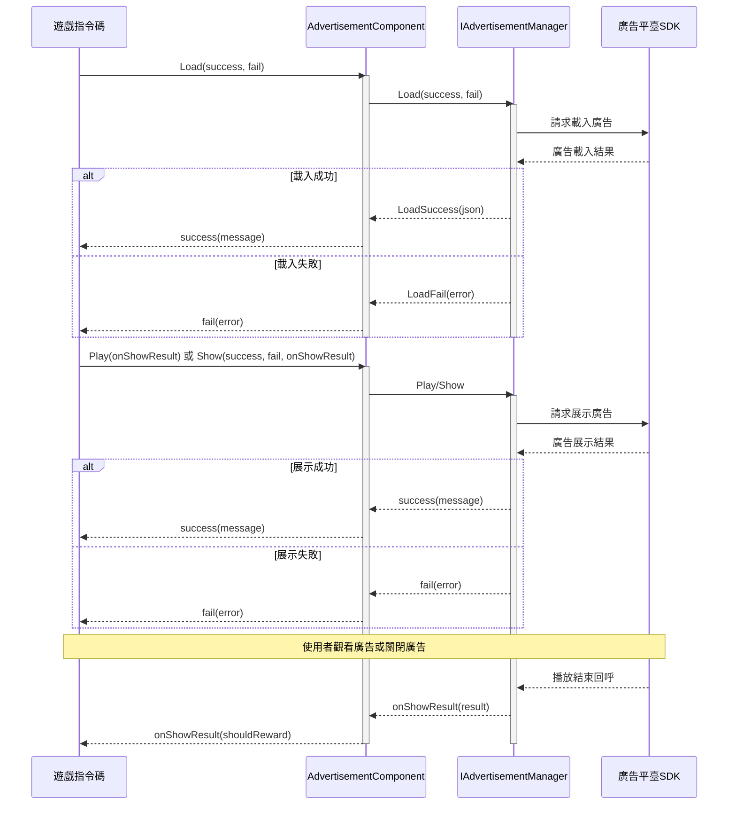

# 快速開始

本指南將幫助您快速在 Unity 專案中整合廣告功能。透過幾個簡單的步驟，您就可以在遊戲中展示橫幅廣告、插屏廣告和激勵影片廣告。

## 概述

Game Frame X Advertisement 是一個輕量級的廣告抽象層組件，它為 Unity 專案提供了統一廣告介面。透過實現 `IAdvertisementManager` 介面，您可以輕鬆整合任何廣告網路（如 AdMob、Unity Ads、IronSource 等），而無需修改核心業務程式碼。

該組件的主要特點：
- **平臺無關**：統一的 API 介面，支援多平臺廣告展示
- **易於整合**：透過 Unity 組件方式整合，無需編寫複雜程式碼
- **靈活擴充套件**：透過介面實現輕鬆切換不同的廣告 SDK

## 架構概覽

廣告組件採用分層架構設計，核心層與平臺實現層分離：

```mermaid
flowchart TD
    subgraph Client["客戶端層"]
        GameScript[遊戲指令碼]
    end

    subgraph Component["AdvertisementComponent"]
        AdComp[廣告組件]
    end

    subgraph Core["核心介面層"]
        IAdMgr[IAdvertisementManager]
        BaseMgr[BaseAdvertisementManager]
    end

    subgraph Implementation["平臺實現層"]
        Admob[AdMob 實現]
        UnityAds[Unity Ads 實現]
        IronSource[IronSource 實現]
    end

    GameScript --> AdComp
    AdComp --> IAdMgr
    IAdMgr <|.. BaseMgr
    BaseMgr <|-- Admob
    BaseMgr <|-- UnityAds
    BaseMgr <|-- IronSource
```

## 快速整合步驟

### 步驟 1：安裝廣告組件

首先，在 Unity 專案中安裝 Game Frame X Advertisement 組件。詳細安裝說明請參閱[安裝指南](./2-installation)。

### 步驟 2：新增廣告組件到場景

1. 在 Unity 編輯器中，選擇需要新增廣告的場景
2. 在 Hierarchy 面板中，右鍵點選需要新增廣告的 GameObject
3. 選擇 **GameFrameX → Advertisement** 選單項
4. 或者直接將 `AdvertisementComponent` 指令碼拖放到 GameObject 上

```csharp
// 手動新增組件的方式
using UnityEngine;
using GameFrameX.Advertisement.Runtime;

public class GameManager : MonoBehaviour
{
    private AdvertisementComponent _adComponent;

    void Start()
    {
        // 新增廣告組件到當前 GameObject
        _adComponent = gameObject.AddComponent<AdvertisementComponent>();
    }
}
```

> Source: [AdvertisementComponent.cs](https://cnb.cool/GameFrameX/com.gameframex.unity.advertisement/blob/main/Runtime/Advertisement/AdvertisementComponent.cs#L1-L169)

### 步驟 3：配置廣告位 ID

在 Unity Inspector 面板中配置各個平臺的廣告位 ID：

| 平臺 | 欄位名 | 說明 |
|------|--------|------|
| Android | Ad Unit Id Android | Google Play 商店版本 |
| iOS | Ad Unit Id iOS | Apple App Store 版本 |
| WebGL | Ad Unit Id WebGL | 網頁版本 |
| 微信小程式 | Ad Unit Id WebGL WeChat | 微信環境 |
| 抖音小程式 | Ad Unit Id WebGL DouYin | 抖音環境 |
| 快手小程式 | Ad Unit Id WebGL KuaiShou | 快手環境 |

> Source: [AdvertisementComponent.cs](https://cnb.cool/GameFrameX/com.gameframex.unity.advertisement/blob/main/Runtime/Advertisement/AdvertisementComponent.cs#L15-L43)

### 步驟 4：實現廣告管理器

組件本身只提供抽象層，您需要實現具體的廣告管理器。建立一個繼承自 `BaseAdvertisementManager` 的類：

```csharp
using System;
using GameFrameX.Advertisement.Runtime;
using UnityEngine;

public class MyAdManager : BaseAdvertisementManager
{
    private string _adUnitId;
    private bool _isDebug;

    /// <summary>
    /// 初始化廣告管理器
    /// </summary>
    public override void Initialize(string adUnitId, bool debug = false)
    {
        _adUnitId = adUnitId;
        _isDebug = debug;
        Debug.Log($"Ad Manager Initialized with ID: {_adUnitId}, Debug: {_isDebug}");
    }

    /// <summary>
    /// 載入廣告
    /// </summary>
    public override void Load(Action<string> success, Action<string> fail, string customData = null)
    {
        // 在這裡實現實際的廣告載入邏輯
        // 呼叫 base.LoadSuccess(json) 或 base.LoadFail(json) 通知結果
        Debug.Log("Loading advertisement...");
        
        // 模擬載入成功
        base.LoadSuccess("{\"status\":\"loaded\"}");
    }

    /// <summary>
    /// 展示廣告
    /// </summary>
    public override void Show(Action<string> success, Action<string> fail, Action<bool> onShowResult, string customData = null)
    {
        // 在這裡實現實際的廣告展示邏輯
        Debug.Log("Showing advertisement...");
        
        // 模擬展示成功
        success?.Invoke("{\"status\":\"shown\"}");
    }

    /// <summary>
    /// 播放激勵影片廣告
    /// </summary>
    public override void Play(Action<bool> playResult, string customData = null)
    {
        // 在這裡實現激勵影片廣告的播放邏輯
        // playResult 回呼引數: true = 完整觀看, false = 跳過
        Debug.Log("Playing rewarded advertisement...");
        
        // 模擬完整觀看
        playResult?.Invoke(true);
    }
}
```

> Source: [BaseAdvertisementManager.cs](https://cnb.cool/GameFrameX/com.gameframex.unity.advertisement/blob/main/Runtime/Advertisement/BaseAdvertisementManager.cs#L1-L108)

## 使用示例

### 基本用法：載入和展示廣告

```csharp
using UnityEngine;
using GameFrameX.Advertisement.Runtime;
using System;

public class RewardedAdButton : MonoBehaviour
{
    // 引用 AdvertisementComponent
    [SerializeField] private AdvertisementComponent adComponent;

    // 載入廣告
    public void LoadRewardedAd()
    {
        if (adComponent == null)
        {
            adComponent = GetComponent<AdvertisementComponent>();
        }

        adComponent.Load(
            // 載入成功回呼
            (message) => {
                Debug.Log($"廣告載入成功: {message}");
                // 可以在這裡啟用"顯示廣告"按鈕
            },
            // 載入失敗回呼
            (error) => {
                Debug.LogError($"廣告載入失敗: {error}");
            }
        );
    }

    // 展示激勵影片廣告
    public void ShowRewardedAd()
    {
        if (adComponent == null)
        {
            adComponent = GetComponent<AdvertisementComponent>();
        }

        adComponent.Play(
            // 廣告播放結果回呼
            // true = 使用者完整觀看廣告，應發放獎勵
            // false = 使用者跳過廣告，不發放獎勵
            (shouldReward) => {
                if (shouldReward)
                {
                    Debug.Log("使用者完整觀看廣告，發放獎勵！");
                    GivePlayerReward();
                }
                else
                {
                    Debug.Log("使用者跳過廣告，不發放獎勵");
                }
            }
        );
    }

    private void GivePlayerReward()
    {
        // 在這裡實現獎勵發放邏輯
        Debug.Log("獎勵已發放！");
    }
}
```

> Source: [README.md](https://cnb.cool/GameFrameX/com.gameframex.unity.advertisement/blob/main/README.md#L25-L82)

### 使用 Show 方法展示廣告

除了 `Play` 方法，還可以使用 `Show` 方法進行更細粒度的控制：

```csharp
public void ShowInterstitialAd()
{
    adComponent.Show(
        // 展示成功回呼
        (message) => {
            Debug.Log($"廣告展示成功: {message}");
        },
        // 展示失敗回呼
        (error) => {
            Debug.LogError($"廣告展示失敗: {error}");
        },
        // 展示結果回呼（廣告關閉時呼叫）
        (showResult) => {
            Debug.Log($"廣告展示結果: {(showResult ? "完整播放" : "未完整播放")}");
            // 恢復遊戲狀態
            ResumeGame();
        }
    );
}
```

> Source: [IAdvertisementManager.cs](https://cnb.cool/GameFrameX/com.gameframex.unity.advertisement/blob/main/Runtime/Advertisement/IAdvertisementManager.cs#L36-L53)

### 設定額外資料

某些廣告平臺支援在展示前設定額外的引數資料：

```csharp
// 設定額外資料
adComponent.SetExtraData("user_level", "10");
adComponent.SetExtraData("is_vip", "true");

// 然後展示廣告
ShowRewardedAd();
```

> Source: [AdvertisementComponent.cs](https://cnb.cool/GameFrameX/com.gameframex.unity.advertisement/blob/main/Runtime/Advertisement/AdvertisementComponent.cs#L107-L119)

## 廣告載入與展示流程

以下流程圖展示了廣告從載入到展示的完整流程：



## 回呼說明

| 方法 | 回呼 | 引數 | 說明 |
|------|------|------|------|
| `Load` | success | `string message` | 廣告載入成功時呼叫，引數為成功資訊 |
| `Load` | fail | `string error` | 廣告載入失敗時呼叫，引數為錯誤資訊 |
| `Show` | success | `string message` | 廣告開始展示時呼叫 |
| `Show` | fail | `string error` | 廣告展示失敗時呼叫（如無廣告可展示） |
| `Show` | onShowResult | `bool shouldReward` | 廣告關閉後呼叫，`true` 表示完整觀看 |
| `Play` | onShowResult | `bool shouldReward` | 激勵影片播放結果，`true` 表示可發放獎勵 |

## 平臺配置

不同的釋出平臺需要不同的配置。請參考[平臺配置](./5-platforms)文件獲取詳細說明：

- Android 廣告位 ID 配置
- iOS 廣告位 ID 配置
- WebGL 廣告位 ID 配置
- 微信/抖音/快手小程式配置

## 核心概念

如需深入瞭解廣告系統的核心概念和設計原理，請參閱[核心概念](./4-core-concepts)文件。

## 常見問題

如果在整合過程中遇到問題，請參閱[常見問題](./7-troubleshooting)文件獲取解決方案。

## 相關連結

- [安裝指南](./2-installation) - 詳細的安裝步驟
- [核心概念](./4-core-concepts) - 廣告系統架構和設計模式
- [平臺配置](./5-platforms) - 各平臺的詳細配置說明
- [API 參考](./6-api-reference) - 完整的 API 文件
- [常見問題](./7-troubleshooting) - 常見問題解答
