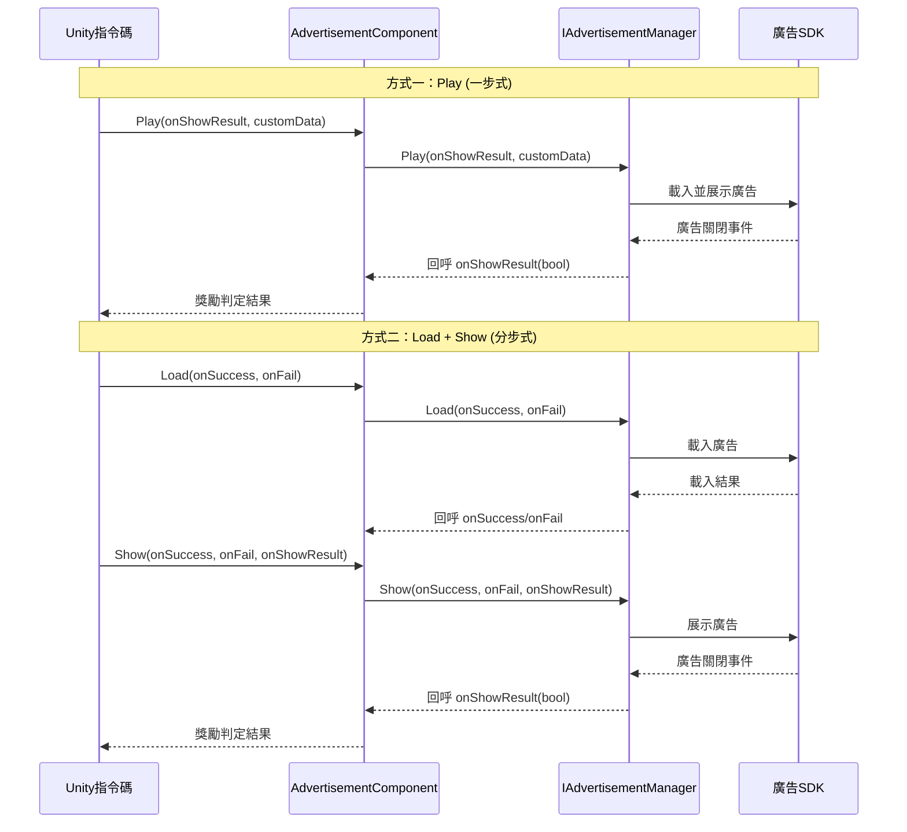

# 核心概念

本文件介紹 GameFrameX 廣告模組的核心架構概念、設計模式和工作原理。理解這些概念有助於更好地使用和擴充套件廣告功能。

## 概述

GameFrameX 廣告模組是一個基於 Unity 的廣告整合框架，採用模組化架構設計，提供了統一的廣告介面抽象。該模組允許開發者以平臺無關的方式實現廣告功能，同時支援針對不同平臺（Android、iOS、WebGL 以及各種小程式環境）的定製化實現。

核心設計理念是將廣告業務邏輯與 Unity 組件生命週期解耦，透過介面抽象和模組化設計，使程式碼更加可測試、可維護和可擴充套件。

## 架構設計

```mermaid
graph TD
    subgraph Unity層["Unity 組件層"]
        AC[AdvertisementComponent<br/>廣告組件]
    end

    subgraph 框架層["GameFrameX 框架層"]
        GFC[GameFrameworkComponent<br/>框架組件基類]
        GFE[GameFrameworkEntry<br/>框架入口]
        GFM[GameFrameworkModule<br/>框架模組基類]
    end

    subgraph 抽象層["抽象介面層"]
        IAM[IAdvertisementManager<br/>廣告管理器介面]
        BAM[BaseAdvertisementManager<br/>廣告管理器基類]
    end

    subgraph 實現層["平臺實現層"]
        ADM[Platform Specific<br/>廣告管理器實現]
    end

    AC -->|依賴| IAM
    AC -->|獲取模組| GFE
    GFE -->|例項化| GFM
    IAM <|..| BAM
    BAM -->|繼承| GFM
    BAM -->|依賴| ADM
    AC -->|引用| GFC
```

### 各層職責

**Unity 組件層**
- `AdvertisementComponent`：作為 Unity 遊戲物件組件，封裝了廣告功能的對外介面
- 負責組件生命週期管理（Awake、Start）
- 處理平臺特定的廣告位 ID 選擇

**框架層**
- `GameFrameworkComponent`：提供 Unity 組件的基礎功能
- `GameFrameworkEntry`：提供模組註冊和獲取的入口點
- `GameFrameworkModule`：所有 GameFrameX 模組的基類

**抽象介面層**
- `IAdvertisementManager`：定義廣告管理器的抽象介面，隔離業務邏輯與具體實現
- `BaseAdvertisementManager`：提供基礎實現，定義回呼欄位和模板方法

**平臺實現層**
- 由具體平臺實現（如 Unity Ads、AdMob 等）繼承 `BaseAdvertisementManager` 實現

## 核心組件詳解

### IAdvertisementManager 介面

`IAdvertisementManager` 是廣告模組的核心介面，定義了所有廣告操作的標準契約：

```csharp
public interface IAdvertisementManager
{
    void Initialize(string adUnitId, bool isDebug = false);
    void SetExtraData(string key, string value);
    void Play(Action<bool> playResult, string customData = null);
    void Show(Action<string> success, Action<string> fail, Action<bool> onShowResult, string customData = null);
    void Load(Action<string> success, Action<string> fail, string customData = null);
}
```

> Source: [IAdvertisementManager.cs]({{file_base_url}}/Runtime/Advertisement/IAdvertisementManager.cs#L10-L54)

**介面設計意圖：**
- **Initialize**：初始化廣告管理器，設定廣告位 ID 和除錯模式
- **SetExtraData**：允許在展示廣告前設定額外引數，供廣告 SDK 使用
- **Play**：簡化的一步式廣告播放方法（載入+展示）
- **Show**：分步式廣告展示，需要先呼叫 Load
- **Load**：預載入廣告資源，提高展示成功率

### BaseAdvertisementManager 基類

`BaseAdvertisementManager` 是所有平臺特定廣告管理器的基類，繼承自 `GameFrameworkModule`：

```csharp
public abstract class BaseAdvertisementManager : GameFrameworkModule, IAdvertisementManager
{
    protected Action<bool> OnShowResult;
    protected Action<string> OnLoadSuccess;
    protected Action<string> OnLoadFail;

    public abstract void Initialize(string adUnitId, bool debug = false);
    public abstract void Play(Action<bool> playResult, string customData = null);
    public abstract void Show(Action<string> success, Action<string> fail, Action<bool> onShowResult, string customData = null);
    public abstract void Load(Action<string> success, Action<string> fail, string customData = null);

    protected void LoadSuccess(string json);
    protected void LoadFail(string json);
}
```

> Source: [BaseAdvertisementManager.cs]({{file_base_url}}/Runtime/Advertisement/BaseAdvertisementManager.cs#L11-L108)

**基類設計意圖：**
- 繼承 `GameFrameworkModule` 使其成為框架的一部分，享受框架提供的生命週期管理
- 使用 `protected` 修飾符暴露回呼欄位，供子類在適當時機觸發
- 抽象方法強制子類實現平臺特定邏輯
- `LoadSuccess` 和 `LoadFail` 提供了載入結果的標準處理模板

### AdvertisementComponent 組件

`AdvertisementComponent` 是 Unity 層面的入口組件，繼承自 `GameFrameworkComponent`：

```csharp
[DisallowMultipleComponent]
[AddComponentMenu("GameFrameX/Advertisement")]
public class AdvertisementComponent : GameFrameworkComponent
{
    [SerializeField] private string m_adUnitIdAndroid = string.Empty;
    [SerializeField] private string m_adUnitIdiOS = string.Empty;
    [SerializeField] private string m_adUnitIdWebGL = string.Empty;
    [SerializeField] private string m_adUnitIdWebGLWeChat = string.Empty;
    [SerializeField] private string m_adUnitIdWebGLDouYin = string.Empty;
    [SerializeField] private string m_adUnitIdWebGLKuaiShou = string.Empty;
    [SerializeField] private bool m_debug = false;

    public string AdUnitId { get; private set; }

    private IAdvertisementManager _advertisementManager;

    protected override void Awake() { /* ... */ }
    private void Start() { /* ... */ }
    public void Initialize(string adUnitId, bool isDebug = false) { /* ... */ }
    public void SetExtraData(string key, string value) { /* ... */ }
    public void Show(Action<string> success, Action<string> fail, Action<bool> onShowResult) { /* ... */ }
    public void Play(Action<bool> onShowResult, string customData = null) { /* ... */ }
    public void Load(Action<string> success, Action<string> fail) { /* ... */ }
}
```

> Source: [AdvertisementComponent.cs]({{file_base_url}}/Runtime/Advertisement/AdvertisementComponent.cs#L13-L168)

**組件設計意圖：**
- 使用 `[DisallowMultipleComponent]` 確保場景中只有一個廣告組件例項
- 使用 `[AddComponentMenu]` 方便在 Unity 編輯器中新增組件
- 序列化欄位支援在編輯器中配置不同平臺的海報位 ID
- `Awake` 中透過 `GameFrameworkEntry.GetModule<IAdvertisementManager>()` 獲取模組例項
- `Start` 中自動初始化廣告管理器
- 根據執行時平臺和編譯條件自動選擇正確的廣告位 ID

## 平臺選擇機制

廣告組件根據執行時環境自動選擇對應的廣告位 ID，這個過程在 `Awake` 方法中完成：

```csharp
AdUnitId =
#if UNITY_WEBGL
#if ENABLE_WECHAT_MINI_GAME
    m_adUnitIdWebGLWeChat
#elif ENABLE_DOUYIN_MINI_GAME
    m_adUnitIdWebGLDouYin
#elif ENABLE_KUAISHOU_MINI_GAME
    m_adUnitIdWebGLKuaiShou
#else
    m_adUnitIdWebGL
#endif
#elif UNITY_ANDROID
    m_adUnitIdAndroid
#elif UNITY_IOS
    m_adUnitIdiOS
#else
    string.Empty
#endif
;
```

> Source: [AdvertisementComponent.cs]({{file_base_url}}/Runtime/Advertisement/AdvertisementComponent.cs#L69-L87)

這種設計支援以下平臺：
| 平臺 | 條件編譯符號 | 配置欄位 |
|------|-------------|---------|
| Android | `UNITY_ANDROID` | m_adUnitIdAndroid |
| iOS | `UNITY_IOS` | m_adUnitIdiOS |
| WebGL (通用) | `UNITY_WEBGL` | m_adUnitIdWebGL |
| 微信小程式 | `ENABLE_WECHAT_MINI_GAME` | m_adUnitIdWebGLWeChat |
| 抖音小程式 | `ENABLE_DOUYIN_MINI_GAME` | m_adUnitIdWebGLDouYin |
| 快手小程式 | `ENABLE_KUAISHOU_MINI_GAME` | m_adUnitIdWebGLKuaiShou |

## 廣告播放流程



### Play 方法（推薦方式）

`Play` 方法是最簡單的廣告播放方式，封裝了載入和展示的完整流程：

```csharp
public void Play(Action<bool> onShowResult, string customData = null)
{
    _advertisementManager.Play(onShowResult, customData);
}
```

> Source: [AdvertisementComponent.cs]({{file_base_url}}/Runtime/Advertisement/AdvertisementComponent.cs#L148-L151)

適用於簡單場景，呼叫時自動處理廣告載入。

### Load + Show 方法（精細控制）

對於需要精細控制的場景，可以使用分步方式：

```csharp
// 第一步：預載入廣告
public void Load(Action<string> success, Action<string> fail)
{
    _advertisementManager.Load(success, fail);
}

// 第二步：展示廣告
public void Show(Action<string> success, Action<string> fail, Action<bool> onShowResult)
{
    _advertisementManager.Show(success, fail, onShowResult);
}
```

> Source: [AdvertisementComponent.cs]({{file_base_url}}/Runtime/Advertisement/AdvertisementComponent.cs#L133-L167)

適用於：
- 需要在特定時機預載入廣告
- 需要根據載入結果做不同處理
- 需要區分載入失敗和展示失敗

## 回呼機制

廣告模組使用 C# 的 `Action` 委託實現非同步回呼：

| 回呼型別 | 引數 | 用途 |
|---------|------|------|
| `Action<string> success` | 成功資訊 | 操作成功時呼叫 |
| `Action<string> fail` | 失敗原因 | 操作失敗時呼叫 |
| `Action<bool> onShowResult` | 是否完整觀看 | 廣告關閉時呼叫，true 表示應發放獎勵 |

### onShowResult 回呼說明

`onShowResult` 回呼的布林值含義：
- **true**：使用者完整觀看廣告（通常需要發放獎勵）
- **false**：使用者跳過廣告或廣告播放異常（不發放獎勵）

```csharp
// 使用示例
advertisementComponent.Play((shouldReward) =>
{
    if (shouldReward)
    {
        // 發放獎勵
        Debug.Log("使用者完整觀看廣告，發放獎勵");
    }
    else
    {
        Debug.Log("使用者跳過廣告，不發放獎勵");
    }
});
```

## 設計模式總結

### 1. 模板方法模式

`BaseAdvertisementManager` 定義了 `LoadSuccess` 和 `LoadFail` 模板方法，子類只需呼叫這些方法而不需要自行實現回呼邏輯：

```csharp
protected void LoadSuccess(string json)
{
    OnLoadSuccess?.Invoke(json);
}
```

> Source: [BaseAdvertisementManager.cs]({{file_base_url}}/Runtime/Advertisement/BaseAdvertisementManager.cs#L94-L97)

### 2. 依賴注入

`AdvertisementComponent` 透過 `GameFrameworkEntry.GetModule<IAdvertisementManager>()` 獲取模組例項，而非自行建立：

```csharp
_advertisementManager = GameFrameworkEntry.GetModule<IAdvertisementManager>();
```

> Source: [AdvertisementComponent.cs]({{file_base_url}}/Runtime/Advertisement/AdvertisementComponent.cs#L62-L67)

這種設計允許在執行時替換不同的廣告實現，便於測試和平臺適配。

### 3. 策略模式

不同的廣告平臺實現可以替換 `IAdvertisementManager` 介面，只要實現相同的介面即可無縫切換。

### 4. 門面模式

`AdvertisementComponent` 作為統一入口，簡化了與廣告模組的互動，開發者無需關心底層實現細節。

## 擴充套件廣告模組

要新增新的廣告平臺支援，需要：

1. **建立新的廣告管理器類**，繼承 `BaseAdvertisementManager`
2. **實現所有抽象方法**，處理平臺特定的廣告邏輯
3. **註冊到框架**，透過 `GameFrameworkEntry` 註冊模組
4. **在 Unity 組件中配置**，設定對應平臺的廣告位 ID

具體實現請參考 [API 參考](./6-api-reference) 和 [平臺配置](./5-platforms) 文件。

## 相關連結

- [快速開始](./3-getting-started)
- [平臺配置](./5-platforms)
- [API 參考](./6-api-reference)
- [安裝指南](./2-installation)
