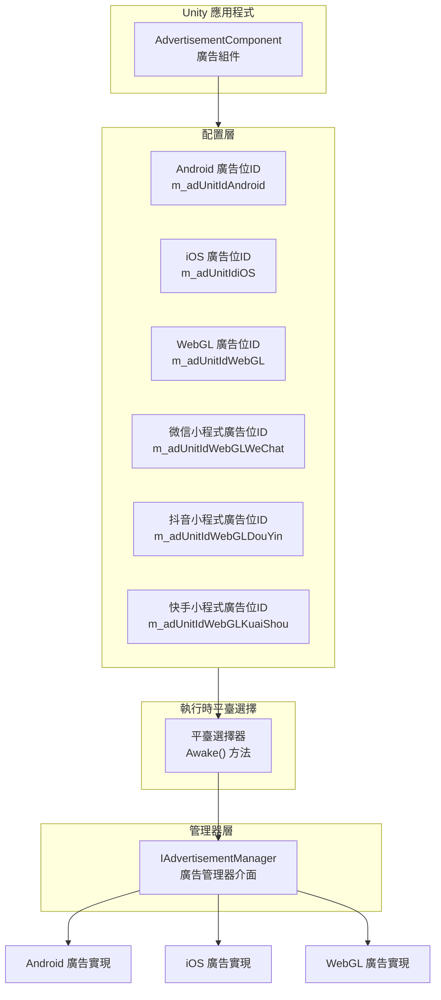

# 平臺配置

本文件介紹 Game Frame X 廣告組件的平臺配置機制，說明如何在不同的釋出平臺上配置廣告位ID。

## 概述

Game Frame X 廣告組件採用平臺無關的設計架構，透過 `AdvertisementComponent` 組件提供統一的廣告介面。底層透過 Unity 的條件編譯指令實現不同平臺自動適配，開發者只需在 Inspector 面板中配置各平臺的廣告位ID，即可實現一次配置、多平臺釋出。

> 注意：本組件僅提供廣告功能的抽象層和核心邏輯框架。要實現真正的廣告展示，您需要在專案中整合具體的廣告 SDK（如 AdMob、Unity Ads、穿山甲等），並實現 `IAdvertisementManager` 介面。

## 支援的平臺

Game Frame X 廣告組件支援以下平臺配置：

| 平臺 | 配置欄位 | 條件編譯指令 | 說明 |
|------|----------|--------------|------|
| Android | `m_adUnitIdAndroid` | `UNITY_ANDROID` | Android 原生平臺 |
| iOS | `m_adUnitIdiOS` | `UNITY_IOS` | iOS 平臺 |
| WebGL | `m_adUnitIdWebGL` | `UNITY_WEBGL` | 標準 WebGL 平臺 |
| WebGL (微信小程式) | `m_adUnitIdWebGLWeChat` | `UNITY_WEBGL` + `ENABLE_WECHAT_MINI_GAME` | 微信小遊戲環境 |
| WebGL (抖音小程式) | `m_adUnitIdWebGLDouYin` | `UNITY_WEBGL` + `ENABLE_DOUYIN_MINI_GAME` | 抖音小遊戲環境 |
| WebGL (快手小程式) | `m_adUnitIdWebGLKuaiShou` | `UNITY_WEBGL` + `ENABLE_KUAISHOU_MINI_GAME` | 快手小遊戲環境 |

## 架構設計



平臺選擇邏輯在 `AdvertisementComponent` 的 `Awake()` 方法中實現，根據當前編譯平臺自動選擇對應的廣告位ID：

```csharp
AdUnitId =
#if UNITY_WEBGL
#if ENABLE_WECHAT_MINI_GAME
    m_adUnitIdWebGLWeChat
#elif ENABLE_DOUYIN_MINI_GAME
    m_adUnitIdWebGLDouYin
#elif ENABLE_KUAISHOU_MINI_GAME
    m_adUnitIdWebGLKuaiShou
#else
    m_adUnitIdWebGL
#endif
#elif UNITY_ANDROID
    m_adUnitIdAndroid
#elif UNITY_IOS
    m_adUnitIdiOS
#else
    string.Empty
#endif
;
```

> Source: [AdvertisementComponent.cs](https://cnb.cool/GameFrameX/com.gameframex.unity.advertisement/blob/main/Runtime/Advertisement/AdvertisementComponent.cs#L69-L87)

## 配置流程

### 步驟1：新增組件

在 Unity 場景中建立一個空 GameObject（或選擇現有物件），然後新增 `AdvertisementComponent` 組件：

1. 在 Unity 選單中選擇 **GameObject** → **GameFrameX** → **Advertisement**
2. 或者在 Inspector 面板中點選 **Add Component**，搜尋並新增 `Advertisement`

### 步驟2：配置廣告位ID

在 Inspector 面板中配置各平臺的廣告位ID：

```csharp
[SerializeField] private string m_adUnitIdAndroid = string.Empty;      // Android 廣告位ID
[SerializeField] private string m_adUnitIdiOS = string.Empty;           // iOS 廣告位ID
[SerializeField] private string m_adUnitIdWebGL = string.Empty;         // WebGL 廣告位ID
[SerializeField] private string m_adUnitIdWebGLWeChat = string.Empty;   // 微信小程式廣告位ID
[SerializeField] private string m_adUnitIdWebGLDouYin = string.Empty;   // 抖音小程式廣告位ID
[SerializeField] private string m_adUnitIdWebGLKuaiShou = string.Empty;  // 快手小程式廣告位ID
```

> Source: [AdvertisementComponent.cs](https://cnb.cool/GameFrameX/com.gameframex.unity.advertisement/blob/main/Runtime/Advertisement/AdvertisementComponent.cs#L15-L43)

### 步驟3：配置測試模式（可選）

如果需要在除錯時檢視廣告日誌，可以啟用測試模式：

```csharp
[SerializeField] private bool m_debug = false;  // 是否是測試模式
```

> Source: [AdvertisementComponent.cs](https://cnb.cool/GameFrameX/com.gameframex.unity.advertisement/blob/main/Runtime/Advertisement/AdvertisementComponent.cs#L48)

### 步驟4：實現廣告管理器

本組件提供了配置層，您還需要實現具體的廣告管理器。典型的實現流程如下：

```csharp
using GameFrameX.Advertisement.Runtime;
using GameFrameX.Runtime;
using UnityEngine;

public class MyAdvertisementManager : BaseAdvertisementManager
{
    public override void Initialize(string adUnitId, bool debug = false)
    {
        // 實現具體的初始化邏輯
    }

    public override void Play(Action<bool> playResult, string customData = null)
    {
        // 實現廣告播放邏輯
    }

    public override void Show(Action<string> success, Action<string> fail, Action<bool> onShowResult, string customData = null)
    {
        // 實現廣告展示邏輯
    }

    public override void Load(Action<string> success, Action<string> fail, string customData = null)
    {
        // 實現廣告載入邏輯
    }
}
```

## Unity Editor 配置介面

Game Frame X 提供了自定義的 Inspector 介面，方便開發者在編輯器中配置廣告位ID：

```csharp
[CustomEditor(typeof(AdvertisementComponent))]
internal sealed class AdvertisementComponentInspector : ComponentTypeComponentInspector
{
    // 在此自定義 Inspector 中顯示各平臺的廣告位ID配置欄位
}
```

> Source: [AdvertisementComponentInspector.cs](https://cnb.cool/GameFrameX/com.gameframex.unity.advertisement/blob/main/Editor/Inspector/AdvertisementComponentInspector.cs#L16-L71)

Inspector 介面顯示效果：

```
┌─────────────────────────────────────────────┐
│ Advertisement Component                      │
├─────────────────────────────────────────────┤
│ Debug Mode:  [ ]                              │
│                                          │
│ Android 廣告位ID:  [________________]        │
│ IOS 廣告位ID:      [________________]        │
│ WebGL 廣告位ID:    [________________]         │
│ WebGL 微信 廣告位ID: [________________]       │
│ WebGL 抖音 廣告位ID: [________________]       │
│ WebGL 快手 廣告位ID: [________________]       │
└─────────────────────────────────────────────┘
```

## 平臺特定說明

### Android 平臺

- 使用 `UnityEngine.RuntimePlatform.Android` 作為編譯目標
- 需要在 Google AdMob 或其他 Android 廣告平臺申請廣告位ID

### iOS 平臺

- 使用 `UnityEngine.RuntimePlatform.IPhonePlayer` 作為編譯目標
- 需要在 Apple App Store 政策允許的廣告平臺申請廣告位ID

### WebGL 平臺

WebGL 平臺根據編譯宏定義進一步細分：

| 編譯宏 | 平臺 | 說明 |
|--------|------|------|
| `ENABLE_WECHAT_MINI_GAME` | 微信小程式 | 微信小遊戲環境 |
| `ENABLE_DOUYIN_MINI_GAME` | 抖音小程式 | 抖音小遊戲環境 |
| `ENABLE_KUAISHOU_MINI_GAME` | 快手小程式 | 快手小遊戲環境 |
| 無上述宏 | 標準 WebGL | 瀏覽器環境 |

> **重要提示**：在 Unity 構建設定中，需要根據目標平臺正確設定前處理器宏。對於微信、抖音、快手小遊戲，需要在 Player Settings → Other Settings → Scripting Define Symbols 中新增對應的宏定義。

## 配置驗證

配置完成後，可以透過以下方式驗證配置是否正確：

1. **執行時日誌**：組件初始化時會輸出選擇的平臺和廣告位ID
2. **程式碼除錯**：在 `Awake()` 方法中檢查 `AdUnitId` 屬性的值

```csharp
// 在 AdvertisementComponent 中
public string AdUnitId { get; private set; }

// 使用日誌輸出驗證
Debug.Log($"當前平臺廣告位ID: {AdUnitId}");
```

## 常見問題

### Q1: 某平臺的廣告位ID應該填什麼格式？

不同廣告平臺的廣告位ID格式不同：
- **Google AdMob**: 格式如 `ca-app-pub-xxxxxx/xxxxxx`
- **Unity Ads**: 格式為數字ID
- **穿山甲**: 格式由廣告平臺提供

請參考具體廣告平臺的文件獲取正確的廣告位ID格式。

### Q2: 廣告位ID配置正確但無法顯示廣告？

請檢查以下幾點：
1. 確認是否實現了 `IAdvertisementManager` 介面的具體類
2. 確認具體實現類已正確註冊到 Game Frame X 框架
3. 檢查廣告平臺後臺是否已配置好應用和廣告位
4. 開啟 `m_debug` 模式檢視詳細日誌

### Q3: WebGL 平臺編譯後廣告不顯示？

對於 WebGL 平臺，確保：
1. 正確設定了 `m_adUnitIdWebGL` 欄位
2. 如果是微信/抖音/快手小遊戲，確保在 Player Settings 中新增了對應的編譯宏
3. 瀏覽器控制檯無 JavaScript 錯誤

## 相關連結

- [概述](./1-overview) - 瞭解廣告組件的整體架構
- [安裝指南](./2-installation) - 檢視組件安裝方法
- [快速開始](./3-getting-started) - 快速整合廣告功能
- [核心概念](./4-core-concepts) - 深入瞭解核心概念
- [API 參考](./6-api-reference) - 完整的 API 介面文件
- [常見問題](./7-troubleshooting) - 常見問題解答
