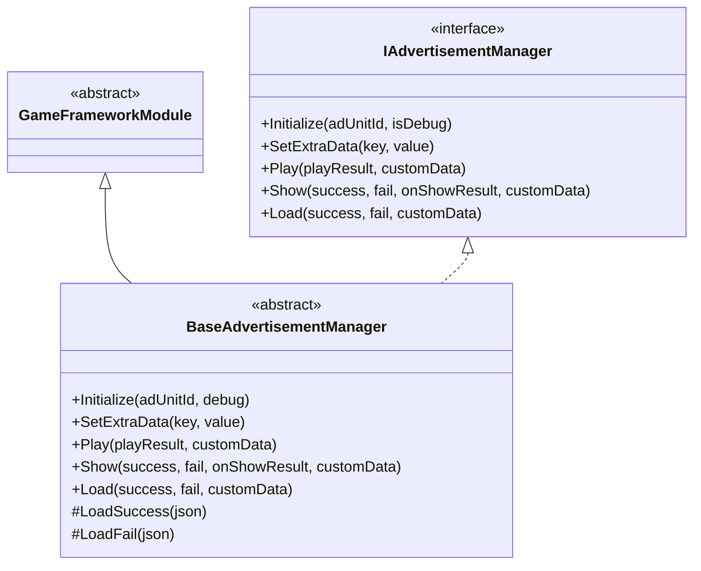
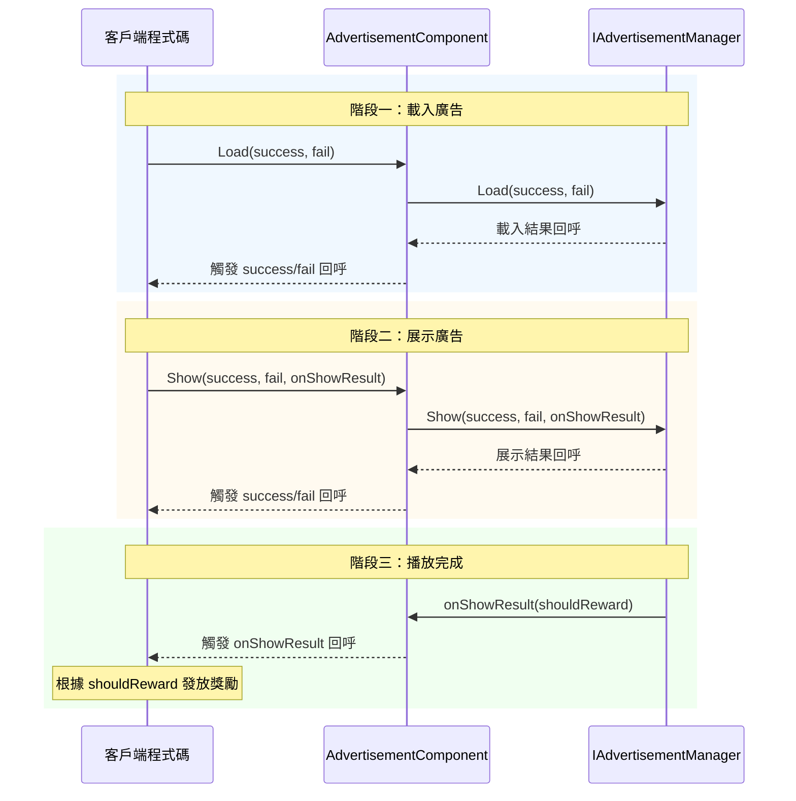

# API 參考

本節詳細介紹 GameFrameX Advertisement 模組的完整 API 介面，涵蓋介面定義、抽象基類以及 Unity 組件的公共方法和屬性。

## 概述

 Advertisement 模組提供了一套統一的廣告管理介面，支援多種廣告平臺（Android、iOS、WebGL、微信小遊戲、抖音小遊戲、快手小遊戲）。API 設計採用策略模式，透過 `IAdvertisementManager` 介面定義統一的廣告操作契約，各平臺實現類負責具體的廣告 SDK 整合。

---

## IAdvertisementManager 介面

`IAdvertisementManager` 是廣告管理的核心介面，定義了所有廣告操作的標準方法。該介面採用依賴倒置原則，使上層程式碼與具體廣告平臺實現解耦。

> Source: [IAdvertisementManager.cs]({{file_base_url}}/Runtime/Advertisement/IAdvertisementManager.cs#L1-L55)

### 方法列表

| 方法 | 描述 |
|------|------|
| `Initialize` | 初始化廣告管理器 |
| `SetExtraData` | 設定額外的廣告資料 |
| `Play` | 播放廣告（簡化版） |
| `Show` | 展示廣告（完整版） |
| `Load` | 載入廣告 |

---

## BaseAdvertisementManager 抽象類

`BaseAdvertisementManager` 是所有平臺廣告管理器的抽象基類，繼承自 `GameFrameworkModule` 並實現 `IAdvertisementManager` 介面。該類提供了部分方法的預設實現，並定義了子類必須實現的抽象方法。

> Source: [BaseAdvertisementManager.cs]({{file_base_url}}/Runtime/Advertisement/BaseAdvertisementManager.cs#L1-L109)

### 類結構



### 受保護成員

| 成員 | 型別 | 描述 |
|------|------|------|
| `OnShowResult` | `Action<bool>` | 廣告展示結果回呼 |
| `OnLoadSuccess` | `Action<string>` | 廣告載入成功回呼 |
| `OnLoadFail` | `Action<string>` | 廣告載入失敗回呼 |

### 生命週期方法

#### `Update(elapseSeconds, realElapseSeconds)`

更新方法，每幀呼叫。

**宣告：**
```csharp
protected override void Update(float elapseSeconds, float realElapseSeconds)
```

> Source: [BaseAdvertisementManager.cs]({{file_base_url}}/Runtime/Advertisement/BaseAdvertisementManager.cs#L18-L21)

#### `Shutdown()`

關閉時的清理方法，模組關閉時呼叫。

**宣告：**
```csharp
protected override void Shutdown()
```

> Source: [BaseAdvertisementManager.cs]({{file_base_url}}/Runtime/Advertisement/BaseAdvertisementManager.cs#L25-L28)

---

## AdvertisementComponent 組件

`AdvertisementComponent` 是用於 Unity 場景中的廣告組件，繼承自 `GameFrameworkComponent`。該組件提供了面向 Unity 編輯器的配置介面和執行時 API，是開發者在遊戲中最常直接互動的類。

> Source: [AdvertisementComponent.cs]({{file_base_url}}/Runtime/Advertisement/AdvertisementComponent.cs#L1-L169)

### Unity 屬性

在 Unity 編輯器中可配置以下屬性：

| 屬性 | 型別 | 預設值 | 描述 |
|------|------|--------|------|
| `AdUnitId` | string | 空字串 | Android 平臺廣告位ID |
| `m_adUnitIdiOS` | string | 空字串 | iOS 平臺廣告位ID |
| `m_adUnitIdWebGL` | string | 空字串 | WebGL 平臺廣告位ID |
| `m_adUnitIdWebGLWeChat` | string | 空字串 | 微信小遊戲廣告位ID |
| `m_adUnitIdWebGLDouYin` | string | 空字串 | 抖音小遊戲廣告位ID |
| `m_adUnitIdWebGLKuaiShou` | string | 空字串 | 快手小遊戲廣告位ID |
| `m_debug` | bool | false | 是否開啟測試模式 |

### 公共屬性

#### `AdUnitId`

獲取當前平臺對應的廣告位ID。該屬性在 `Awake()` 方法中根據當前執行平臺自動選擇合適的廣告位ID。

```csharp
public string AdUnitId { get; private set; }
```

> Source: [AdvertisementComponent.cs]({{file_base_url}}/Runtime/Advertisement/AdvertisementComponent.cs#L51-L53)

### 公共方法

#### `Initialize(adUnitId, isDebug)`

初始化廣告管理器。可在執行時重新初始化廣告管理器。

**宣告：**
```csharp
public void Initialize(string adUnitId, bool isDebug = false)
```

**引數：**
- `adUnitId` (string): 廣告位ID
- `isDebug` (bool): 是否開啟測試模式，預設值為 false

**示例：**
```csharp
// 初始化廣告組件
var adComponent = gameObject.GetComponent<AdvertisementComponent>();
adComponent.Initialize("your_ad_unit_id", true);
```

> Source: [AdvertisementComponent.cs]({{file_base_url}}/Runtime/Advertisement/AdvertisementComponent.cs#L101-L105)

---

#### `SetExtraData(key, value)`

設定廣告額外資料。在展示廣告前設定額外的引數資料，這些資料可能會被廣告SDK使用。

**宣告：**
```csharp
public void SetExtraData(string key, string value)
```

**引數：**
- `key` (string): 資料鍵
- `value` (string): 資料值

**設計意圖：** 此方法用於傳遞廣告相關的上下文資訊，例如使用者等級、關卡進度等，廣告SDK可根據這些資訊最佳化廣告投放策略。

**示例：**
```csharp
// 設定使用者等級資訊
adComponent.SetExtraData("user_level", "10");
adComponent.SetExtraData("current_level", "5");
```

> Source: [AdvertisementComponent.cs]({{file_base_url}}/Runtime/Advertisement/AdvertisementComponent.cs#L116-L119)

---

#### `Show(success, fail, onShowResult)`

展示廣告（完整版）。在呼叫此方法前，請確保已經透過 `Load` 方法預載入了廣告。

**宣告：**
```csharp
public void Show(Action<string> success, Action<string> fail, Action<bool> onShowResult)
```

**引數：**
- `success` (Action\<string\>): 展示成功回呼，引數為成功資訊
- `fail` (Action\<string\>): 展示失敗回呼，引數為失敗原因
- `onShowResult` (Action\<bool\>): 展示成功後廣告關閉回呼。引數值為 true 表示廣告應該發放獎勵，為 false 表示沒有完整播放完廣告

**設計意圖：** 此方法提供完整的回呼處理能力，適用於需要根據廣告展示結果執行不同業務邏輯的場景。

**示例：**
```csharp
// 展示插屏廣告
adComponent.Show(
    success => Debug.Log($"廣告展示成功: {success}"),
    fail => Debug.LogError($"廣告展示失敗: {fail}"),
    shouldReward =>
    {
        if (shouldReward)
        {
            // 發放獎勵
            Debug.Log("使用者完整觀看廣告，發放獎勵");
        }
    }
);
```

> Source: [AdvertisementComponent.cs]({{file_base_url}}/Runtime/Advertisement/AdvertisementComponent.cs#L133-L136)

---

#### `Play(onShowResult, customData)`

播放廣告（簡化版）。這是 `Show` 方法的簡化版本，適合簡單的廣告播放場景。

**宣告：**
```csharp
public void Play(Action<bool> onShowResult, string customData = null)
```

**引數：**
- `onShowResult` (Action\<bool\>): 展示成功後廣告關閉回呼。引數值為 true 表示廣告應該發放獎勵，為 false 表示沒有完整播放完廣告
- `customData` (string): 自定義資料，可為空

**設計意圖：** 相比 `Show` 方法，`Play` 方法簡化了回呼引數，適合快速整合和簡單獎勵發放場景。

**示例：**
```csharp
// 播放激勵影片廣告
adComponent.Play(shouldReward =>
{
    if (shouldReward)
    {
        // 發放獎勵
        Debug.Log("發放獎勵金幣 x 100");
    }
}, "level_5_reward");
```

> Source: [AdvertisementComponent.cs]({{file_base_url}}/Runtime/Advertisement/AdvertisementComponent.cs#L148-L151)

---

#### `Load(success, fail)`

載入廣告。建議在展示廣告前預先呼叫此方法載入廣告資源。

**宣告：**
```csharp
public void Load(Action<string> success, Action<string> fail)
```

**引數：**
- `success` (Action\<string\>): 載入成功回呼，引數為成功資訊
- `fail` (Action\<string\>): 載入失敗回呼，引數為失敗原因

**設計意圖：** 預載入廣告可以減少使用者等待時間，提升使用者體驗。建議在遊戲載入介面或空閒時提前呼叫。

**示例：**
```csharp
// 預載入廣告
adComponent.Load(
    success => Debug.Log($"廣告載入成功: {success}"),
    fail => Debug.LogWarning($"廣告載入失敗: {fail}")
);
```

> Source: [AdvertisementComponent.cs]({{file_base_url}}/Runtime/Advertisement/AdvertisementComponent.cs#L164-L167)

---

## 廣告播放流程

以下流程圖展示了完整的廣告播放生命週期：



---

## 完整使用示例

以下示例展示了在遊戲關卡完成後播放激勵影片廣告的完整流程：

```csharp
using UnityEngine;
using GameFrameX.Advertisement.Runtime;

public class GameLevel : MonoBehaviour
{
    [SerializeField] private AdvertisementComponent advertisementComponent;
    
    private void OnLevelComplete()
    {
        // 檢查是否有可用的廣告
        if (advertisementComponent != null)
        {
            // 播放激勵影片廣告
            advertisementComponent.Play(shouldReward =>
            {
                if (shouldReward)
                {
                    // 發放通關獎勵
                    AwardLevelRewards();
                }
                else
                {
                    Debug.Log("使用者未完整觀看廣告，無法獲得獎勵");
                }
            }, $"level_{CurrentLevel}_completion");
        }
    }
    
    private void AwardLevelRewards()
    {
        Debug.Log("關卡獎勵已發放！");
    }
}
```

> Sources:
> - [AdvertisementComponent.cs]({{file_base_url}}/Runtime/Advertisement/AdvertisementComponent.cs#L148-L151)
> - [IAdvertisementManager.cs]({{file_base_url}}/Runtime/Advertisement/IAdvertisementManager.cs#L28-L34)

---

## 相關連結

- [概述](../1-overview) - 廣告模組整體介紹
- [安裝指南](../2-installation) - 環境配置與安裝
- [快速開始](../3-getting-started) - 快速整合指南
- [核心概念](../4-core-concepts) - 核心架構設計
- [平臺配置](../5-platforms) - 各平臺詳細配置
- [常見問題](../7-troubleshooting) - 常見問題與解決方案
