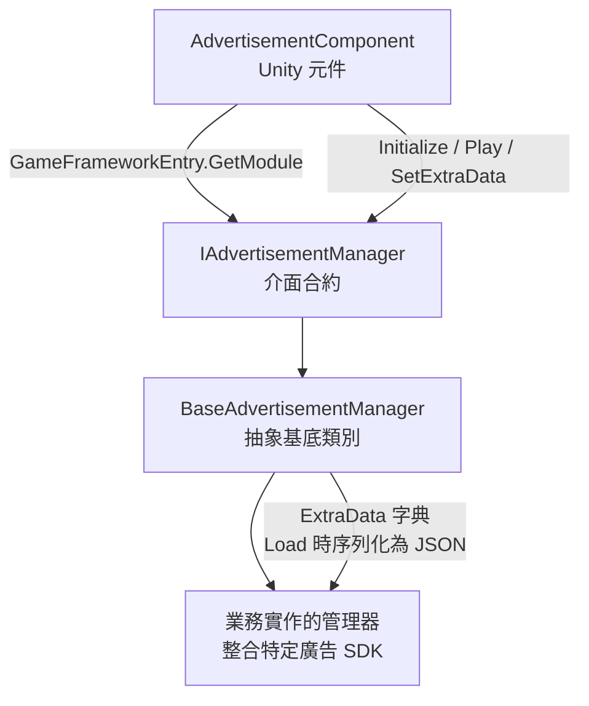

# 廣告元件執行階段概觀

GameFrameX 廣告元件建立在結合 Unity 元件與框架模組的雙層結構之上。它將 SDK 初始化、播放、載入與回呼整合在統一的 `IAdvertisementManager` 合約之下，因此業務程式碼只需呼叫 `AdvertisementComponent`。

## 快速開始

1. 將 `AdvertisementComponent` 附加到場景物件上(選單路徑 `GameFrameX/Advertisement`),並在 Inspector 中填入各平台的廣告單元 ID(`m_adUnitIdAndroid` / `m_adUnitIdiOS` / `m_adUnitIdWebGL*`)。
2. 將繼承自 `AdvertisementConfig` 的設定子類別(例如 `DefaultAdvertisementConfig`)拖曳至 Inspector 的 `Config` 欄位，以攜帶 `isDebug` 等擴充參數。
3. 場景啟動後，框架會依據目前平台自動選擇廣告單元 ID,並在 `Start()` 中將 `m_config` 傳遞給管理器。之後，業務程式碼只需呼叫 `Play(AdvertisementPlayOption)` 即可。

```csharp
// 觸發播放(建議用法)
var option = new AdvertisementPlayOption
{
    onPlayResult = success => Debug.Log($"Playback finished: {success}"),
    customData = "revive_001",
};
FindObjectOfType<AdvertisementComponent>().Play(option);
```

來源:[AdvertisementComponent.cs](https://github.com/GameFrameX/com.gameframex.unity.advertisement/blob/main/Runtime/Advertisement/AdvertisementComponent.cs#L120-L219)

## 運作方式

廣告元件由四個協作物件驅動：元件層(`AdvertisementComponent`)→ 介面層(`IAdvertisementManager`)→ 抽象管理器(`BaseAdvertisementManager`)→ 平台特定實作(業務專案繼承 `BaseAdvertisementManager` 以整合第三方 SDK)。`Awake()` 使用反射解析實作類型，從 `GameFrameworkEntry` 取得管理器，然後依據平台巨集選擇廣告單元 ID。



重點說明：

- **平台廣告單元 ID 選擇**:`Awake()` 使用 `#if UNITY_WEBGL` / `UNITY_ANDROID` / `UNITY_IOS` 等巨集來區分平台；在 WebGL 下，還會進一步區分微信/抖音/快手小遊戲等子平台。([AdvertisementComponent.cs#L99-L117](https://github.com/GameFrameX/com.gameframex.unity.advertisement/blob/main/Runtime/Advertisement/AdvertisementComponent.cs#L99-L117))
- **設定物件**:`AdvertisementConfig` 是僅包含 `isDebug` 欄位的抽象基底類別；業務程式碼可繼承它並依需要新增欄位(例如 `adUnitId`)。當 `BaseAdvertisementManager.Initialize(AdvertisementConfig)` 收到 `DefaultAdvertisementConfig` 時，會提取 `adUnitId`,然後回退到舊有的 `Initialize(string, bool)` 呼叫路徑。([AdvertisementConfig.cs#L41-L53](https://github.com/GameFrameX/com.gameframex.unity.advertisement/blob/main/Runtime/Advertisement/AdvertisementConfig.cs#L41-L53), [BaseAdvertisementManager.cs#L112-L163](https://github.com/GameFrameX/com.gameframex.unity.advertisement/blob/main/Runtime/Advertisement/BaseAdvertisementManager.cs#L112-L163))
- **新舊 API 的向下相容**：舊有的 `Initialize(string, bool)` / `Show(...)` / `Play(Action<bool>, string)` / `Load(...)` 方法仍被保留，但已標記為 `[Obsolete]`。實作中使用 `_delegating` 旗標來防止新舊 API 遞迴互相呼叫；建議的統一用法是 `Play(AdvertisementPlayOption)`。([BaseAdvertisementManager.cs#L119-L134](https://github.com/GameFrameX/com.gameframex.unity.advertisement/blob/main/Runtime/Advertisement/BaseAdvertisementManager.cs#L119-L134))
- **擴充資料的傳遞**:`SetExtraData(string, string)` 會將鍵值對寫入基底類別的 `ExtraData` 字典(`null` 值會移除該鍵)。業務實作可在 `Load` 階段將此字典序列化為 JSON 並傳遞給廣告伺服器，以進行伺服器端的獎勵驗證。([BaseAdvertisementManager.cs#L174-L189](https://github.com/GameFrameX/com.gameframex.unity.advertisement/blob/main/Runtime/Advertisement/BaseAdvertisementManager.cs#L174-L189))
- **回呼插槽**：基底類別宣告了三個回呼欄位 —— `OnShowResult` / `OnLoadSuccess` / `OnLoadFail` —— 業務實作可視需要觸發它們。([BaseAdvertisementManager.cs#L77-L93](https://github.com/GameFrameX/com.gameframex.unity.advertisement/blob/main/Runtime/Advertisement/BaseAdvertisementManager.cs#L77-L93))

## 下一步

- 在場景中附加元件並填入廣告單元 ID:請參閱*如何整合廣告元件*
- 整合特定 SDK(Unity Ads / Pangle / GroMore 等)：請參閱*如何實作自訂廣告管理器*
- 呼叫 `Play(AdvertisementPlayOption)` 的參數參考：請參閱*廣告播放選項參考*