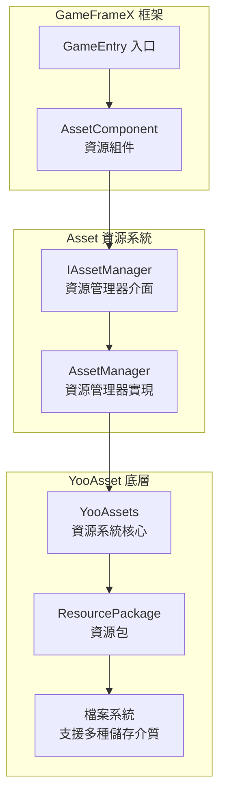
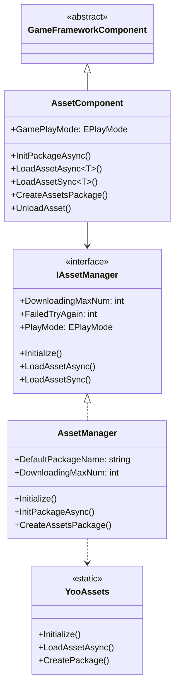
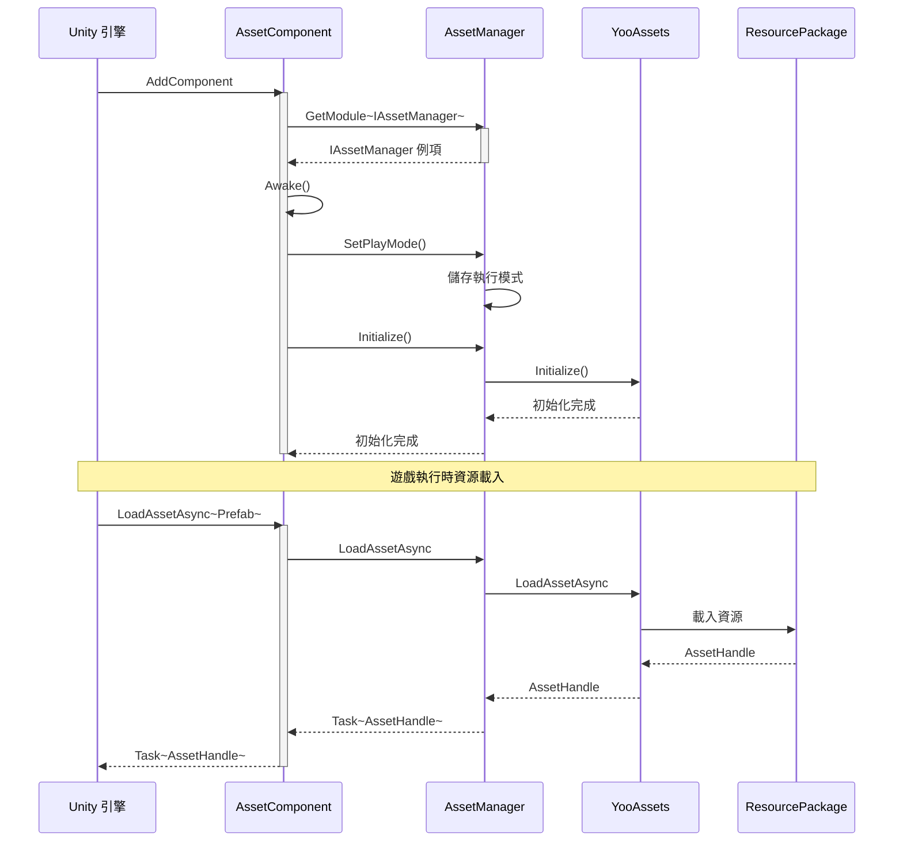
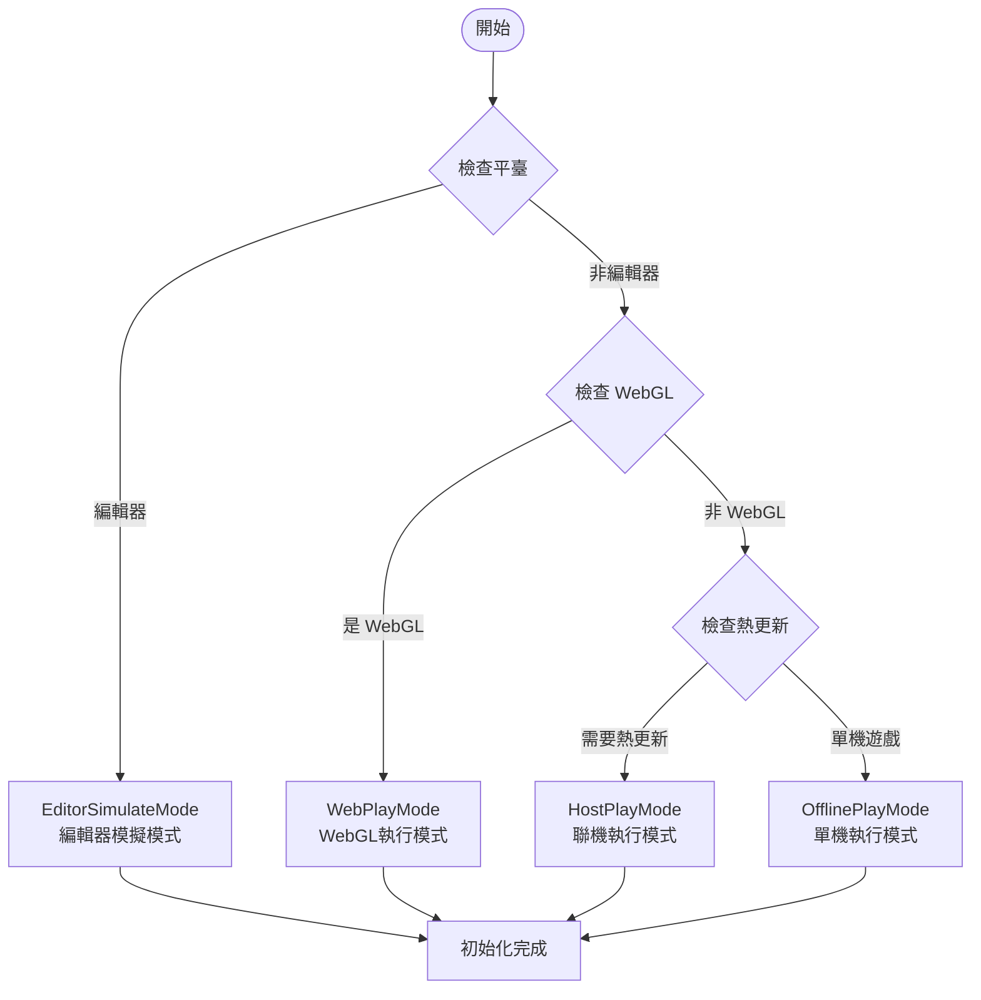

# Asset 資源組件介紹

GameFrameX 的 Asset 資源組件是 Unity 遊戲資源的統一管理解決方案，基於 YooAsset 底層實現，為開發者提供了簡潔、高效的資源載入與管理介面。該組件支援多種執行模式，能夠滿足從開發除錯到熱更新生產環境的全流程需求。

## 概述

Asset 資源組件是 GameFrameX 框架的核心模組之一，專門用於解決 Unity 專案中的資源管理問題。在遊戲開發過程中，資源的載入、快取、解除安裝以及熱更新是非常關鍵的環節，直接影響遊戲的效能和使用者體驗。Asset 組件透過封裝 YooAsset 的強大功能，提供了一套統一、簡潔且易於使用的 API，開發者無需深入瞭解底層實現細節，即可快速實現資源的載入和管理。

該組件的核心設計理念是將複雜的資源管理邏輯封裝為簡單的介面呼叫，同時保留足夠的靈活性以滿足不同專案需求。無論是簡單的單機遊戲還是需要熱更新的大型商業專案，Asset 組件都能夠提供合適的解決方案。透過支援多種執行模式，開發者可以在開發階段使用編輯器模擬模式快速迭代，在測試階段使用單機模式進行功能驗證，在生產環境中使用熱更新模式實現資源的動態更新。



## 核心功能

Asset 資源組件提供了全面的資源管理能力，涵蓋了遊戲開發中常見的所有資源操作場景。

### 資源載入

組件支援同步和非同步兩種資源載入方式，開發者可以根據實際需求選擇合適的載入方法。非同步載入適用於大多數場景，能夠保持遊戲的流暢執行；同步載入則在某些特定場景下（如資源預載入完成後的切換）更為高效。

- **非同步載入**：透過 Task 非同步模式載入資源，支援協程和回呼兩種使用方式
- **同步載入**：直接返回資源控制代碼，適用於已知資源已載入完成的場景
- **泛型支援**：提供強型別的泛型方法，避免型別轉換錯誤
- **多種資源型別**：支援普通資源、子資源、原生檔案和場景的載入

### 資源包管理

資源包是資源管理的基本單位，組件支援建立、獲取、設定預設包等操作。透過資源包機制，可以實現資源的模組化管理，不同功能模組使用不同的資源包，便於資源的組織和更新。

```csharp
// 建立資源包
var package = assetComponent.CreateAssetsPackage("GameplayPackage");

// 嘗試獲取資源包
var existingPackage = assetComponent.TryGetAssetsPackage("GameplayPackage");

// 設定預設資源包
assetComponent.SetDefaultAssetsPackage(existingPackage);

// 檢查資源包是否存在
if (assetComponent.HasAssetsPackage("GameplayPackage"))
{
    // 資源包存在
}
```

> Source: [AssetComponent.cs](https://github.com/GameFrameX/com.gameframex.unity.asset/blob/main/Runtime/Asset/AssetComponent.cs#L463-L510)

### 資源資訊查詢

組件提供了豐富的資源資訊查詢功能，包括獲取資源資訊、檢查資源是否存在、判斷資源是否需要下載等。這些功能對於實現資源的按需下載和進度展示非常重要。

### 資源解除安裝與清理

合理的資源管理不僅包括載入，還包括及時的解除安裝和清理。組件提供了多種資源釋放策略，包括指定資源解除安裝、無用資源解除安裝和強制清理等，幫助開發者有效控制記憶體使用。

## 架構設計

Asset 資源組件採用了分層架構設計，每一層都有明確的職責邊界，這種設計使得系統具有良好的可擴充套件性和可維護性。

### 分層架構



### 組件互動流程



## 執行模式

Asset 組件支援四種執行模式，每種模式適用於不同的開發和部署場景。執行模式決定了資源的載入方式和來源，開發者需要根據專案的具體需求選擇合適的模式。

### 1. 編輯器模擬模式 (EditorSimulateMode)

編輯器模擬模式主要用於開發階段的快速迭代。在這種模式下，資源直接從 Unity 編輯器的資原始檔夾中載入，無需進行資源打包。這種模式的優勢是開發過程中修改資源後可以立即生效，無需重新打包，大大提高了開發效率。但是需要注意的是，這種模式只能用於編輯器環境，打包釋出時必須切換到其他模式。

### 2. 單機執行模式 (OfflinePlayMode)

單機執行模式適用於不需要熱更新的單機遊戲或遊戲的內建資源。在這種模式下，所有資源都從內建檔案系統中載入，資源打包時會被打包到安裝包中。這種模式的優勢是簡單可靠，遊戲釋出後不需要考慮資源伺服器的維護問題，適合於不經常更新內容的遊戲。

### 3. 聯機執行模式 (HostPlayMode)

聯機執行模式是大型遊戲最常用的模式，特別適用於需要熱更新的專案。在這種模式下，資源分為內建資源和遠端資源兩部分。內建資源隨應用一起打包，遠端資源則從資源伺服器按需下載。這種模式支援資源的動態更新，遊戲釋出後仍然可以更新遊戲內容、修復 bug 或新增新功能。組件支援主伺服器和備用伺服器的配置，確保資源下載的可靠性。

### 4. WebGL 執行模式 (WebPlayMode)

WebGL 執行模式專門針對 WebGL 平臺進行了最佳化，適用於網頁遊戲和小程式遊戲。這種模式考慮了 WebGL 平臺的特殊限制，對資源載入進行了專門的適配。同時支援位元組小遊戲、微信小遊戲和快手小遊戲等多種平臺，開發者可以根據目標平臺進行相應的配置。



## 平臺支援

Asset 資源組件基於 YooAsset 構建，天然支援 Unity 支援的所有平臺，包括但不限於 Windows、macOS、iOS、Android、WebGL，以及各種小遊戲平臺。組件在 WebGL 平臺上會自動切換到 WebPlayMode，確保資源載入的正確性。

## 快速開始

要在專案中使用 Asset 資源組件，首先需要在場景中新增 AssetComponent：

```csharp
// 在 Unity 場景中建立空物體，新增 AssetComponent
var assetComponent = gameObject.AddComponent<AssetComponent>();
assetComponent.GamePlayMode = EPlayMode.HostPlayMode;
```

然後透過 GameFrameX 的入口獲取組件例項進行資源載入：

```csharp
// 獲取資源組件
var assetComponent = GameEntry.GetComponent<AssetComponent>();

// 非同步載入資源
var handle = await assetComponent.LoadAssetAsync<GameObject>("Assets/Prefabs/Player.prefab");
var prefab = handle.AssetObject as GameObject;

// 使用完成後釋放資源
handle.Release();
```

> Source: [AssetComponent.cs](https://github.com/GameFrameX/com.gameframex.unity.asset/blob/main/Runtime/Asset/AssetComponent.cs#L225-L316)

## 相關連結

- [功能特性](./1-overview.features) - 瞭解更多功能特性
- [安裝方式](./2-installation.index) - 安裝配置指南
- [快速入門指南](./3-getting-started.index) - 快速開始使用
- [架構設計](./4-core-concepts.architecture) - 深入瞭解架構設計
- [資源管理器](./4-core-concepts.asset-manager) - 資源管理器詳解
- [資源載入介面](./5-api-reference.loading-api) - API 參考
- [執行模式](./6-configuration.play-modes) - 執行模式配置
