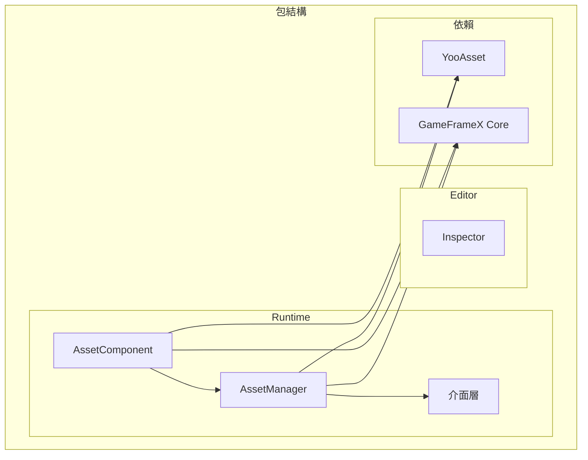

# 安裝方式

GameFrameX Asset 資源組件支援多種安裝方式，以適應不同的專案工作流和開發需求。本文將詳細介紹每種安裝方法及其適用場景。

## 概述

GameFrameX Asset 資源組件是基於 YooAsset 構建的 Unity 資源管理功能包，提供統一的資源載入、解除安裝和熱更新介面。該組件採用 Unity Package Manager (UPM) 方式進行分發，支援多種安裝途徑，開發者可根據專案實際情況選擇最合適的安裝方法。

## 環境要求

| 要求項 | 最低版本 | 說明 |
|--------|----------|------|
| Unity 版本 | 2019.4 | LTS 版本推薦 |
| 包管理器 | UPM | Unity 內建 |
| 網路環境 | 需要訪問 GitHub | 用於 Git URL 安裝 |

## 安裝方式

### 方式一：透過 manifest.json 安裝

直接編輯專案的 `Packages/manifest.json` 檔案，在 `dependencies` 節點下新增包引用。這是最常用的安裝方式，適合需要版本控制的團隊專案。

**操作步驟：**

1. 開啟 Unity 專案目錄下的 `Packages/manifest.json` 檔案
2. 在 `dependencies` 節點中新增包引用
3. 儲存檔案後等待 Unity 自動下載並匯入

```json
{
  "dependencies": {
    "com.gameframex.unity.asset": "https://github.com/GameFrameX/com.gameframex.unity.asset.git"
  }
}
```

> Source: [README.md](https://github.com/GameFrameX/com.gameframex.unity.asset/blob/main/README.md#L13-L16)

**適用場景：**
- 團隊協作專案，需要版本鎖定
- CI/CD 自動化構建環境
- 需要自定義包版本的開發流程

**注意事項：**
- 該方式會始終獲取最新版本
- 如需鎖定版本，可使用 `#分支名` 或 `#tag` 語法
- Git 倉庫地址需保持可訪問

### 方式二：透過 Unity Package Manager 安裝

使用 Unity 編輯器內建的包管理器介面，透過 Git URL 新增包。這種方式無需手動編輯配置檔案，適合快速嘗試和臨時測試。

**操作步驟：**

1. 在 Unity 編輯器中開啟 `Window` → `Package Manager`
2. 點選左上角的 `+` 按鈕
3. 選擇 `Add package from git URL...`
4. 輸入 Git 倉庫地址：`https://github.com/GameFrameX/com.gameframex.unity.asset.git`
5. 點選 `Add` 等待包下載完成

```
https://github.com/GameFrameX/com.gameframex.unity.asset.git
```

> Source: [README.md](https://github.com/GameFrameX/com.gameframex.unity.asset/blob/main/README.md#L17)

**適用場景：**
- 快速原型開發和功能測試
- 獨立開發者快速上手
- 臨時需要引入的功能驗證

**注意事項：**
- 需要保持網路連線
- 首次安裝可能需要較長時間下載依賴
- 建議測試完成後切換到方式一進行版本控制

### 方式三：手動放置到 Packages 目錄

將倉庫克隆或下載後，直接放置到 Unity 專案的 `Packages` 目錄下。這種方式完全離線，適合網路受限的環境。

**操作步驟：**

1. 克隆或下載倉庫：`https://github.com/GameFrameX/com.gameframex.unity.asset.git`
2. 將倉庫資料夾重新命名為 `com.gameframex.unity.asset`
3. 將資料夾複製到 Unity 專案的 `Packages` 目錄下
4. Unity 會自動識別並載入包

```
YourUnityProject/
└── Packages/
    └── com.gameframex.unity.asset/
        ├── package.json
        ├── Runtime/
        └── Editor/
```

> Source: [README.md](https://github.com/GameFrameX/com.gameframex.unity.asset/blob/main/README.md#L18)

**適用場景：**
- 網路受限或無法訪問外部倉庫
- 需要對包進行本地修改和除錯
- 離線開發和構建環境

**注意事項：**
- 包不會自動更新，需要手動同步
- 修改後的包可能影響後續升級
- 建議保留原始包副本以便升級

## 依賴要求

GameFrameX Asset 組件依賴以下包，在安裝過程中會自動一併安裝：

| 依賴包 | 版本 | 說明 |
|--------|------|------|
| com.gameframex.unity | 1.1.1 | GameFrameX 核心框架 |
| YooAsset | - | 資源管理底層實現 |
| BetterStreamingAssets | - | 流資源訪問支援 |

### YooAsset 整合

該組件基於 [YooAsset](https://github.com/yoomotion/YooAsset) 構建，提供以下核心功能：

- 資源打包與分配
- 資源載入與快取管理
- 場景非同步載入
- 資源熱更新支援
- 多平臺適配

> 詳細 API 使用方式請參考 [資源載入介面](./5-api-reference.loading-api) 文件。

## 包結構說明

安裝完成後，包目錄結構如下：

```
com.gameframex.unity.asset/
├── package.json              # 包配置檔案
├── Runtime/                  # 執行時程式碼
│   ├── GameFrameX.Asset.Runtime.asmdef
│   ├── Asset/
│   │   ├── AssetComponent.cs
│   │   ├── AssetManager.cs
│   │   ├── IAssetManager.cs
│   │   └── Constant.cs
│   └── Update/
│       ├── EPatchStates.cs
│       └── EventArgs/
├── Editor/                   # 編輯器程式碼
│   ├── GameFrameX.Asset.Editor.asmdef
│   └── Inspector/
│       └── AssetComponentInspector.cs
└── Tests/                   # 單元測試
    └── GameFrameX.Asset.Tests.asmdef
```



## 安裝驗證

安裝完成後，可透過以下方式驗證：

1. **檢查 Package Manager**：在 Package Manager 視窗確認 `GameFrameX Asset` 包已顯示
2. **檢查程式集**：在 Project 視窗確認 `GameFrameX.Asset.Runtime` 和 `GameFrameX.Asset.Editor` 程式集已生成
3. **執行示例程式碼**：嘗試載入資源驗證功能正常

```csharp
// 驗證安裝成功的簡單測試
using GameFrameX.Asset.Runtime;

public class InstallationTest : MonoBehaviour
{
    private void Start()
    {
        // 獲取資源管理器例項
        var manager = AssetManager.Instance;
        Debug.Log($"Asset Manager initialized: {manager != null}");
    }
}
```

## 版本選擇

| 版本格式 | 示例 | 說明 |
|----------|------|------|
| latest | - | 獲取主分支最新程式碼 |
| 分支 | #main | 獲取指定分支 |
| 標籤 | #2.4.0 | 獲取指定版本釋出 |

建議在正式專案中鎖定具體版本號，避免因自動更新導致相容性問題。

## 常見問題

### 安裝後編譯報錯

**原因**：缺少依賴包或 Unity 版本過低

**解決方案**：
1. 確認 Unity 版本 >= 2019.4
2. 檢查 `manifest.json` 中依賴是否正確新增
3. 嘗試刪除 `Library` 資料夾後重新開啟專案

### 無法連線到 Git 倉庫

**原因**：網路問題或倉庫地址變更

**解決方案**：
1. 檢查網路連線
2. 確認 Git 倉庫地址正確
3. 嘗試使用方式三手動安裝

### 版本升級問題

**解決方案**：
1. 備份當前專案
2. 刪除舊版本包
3. 按本文件重新安裝新版本
4. 檢查 [CHANGELOG](./CHANGELOG.md) 瞭解版本變更

## 相關連結

- [GitHub 倉庫](https://github.com/GameFrameX/com.gameframex.unity.asset.git)
- [依賴要求](./2-installation.dependencies)
- [快速入門指南](./3-getting-started.index)
- [官方文件](https://gameframex.doc.alianblank.com)
