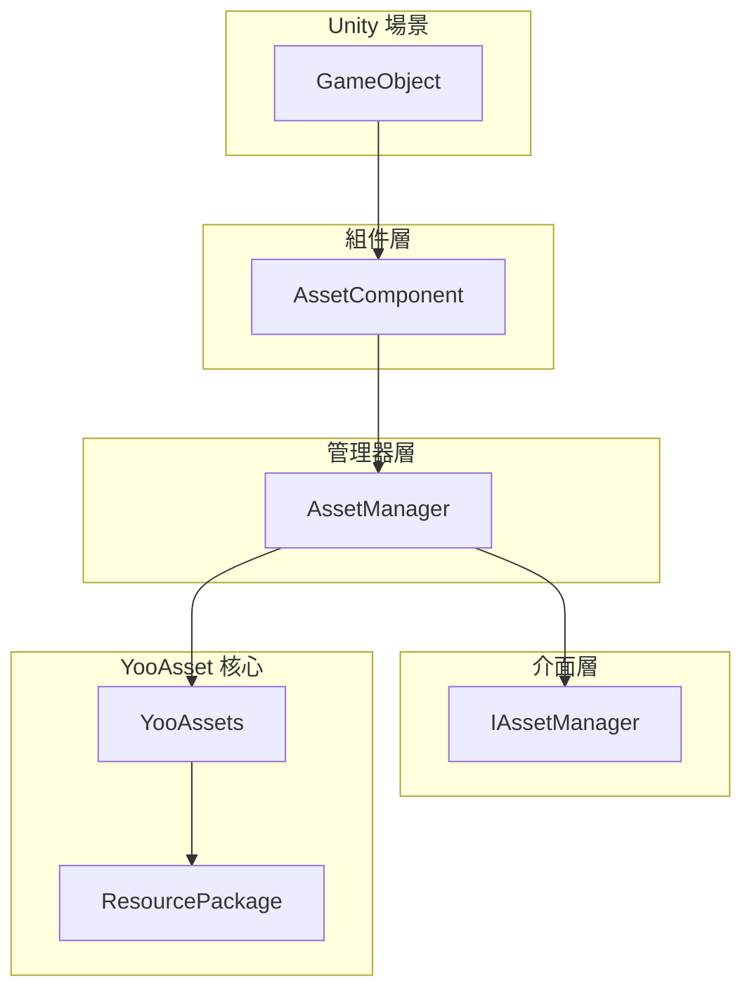
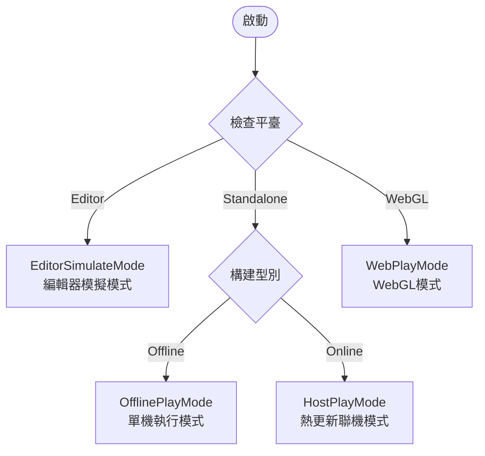

# 快速入門指南

本文件將幫助您快速上手 GameFrameX Asset 資源組件，瞭解如何在自己的 Unity 專案中整合和使用該組件進行資源管理。

## 概述

GameFrameX Asset 是基於 [YooAsset](https://yooasset.com/) 構建的 Unity 資源管理系統。它提供了統一的資源載入介面，支援多種執行模式，包括編輯器模擬模式、單機執行模式、熱更新聯機模式和 WebGL 模式。該組件是 GameFrameX 遊戲框架的核心模組之一，專門負責處理遊戲資源的載入、解除安裝和熱更新流程。

 Asset 組件的主要設計目標是簡化資源管理的複雜性，讓開發者能夠以更簡潔的方式實現資源的非同步載入、同步載入、場景切換以及熱更新功能。透過封裝 YooAsset 的底層 API，Asset 組件提供了一套更加直觀易用的介面，同時保持了 YooAsset 強大的資源管理能力。

## 系統架構

Asset 組件採用分層架構設計，核心由三個主要部分組成：Unity 組件層、管理器層和介面層。這種分層設計確保了程式碼的可維護性和擴充套件性，同時提供了靈活的資源管理能力。



**各層職責說明：**

**組件層（AssetComponent）** 是 Unity 的 MonoBehaviour 組件，需要掛載到場景中的 GameObject 上。它負責在遊戲啟動時初始化資源管理系統，並根據目標平臺自動選擇合適的執行模式。在 WebGL 平臺上，組件會自動切換到 WebPlayMode，確保資源能夠正確從遠端伺服器載入。

**管理器層（AssetManager）** 是資源管理的核心實現類，繼承自 GameFrameworkModule。它封裝了所有資源操作，包括資源的載入、解除安裝、包管理和清理等。AssetManager 提供了同步和非同步兩套載入介面，滿足不同場景的需求。

**介面層（IAssetManager）** 定義了資源管理的標準介面，確保了管理器實現的規範性。透過介面抽象，可以方便地進行單元測試和模組替換。

## 核心概念

### 執行模式（PlayMode）

Asset 組件支援四種執行模式，每種模式適用於不同的開發和部署場景：



**EditorSimulateMode（編輯器模擬模式）** 主要用於開發階段。在這種模式下，資源直接從 Unity 編輯器的資原始檔夾中載入，無需進行資源打包。這種模式可以大幅縮短開發迭代週期，讓開發者能夠快速測試資源載入功能。需要注意的是，在非編輯器環境下執行時，如果設定為此模式，系統會自動切換到 HostPlayMode。

**OfflinePlayMode（單機執行模式）** 適用於不需要熱更新的單機遊戲或內測階段。在這種模式下，所有資源都從內建資源包（Buildin）中載入，不涉及遠端資源下載。資源打包後內建到安裝包中，玩家無需聯網即可執行遊戲。

**HostPlayMode（熱更新聯機模式）** 是最常用的生產模式，適用於需要持續更新的網路遊戲。資源分為內建資源和遠端資源兩部分：內建資源隨應用包一起分發，遠端資源從熱更新伺服器按需下載。這種模式支援資源的動態更新，無需重新發布應用即可更新遊戲內容。

**WebPlayMode（WebGL 模式）** 專門針對 WebGL 平臺最佳化。由於瀏覽器安全限制和載入效能考慮，WebGL 平臺需要使用特殊的資源載入方式。Asset 組件會自動檢測 WebGL 平臺並切換到此模式，同時支援位元組小遊戲、微信小遊戲和快手小遊戲等平臺。

### 資源包（ResourcePackage）

資源包是組織和管理資源的基本單元。每個資源包都有獨立的名稱，可以配置不同的資源伺服器地址。系統支援建立多個資源包，用於分離不同型別的資源，例如主資源包、DLC 資源包或語言資源包等。預設資源包名稱為 "DefaultPackage"，系統會自動建立並設定為預設包。

### 資源控制代碼（AssetHandle）

資源控制代碼是載入資源的返回值封裝類。透過控制代碼物件可以訪問載入的資源，並且在不再需要時呼叫 Release 方法釋放資源。系統提供多種型別的控制代碼：AssetHandle 用於普通資源、SubAssetsHandle 用於子資源、AllAssetsHandle 用於載入所有資源、SceneHandle 用於場景載入、RawFileHandle 用於原生檔案。

## 快速開始流程

要在專案中使用 Asset 組件，需要完成以下幾個關鍵步驟：

### 第一步：安裝組件

首先需要將 Asset 組件安裝到您的 Unity 專案中。安裝方式請參閱 [安裝方式](./2-installation.index) 文件。安裝完成後，確保專案中已經包含 GameFrameX 核心框架和其他必要的依賴。

### 第二步：新增組件到場景

在 Unity 編輯器中，建立一個新的 GameObject（或者使用現有的遊戲物件），然後透過選單 "Component" -> "GameFrameX" -> "Asset" 新增 AssetComponent 組件。新增組件後，在 Inspector 面板中可以配置執行模式和其他引數。

```csharp
// 組件新增後的 Unity 場景層級結構示例
// GameObject (Root)
// └── Asset (新增了 AssetComponent 組件)
```

> Source: [AssetComponent.cs](https://github.com/GameFrameX/com.gameframex.unity.asset/blob/main/Runtime/Asset/AssetComponent.cs#L18-L35)

### 第三步：配置執行模式

在 Inspector 面板中，根據您的開發階段和釋出目標選擇合適的執行模式：

- **開發階段**：選擇 EditorSimulateMode，可以直接從編輯器載入資源
- **單機測試**：選擇 OfflinePlayMode，模擬單機環境
- **熱更新測試**：選擇 HostPlayMode，測試完整的熱更新流程
- **WebGL 釋出**：在 WebGL 平臺下會自動切換到 WebPlayMode

```csharp
// 在程式碼中也可以動態設定執行模式
var assetComponent = gameObject.GetComponent<AssetComponent>();
assetComponent.GamePlayMode = EPlayMode.HostPlayMode;
```

> Source: [AssetComponent.cs](https://github.com/GameFrameX/com.gameframex.unity.asset/blob/main/Runtime/Asset/AssetComponent.cs#L20-L31)

### 第四步：初始化資源包

對於需要熱更新的場景，需要初始化資源包並配置遠端伺服器地址。這一步通常在遊戲啟動時或資源更新流程中執行。

```csharp
// 初始化預設資源包
var assetComponent = gameObject.GetComponent<AssetComponent>();
bool success = await assetComponent.InitPackageAsync(
    "DefaultPackage",           // 資源包名稱
    "https://your-server.com/", // 主伺服器地址
    "https://backup-server.com/", // 備用伺服器地址
    true                        // 是否設為預設包
);

if (success)
{
    Debug.Log("資源包初始化成功");
}
```

> Source: [AssetComponent.cs](https://github.com/GameFrameX/com.gameframex.unity.asset/blob/main/Runtime/Asset/AssetComponent.cs#L80-L95)

### 第五步：載入資源

初始化完成後，就可以使用組件提供的介面載入資源了。系統同時支援同步和非同步兩種載入方式：

```csharp
// 非同步載入資源示例
var assetComponent = gameObject.GetComponent<AssetComponent>();
var handle = await assetComponent.LoadAssetAsync<Sprite>("UI/Icons/PlayerIcon");
var sprite = handle.AssetObject as Sprite;

// 使用完畢後釋放資源
handle.Release();
```

> Source: [AssetComponent.cs](https://github.com/GameFrameX/com.gameframex.unity.asset/blob/main/Runtime/Asset/AssetComponent.cs#L258-L261)

## 資源載入方式詳解

Asset 組件提供了豐富的資源載入介面，可以滿足各種不同的載入需求。

### 非同步載入

非同步載入是推薦的主要載入方式，特別適用於需要載入大量資源的場景。非同步載入不會阻塞主執行緒，能夠保持遊戲流暢執行。所有非同步方法都返回 Task 物件，支援 await 語法：

```csharp
// 非同步載入普通資源
var handle = await assetComponent.LoadAssetAsync<GameObject>("Prefabs/Player");

// 非同步載入帶型別的資源
var handle = await assetComponent.LoadAssetAsync<Sprite>("UI/Background");

// 非同步載入多個資源
var allAssetsHandle = await assetComponent.LoadAllAssetsAsync<GameObject>("Prefabs/Enemies");

// 非同步載入場景
var sceneHandle = await assetComponent.LoadSceneAsync("Scenes/GameLevel", LoadSceneMode.Single);
```

> Source: [AssetManager.cs](https://github.com/GameFrameX/com.gameframex.unity.asset/blob/main/Runtime/Asset/AssetManager.cs#L469-L481)

### 同步載入

同步載入適用於對載入時間要求不高、但需要立即獲取資源的場景。由於同步載入會阻塞主執行緒，在載入大型資源時可能會造成卡頓，建議僅在必要時使用：

```csharp
// 同步載入資源
var handle = assetComponent.LoadAssetSync<GameObject>("Prefabs/Player");
var player = handle.AssetObject as GameObject;
```

> Source: [AssetManager.cs](https://github.com/GameFrameX/com.gameframex.unity.asset/blob/main/Runtime/Asset/AssetManager.cs#L603-L606)

### 子資源載入

子資源載入用於處理一個資原始檔包含多個子資源的情況，例如 Sprite Atlas 或模型檔案中的多個子物件：

```csharp
// 載入 Sprite Atlas 中的所有子圖
var handle = await assetComponent.LoadSubAssetsAsync<Sprite>("Atlas/UIAtlas");
foreach (var sprite in handle.AssetObject)
{
    Debug.Log($"Sprite 名稱: {sprite.name}");
}
handle.Release();
```

> Source: [AssetManager.cs](https://github.com/GameFrameX/com.gameframex.unity.asset/blob/main/Runtime/Asset/AssetManager.cs#L244-L250)

### 原生檔案載入

如果需要載入非 Unity 資源型別的檔案（如配置檔案、文字檔案等），可以使用原生檔案載入介面：

```csharp
// 非同步載入原生檔案
var rawHandle = await assetComponent.LoadRawFileAsync("Config/GameConfig.json");
byte[] data = rawHandle.ReadRawFile();
rawHandle.Release();
```

> Source: [AssetManager.cs](https://github.com/GameFrameX/com.gameframex.unity.asset/blob/main/Runtime/Asset/AssetManager.cs#L314-L320)

## 資源管理最佳實踐

### 及時釋放資源

不再使用的資源應當及時釋放，以釋放記憶體空間。可以使用資源控制代碼的 Release 方法進行釋放：

```csharp
// 載入並使用資源
var handle = await assetComponent.LoadAssetAsync<GameObject>("Prefabs/Player");
var player = Instantiate(handle.AssetObject as GameObject);

// 使用完畢後釋放控制代碼（注意：資源例項不會被銷燬）
handle.Release();

// 如果需要完全清理，包括資源例項
Destroy(player);
```

> Source: [AssetComponent.cs](https://github.com/GameFrameX/com.gameframex.unity.asset/blob/main/Runtime/Asset/AssetComponent.cs#L622-L628)

### 批次解除安裝無用資源

遊戲執行一段時間後，可能會積累大量不再使用的資源。可以使用清理功能釋放這些資源：

```csharp
// 解除安裝未被引用的資源
assetComponent.UnloadUnusedAssetsAsync();

// 清理未使用的資源包檔案（可釋放儲存空間）
assetComponent.ClearUnusedBundleFilesAsync();
```

> Source: [AssetComponent.cs](https://github.com/GameFrameX/com.gameframex.unity.asset/blob/main/Runtime/Asset/AssetComponent.cs#L635-L658)

### 使用資源包進行資源隔離

對於大型專案，建議使用多個資源包來組織不同型別的資源。這樣可以實現資源的按需載入和更新：

```csharp
// 建立額外的資源包
var dlcPackage = assetComponent.CreateAssetsPackage("DLC_Package");

// 獲取已存在的資源包
var package = assetComponent.TryGetAssetsPackage("DefaultPackage");

// 設定預設資源包
assetComponent.SetDefaultAssetsPackage(package);
```

> Source: [AssetComponent.cs](https://github.com/GameFrameX/com.gameframex.unity.asset/blob/main/Runtime/Asset/AssetComponent.cs#L471-L507)

## 下一步

現在您已經瞭解了 Asset 組件的基本使用方法，可以繼續深入學習以下內容：

- **[首個示例](./3-getting-started.first-steps)**：透過完整的程式碼示例深入學習資源載入的具體實現
- **[架構設計](./4-core-concepts.architecture)**：瞭解組件的詳細架構設計和模組劃分
- **[資源載入介面](./5-api-reference.loading-api)**：查閱完整的 API 介面文件
- **[執行模式](./6-configuration.play-modes)**：詳細瞭解各種執行模式的配置和使用場景

## 相關連結

- [Asset 資源組件介紹](./1-overview.introduction)
- [功能特性](./1-overview.features)
- [支援的 Unity 版本](./1-overview.supported-versions)
- [安裝方式](./2-installation.index)
- [依賴要求](./2-installation.dependencies)
- [首個示例](./3-getting-started.first-steps)
- [架構設計](./4-core-concepts.architecture)
- [資源組件](./4-core-concepts.asset-component)
- [資源管理器](./4-core-concepts.asset-manager)
