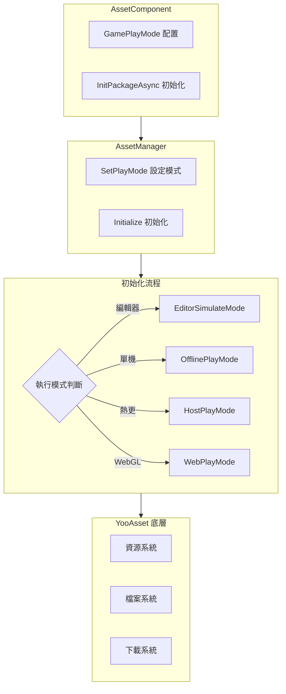

# 功能特性

Asset 資源組件是 GameFrameX 框架的核心模組之一，基於 YooAsset 封裝構建，提供統一的資源載入、管理和更新能力。該組件將複雜的資源管理操作簡化為直觀的 API 介面，使開發者能夠高效地進行資源載入、場景切換和資源包管理。

## 概述

Asset 資源組件旨在解決 Unity 專案中的資源管理痛點，包括資源載入方式不一致、資源更新困難、多平臺適配複雜等問題。透過提供統一的介面抽象和多種執行模式支援，開發者可以在不同的開發和部署場景下靈活使用同一套程式碼。組件支援從簡單的單機遊戲到複雜的熱更新遊戲的各種需求，無論是編輯器下的快速迭代還是生產環境的熱更新部署，都能提供完善的解決方案。

該組件的核心價值在於將底層資源管理框架（YooAsset）的複雜功能進行封裝，同時保留其強大的能力。開發者無需瞭解底層實現細節，只需透過簡單的 API 呼叫即可完成資源載入、場景切換等操作。此外，組件還提供了完整的事件系統，使開發者能夠實時監控資源下載進度、狀態變化等關鍵資訊，從而實現更好的使用者體驗。

## 核心功能特性

### 多模式執行支援

Asset 組件支援四種不同的執行模式，每種模式針對特定的使用場景進行最佳化。這種設計使得同一套程式碼可以在不同的開發和部署環境中無縫切換，無需修改業務邏輯程式碼。

**編輯器模擬模式（EditorSimulateMode）** 適用於開發階段的快速迭代。在此模式下，資源直接從 Unity 編輯器的工程目錄中載入，無需進行任何打包操作。這極大地加快了開發速度，因為開發者可以在修改資源後立即看到效果，無需等待資源打包完成。該模式僅在 Unity 編輯器環境下有效，打包釋出時會自動切換到其他模式。

**離線執行模式（OfflinePlayMode）** 適用於單機遊戲或不需要熱更新的場景。在此模式下，所有資源都從內建資源包（Buildin）中載入，不涉及任何網路請求。資源隨應用一起分發，無需額外的下載步驟。這種模式最適合獨立遊戲開發或需要嚴格控制資源分發方式的場景。

**聯機執行模式（HostPlayMode）** 適用於需要熱更新功能的遊戲。在此模式下，資源分為兩部分：內建資源包用於儲存初始資源，遠端伺服器用於儲存熱更新資源。組件會自動檢測並下載需要更新的資源，支援斷點續傳和版本管理。這種模式是現代手遊的標配，允許開發者在遊戲釋出後繼續更新內容。

**WebGL 執行模式（WebPlayMode）** 專門針對 WebGL 平臺最佳化。該模式針對瀏覽器環境的特殊性進行了適配，支援各種 Web 小遊戲平臺（如微信小遊戲、抖音小遊戲、快手小遊戲等）。組件會自動檢測目標平臺並選擇合適的檔案系統引數，確保資源能夠正確載入。



### 統一的資源載入介面

Asset 組件提供了豐富的資源載入介面，涵蓋各種使用場景。所有載入介面都支援泛型版本，能夠自動推斷資源型別，減少型別轉換的麻煩。

**非同步載入** 是推薦的主要載入方式，特別適合需要載入多個資源或資源較大的場景。非同步載入不會阻塞主執行緒，能夠保持介面的流暢響應。組件將 YooAsset 的回呼式 API 轉換為 Task 式的非同步介面，使程式碼更加簡潔易讀，支援 async/await 語法糖。

```csharp
// 非同步載入資源
var handle = await assetComponent.LoadAssetAsync<Texture2D>("Textures/Background");
var texture = handle.AssetObject as Texture2D;

// 非同步載入所有資源
var allHandle = await assetComponent.LoadAllAssetsAsync<GameObject>("Prefabs/Enemies");
foreach (var obj in allHandle.AllAssetObjects)
{
    // 處理每個資源
}

// 非同步載入場景
await assetComponent.LoadSceneAsync("Scenes/GameLevel", LoadSceneMode.Single);
```

> Source: [AssetComponent.cs](https://github.com/GameFrameX/com.gameframex.unity.asset/blob/main/Runtime/Asset/AssetComponent.cs#L258-L261)

**同步載入** 適用於對載入時間有嚴格要求的場景，如需要立即顯示的資源。同步載入會阻塞呼叫執行緒，可能導致介面卡頓，因此建議僅在必要時使用，並且避免在主執行緒中載入大型資源。

```csharp
// 同步載入資源
var handle = assetComponent.LoadAssetSync<AudioClip>("Audio/BGM");
var audio = handle.AssetObject as AudioClip;
```

> Source: [AssetComponent.cs](https://github.com/GameFrameX/com.gameframex.unity.asset/blob/main/Runtime/Asset/AssetComponent.cs#L426-L429)

**子資源載入** 用於處理帶有子資源的資源，如 SpriteAtlas（包含多個 Sprite）。這使得開發者可以一次性載入整個圖集，然後按需獲取其中的單個精靈。

```csharp
// 載入子資源
var handle = await assetComponent.LoadSubAssetsAsync<Sprite>("UI/Atlas/MainUI");
foreach (var sprite in handle.SubAssetObjects)
{
    // 處理每個子資源
}
```

> Source: [AssetComponent.cs](https://github.com/GameFrameX/com.gameframex.unity.asset/blob/main/Runtime/Asset/AssetComponent.cs#L128-L131)

**原生檔案載入** 用於載入非 Unity 資源格式的檔案，如配置檔案、文字檔案、二進位制資料等。載入後的資料以位元組陣列形式返回，開發者可以自行解析。

```csharp
// 載入原生檔案
var handle = await assetComponent.LoadRawFileAsync("Config/GameConfig.json");
var data = handle.RawFileData;
var json = System.Text.Encoding.UTF8.GetString(data);
```

> Source: [AssetComponent.cs](https://github.com/GameFrameX/com.gameframex.unity.asset/blob/main/Runtime/Asset/AssetComponent.cs#L192-L195)

### 資源包管理

資源包（ResourcePackage）是組織和管理資源的基本單元。Asset 組件支援建立多個獨立的資源包，使開發者能夠按功能模組或載入策略劃分資源。

**建立資源包** 允許開發者建立新的資源包來管理特定類別的資源。每個資源包有獨立的初始化引數和資源集合，適用於需要按需載入不同資源集的場景。

```csharp
// 建立資源包
var package = assetComponent.CreateAssetsPackage("DLC_Package");
```

> Source: [AssetComponent.cs](https://github.com/GameFrameX/com.gameframex.unity.asset/blob/main/Runtime/Asset/AssetComponent.cs#L471-L474)

**獲取和檢查資源包** 提供了多種方式來查詢已存在的資源包。可以根據名稱獲取資源包例項，也可以檢查某個名稱的資源包是否存在。

```csharp
// 檢查資源包是否存在
if (assetComponent.HasAssetsPackage("DLC_Package"))
{
    var package = assetComponent.GetAssetsPackage("DLC_Package");
}
```

> Source: [AssetComponent.cs](https://github.com/GameFrameX/com.gameframex.unity.asset/blob/main/Runtime/Asset/AssetComponent.cs#L493-L506)

**設定預設資源包** 可以指定預設的資源包，後續的資源載入操作將預設使用該資源包。這簡化了資源載入的程式碼，無需每次都指定資源包名稱。

```csharp
// 設定預設資源包
assetComponent.SetDefaultAssetsPackage(package);
```

> Source: [AssetComponent.cs](https://github.com/GameFrameX/com.gameframex.unity.asset/blob/main/Runtime/Asset/AssetComponent.cs#L581-L584)

### 資源查詢與驗證

組件提供了完善的資源查詢功能，幫助開發者在載入資源前瞭解資源的相關資訊。

**獲取資源資訊** 可以根據資源的標籤或路徑獲取資源的後設資料。這些資訊包括資源的依賴關係、所在資源包、載入方式等，對於實現更復雜的資源管理策略非常有用。

```csharp
// 根據標籤獲取資源資訊
var infos = assetComponent.GetAssetInfos("UI");
// 根據路徑獲取單個資源資訊
var info = assetComponent.GetAssetInfo("Prefabs/Player");
```

> Source: [AssetComponent.cs](https://github.com/GameFrameX/com.gameframex.unity.asset/blob/main/Runtime/Asset/AssetComponent.cs#L550-L562)

**檢查資源路徑** 驗證指定的資源路徑是否有效，避免載入不存在的資源導致錯誤。

```csharp
// 檢查資源路徑是否存在
if (assetComponent.HasAssetPath("Prefabs/Enemy"))
{
    // 資源存在，可以安全載入
}
```

> Source: [AssetComponent.cs](https://github.com/GameFrameX/com.gameframex.unity.asset/blob/main/Runtime/Asset/AssetComponent.cs#L570-L573)

**檢查是否需要下載** 在聯機執行模式下，可以檢查某個資源是否需要從遠端伺服器下載。這對於實現預下載功能或顯示下載進度非常有幫助。

```csharp
// 檢查是否需要下載
if (assetComponent.IsNeedDownload("Textures/HighRes/Detail"))
{
    // 該資源需要從遠端下載
}
```

> Source: [AssetComponent.cs](https://github.com/GameFrameX/com.gameframex.unity.asset/blob/main/Runtime/Asset/AssetComponent.cs#L528-L531)

### 資源解除安裝與清理

合理的資源管理不僅包括載入，還包括及時的解除安裝和清理，以釋放記憶體並最佳化效能。

**解除安裝指定資源** 釋放特定資源的記憶體佔用。當某個資源不再需要時，應當及時解除安裝以釋放記憶體。

```csharp
// 解除安裝指定資源
assetComponent.UnloadAsset("Prefabs/Enemy");
// 指定資源包解除安裝
assetComponent.UnloadAsset("DLC_Package", "Prefabs/Boss");
```

> Source: [AssetComponent.cs](https://github.com/GameFrameX/com.gameframex.unity.asset/blob/main/Runtime/Asset/AssetComponent.cs#L612-L615)

**解除安裝未使用資源** 掃描並解除安裝所有未被引用的資源。這通常在切換場景或進入新的遊戲階段時呼叫，以清理不再需要的資源。

```csharp
// 解除安裝未使用資源
assetComponent.UnloadUnusedAssetsAsync();
```

> Source: [AssetComponent.cs](https://github.com/GameFrameX/com.gameframex.unity.asset/blob/main/Runtime/Asset/AssetComponent.cs#L635-L638)

**清理資原始檔** 不僅釋放記憶體，還刪除快取的下載檔案。這在需要釋放磁碟空間或重置資源快取時使用。

```csharp
// 清理無用資原始檔
assetComponent.ClearUnusedBundleFilesAsync();
// 清理所有資原始檔
assetComponent.ClearAllBundleFilesAsync();
```

> Source: [AssetComponent.cs](https://github.com/GameFrameX/com.gameframex.unity.asset/blob/main/Runtime/Asset/AssetComponent.cs#L645-L658)

### 更新事件系統

Asset 組件實現了完整的事件系統，使開發者能夠實時監控資源管理的各個階段。這對於實現載入介面、更新提示等功能至關重要。

**下載進度更新事件** 在資源下載過程中持續觸發，提供當前的下載進度資訊。事件引數包含總檔案數、已下載檔案數、總大小和已下載大小，開發者可以據此計算百分比並顯示進度條。

```csharp
// 訂閱下載進度更新事件
EventComponent.Subscribe<AssetDownloadProgressUpdateEventArgs>(OnDownloadProgress);

private void OnDownloadProgress(object sender, AssetDownloadProgressUpdateEventArgs e)
{
    var progress = (float)e.CurrentDownloadSizeBytes / e.TotalDownloadSizeBytes;
    Debug.Log($"下載進度: {progress * 100}%");
}
```

> Source: [AssetDownloadProgressUpdateEventArgs.cs](https://github.com/GameFrameX/com.gameframex.unity.asset/blob/main/Runtime/Update/EventArgs/AssetDownloadProgressUpdateEventArgs.cs#L66-L68)

**發現更新檔案事件** 在檢測到需要更新的資原始檔時觸發。此時可以向使用者顯示更新內容摘要，並詢問是否開始下載。

**資源包狀態變更事件** 在資源初始化流程的各個階段觸發，包括準備階段、版本檢測階段、清單更新階段、資源探測階段和完成階段。

```csharp
// 訂閱狀態變更事件
EventComponent.Subscribe<AssetPatchStatesChangeEventArgs>(OnPatchStatesChange);

private void OnPatchStatesChange(object sender, AssetPatchStatesChangeEventArgs e)
{
    Debug.Log($"當前狀態: {e.CurrentStates}");
}
```

> Source: [AssetPatchStatesChangeEventArgs.cs](https://github.com/GameFrameX/com.gameframex.unity.asset/blob/main/Runtime/Update/EventArgs/AssetPatchStatesChangeEventArgs.cs#L41-L42)

**錯誤處理事件** 包括補丁清單更新失敗、靜態版本更新失敗、網路檔案下載失敗等事件，使開發者能夠針對不同型別的錯誤進行相應的處理。

```csharp
// 訂閱下載失敗事件
EventComponent.Subscribe<AssetWebFileDownloadFailedEventArgs>(OnDownloadFailed);

private void OnDownloadFailed(object sender, AssetWebFileDownloadFailedEventArgs e)
{
    Debug.LogError($"檔案下載失敗: {e.FileName}, 錯誤: {e.Error}");
}
```

> Source: [AssetWebFileDownloadFailedEventArgs.cs](https://github.com/GameFrameX/com.gameframex.unity.asset/blob/main/Runtime/Update/EventArgs/AssetWebFileDownloadFailedEventArgs.cs#L51-L53)

## 平臺支援

Asset 組件針對不同的目標平臺提供了專門的最佳化支援，確保在各種環境下都能正常工作。

**Unity 編輯器** 提供完整的開發支援，包括模擬執行模式、資源預覽和除錯功能。開發者可以在編輯器中快速測試和迭代資源管理邏輯。

**PC 平臺**（Windows、Mac、Linux）支援所有執行模式，包括聯機模式的熱更新功能。由於磁碟和網路條件通常較好，資源載入體驗流暢。

**移動平臺**（iOS、Android）是組件的主要目標平臺，支援完整的熱更新能力。組件針對行動網路的不穩定性進行了最佳化，支援斷點續傳和失敗重試。

**WebGL 平臺** 具有專門的執行模式，針對瀏覽器環境進行了最佳化。組件支援主流的 Web 小遊戲平臺，包括微信小遊戲、抖音小遊戲和快手小遊戲。

```mermaid
flowchart LR
    subgraph Platforms["支援的平臺"]
        P1[Unity 編輯器]
        P2[PC (Win/Mac/Linux)]
        P3[移動端 (iOS/Android)]
        P4[WebGL]
        P5[小遊戲平臺]
    end
    
    subgraph Modes["支援的執行模式"]
        M1[EditorSimulateMode]
        M2[OfflinePlayMode]
        M3[HostPlayMode]
        M4[WebPlayMode]
    end
    
    P1 -->|EditorSimulateMode| M1
    P2 -->|OfflinePlayMode| M2
    P2 -->|HostPlayMode| M3
    P3 -->|OfflinePlayMode| M2
    P3 -->|HostPlayMode| M3
    P4 -->|WebPlayMode| M4
    P5 -->|WebPlayMode| M4
```

## 配置選項

Asset 組件提供多種配置選項，允許開發者根據專案需求調整行為。

| 配置項 | 型別 | 預設值 | 說明 |
|--------|------|--------|------|
| GamePlayMode | EPlayMode | EditorSimulateMode | 資源執行模式 |
| DownloadingMaxNum | int | 10 | 同時下載的最大檔案數 |
| FailedTryAgain | int | 3 | 下載失敗後的重試次數 |
| VerifyLevel | EFileVerifyLevel | Normal | 下載檔案校驗等級 |
| Milliseconds | long | 30 | 非同步系統每幀執行的最大時間切片（毫秒） |
| ReadOnlyPath | string | - | 資源只讀區路徑 |
| ReadWritePath | string | - | 資源讀寫區路徑 |

> Source: [IAssetManager.cs](https://github.com/GameFrameX/com.gameframex.unity.asset/blob/main/Runtime/Asset/IAssetManager.cs#L18-L75)

## 相關連結

- [Asset 資源組件介紹](./1-overview.introduction)
- [架構設計](./4-core-concepts.architecture)
- [資源組件](./4-core-concepts.asset-component)
- [資源管理器](./4-core-concepts.asset-manager)
- [執行模式](./6-configuration.play-modes)
- [資源載入介面](./5-api-reference.loading-api)
- [資源包管理](./5-api-reference.package-management)
- [更新事件](./5-api-reference.update-events)
