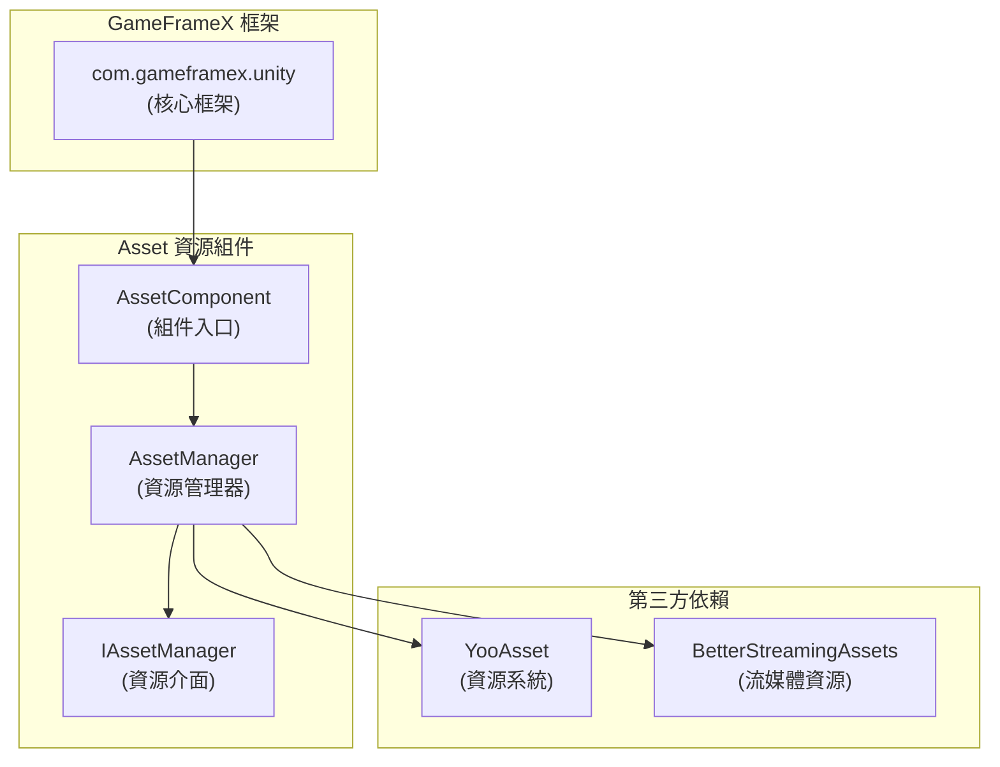

# 依賴要求

本文件詳細說明 GameFrameX Asset 資源組件的依賴要求，包括 Unity 版本要求、框架依賴以及第三方依賴。

## 概述

GameFrameX Asset 資源組件是 GameFrameX 框架的核心模組之一，負責提供統一的資源管理功能。在使用該組件之前，需要確保開發環境和專案滿足以下依賴要求。

## Unity 版本要求

| 專案 | 要求 |
|------|------|
| 最低 Unity 版本 | **2019.4** |
| 推薦 Unity 版本 | 2020.3 LTS 或更高 |

> Source: [package.json](https://github.com/GameFrameX/com.gameframex.unity.asset/blob/main/package.json#L7)

## 框架依賴

### 核心依賴

Asset 資源組件依賴於 GameFrameX 核心框架包，這是使用該組件的**必要前提**。

| 依賴包 | 版本 | 說明 |
|--------|------|------|
| `com.gameframex.unity` | **1.1.1** | GameFrameX 核心框架，提供基礎架構和模組系統 |

```json
{
  "dependencies": {
    "com.gameframex.unity.asset": "2.4.0",
    "com.gameframex.unity": "1.1.1"
  }
}
```

> Source: [package.json](https://github.com/GameFrameX/com.gameframex.unity.asset/blob/main/package.json#L21-L23)

### 框架架構

Asset 組件在 GameFrameX 框架中的位置如下：



**設計說明：**
- `AssetComponent` 繼承自 `GameFrameworkComponent`，是組件的入口點
- `AssetManager` 實現 `IAssetManager` 介面，提供資源管理的具體實現
- 底層使用 YooAsset 作為資源管理系統，BetterStreamingAssets 作為流媒體資源支援

## 第三方依賴

### YooAsset

YooAsset 是 Asset 組件的核心資源管理系統，負責：
- 資源的非同步/同步載入
- 資源包管理
- 資源版本管理
- 資源熱更新支援

```csharp
// AssetManager.cs 中使用 YooAsset
using YooAsset;

public partial class AssetManager : GameFrameworkModule, IAssetManager
{
    public void Initialize()
    {
        BetterStreamingAssets.Initialize();
        YooAssets.Initialize();
        YooAssets.SetOperationSystemMaxTimeSlice(30);
    }
}
```

> Source: [Runtime/Asset/AssetManager.cs](https://github.com/GameFrameX/com.gameframex.unity.asset/blob/main/Runtime/Asset/AssetManager.cs#L46-L56)

### BetterStreamingAssets

用於支援流媒體資源的高效訪問，是 YooAsset 的依賴組件。

## 名稱空間依賴

Asset 組件使用以下名稱空間：

| 名稱空間 | 說明 |
|----------|------|
| `GameFrameX.Runtime` | 核心框架執行時名稱空間 |
| `GameFrameX.Asset.Runtime` | Asset 組件自身名稱空間 |
| `YooAsset` | 資源管理系統 |
| `UnityEngine` | Unity 引擎核心 |
| `UnityEngine.SceneManagement` | 場景管理 |

```csharp
using GameFrameX.Runtime;
using GameFrameX.Asset.Runtime;
using YooAsset;
using UnityEngine;
using UnityEngine.SceneManagement;
using Object = UnityEngine.Object;
```

> Source: [Runtime/Asset/AssetComponent.cs](https://github.com/GameFrameX/com.gameframex.unity.asset/blob/main/Runtime/Asset/AssetComponent.cs#L1-L8)

## 安裝依賴

### 自動安裝（推薦）

在 Unity 專案的 `Packages/manifest.json` 檔案中新增依賴：

```json
{
  "dependencies": {
    "com.gameframex.unity.asset": "https://github.com/GameFrameX/com.gameframex.unity.asset.git",
    "com.gameframex.unity": "1.1.1"
  }
}
```

> 更多資訊請參考 [安裝方式](./2-installation.index)

### Git URL 安裝

在 Unity Package Manager 中使用 Git URL 新增：
- Asset 組件：`https://github.com/GameFrameX/com.gameframex.unity.asset.git`
- 核心框架：`https://github.com/GameFrameX/com.gameframex.unity.git`

### 本地安裝

直接將倉庫克隆到 Unity 專案的 `Packages` 目錄下：

```bash
git clone https://github.com/GameFrameX/com.gameframex.unity.asset.git Packages/com.gameframex.unity.asset
git clone https://github.com/GameFrameX/com.gameframex.unity.git Packages/com.gameframex.unity
```

## 版本相容性

| Asset 組件版本 | Unity 版本 | 框架版本 | 說明 |
|----------------|------------|----------|------|
| 2.4.0 | 2019.4+ | 1.1.1 | 當前最新版本 |
| 2.3.0 | 2019.4+ | 1.1.1 | 支援抖音小遊戲 |
| 2.2.x | 2019.4+ | 1.1.0 | 基礎功能穩定版 |

## 常見問題

### Q: 沒有安裝核心框架會怎樣？

A: Asset 組件依賴 `GameFrameworkComponent` 基類，如果未安裝核心框架，將導致編譯錯誤。請確保先安裝 `com.gameframex.unity` 包。

### Q: YooAsset 需要單獨安裝嗎？

A: 不需要。YooAsset 作為 YooAsset 包的依賴，會在安裝 Asset 組件時自動作為子依賴安裝。

### Q: 支援哪些 Unity 平臺？

A: Asset 組件支援以下平臺：
- Windows/Mac/Linux 桌面平臺
- iOS/Android 移動平臺
- WebGL 平臺
- 微信小遊戲
- 抖音小遊戲
- 快手小遊戲

> 更多資訊請參考 [平臺支援概覽](./7-platforms.index)

## 相關連結

- [安裝方式](./2-installation.index)
- [Asset 資源組件介紹](./1-overview.introduction)
- [功能特性](./1-overview.features)
- [核心概念](./4-core-concepts.architecture)
- [API 參考](./5-api-reference.loading-api)
