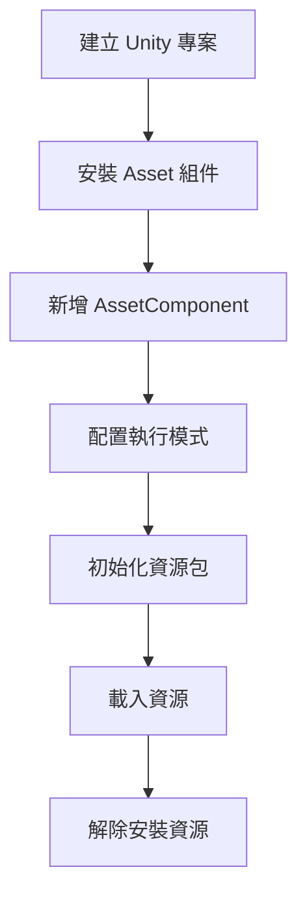

# 首個示例

本文件將引導您完成 GameFrameX Asset 資源組件的首次使用，透過一個完整的示例幫助您快速上手資源系統的核心功能。

## 概述

Asset 資源組件是基於 YooAssets 構建的 Unity 資源管理系統，提供統一的資源載入、解除安裝和熱更新功能。本示例將展示如何在 Unity 專案中配置並使用該組件完成基本的資源載入操作。

## 快速開始流程

以下是使用 Asset 資源組件的標準流程：



## 使用步驟

### 步驟 1：新增 AssetComponent

在 Unity 場景中建立一個空的 GameObject，並新增 `AssetComponent` 組件。該組件會自動暴露資源管理的各項功能。

```csharp
// 在 Unity 編輯器中
// 1. 在場景中建立一個空的 GameObject
// 2. 點選 Add Component
// 3. 搜尋 "GameFrameX/Asset" 並新增
// 4. 組件會自動掛載 AssetComponent
```

> Source: [AssetComponent.cs](https://github.com/GameFrameX/com.gameframex.unity.asset/blob/main/Runtime/Asset/AssetComponent.cs#L16-L18)

AssetComponent 繼承自 `GameFrameworkComponent`，並透過 `[AddComponentMenu("GameFrameX/Asset")]` 屬性在編輯器中方便新增。

### 步驟 2：配置執行模式

AssetComponent 提供 `GamePlayMode` 屬性，用於設定資源的執行模式：

```csharp
// AssetComponent.cs 中的屬性定義
public EPlayMode GamePlayMode { get; set; }
```

支援的執行模式包括：
- **EditorSimulateMode**：編輯器模擬模式，僅在開發時使用
- **HostPlayMode**：遠端熱更模式
- **WebPlayMode**：WebGL 平臺專用模式

> 詳細執行模式說明請參閱 [執行模式](./6-configuration.play-modes) 文件。

```csharp
// 執行時模式設定示例（在 AssetComponent.Awake 中）
_assetManager.SetPlayMode(GamePlayMode);
```

> Source: [AssetComponent.cs](https://github.com/GameFrameX/com.gameframex.unity.asset/blob/main/Runtime/Asset/AssetComponent.cs#L63)

### 步驟 3：初始化資源包

在使用資源系統前，需要先初始化資源包：

```csharp
// 在 AssetComponent.Start 中會自動呼叫初始化
private void Start()
{
    _assetManager.Initialize();
}
```

> Source: [AssetComponent.cs](https://github.com/GameFrameX/com.gameframex.unity.asset/blob/main/Runtime/Asset/AssetComponent.cs#L66-L70)

您也可以手動初始化特定的資源包：

```csharp
// 初始化資源包示例
public async Task<bool> InitPackageAsync(string packageName, string host, string fallbackHostServer, bool isDefaultPackage = false)
{
    return await _assetManager.InitPackageAsync(packageName, host, fallbackHostServer, isDefaultPackage);
}
```

> Source: [AssetComponent.cs](https://github.com/GameFrameX/com.gameframex.unity.asset/blob/main/Runtime/Asset/AssetComponent.cs#L80-L95)

## 資源載入示例

Asset 組件提供多種資源載入方式，下面分別展示非同步載入和同步載入的用法。

### 非同步載入資源

非同步載入是推薦的主要方式，不會阻塞主執行緒：

```csharp
using UnityEngine;
using GameFrameX.Asset.Runtime;
using YooAsset;
using System.Threading.Tasks;

// 非同步載入 Prefab 示例
public async void LoadAssetExample(AssetComponent assetComponent)
{
    // 方法1：使用泛型非同步載入
    var handle = await assetComponent.LoadAssetAsync<GameObject>("Assets/Prefabs/Player.prefab");
    var prefab = handle.AssetObject as GameObject;
    
    // 例項化物件
    if (prefab != null)
    {
        Instantiate(prefab);
    }
    
    // 載入完成後釋放控制代碼
    handle.Release();
}
```

> Source: [AssetComponent.cs](https://github.com/GameFrameX/com.gameframex.unity.asset/blob/main/Runtime/Asset/AssetComponent.cs#L257-L261)

```csharp
// 方法2：使用路徑和型別載入
public async Task LoadAssetWithType(AssetComponent assetComponent)
{
    var handle = await assetComponent.LoadAssetAsync("Assets/Textures/Background.png", typeof(Texture2D));
    var texture = handle.AssetObject as Texture2D;
    
    // 使用紋理...
    handle.Release();
}
```

> Source: [AssetComponent.cs](https://github.com/GameFrameX/com.gameframex.unity.asset/blob/main/Runtime/Asset/AssetComponent.cs#L245-L249)

### 同步載入資源

同步載入適用於必須在當前幀獲取資源的場景：

```csharp
// 同步載入 Prefab 示例
public void LoadAssetSyncExample(AssetComponent assetComponent)
{
    var handle = assetComponent.LoadAssetSync<GameObject>("Assets/Prefabs/Enemy.prefab");
    var enemy = handle.AssetObject as GameObject;
    
    if (enemy != null)
    {
        Instantiate(enemy);
    }
    
    // 同步載入也需要手動釋放
    handle.Release();
}
```

> Source: [AssetComponent.cs](https://github.com/GameFrameX/com.gameframex.unity.asset/blob/main/Runtime/Asset/AssetComponent.cs#L425-L429)

### 載入場景

```csharp
// 非同步載入場景示例
public async Task LoadSceneExample(AssetComponent assetComponent)
{
    var sceneHandle = await assetComponent.LoadSceneAsync(
        "Assets/Scenes/GameScene.unity", 
        UnityEngine.SceneManagement.LoadSceneMode.Single, 
        true
    );
    
    Debug.Log($"場景載入完成: {sceneHandle.Scene.name}");
}
```

> Source: [AssetComponent.cs](https://github.com/GameFrameX/com.gameframex.unity.asset/blob/main/Runtime/Asset/AssetComponent.cs#L442-L446)

### 載入多個資源

```csharp
// 載入指定路徑下的所有資源
public async Task LoadAllAssetsExample(AssetComponent assetComponent)
{
    var allAssetsHandle = await assetComponent.LoadAllAssetsAsync<GameObject>("Assets/Prefabs/");
    
    foreach (var asset in allAssetsHandle.AllAssetObjects)
    {
        Debug.Log($"載入資源: {asset.name}");
    }
    
    // 全部使用完成後釋放
    allAssetsHandle.Release();
}
```

> Source: [AssetComponent.cs](https://github.com/GameFrameX/com.gameframex.unity.asset/blob/main/Runtime/Asset/AssetComponent.cs#L269-L273)

## 資源解除安裝示例

正確管理資源生命週期對於避免記憶體洩漏至關重要：

```csharp
public class ResourceManager
{
    private AssetComponent _assetComponent;
    
    // 解除安裝指定資源
    public void UnloadSingleAsset(string assetPath)
    {
        _assetComponent.UnloadAsset(assetPath);
    }
    
    // 解除安裝未使用的資源（推薦定期呼叫）
    public void UnloadUnusedAssets()
    {
        _assetComponent.UnloadUnusedAssetsAsync();
    }
    
    // 清理無用資源包檔案
    public void ClearUnusedBundles()
    {
        _assetComponent.ClearUnusedBundleFilesAsync();
    }
    
    // 強制解除安裝所有資源（謹慎使用）
    public void UnloadAllAssets()
    {
        _assetComponent.UnloadAllAssetsAsync(null);
    }
}
```

> Source: [AssetComponent.cs](https://github.com/GameFrameX/com.gameframex.unity.asset/blob/main/Runtime/Asset/AssetComponent.cs#L590-L658)

## 完整使用示例

以下是一個完整的 MonoBehaviour 指令碼示例，展示從初始化到載入再到解除安裝的完整流程：

```csharp
using UnityEngine;
using GameFrameX.Asset.Runtime;
using YooAsset;
using System.Threading.Tasks;
using UnityEngine.SceneManagement;

public class GameEntry : MonoBehaviour
{
    private AssetComponent _assetComponent;
    
    private void Start()
    {
        // 獲取 AssetComponent 組件
        _assetComponent = GetComponent<AssetComponent>();
        
        // 初始化資源包
        InitializePackage();
    }
    
    private async void InitializePackage()
    {
        // 初始化預設資源包
        bool success = await _assetComponent.InitPackageAsync(
            "DefaultPackage",           // 包名稱
            "http://localhost:8080/",   // 主伺服器地址
            "http://backup:8080/",     // 備用伺服器地址
            true                        // 是否設為預設包
        );
        
        if (success)
        {
            Debug.Log("資源包初始化成功！");
            // 開始載入遊戲內容
            LoadGameContent();
        }
        else
        {
            Debug.LogError("資源包初始化失敗！");
        }
    }
    
    private async void LoadGameContent()
    {
        // 載入玩家預製體
        var playerHandle = await _assetComponent.LoadAssetAsync<GameObject>("Assets/Prefabs/Player.prefab");
        var playerPrefab = playerHandle.AssetObject as GameObject;
        
        if (playerPrefab != null)
        {
            Instantiate(playerPrefab);
        }
        
        // 載入背景音樂
        var audioHandle = await _assetComponent.LoadAssetAsync<AudioClip>("Assets/Audio/BGM.mp3");
        var bgm = audioHandle.AssetObject as AudioClip;
        
        // 載入主場景
        await _assetComponent.LoadSceneAsync(
            "Assets/Scenes/Main.unity",
            LoadSceneMode.Single,
            true
        );
        
        // 注意：實際專案中應根據需求決定何時釋放資源控制代碼
    }
}
```

> Source: [AssetManager.cs](https://github.com/GameFrameX/com.gameframex.unity.asset/blob/main/Runtime/Asset/AssetManager.cs#L46-L56)

## 資源包管理

Asset 組件支援多資源包管理，可以建立和切換不同的資源包：

```csharp
public class PackageManagerExample
{
    private AssetComponent _assetComponent;
    
    // 建立新的資源包
    public void CreatePackage(string packageName)
    {
        var package = _assetComponent.CreateAssetsPackage(packageName);
        
        if (package != null)
        {
            Debug.Log($"建立資源包成功: {packageName}");
        }
    }
    
    // 獲取資源包
    public void GetPackage(string packageName)
    {
        var package = _assetComponent.GetAssetsPackage(packageName);
        
        if (package != null)
        {
            Debug.Log($"獲取到資源包: {package.Name}");
        }
    }
    
    // 檢查資源包是否存在
    public bool CheckPackageExists(string packageName)
    {
        return _assetComponent.HasAssetsPackage(packageName);
    }
    
    // 設定預設資源包
    public void SetDefaultPackage(string packageName)
    {
        var package = _assetComponent.GetAssetsPackage(packageName);
        if (package != null)
        {
            _assetComponent.SetDefaultAssetsPackage(package);
        }
    }
}
```

> Source: [AssetComponent.cs](https://github.com/GameFrameX/com.gameframex.unity.asset/blob/main/Runtime/Asset/AssetComponent.cs#L470-L507)

## 最佳實踐

### 1. 使用非同步載入

```csharp
// ✅ 推薦：非同步載入
public async Task<GameObject> LoadPlayerAsync()
{
    var handle = await _assetComponent.LoadAssetAsync<GameObject>("Assets/Prefabs/Player.prefab");
    return handle.AssetObject as GameObject;
}
```

### 2. 及時釋放資源控制代碼

```csharp
// ✅ 推薦：使用完成後釋放
var handle = await _assetComponent.LoadAssetAsync<GameObject>("Assets/Prefabs/Player.prefab");
var player = handle.AssetObject as GameObject;
Instantiate(player);
handle.Release();  // 立即釋放控制代碼

// ❌ 不推薦：持有控制代碼不釋放
var handle = await _assetComponent.LoadAssetAsync<GameObject>("Assets/Prefabs/Player.prefab");
// ... 長時間持有不釋放
```

### 3. 使用資源標籤進行批次查詢

```csharp
// 根據標籤批次獲取資源資訊
public void LoadByTag()
{
    var assets = _assetComponent.GetAssetInfos("UI");
    foreach (var asset in assets)
    {
        Debug.Log($"找到 UI 資源: {asset.AssetPath}");
    }
}
```

> Source: [AssetComponent.cs](https://github.com/GameFrameX/com.gameframex.unity.asset/blob/main/Runtime/Asset/AssetComponent.cs#L549-L553)

## 相關連結

- [快速入門指南](./3-getting-started.index) - 返回快速入門概覽
- [架構設計](./4-core-concepts.architecture) - 瞭解系統架構
- [資源組件](./4-core-concepts.asset-component) - 深入瞭解 AssetComponent
- [資源管理器](./4-core-concepts.asset-manager) - 深入瞭解 AssetManager
- [資源載入介面](./5-api-reference.loading-api) - 完整的 API 參考
- [執行模式](./6-configuration.play-modes) - 配置不同的執行模式
- [組件配置](./6-configuration.component-settings) - 組件配置詳解
