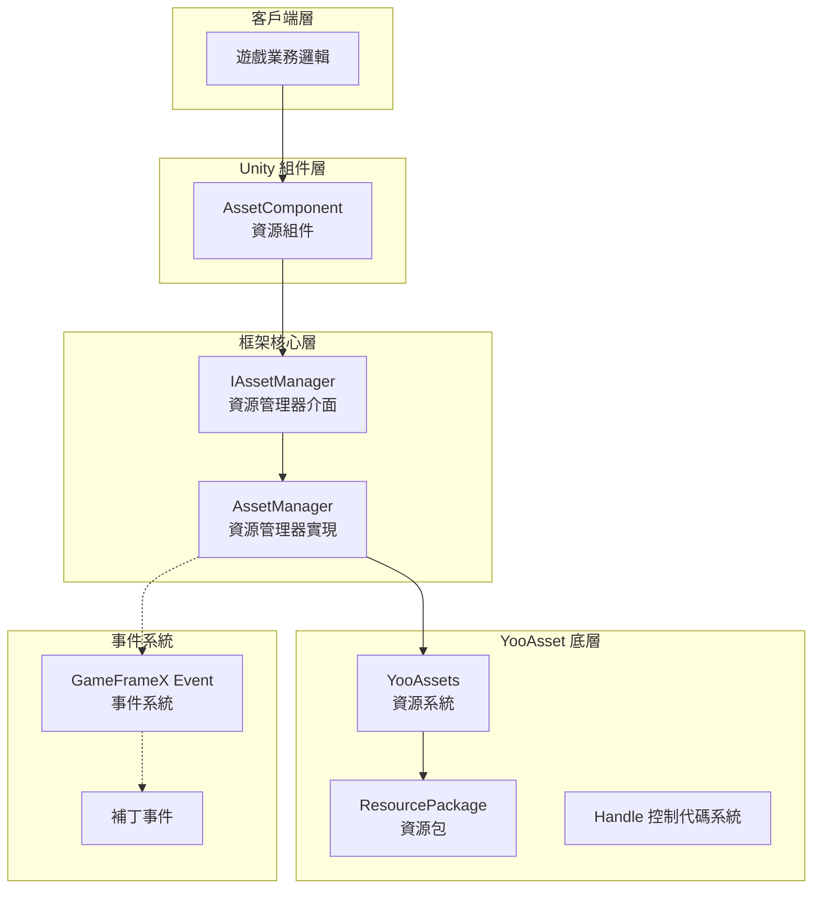
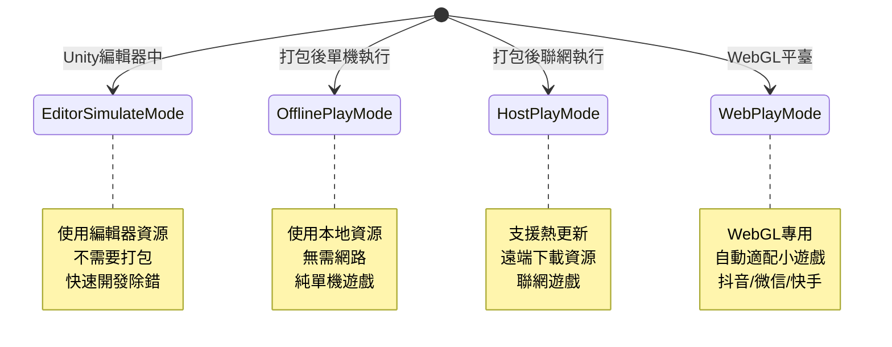
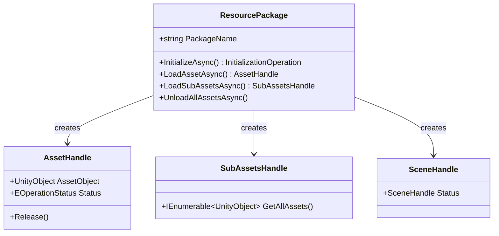
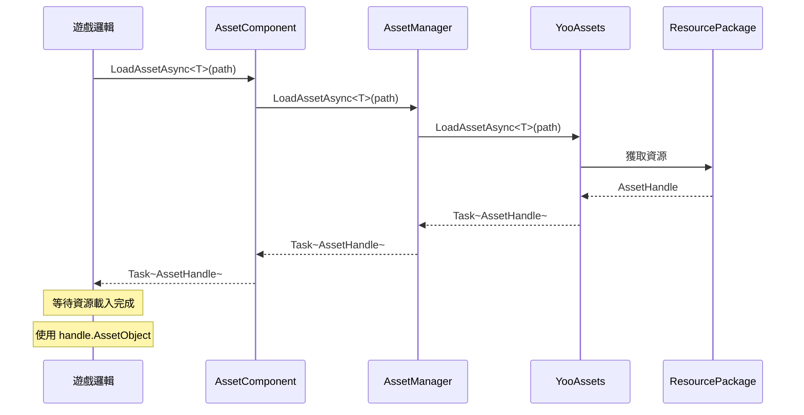

# 架構設計

本文件詳細介紹 GameFrameX Asset 資源組件的整體架構設計，包括核心組件、模組職責、互動關係以及設計決策。

## 概述

GameFrameX Asset 資源組件是 GameFrameX 框架的核心模組之一，基於業界成熟的 **YooAsset** 資源管理系統構建。該組件透過封裝 YooAsset 的底層 API，為 Unity 遊戲應用提供了一套**統一、簡潔、易用**的資源管理解決方案。

**設計目標：**
- 簡化資源載入和解除安裝的複雜度
- 提供跨平臺一致的 API 介面
- 支援多種執行模式（編輯器模擬、離線、熱更新、WebGL）
- 整合 GameFrameX 事件系統，實現狀態通知
- 支援多資源包管理

## 架構總覽



### 各層職責說明

| 層級 | 組件 | 職責 |
|------|------|------|
| 客戶端層 | 遊戲業務邏輯 | 呼叫資源組件提供的 API 進行資源載入 |
| Unity 組件層 | AssetComponent | 作為 Unity 場景中的組件，提供面向使用者的 API 入口 |
| 框架核心層 | AssetManager | 實現資源管理的核心業務邏輯 |
| YooAsset 底層 | YooAssets | 底層資源系統，處理實際的檔案系統、下載、快取等 |
| 事件系統 | EventSystem | 提供補丁流程狀態通知、下載進度等事件 |

## 核心組件

### 1. AssetComponent（資源組件）

`AssetComponent` 是 Unity 遊戲場景中的核心組件，繼承自 `GameFrameworkComponent`。它作為資源系統的統一入口，為遊戲邏輯層提供資源訪問介面。

**主要職責：**
- 作為 Unity 組件掛載在場景中
- 配置執行模式（PlayMode）
- 管理資源包的初始化
- 代理轉發資源載入請求到 AssetManager
- 處理平臺差異（WebGL 自動切換模式）

> Source: [AssetComponent.cs](https://github.com/GameFrameX/com.gameframex.unity.asset/blob/main/Runtime/Asset/AssetComponent.cs#L18-L70)

```csharp
[DisallowMultipleComponent]
[AddComponentMenu("GameFrameX/Asset")]
public sealed class AssetComponent : GameFrameworkComponent
{
    [Tooltip("當目標平臺為Web平臺時，將會強制設定為WebPlayMode")]
    [SerializeField]
    private EPlayMode m_GamePlayMode;
    
    private IAssetManager _assetManager;
    
    protected override void Awake()
    {
        // 非編輯器環境下，自動調整執行模式
#if !UNITY_EDITOR
        if (GamePlayMode == EPlayMode.EditorSimulateMode)
        {
            GamePlayMode = EPlayMode.HostPlayMode;
        }
#if UNITY_WEBGL
        GamePlayMode = EPlayMode.WebPlayMode;
#endif
#endif
        base.Awake();
        _assetManager = GameFrameworkEntry.GetModule<IAssetManager>();
        _assetManager.SetPlayMode(GamePlayMode);
    }
}
```

**設計意圖：**
- 使用 `[DisallowMultipleComponent]` 限制場景中只能有一個 AssetComponent，保證資源管理的唯一性
- 在 `Awake` 中處理平臺差異，確保在非編輯器環境下使用正確的執行模式
- 透過依賴注入獲取 IAssetManager 例項，實現解耦

### 2. IAssetManager（資源管理器介面）

`IAssetManager` 介面定義了資源管理的所有操作契約，確保實現的靈活性和可測試性。

> Source: [IAssetManager.cs](https://github.com/GameFrameX/com.gameframex.unity.asset/blob/main/Runtime/Asset/IAssetManager.cs#L1-L519)

**介面分類：**

| 功能分類 | 方法示例 |
|----------|----------|
| 初始化 | `Initialize()`, `InitPackageAsync()` |
| 非同步載入 | `LoadAssetAsync<T>()`, `LoadSceneAsync()` |
| 同步載入 | `LoadAssetSync<T>()`, `LoadSubAssetSync()` |
| 資源包管理 | `CreateAssetsPackage()`, `GetAssetsPackage()` |
| 資源解除安裝 | `UnloadAsset()`, `UnloadUnusedAssetsAsync()` |
| 資源查詢 | `GetAssetInfo()`, `HasAssetPath()`, `IsNeedDownload()` |

### 3. AssetManager（資源管理器實現）

`AssetManager` 是資源管理的核心實現類，繼承自 `GameFrameworkModule` 並實現 `IAssetManager` 介面。它封裝了對 YooAssets 的呼叫，並適配了 GameFrameX 的模組系統。

**主要職責：**
- 管理 YooAssets 初始化
- 處理不同執行模式的配置
- 封裝資源載入/解除安裝操作
- 管理資源包（Package）

> Source: [AssetManager.cs](https://github.com/GameFrameX/com.gameframex.unity.asset/blob/main/Runtime/Asset/AssetManager.cs#L14-L60)

```csharp
[UnityEngine.Scripting.Preserve]
public partial class AssetManager : GameFrameworkModule, IAssetManager
{
    public string DefaultPackageName { get; set; } = ConstDefaultPackageName;
    public int DownloadingMaxNum { get; set; }
    public int FailedTryAgain { get; set; }
    public EFileVerifyLevel VerifyLevel { get; set; }
    public EPlayMode PlayMode { get; private set; }
    
    public void Initialize()
    {
        BetterStreamingAssets.Initialize();
        Log.Info($"資源系統執行模式：{PlayMode}");
        YooAssets.Initialize();
        YooAssets.SetOperationSystemMaxTimeSlice(30);
    }
}
```

## 執行模式

Asset 組件支援四種執行模式，透過 `EPlayMode` 列舉定義：



### 模式選擇邏輯

> Source: [AssetManager.Initialization.cs](https://github.com/GameFrameX/com.gameframex.unity.asset/blob/main/Runtime/Asset/AssetManager.Initialization.cs#L18-L47)

```csharp
private InitializationOperation CreateInitializationOperationHandler(ResourcePackage resourcePackage, string hostServerURL, string fallbackHostServerURL)
{
    switch (PlayMode)
    {
        case EPlayMode.EditorSimulateMode:
            return InitializeYooAssetEditorSimulateMode(resourcePackage);
        case EPlayMode.OfflinePlayMode:
            return InitializeYooAssetOfflinePlayMode(resourcePackage);
        case EPlayMode.HostPlayMode:
            return InitializeYooAssetHostPlayMode(resourcePackage, hostServerURL, fallbackHostServerURL);
        case EPlayMode.WebPlayMode:
            return InitializeYooAssetWebPlayMode(resourcePackage, hostServerURL, fallbackHostServerURL);
        default:
            return null;
    }
}
```

### 模式初始化詳情

| 模式 | 初始化方法 | 適用場景 |
|------|------------|----------|
| EditorSimulateMode | `InitializeYooAssetEditorSimulateMode()` | 編輯器開發除錯，不打包 |
| OfflinePlayMode | `InitializeYooAssetOfflinePlayMode()` | 單機遊戲，無需熱更新 |
| HostPlayMode | `InitializeYooAssetHostPlayMode()` | 需要熱更新的聯網遊戲 |
| WebPlayMode | `InitializeYooAssetWebPlayMode()` | WebGL/小遊戲平臺 |

## 資源包系統

Asset 組件採用**資源包（ResourcePackage）**機制管理不同型別的資源。



### 資源包操作

```csharp
// 建立資源包
ResourcePackage package = assetComponent.CreateAssetsPackage("MyPackage");

// 獲取資源包
ResourcePackage pkg = assetComponent.TryGetAssetsPackage("MyPackage");

// 設定預設資源包
assetComponent.SetDefaultAssetsPackage(pkg);

// 檢查資源包是否存在
if (assetComponent.HasAssetsPackage("MyPackage"))
{
    // 使用資源包
}
```

> Source: [AssetManager.cs](https://github.com/GameFrameX/com.gameframex.unity.asset/blob/main/Runtime/Asset/AssetManager.cs#L646-L692)

## 事件系統

Asset 組件整合了 GameFrameX 的事件系統，用於通知資源載入進度和狀態變更。

### 補丁狀態變更

> Source: [EPatchStates.cs](https://github.com/GameFrameX/com.gameframex.unity.asset/blob/main/Runtime/Update/EPatchStates.cs#L1-L33)

```csharp
public enum EPatchStates
{
    /// <summary>更新靜態的資源版本</summary>
    UpdateStaticVersion,
    /// <summary>更新補丁清單</summary>
    UpdateManifest,
    /// <summary>建立下載器</summary>
    CreateDownloader,
    /// <summary>下載遠端檔案</summary>
    DownloadWebFiles,
    /// <summary>補丁流程完畢</summary>
    PatchDone,
}
```

### 事件型別

| 事件類 | 用途 |
|--------|------|
| AssetPatchStatesChangeEventArgs | 補丁流程狀態變更 |
| AssetDownloadProgressUpdateEventArgs | 下載進度更新 |
| AssetFoundUpdateFilesEventArgs | 發現需要更新的檔案 |
| AssetPatchManifestUpdateFailedEventArgs | 補丁清單更新失敗 |
| AssetWebFileDownloadFailedEventArgs | 資原始檔下載失敗 |

> Source: [AssetPatchStatesChangeEventArgs.cs](https://github.com/GameFrameX/com.gameframex.unity.asset/blob/main/Runtime/Update/EventArgs/AssetPatchStatesChangeEventArgs.cs#L1-L49)

## 資源載入流程

### 非同步資源載入



### 資源解除安裝流程

```mermaid
flowchart LR
    A[呼叫 UnloadAsset] --> B{指定資源包?}
    B -->|是| C[UnloadAsset(packageName, assetPath)]
    B -->|否| D[UnloadAsset(assetPath)]
    C --> E[獲取目標資源包]
    D --> E
    E --> F[呼叫 Package.TryUnloadUnusedAsset]
    F --> G[YooAsset 釋放資源]
    
    G --> H{呼叫 UnloadUnusedAssetsAsync?}
    H -->|是| I[釋放未使用資源]
    H -->|否| J[結束]
```

## 配置選項

Asset 組件提供以下可配置項：

| 配置項 | 型別 | 預設值 | 說明 |
|--------|------|--------|------|
| GamePlayMode | EPlayMode | EditorSimulateMode | 資源執行模式 |
| DefaultPackageName | string | "DefaultPackage" | 預設資源包名稱 |
| DownloadingMaxNum | int | - | 最大併發下載數量 |
| FailedTryAgain | int | - | 下載失敗重試次數 |
| VerifyLevel | EFileVerifyLevel | - | 檔案驗證等級 |
| Milliseconds | long | - | 非同步系統每幀最大執行時間(毫秒) |

> Source: [AssetComponent.cs](https://github.com/GameFrameX/com.gameframex.unity.asset/blob/main/Runtime/Asset/AssetComponent.cs#L20-L36)

## 設計決策說明

### 1. 為什麼使用 YooAsset？

選擇 YooAsset 作為底層資源系統的原因：
- **功能完善**：支援資源打包、依賴分析、熱更新、快取管理等完整功能
- **效能最佳化**：提供控制代碼機制、引用計數、資源釋放最佳化
- **跨平臺**：支援 Unity 所有主流平臺
- **社群活躍**：持續維護更新

### 2. 為什麼採用介面分離？

透過 `IAssetManager` 介面定義清晰的操作契約：
- 便於單元測試（可以 mock 實現）
- 提供擴充套件點，允許替換底層實現
- API 文件更清晰

### 3. 為什麼區分同步/非同步載入？

- **非同步載入**：適合大規模資源載入，避免阻塞主執行緒
- **同步載入**：適合小資源或特定效能敏感場景
- 使用者可以根據場景需求選擇合適的載入方式

### 4. 為什麼需要資源包？

多資源包設計支援：
- 按功能模組劃分資源（UI、DLC、配置）
- 動態載入/解除安裝特定模組
- 資源按需下載，節省頻寬

## 相關連結

- [資源組件](./4-core-concepts.asset-component) - AssetComponent 詳細 API
- [資源管理器](./4-core-concepts.asset-manager) - AssetManager 實現細節
- [資源載入介面](./5-api-reference.loading-api) - 完整載入 API 參考
- [資源包管理](./5-api-reference.package-management) - 資源包操作 API
- [執行模式](./6-configuration.play-modes) - 各種執行模式配置
- [組件配置](./6-configuration.component-settings) - 組件配置選項
