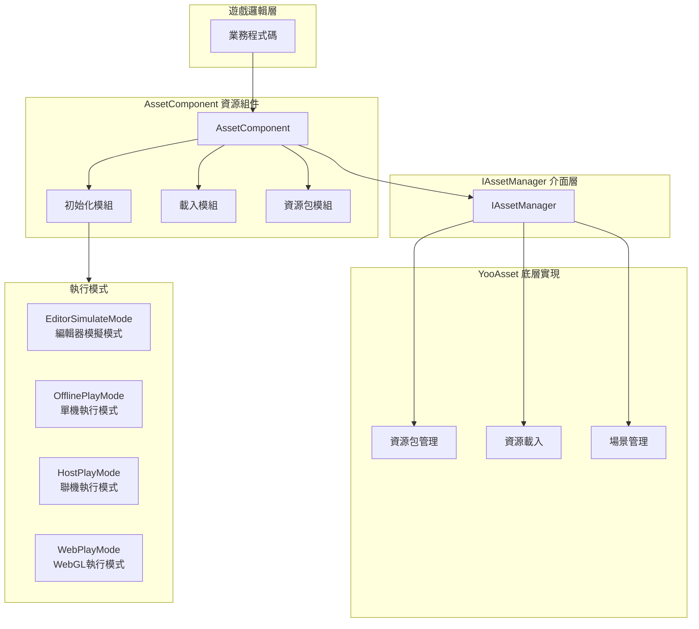
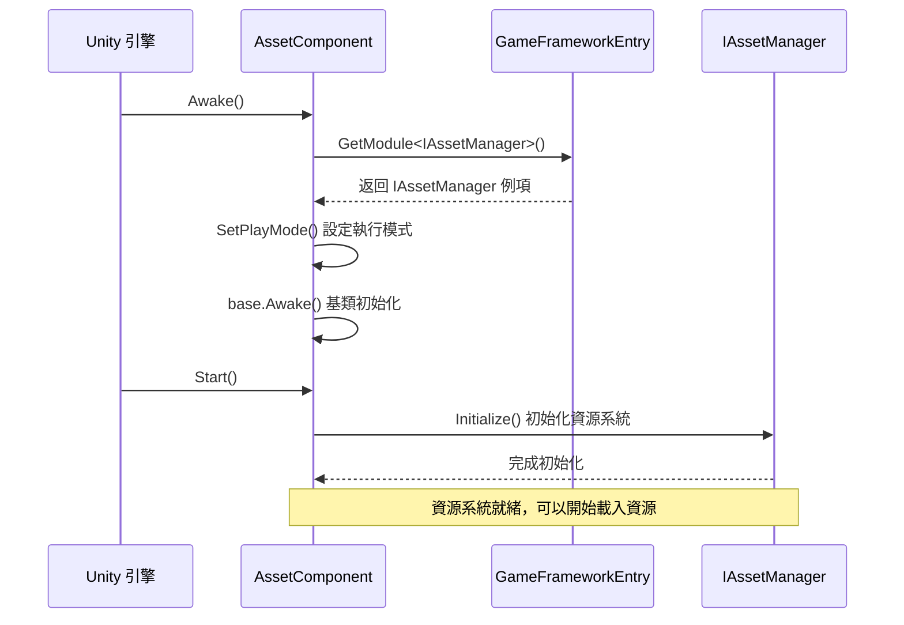
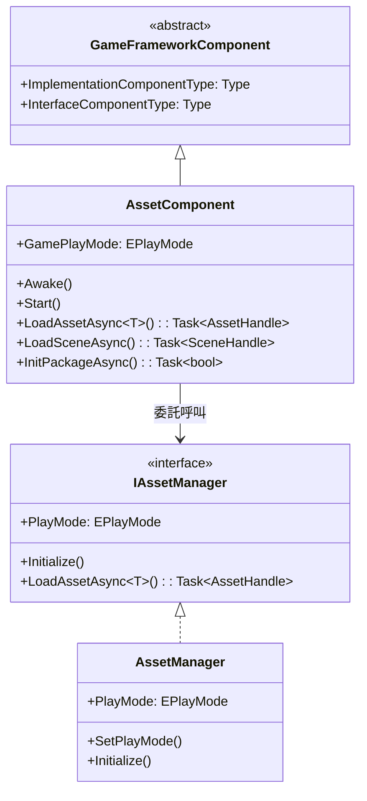

# 資源組件

資源組件（AssetComponent）是 GameFrameX 資源系統的核心入口，提供統一的資源載入、解除安裝和管理功能。該組件封裝了 YooAsset 底層實現，為遊戲專案提供簡潔高效的資源管理 API。

## 概述

AssetComponent 是一個 Unity 組件（MonoBehaviour），繼承自 GameFrameworkComponent。作為資源系統的門面（Facade），它簡化了資源操作的複雜性，提供了同步/非同步載入、場景管理、資源包管理等功能。

**設計目的**：
- 提供統一的資源訪問介面，隱藏底層實現細節
- 支援多種執行模式，適應不同的開發和部署場景
- 實現資源的懶載入和自動釋放，最佳化記憶體使用
- 支援熱更新資源管理，適用於聯機遊戲

## 架構設計



**架構說明**：
- **遊戲邏輯層**：業務程式碼透過 AssetComponent 訪問資源系統
- **AssetComponent 層**：提供組件化的資源介面，包括初始化、載入、資源包管理模組
- **IAssetManager 介面層**：定義資源管理的抽象介面，實現關注點分離
- **YooAsset 層**：基於 YooAsset 庫的實際資源管理實現
- **執行模式**：支援四種不同的資源執行模式，適應各種開發部署場景

## 核心功能

### 1. 執行模式支援

AssetComponent 支援四種執行模式，透過 `GamePlayMode` 屬性配置：

| 模式 | 說明 | 適用場景 |
|------|------|----------|
| EditorSimulateMode | 編輯器模擬模式 | 開發階段，無需打包即可測試資源 |
| OfflinePlayMode | 單機執行模式 | 純本地資源，不涉及網路更新 |
| HostPlayMode | 聯機執行模式 | 需要熱更新的正式釋出版本 |
| WebPlayMode | WebGL 執行模式 | Web 平臺釋出，支援小遊戲平臺 |

**平臺自動適配**：

```csharp
// AssetComponent.cs - 執行時自動調整執行模式
#if !UNITY_EDITOR
    if (GamePlayMode == EPlayMode.EditorSimulateMode)
    {
        GamePlayMode = EPlayMode.HostPlayMode;
    }
#if UNITY_WEBGL
    GamePlayMode = EPlayMode.WebPlayMode;
#endif
#endif
```
> Source: [AssetComponent.cs](https://github.com/GameFrameX/com.gameframex.unity.asset/blob/main/Runtime/Asset/AssetComponent.cs#L44-L52)

### 2. 資源載入

AssetComponent 提供豐富的資源載入介面，支援同步和非同步兩種方式：

```csharp
// 非同步載入資源
public async Task<AssetHandle> LoadAssetAsync<T>(string path) where T : Object

// 同步載入資源
public AssetHandle LoadAssetSync<T>(string path) where T : Object

// 非同步載入子資源（如 SpriteAtlas 中的 Sprite）
public Task<SubAssetsHandle> LoadSubAssetsAsync<T>(string path) where T : Object

// 非同步載入所有資源
public Task<AllAssetsHandle> LoadAllAssetsAsync<T>(string path) where T : Object
```
> Source: [AssetComponent.cs](https://github.com/GameFrameX/com.gameframex.unity.asset/blob/main/Runtime/Asset/AssetComponent.cs#L257-L305)

### 3. 場景載入

支援非同步載入 Unity 場景：

```csharp
// 非同步載入場景
public Task<SceneHandle> LoadSceneAsync(string path, LoadSceneMode sceneMode, bool activateOnLoad = true)
```
> Source: [AssetComponent.cs](https://github.com/GameFrameX/com.gameframex.unity.asset/blob/main/Runtime/Asset/AssetComponent.cs#L443-L459)

### 4. 資源包管理

支援多資源包管理，可以建立、獲取、設定預設資源包：

```csharp
// 建立資源包
public ResourcePackage CreateAssetsPackage(string packageName)

// 嘗試獲取資源包（不存在返回 null）
public ResourcePackage TryGetAssetsPackage(string packageName)

// 檢查資源包是否存在
public bool HasAssetsPackage(string packageName)

// 設定預設資源包
public void SetDefaultAssetsPackage(ResourcePackage assetsPackage)
```
> Source: [AssetComponent.cs](https://github.com/GameFrameX/com.gameframex.unity.asset/blob/main/Runtime/Asset/AssetComponent.cs#L471-L584)

### 5. 資源解除安裝與清理

提供多種資源釋放策略：

```csharp
// 解除安裝指定資源
public void UnloadAsset(string assetPath)

// 解除安裝資源控制代碼
public void UnloadAssetHandle(object assetHandle)

// 解除安裝無用資源
public void UnloadUnusedAssetsAsync(string packageName = null)

// 清理無用資源包檔案
public void ClearUnusedBundleFilesAsync(string packageName = null)

// 強制回收所有資源
public void UnloadAllAssetsAsync(string packageName)

// 清理所有資源包檔案
public void ClearAllBundleFilesAsync(string packageName = null)
```
> Source: [AssetComponent.cs](https://github.com/GameFrameX/com.gameframex.unity.asset/blob/main/Runtime/Asset/AssetComponent.cs#L602-L658)

## 核心流程

### 組件初始化流程



### 資源載入流程

```mermaid
sequenceDiagram
    participant Client as 業務程式碼
    participant AC as AssetComponent
    participant IAM as IAssetManager
    package as YooAsset ResourcePackage

    Client->>AC: LoadAssetAsync<T>(path)
    AC->>IAM: LoadAssetAsync<T>(path)
    IAM->>package: LoadAssetAsync(path)
    
    rect rgb(240, 248, 255)
        Note right of package: 資源載入階段
    end
    
    package-->>IAM: AssetHandle
    IAM-->>AC: AssetHandle
    AC-->>Client: Task<AssetHandle>
    
    Client->>Client: await Task
    Note over Client: 獲取資源物件
    
    Client->>AC: UnloadAssetHandle(handle)
    AC->>IAM: handle.Release()
    Note over package: 資源已釋放
```

## 使用示例

### 基礎用法：非同步載入資源

```csharp
using UnityEngine;
using GameFrameX.Asset.Runtime;
using YooAssets;

public class Example : MonoBehaviour
{
    private async void Start()
    {
        var assetComponent = GameEntry.GetComponent<AssetComponent>();
        
        // 非同步載入 Prefab
        var handle = await assetComponent.LoadAssetAsync<GameObject>("Prefabs/Player");
        var prefab = handle.LoadAsset();
        
        // 例項化物件
        Instantiate(prefab);
        
        // 載入完成後釋放資源控制代碼
        handle.Release();
    }
}
```
> Source: [AssetComponent.cs](https://github.com/GameFrameX/com.gameframex.unity.asset/blob/main/Runtime/Asset/AssetComponent.cs#L257-L261)

### 進階用法：資源包初始化與多資源包管理

```csharp
using UnityEngine;
using GameFrameX.Asset.Runtime;

public class MultiPackageExample : MonoBehaviour
{
    private async void Start()
    {
        var assetComponent = GameEntry.GetComponent<AssetComponent>();
        
        // 初始化預設資源包
        await assetComponent.InitPackageAsync(
            "DefaultPackage",           // 包名稱
            "https://cdn.example.com/", // 主下載地址
            "https://backup.example.com/", // 備用地址
            true                        // 是否預設包
        );
        
        // 建立額外的資源包
        var uiPackage = assetComponent.CreateAssetsPackage("UIPackage");
        var configPackage = assetComponent.CreateAssetsPackage("ConfigPackage");
        
        // 設定預設資源包
        assetComponent.SetDefaultAssetsPackage(uiPackage);
    }
}
```
> Source: [AssetComponent.cs](https://github.com/GameFrameX/com.gameframex.unity.asset/blob/main/Runtime/Asset/AssetComponent.cs#L80-L95)

### 高階用法：檢查資源狀態與條件載入

```csharp
using UnityEngine;
using GameFrameX.Asset.Runtime;

public class ResourceCheckExample : MonoBehaviour
{
    private async void LoadResourceWithCheck()
    {
        var assetComponent = GameEntry.GetComponent<AssetComponent>();
        
        string resourcePath = "Prefabs/HeavyModel";
        
        // 檢查資源是否需要下載
        if (assetComponent.IsNeedDownload(resourcePath))
        {
            Debug.Log("資源需要下載，顯示下載介面...");
            // 這裡可以新增下載進度 UI
        }
        
        // 獲取資源資訊
        var assetInfo = assetComponent.GetAssetInfo(resourcePath);
        if (assetInfo != null)
        {
            Debug.Log($"資源路徑: {assetInfo.AssetPath}");
        }
        
        // 檢查資源路徑是否存在
        if (assetComponent.HasAssetPath(resourcePath))
        {
            var handle = await assetComponent.LoadAssetAsync<GameObject>(resourcePath);
            // 處理資源
            handle.Release();
        }
    }
}
```
> Source: [AssetComponent.cs](https://github.com/GameFrameX/com.gameframex.unity.asset/blob/main/Runtime/Asset/AssetComponent.cs#L517-L573)

## 配置說明

### 在 Unity 編輯器中配置

在 Unity 場景中建立 GameObject，並新增 **AssetComponent** 組件：

1. 在 Inspector 面板中配置 **資源執行模式**（GamePlayMode）
2. 根據選擇的模式配置相應的引數

```csharp
// AssetComponentInspector.cs - 編輯器配置介面
[CustomEditor(typeof(AssetComponent))]
internal sealed class AssetComponentInspector : ComponentTypeComponentInspector
{
    public override void OnInspectorGUI()
    {
        // 執行模式下禁用編輯
        EditorGUI.BeginDisabledGroup(EditorApplication.isPlayingOrWillChangePlaymode);
        {
            EditorGUILayout.PropertyField(m_GamePlayMode, m_GamePlayModeGUIContent);
        }
    }
}
```
> Source: [AssetComponentInspector.cs](https://github.com/GameFrameX/com.gameframex.unity.asset/blob/main/Editor/Inspector/AssetComponentInspector.cs#L48-L66)

### 組件屬性

| 屬性 | 型別 | 說明 |
|------|------|------|
| GamePlayMode | EPlayMode | 資源執行模式，決定資源載入方式 |
| ImplementationComponentType | Type | IAssetManager 的實現型別 |
| InterfaceComponentType | Type | 組件對應的介面型別 |

## 與資源管理器的關係

AssetComponent 是面向 Unity 組件系統的門面類，而 IAssetManager/AssetManager 提供了純業務邏輯層面的資源管理能力：



**職責劃分**：
- **AssetComponent**：作為 Unity 組件，處理生命週期（Awake/Start），提供 Unity 友好的 API
- **IAssetManager**：定義資源管理的介面契約，與 Unity 生命週期解耦
- **AssetManager**：介面的具體實現，處理 YooAsset 的底層呼叫

## 相關連結

- [資源管理器](./4-core-concepts.asset-manager) - 瞭解更多資源管理的底層實現
- [執行模式](./6-configuration.play-modes) - 瞭解四種執行模式的詳細配置
- [資源載入 API](./5-api-reference.loading-api) - 完整的資源載入介面文件
- [資源包管理](./5-api-reference.package-management) - 資源包管理的詳細說明
- [安裝指南](./2-installation.index) - 如何安裝和配置資源組件
- [快速入門](./3-getting-started.index) - 快速開始使用資源組件
