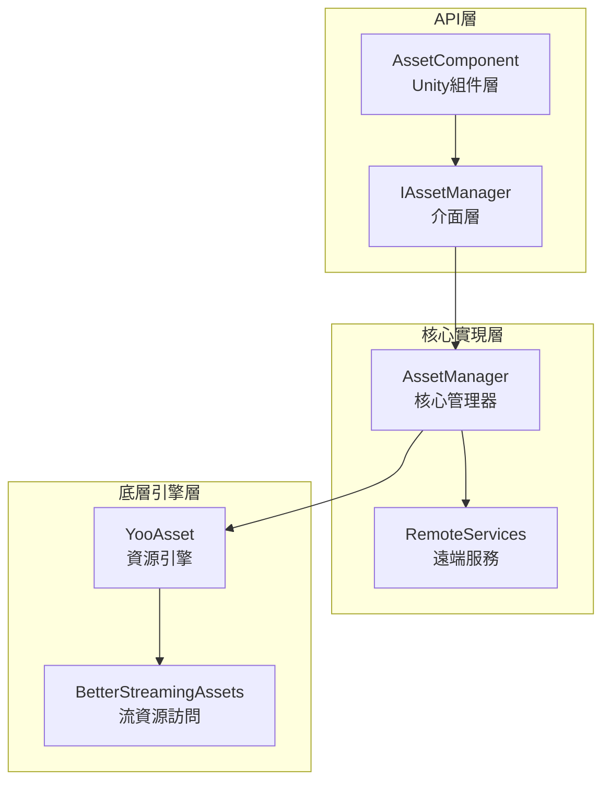
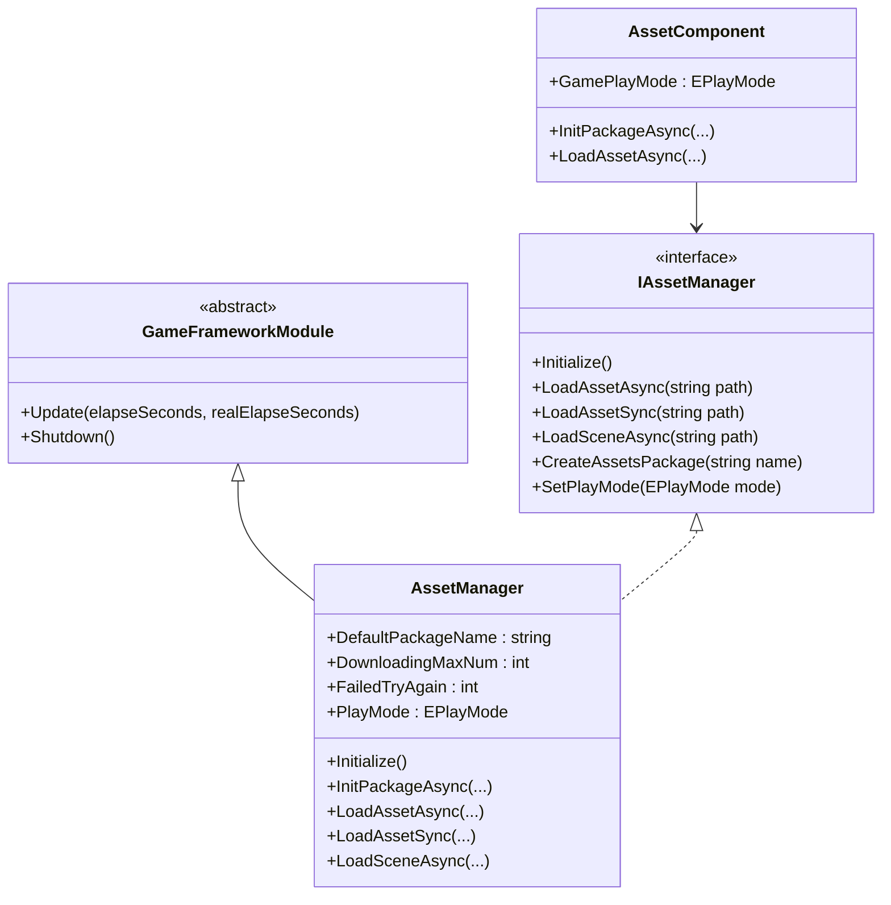
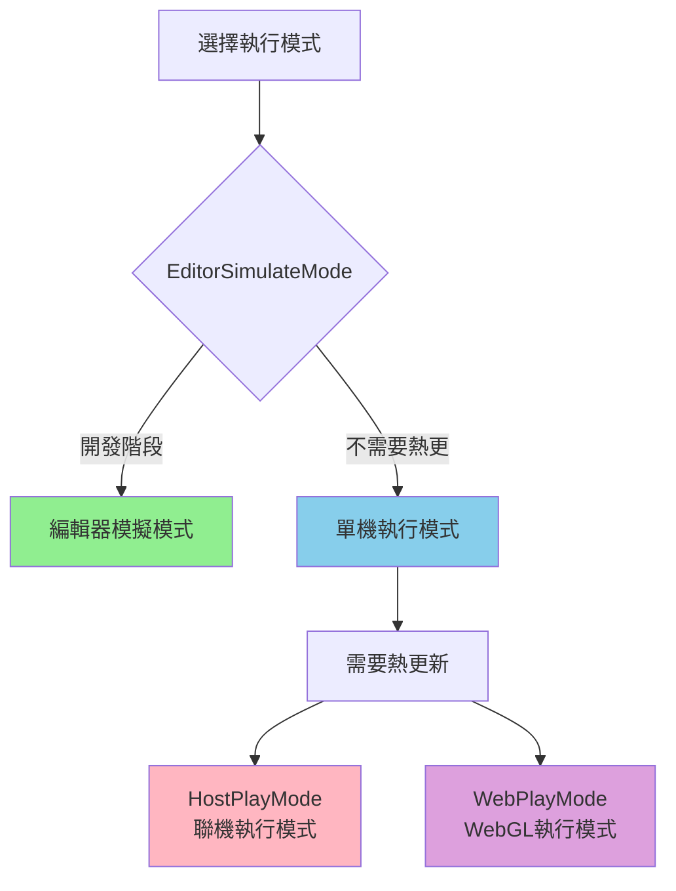
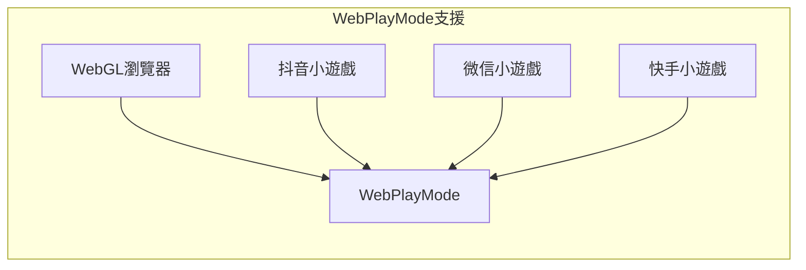

# 資源管理器

資源管理器（Asset Manager）是 GameFrameX 資產系統的核心組件，負責統一管理遊戲資源的載入、解除安裝、熱更新和資源包管理。該組件基於 YooAsset 庫構建，提供了簡潔易用的 API 介面，支援多種執行模式和平臺。

## 概述

資源管理器作為遊戲框架的核心模組，承擔著遊戲執行時資源管理的關鍵職責。在現代遊戲開發中，資源的有效管理直接影響著遊戲的效能、載入速度和使用者體驗。資源管理器透過統一封裝 YooAsset 的功能，為開發者提供了一套完整的資源管理解決方案。

該組件支援以下核心功能：

- **同步/非同步資源載入**：提供同步和非同步兩種載入方式，滿足不同場景需求
- **多資源包管理**：支援建立和管理多個獨立的資源包
- **場景載入**：支援非同步場景載入和切換
- **熱更新支援**：在 HostPlayMode 和 WebPlayMode 下支援資源熱更新
- **資源清理**：提供多種資源釋放策略，最佳化記憶體使用

資源管理器的設計理念是將複雜的底層資源管理邏輯封裝起來，開發者只需關注業務層面的資源使用，無需關心資源如何從磁碟或網路載入、如何進行版本管理等問題。

## 架構設計

資源管理器的架構採用了分層設計模式，從上到下分為三個主要層次：



### 組件說明

**API 層**負責與 Unity 引擎和業務程式碼的互動。`AssetComponent` 是掛載在 GameObject 上的 Unity 組件，提供了 Inspector 面板配置和組件生命週期管理。`IAssetManager` 介面定義了資源管理的所有操作契約，確保了程式碼的可測試性和可替換性。

**核心實現層**實現了資源管理的核心邏輯。`AssetManager` 繼承自 `GameFrameworkModule`，是整個資源系統的核心。它封裝了 YooAsset 的所有功能，並新增了更適合遊戲開發的功能。`RemoteServices` 是內部類，負責解析熱更新資源的遠端 URL。

**底層引擎層**是實際的資源操作實現。YooAsset 是業界優秀的 Unity 資源管理解決方案，提供了強大的資源打包、載入和熱更新能力。BetterStreamingAssets 提供了對 StreamingAssets 目錄的高效訪問。

### 核心類圖



## 核心功能

### 資源載入

資源管理器提供了豐富的資源載入介面，支援同步和非同步兩種載入模式。同步載入適用於對載入時間要求不高、且在主執行緒中執行的場景；非同步載入則適用於需要保持幀率穩定的大型資源載入場景。

#### 非同步載入資源

非同步載入是遊戲開發中最常用的資源載入方式，它不會阻塞主執行緒，可以保持遊戲的流暢執行。資源管理器提供了多種非同步載入介面：

```csharp
// 透過路徑非同步載入資源
var handle = await assetComponent.LoadAssetAsync<GameObject>("Prefabs/Player");

// 獲取載入完成的資源物件
var playerPrefab = handle.AssetObject as GameObject;
if (playerPrefab != null)
{
    Instantiate(playerPrefab);
}

// 載入完成後釋放控制代碼
handle.Release();
```

> Source: [AssetManager.cs](https://github.com/GameFrameX/com.gameframex.unity.asset/blob/main/Runtime/Asset/AssetManager.cs#L454-L480)

非同步載入返回一個 Handle 物件，透過該物件可以獲取載入的資源、監控載入進度、以及在適當時機釋放資源。開發者應當注意，在資源不再需要時及時釋放 Handle，避免記憶體洩漏。

#### 同步載入資源

對於某些必須在當前幀獲取資源的場景，可以使用同步載入介面：

```csharp
// 同步載入資源
var handle = assetComponent.LoadAssetSync<GameObject>("Prefabs/Enemy");
var enemyPrefab = handle.AssetObject as GameObject;
handle.Release();
```

> Source: [AssetManager.cs](https://github.com/GameFrameX/com.gameframex.unity.asset/blob/main/Runtime/Asset/AssetManager.cs#L603-L606)

同步載入會阻塞呼叫執行緒，在資源未載入完成前不會返回。因此，同步載入不適用於大型資源的載入，一般僅用於配置資料等小規模資源的載入。

#### 載入子資源

某些資源包含多個子資源，例如一個 prefab 中引用的材質或紋理。資源管理器提供了專門的子資源載入介面：

```csharp
// 非同步載入子資源
var handle = await assetComponent.LoadSubAssetsAsync<Sprite>("Atlas/GameUI");
foreach (var subAsset in handle.SubAssets)
{
    var sprite = subAsset.AssetObject as Sprite;
    // 處理sprite...
}
handle.Release();
```

> Source: [AssetManager.cs](https://github.com/GameFrameX/com.gameframex.unity.asset/blob/main/Runtime/Asset/AssetManager.cs#L244-L250)

### 資源包管理

資源包（Resource Package）是資源管理的基本單元，每個資源包可以獨立進行打包、版本管理和熱更新。資源管理器支援同時管理多個資源包。

#### 建立資源包

```csharp
// 建立新的資源包
var package = assetComponent.CreateAssetsPackage("DLC_Package");
assetComponent.SetDefaultAssetsPackage(package);
```

> Source: [AssetManager.cs](https://github.com/GameFrameX/com.gameframex.unity.asset/blob/main/Runtime/Asset/AssetManager.cs#L654-L657)

#### 獲取資源包

```csharp
// 獲取已存在的資源包
var package = assetComponent.TryGetAssetsPackage("DLC_Package");
if (package != null)
{
    // 使用資源包...
}
```

> Source: [AssetManager.cs](https://github.com/GameFrameX/com.gameframex.unity.asset/blob/main/Runtime/Asset/AssetManager.cs#L665-L668)

### 場景管理

資源管理器支援非同步載入 Unity 場景，這在大型遊戲的關卡切換中尤為重要：

```csharp
// 非同步載入場景
var handle = await assetComponent.LoadSceneAsync(
    "Scenes/Level1", 
    LoadSceneMode.Single, 
    true
);
```

> Source: [AssetManager.cs](https://github.com/GameFrameX/com.gameframex.unity.asset/blob/main/Runtime/Asset/AssetManager.cs#L620-L626)

第三個引數控制是否在載入完成後自動啟用場景。如果需要在載入過程中顯示 Loading 介面，可以先將引數設為 false，待 Loading 完成後手動啟用。

### 資源清理

合理管理資源記憶體是遊戲效能最佳化的重要環節。資源管理器提供了多種資源釋放介面：

```csharp
// 解除安裝指定資源
assetComponent.UnloadAsset("Prefabs/Player");

// 解除安裝無用資源
assetComponent.UnloadUnusedAssetsAsync();

// 清理未使用的Bundle檔案
assetComponent.ClearUnusedBundleFilesAsync();

// 強制回收所有資源
assetComponent.UnloadAllAssetsAsync();
```

> Source: [AssetManager.cs](https://github.com/GameFrameX/com.gameframex.unity.asset/blob/main/Runtime/Asset/AssetManager.cs#L591-L658)

這些介面的使用場景各不相同：UnloadAsset 用於解除安裝特定資源；UnloadUnusedAssetsAsync 解除安裝當前未被引用的資源；ClearUnusedBundleFilesAsync 清理未使用的 Bundle 檔案以釋放磁碟空間；UnloadAllAssetsAsync 則會強制解除安裝資源包內的所有資源。

## 執行模式

資源管理器支援四種執行模式，每種模式適用於不同的開發和部署場景：



### 編輯器模擬模式

編輯器模擬模式（EditorSimulateMode）是開發階段最常用的模式。在這種模式下，資源直接從 Unity 編輯器的源資原始檔夾中載入，無需進行資源打包。這大大加速了開發迭代速度，修改資源後可以立即看到效果。

```csharp
// 設定執行模式
assetComponent.GamePlayMode = EPlayMode.EditorSimulateMode;
```

> Source: [AssetManager.Initialization.cs](https://github.com/GameFrameX/com.gameframex.unity.asset/blob/main/Runtime/Asset/AssetManager.Initialization.cs#L55-L61)

**特點：**
- 無需打包，修改資源即時生效
- 不支援熱更新功能
- 僅在編輯器環境下可用

### 單機執行模式

單機執行模式（OfflinePlayMode）適用於不需要熱更新的單機遊戲或獨立應用。在這種模式下，所有資源都從本地儲存中載入。

```csharp
// 設定執行模式
assetComponent.GamePlayMode = EPlayMode.OfflinePlayMode;
```

> Source: [AssetManager.Initialization.cs](https://github.com/GameFrameX/com.gameframex.unity.asset/blob/main/Runtime/Asset/AssetManager.Initialization.cs#L69-L75)

**特點：**
- 所有資源從本地載入
- 無網路請求，效能穩定
- 適用於單機遊戲或釋出版本

### 聯機執行模式

聯機執行模式（HostPlayMode）是最常用的生產模式，支援完整的熱更新功能。在這種模式下，資源分為內建資源和遠端資源兩部分，內建資源隨應用一起釋出，遠端資源從伺服器動態下載。

```csharp
// 設定執行模式
assetComponent.GamePlayMode = EPlayMode.HostPlayMode;

// 初始化資源包（非同步）
await assetComponent.InitPackageAsync(
    "DefaultPackage",           // 包名稱
    "http://192.168.1.100:8000", // 主伺服器地址
    "http://backup.example.com"   // 備用伺服器地址
);
```

> Source: [AssetManager.Initialization.cs](https://github.com/GameFrameX/com.gameframex.unity.asset/blob/main/Runtime/Asset/AssetManager.Initialization.cs#L155-L164)

**特點：**
- 支援資源熱更新
- 內建資源 + 遠端資源的混合模式
- 適用於需要頻繁更新內容的遊戲

### WebGL 執行模式

WebGL 執行模式（WebPlayMode）是專門為 WebGL 平臺設計的模式，相容各種小程式遊戲環境：

```csharp
// Web平臺自動使用WebPlayMode
#if UNITY_WEBGL && !UNITY_EDITOR
assetComponent.GamePlayMode = EPlayMode.WebPlayMode;
#endif
```

> Source: [AssetComponent.cs](https://github.com/GameFrameX/com.gameframex.unity.asset/blob/main/Runtime/Asset/AssetComponent.cs#L49-L51)

**支援的平臺：**
- WebGL 瀏覽器
- 抖音小遊戲
- 微信小遊戲
- 快手小遊戲



## 使用示例

### 基礎初始化

在遊戲啟動時，需要正確初始化資源系統：

```csharp
public class GameBootstrap : MonoBehaviour
{
    public AssetComponent assetComponent;
    
    private async void Start()
    {
        // 配置執行模式
        assetComponent.GamePlayMode = EPlayMode.HostPlayMode;
        
        // 初始化預設資源包
        bool success = await assetComponent.InitPackageAsync(
            "DefaultPackage",
            "http://localhost:8080",
            "http://localhost:8081",
            true
        );
        
        if (success)
        {
            Debug.Log("資源系統初始化成功");
            // 開始遊戲邏輯...
        }
    }
}
```

> Source: [AssetComponent.cs](https://github.com/GameFrameX/com.gameframex.unity.asset/blob/main/Runtime/Asset/AssetComponent.cs#L80-L95)

### 資源載入最佳實踐

```csharp
public class ResourceManager
{
    private AssetComponent _assetComponent;
    
    // 使用泛型載入資源，推薦方式
    public async Task<T> LoadAssetAsync<T>(string path) where T : UnityEngine.Object
    {
        var handle = await _assetComponent.LoadAssetAsync<T>(path);
        return handle.AssetObject as T;
    }
    
    // 載入多個同型別資源
    public async Task<T[]> LoadAssetsAsync<T>(string path) where T : UnityEngine.Object
    {
        var handle = await _assetComponent.LoadAllAssetsAsync<T>(path);
        var assets = new List<T>();
        foreach (var asset in handle.AllAssets())
        {
            assets.Add(asset.AssetObject as T);
        }
        handle.Release();
        return assets.ToArray();
    }
    
    // 載入Sprite圖集
    public async Task<Sprite[]> LoadSprites(string atlasPath)
    {
        var handle = await _assetComponent.LoadSubAssetsAsync<Sprite>(atlasPath);
        var sprites = new List<Sprite>();
        foreach (var subAsset in handle.SubAssets)
        {
            sprites.Add(subAsset.AssetObject as Sprite);
        }
        handle.Release();
        return sprites.ToArray();
    }
}
```

### 熱更新檢查

在需要檢查資源是否需要熱更新時：

```csharp
public async Task<bool> CheckAndUpdateResources()
{
    var assetComponent = GameEntry.GetComponent<AssetComponent>();
    
    // 檢查是否需要下載資源
    if (assetComponent.IsNeedDownload("Prefabs/Player"))
    {
        Debug.Log("發現新資源，需要下載...");
        // 實現下載邏輯...
    }
    
    return true;
}
```

> Source: [AssetManager.cs](https://github.com/GameFrameX/com.gameframex.unity.asset/blob/main/Runtime/Asset/AssetManager.cs#L700-L714)

## 配置說明

### AssetComponent 配置

在 Unity 編輯器中，AssetComponent 提供了以下配置選項：

| 配置項 | 型別 | 說明 |
|--------|------|------|
| GamePlayMode | EPlayMode | 資源執行模式 |

> Source: [AssetComponent.cs](https://github.com/GameFrameX/com.gameframex.unity.asset/blob/main/Runtime/Asset/AssetComponent.cs#L18-L31)

### 資源管理器配置

資源管理器提供了多個可配置屬性：

| 屬性 | 型別 | 預設值 | 說明 |
|------|------|--------|------|
| DefaultPackageName | string | "DefaultPackage" | 預設資源包名稱 |
| DownloadingMaxNum | int | - | 同時下載的最大數目 |
| FailedTryAgain | int | - | 失敗重試次數 |
| VerifyLevel | EFileVerifyLevel | - | 下載檔案校驗等級 |
| Milliseconds | long | - | 非同步系統時間切片（毫秒） |

> Source: [AssetManager.cs](https://github.com/GameFrameX/com.gameframex.unity.asset/blob/main/Runtime/Asset/AssetManager.cs#L14-L39)

## API 參考

### 初始化介面

#### `Initialize()`

初始化資源系統。在 Unity 組件的 Start 階段自動呼叫。

```csharp
public void Initialize()
```

> Source: [AssetManager.cs](https://github.com/GameFrameX/com.gameframex.unity.asset/blob/main/Runtime/Asset/AssetManager.cs#L46-L56)

#### `InitPackageAsync`

非同步初始化資源包。

```csharp
public Task<bool> InitPackageAsync(
    string packageName,           // 資源包名稱
    string hostServerURL,         // 主伺服器URL
    string fallbackHostServerURL, // 備用伺服器URL
    bool isDefaultPackage = true  // 是否設為預設包
)
```

> Source: [AssetManager.cs](https://github.com/GameFrameX/com.gameframex.unity.asset/blob/main/Runtime/Asset/AssetManager.cs#L68-L100)

### 資源載入介面

#### `LoadAssetAsync<T>`

非同步載入單個資源。

```csharp
public Task<AssetHandle> LoadAssetAsync<T>(string path) where T : UnityEngine.Object
```

**引數：**
- `path` (string): 資源路徑

**返回：** Task<AssetHandle> - 資源控制代碼

> Source: [AssetManager.cs](https://github.com/GameFrameX/com.gameframex.unity.asset/blob/main/Runtime/Asset/AssetManager.cs#L469-L481)

#### `LoadAssetSync<T>`

同步載入單個資源。

```csharp
public AssetHandle LoadAssetSync<T>(string path) where T : UnityEngine.Object
```

**引數：**
- `path` (string): 資源路徑

**返回：** AssetHandle - 資源控制代碼

> Source: [AssetManager.cs](https://github.com/GameFrameX/com.gameframex.unity.asset/blob/main/Runtime/Asset/AssetManager.cs#L603-L606)

#### `LoadSceneAsync`

非同步載入場景。

```csharp
public Task<SceneHandle> LoadSceneAsync(
    string path,                      // 場景路徑
    LoadSceneMode sceneMode,          // 場景載入模式
    bool activateOnLoad = true        // 載入完成是否自動啟用
)
```

> Source: [AssetManager.cs](https://github.com/GameFrameX/com.gameframex.unity.asset/blob/main/Runtime/Asset/AssetManager.cs#L620-L626)

### 資源包管理介面

#### `CreateAssetsPackage`

建立新的資源包。

```csharp
public ResourcePackage CreateAssetsPackage(string packageName)
```

> Source: [AssetManager.cs](https://github.com/GameFrameX/com.gameframex.unity.asset/blob/main/Runtime/Asset/AssetManager.cs#L654-L657)

#### `GetAssetsPackage`

獲取已存在的資源包。

```csharp
public ResourcePackage GetAssetsPackage(string packageName)
```

> Source: [AssetManager.cs](https://github.com/GameFrameX/com.gameframex.unity.asset/blob/main/Runtime/Asset/AssetManager.cs#L687-L690)

### 資源清理介面

#### `UnloadAsset`

解除安裝指定資源。

```csharp
public void UnloadAsset(string assetPath)
```

> Source: [AssetManager.cs](https://github.com/GameFrameX/com.gameframex.unity.asset/blob/main/Runtime/Asset/AssetManager.cs#L107-L112)

#### `UnloadUnusedAssetsAsync`

非同步解除安裝無用資源。

```csharp
public void UnloadUnusedAssetsAsync(string packageName = null)
```

> Source: [AssetManager.cs](https://github.com/GameFrameX/com.gameframex.unity.asset/blob/main/Runtime/Asset/AssetManager.cs#L153-L165)

#### `ClearUnusedBundleFilesAsync`

清理未使用的 Bundle 檔案。

```csharp
public void ClearUnusedBundleFilesAsync(string packageName = null)
```

> Source: [AssetManager.cs](https://github.com/GameFrameX/com.gameframex.unity.asset/blob/main/Runtime/Asset/AssetManager.cs#L191-L204)

## 相關連結

- [資源組件](./4-core-concepts.asset-component) - Unity 組件層面的資源訪問
- [資源載入介面](./5-api-reference.loading-api) - 詳細 API 參考
- [資源包管理](./5-api-reference.package-management) - 資源包操作指南
- [執行模式](./6-configuration.play-modes) - 各執行模式詳細配置
- [組件配置](./6-configuration.component-settings) - Unity 組件配置說明
- [WebGL 平臺](./7-platforms.webgl) - WebGL 平臺特殊配置
