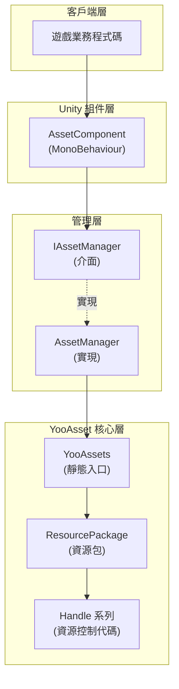
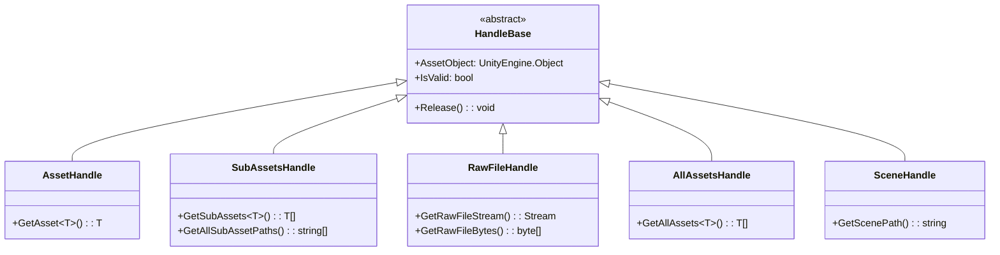
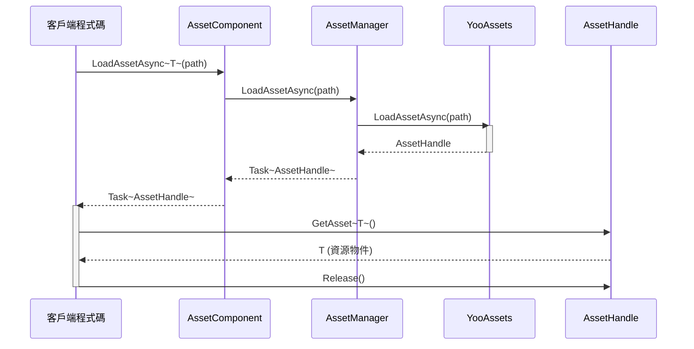

# 資源載入介面

資源載入介面是 GameFrameX Asset 模組的核心 API，提供了一套統一的資源載入和管理方案。該介面基於 YooAsset 庫構建，支援同步/非同步載入、資源包管理、場景載入等多種資源操作。

## 概述

`IAssetManager` 介面定義了資源組件的全部載入功能，涵蓋以下核心能力：

- **多種資源載入方式**：支援同步和非同步兩種載入模式
- **豐富的資源型別**：支援普通資源、子資源、原生檔案、場景等多種型別
- **資源包管理**：支援建立、獲取、切換多個資源包
- **資源生命週期管理**：提供資源解除安裝、清理、回收等完整管理能力

資源載入介面採用 Handle 模式管理資源生命週期，所有載入操作都返回對應的 Handle 物件，透過 Handle 物件可以獲取載入的資源和進行釋放操作。

> Source: [IAssetManager.cs](https://github.com/GameFrameX/com.gameframex.unity.asset/blob/main/Runtime/Asset/IAssetManager.cs#L1-L519)

## 架構設計

資源載入系統採用分層架構設計，核心組件包括：



**架構說明：**

- **客戶端層**：遊戲業務程式碼透過 `AssetComponent` 或 `IAssetManager` 介面呼叫資源功能
- **Unity 組件層**：`AssetComponent` 是掛載在 GameObject 上的 MonoBehaviour 組件，提供組件方式的訪問
- **管理層**：`AssetManager` 實現了 `IAssetManager` 介面，是資源的核心管理器
- **YooAsset 核心層**：實際的資源載入由 YooAsset 完成，返回各種 Handle 物件進行資源管理

### Handle 物件體系

資源載入返回的 Handle 物件是資源管理的核心：



> Handle 型別定義來自 YooAsset 庫，詳情請參考 [YooAsset 官方文件](https://www.yooasset.com/)

## 核心載入 API

### 非同步載入資源

非同步載入是推薦的主要載入方式，不會阻塞主執行緒。

```csharp
/// <summary>
/// 非同步載入資源
/// </summary>
/// <param name="path">資源路徑</param>
/// <typeparam name="T">資源型別</typeparam>
/// <returns>返回一個 Task，包含 AssetHandle 物件</returns>
Task<AssetHandle> LoadAssetAsync<T>(string path) where T : UnityEngine.Object;
```

> Source: [IAssetManager.cs](https://github.com/GameFrameX/com.gameframex.unity.asset/blob/main/Runtime/Asset/IAssetManager.cs#L234)

**使用示例：**

```csharp
// 透過 AssetComponent 非同步載入 Prefab
var handle = await assetComponent.LoadAssetAsync<GameObject>("Prefabs/Player");
GameObject player = handle.GetAsset<GameObject>();
// 使用完畢後釋放資源
handle.Release();
```

> Source: [AssetComponent.cs](https://github.com/GameFrameX/com.gameframex.unity.asset/blob/main/Runtime/Asset/AssetComponent.cs#L258-L261)

### 同步載入資源

同步載入會立即返回資源，但在載入過程中會阻塞主執行緒，應謹慎使用。

```csharp
/// <summary>
/// 同步載入資源
/// </summary>
/// <param name="path">資源路徑</param>
/// <returns>返回 AssetHandle 物件</returns>
AssetHandle LoadAssetSync<T>(string path) where T : UnityEngine.Object;
```

> Source: [IAssetManager.cs](https://github.com/GameFrameX/com.gameframex.unity.asset/blob/main/Runtime/Asset/IAssetManager.cs#L365)

**使用示例：**

```csharp
// 同步載入 Sprite
var handle = assetManager.LoadAssetSync<Sprite>("UI/Sprites/Icon");
Sprite sprite = handle.GetAsset<Sprite>();
handle.Release();
```

> Source: [AssetManager.cs](https://github.com/GameFrameX/com.gameframex.unity.asset/blob/main/Runtime/Asset/AssetManager.cs#L603-L606)

### 載入子資源

子資源載入用於獲取一個資源包內的所有子資源，例如圖集中的所有 Sprite。

```csharp
/// <summary>
/// 非同步載入子資源物件
/// </summary>
/// <param name="path">資源路徑</param>
/// <typeparam name="T">資源型別</typeparam>
Task<SubAssetsHandle> LoadSubAssetsAsync<T>(string path) where T : UnityEngine.Object;
```

> Source: [IAssetManager.cs](https://github.com/GameFrameX/com.gameframex.unity.asset/blob/main/Runtime/Asset/IAssetManager.cs#L134)

**使用示例：**

```csharp
// 載入圖集中的所有 Sprite
var handle = await assetComponent.LoadSubAssetsAsync<Sprite>("Atlas/UI/MainAtlas");
Sprite[] sprites = handle.GetSubAssets<Sprite>();
foreach (var sprite in sprites)
{
    Debug.Log($"Sprite: {sprite.name}");
}
handle.Release();
```

> Source: [AssetComponent.cs](https://github.com/GameFrameX/com.gameframex.unity.asset/blob/main/Runtime/Asset/AssetComponent.cs#L128-L131)

### 載入原生檔案

原生檔案載入用於載入非 Unity 資源型別的原始檔案，如配置檔案、文字檔案等。

```csharp
/// <summary>
/// 非同步載入原生檔案
/// </summary>
/// <param name="path">資源路徑</param>
Task<RawFileHandle> LoadRawFileAsync(string path);
```

> Source: [IAssetManager.cs](https://github.com/GameFrameX/com.gameframex.unity.asset/blob/main/Runtime/Asset/IAssetManager.cs#L183)

**使用示例：**

```csharp
// 載入 JSON 配置檔案
var handle = await assetComponent.LoadRawFileAsync("Config/GameConfig.json");
string json = System.Text.Encoding.UTF8.GetString(handle.GetRawFileBytes());
handle.Release();
```

> Source: [AssetComponent.cs](https://github.com/GameFrameX/com.gameframex.unity.asset/blob/main/Runtime/Asset/AssetComponent.cs#L192-L195)

### 載入所有資源

載入指定資源包內所有的資源物件。

```csharp
/// <summary>
/// 非同步載入資源包內所有資源物件
/// </summary>
/// <param name="path">資源的定位地址</param>
Task<AllAssetsHandle> LoadAllAssetsAsync(string path);
```

> Source: [IAssetManager.cs](https://github.com/GameFrameX/com.gameframex.unity.asset/blob/main/Runtime/Asset/IAssetManager.cs#L267)

**使用示例：**

```csharp
// 載入某個目錄下的所有 Prefab
var handle = await assetComponent.LoadAllAssetsAsync<GameObject>("Prefabs/Enemies");
GameObject[] enemies = handle.GetAllAssets<GameObject>();
handle.Release();
```

> Source: [AssetComponent.cs](https://github.com/GameFrameX/com.gameframex.unity.asset/blob/main/Runtime/Asset/AssetComponent.cs#L292-L295)

### 載入場景

非同步載入 Unity 場景。

```csharp
/// <summary>
/// 非同步載入場景
/// </summary>
/// <param name="path">資源路徑</param>
/// <param name="sceneMode">場景模式</param>
/// <param name="activateOnLoad">是否載入完成自動啟用</param>
Task<SceneHandle> LoadSceneAsync(string path, LoadSceneMode sceneMode, bool activateOnLoad = true);
```

> Source: [IAssetManager.cs](https://github.com/GameFrameX/com.gameframex.unity.asset/blob/main/Runtime/Asset/IAssetManager.cs#L379)

**使用示例：**

```csharp
// 非同步載入並啟用場景
var handle = await assetComponent.LoadSceneAsync("Scenes/Game", LoadSceneMode.Single);
Debug.Log("場景載入完成");
// 場景會自動啟用，如果需要手動啟用：
// handle.Activate();
```

> Source: [AssetComponent.cs](https://github.com/GameFrameX/com.gameframex.unity.asset/blob/main/Runtime/Asset/AssetComponent.cs#L443-L446)

## 資源管理 API

### 資源包管理

資源包（ResourcePackage）是資源管理的基本單位，可以建立多個獨立的資源包。

```csharp
/// <summary>
/// 建立資源包
/// </summary>
ResourcePackage CreateAssetsPackage(string packageName);

/// <summary>
/// 嘗試獲取資源包
/// </summary>
ResourcePackage TryGetAssetsPackage(string packageName);

/// <summary>
/// 檢查資源包是否存在
/// </summary>
bool HasAssetsPackage(string packageName);

/// <summary>
/// 獲取資源包
/// </summary>
ResourcePackage GetAssetsPackage(string packageName);

/// <summary>
/// 設定預設資源包
/// </summary>
void SetDefaultAssetsPackage(ResourcePackage resourcePackage);
```

> Source: [IAssetManager.cs](https://github.com/GameFrameX/com.gameframex.unity.asset/blob/main/Runtime/Asset/IAssetManager.cs#L393-L481)

### 資源解除安裝與清理

```csharp
/// <summary>
/// 解除安裝資源
/// </summary>
void UnloadAsset(string assetPath);
void UnloadAsset(string packageName, string assetPath);

/// <summary>
/// 解除安裝無用資源
/// </summary>
void UnloadUnusedAssetsAsync(string packageName = null);

/// <summary>
/// 清理無用資源
/// </summary>
void ClearUnusedBundleFilesAsync(string packageName = null);

/// <summary>
/// 清理所有資源
/// </summary>
void ClearAllBundleFilesAsync(string packageName = null);

/// <summary>
/// 強制回收所有資源
/// </summary>
void UnloadAllAssetsAsync(string packageName = null);
```

> Source: [IAssetManager.cs](https://github.com/GameFrameX/com.gameframex.unity.asset/blob/main/Runtime/Asset/IAssetManager.cs#L107-L509)

### 資源資訊查詢

```csharp
/// <summary>
/// 是否需要下載（資源是否在遠端伺服器）
/// </summary>
bool IsNeedDownload(AssetInfo assetInfo);
bool IsNeedDownload(string path);

/// <summary>
/// 獲取資源資訊
/// </summary>
AssetInfo[] GetAssetInfos(string[] assetTags);
AssetInfo[] GetAssetInfos(string assetTag);
AssetInfo GetAssetInfo(string path);

/// <summary>
/// 檢查指定的資源路徑是否有效
/// </summary>
bool HasAssetPath(string assetPath);
```

> Source: [IAssetManager.cs](https://github.com/GameFrameX/com.gameframex.unity.asset/blob/main/Runtime/Asset/IAssetManager.cs#L429-L481)

## 初始化與配置

### 初始化資源系統

在使用資源載入功能前，必須先初始化資源系統。

```csharp
/// <summary>
/// 初始化
/// </summary>
void Initialize();
```

> Source: [IAssetManager.cs](https://github.com/GameFrameX/com.gameframex.unity.asset/blob/main/Runtime/Asset/IAssetManager.cs#L89)

初始化操作由 `AssetComponent` 在 Start 階段自動呼叫，一般不需要手動呼叫。

### 初始化資源包

```csharp
/// <summary>
/// 非同步初始化操作
/// </summary>
Task<bool> InitPackageAsync(
    string packageName, 
    string hostServerURL, 
    string fallbackHostServerURL, 
    bool isDefaultPackage = true
);
```

> Source: [IAssetManager.cs](https://github.com/GameFrameX/com.gameframex.unity.asset/blob/main/Runtime/Asset/IAssetManager.cs#L100)

**使用示例：**

```csharp
// 在 AssetComponent 中初始化資源包
bool success = await assetComponent.InitPackageAsync(
    "DefaultPackage",                    // 包名稱
    "https://cdn.example.com/assets",   // 主伺服器地址
    "https://backup.example.com/assets", // 備用伺服器地址
    true                                 // 設為預設包
);

if (success)
{
    Debug.Log("資源包初始化成功");
}
```

> Source: [AssetComponent.cs](https://github.com/GameFrameX/com.gameframex.unity.asset/blob/main/Runtime/Asset/AssetComponent.cs#L80-L95)

### 配置屬性

```csharp
/// <summary>
/// 同時下載的最大數目
/// </summary>
int DownloadingMaxNum { get; set; }

/// <summary>
/// 失敗重試最大數目
/// </summary>
int FailedTryAgain { get; set; }

/// <summary>
/// 獲取資源只讀區路徑
/// </summary>
string ReadOnlyPath { get; }

/// <summary>
/// 獲取資源讀寫區路徑
/// </summary>
string ReadWritePath { get; }

/// <summary>
/// 獲取或設定執行模式
/// </summary>
EPlayMode PlayMode { get; }

/// <summary>
/// 獲取或設定下載檔案校驗等級
/// </summary>
EFileVerifyLevel VerifyLevel { get; set; }
```

> Source: [IAssetManager.cs](https://github.com/GameFrameX/com.gameframex.unity.asset/blob/main/Runtime/Asset/IAssetManager.cs#L15-L75)

### 執行模式

系統支援四種執行模式，由 `EPlayMode` 列舉定義：

| 模式 | 說明 | 使用場景 |
|------|------|----------|
| `EditorSimulateMode` | 編輯器模擬模式 | 開發階段，不需要打包即可測試 |
| `OfflinePlayMode` | 單機執行模式 | 純本地資源，不支援熱更新 |
| `HostPlayMode` | 聯機執行模式 | 支援熱更新的正式環境 |
| `WebPlayMode` | WebGL 執行模式 | WebGL 平臺專用 |

> 執行模式詳細介紹請參考 [執行模式](./6-configuration.play-modes)

```csharp
/// <summary>
/// 設定執行模式
/// </summary>
void SetPlayMode(EPlayMode playMode);
```

> Source: [IAssetManager.cs](https://github.com/GameFrameX/com.gameframex.unity.asset/blob/main/Runtime/Asset/IAssetManager.cs#L82)

## 載入流程

### 典型非同步載入流程



### 完整使用示例

```csharp
using UnityEngine;
using System;
using System.Threading.Tasks;
using YooAsset;
using GameFrameX.Asset.Runtime;

public class ResourceLoaderExample : MonoBehaviour
{
    private AssetComponent _assetComponent;
    
    async void Start()
    {
        // 獲取 AssetComponent
        _assetComponent = GetComponent<AssetComponent>();
        
        // 初始化資源包（通常在啟動介面完成）
        await InitializePackages();
        
        // 示例 1: 非同步載入單個資源
        await LoadSingleAssetAsync();
        
        // 示例 2: 載入子資源（圖集）
        await LoadSubAssetsAsync();
        
        // 示例 3: 載入場景
        await LoadSceneAsync();
    }
    
    async Task InitializePackages()
    {
        bool success = await _assetComponent.InitPackageAsync(
            "DefaultPackage",
            "https://cdn.example.com/assets",
            "https://backup.example.com/assets",
            true
        );
        Debug.Log($"資源包初始化: {(success ? "成功" : "失敗")}");
    }
    
    async Task LoadSingleAssetAsync()
    {
        // 載入 Prefab
        var handle = await _assetComponent.LoadAssetAsync<GameObject>("Prefabs/Player");
        if (handle.IsValid())
        {
            GameObject player = handle.GetAsset<GameObject>();
            Instantiate(player);
            Debug.Log($"載入 Prefab 成功: {player.name}");
            
            // 使用完畢後必須釋放
            handle.Release();
        }
    }
    
    async Task LoadSubAssetsAsync()
    {
        // 載入圖集中的所有 Sprite
        var handle = await _assetComponent.LoadSubAssetsAsync<Sprite>("Atlas/UI/MainUI");
        if (handle.IsValid())
        {
            var sprites = handle.GetSubAssets<Sprite>();
            Debug.Log($"載入了 {sprites.Length} 個 Sprite");
            
            foreach (var sprite in sprites)
            {
                Debug.Log($"  - {sprite.name}");
            }
            
            handle.Release();
        }
    }
    
    async Task LoadSceneAsync()
    {
        // 載入遊戲場景
        var handle = await _assetComponent.LoadSceneAsync(
            "Scenes/GameMain", 
            UnityEngine.SceneManagement.LoadSceneMode.Single,
            true
        );
        
        if (handle.IsValid())
        {
            Debug.Log("場景載入成功");
        }
    }
}
```

> Source: [AssetManager.cs](https://github.com/GameFrameX/com.gameframex.unity.asset/blob/main/Runtime/Asset/AssetManager.cs#L1-L829)

## API 參考

### 初始化方法

#### `Initialize(): void`

初始化資源系統。通常由 `AssetComponent` 在啟動時自動呼叫。

#### `InitPackageAsync(packageName, hostServerURL, fallbackHostServerURL, isDefaultPackage): Task<bool>`

非同步初始化資源包。

**引數：**
- `packageName` (string): 資源包名稱
- `hostServerURL` (string): 主熱更伺服器地址
- `fallbackHostServerURL` (string): 備用熱更伺服器地址
- `isDefaultPackage` (bool, 可選): 是否設為預設包，預設 true

**返回：** 初始化是否成功

### 非同步載入方法

#### `LoadAssetAsync<T>(path): Task<AssetHandle>`

非同步載入單個資源。

**引數：**
- `path` (string): 資源路徑
- `T`: 資源型別（泛型引數）

**返回：** 包含 AssetHandle 的 Task

#### `LoadSubAssetsAsync<T>(path): Task<SubAssetsHandle>`

非同步載入子資源。

#### `LoadRawFileAsync(path): Task<RawFileHandle>`

非同步載入原生檔案。

#### `LoadAllAssetsAsync(path): Task<AllAssetsHandle>`

非同步載入資源包內所有資源物件。

#### `LoadSceneAsync(path, sceneMode, activateOnLoad): Task<SceneHandle>`

非同步載入場景。

### 同步載入方法

同步載入方法與非同步方法對應，但立即返回結果：
- `LoadAssetSync<T>(path): AssetHandle`
- `LoadSubAssetSync<T>(path): SubAssetsHandle`
- `LoadRawFileSync(path): RawFileHandle`
- `LoadAllAssetsSync<T>(path): AllAssetsHandle`

### 資源管理方法

| 方法 | 說明 |
|------|------|
| `CreateAssetsPackage(name)` | 建立資源包 |
| `GetAssetsPackage(name)` | 獲取資源包 |
| `HasAssetsPackage(name)` | 檢查資源包是否存在 |
| `SetDefaultAssetsPackage(package)` | 設定預設資源包 |
| `UnloadAsset(path)` | 解除安裝指定資源 |
| `UnloadUnusedAssetsAsync()` | 非同步解除安裝無用資源 |
| `ClearUnusedBundleFilesAsync()` | 清理無用資源包檔案 |
| `UnloadAllAssetsAsync()` | 強制回收所有資源 |

### 查詢方法

| 方法 | 說明 |
|------|------|
| `IsNeedDownload(path)` | 檢查資源是否需要下載 |
| `GetAssetInfo(path)` | 獲取資源資訊 |
| `GetAssetInfos(tag)` | 根據標籤獲取資源資訊列表 |
| `HasAssetPath(path)` | 檢查資源路徑是否有效 |

## 最佳實踐

### 1. 使用非同步載入

優先使用非同步載入方法，避免阻塞主執行緒影響遊戲幀率：

```csharp
// ✅ 推薦：非同步載入
var handle = await assetComponent.LoadAssetAsync<GameObject>("Prefables/Player");

// ⚠️ 謹慎：同步載入
var handle = assetManager.LoadAssetSync<GameObject>("Prefables/Player");
```

### 2. 及時釋放資源

使用完資源後必須呼叫 Release() 釋放，避免記憶體洩漏：

```csharp
var handle = await assetComponent.LoadAssetAsync<GameObject>("Prefabs/Player");
GameObject obj = handle.GetAsset<GameObject>();
// ... 使用資源物件
handle.Release(); // 釋放資源
```

### 3. 使用 try-finally 確保釋放

使用 try-finally 確保資源一定被釋放：

```csharp
var handle = await assetComponent.LoadAssetAsync<GameObject>("Prefabs/Player");
try
{
    GameObject obj = handle.GetAsset<GameObject>();
    // 使用資源
}
finally
{
    handle.Release();
}
```

### 4. 合理使用資源包

根據遊戲結構合理劃分資源包：

```csharp
// 建立UI資源包
var uiPackage = assetManager.CreateAssetsPackage("UI");
// 設定為預設包
assetManager.SetDefaultAssetsPackage(uiPackage);
```

### 5. 檢查資源有效性

在獲取資源前檢查 Handle 有效性：

```csharp
var handle = await assetComponent.LoadAssetAsync<GameObject>("Prefabs/Player");
if (handle.IsValid())
{
    GameObject obj = handle.GetAsset<GameObject>();
    // 使用資源
}
else
{
    Debug.LogError("資源載入失敗");
}
handle.Release();
```

## 相關連結

- [資源組件](./4-core-concepts.asset-component) - Unity 組件方式訪問資源
- [資源管理器](./4-core-concepts.asset-manager) - 資源管理器核心實現
- [執行模式](./6-configuration.play-modes) - 四種執行模式詳解
- [資源包管理](./5-api-reference.package-management) - 資源包管理 API
- [更新事件](./5-api-reference.update-events) - 資源更新事件
- [YooAsset 官方文件](https://www.yooasset.com/)
