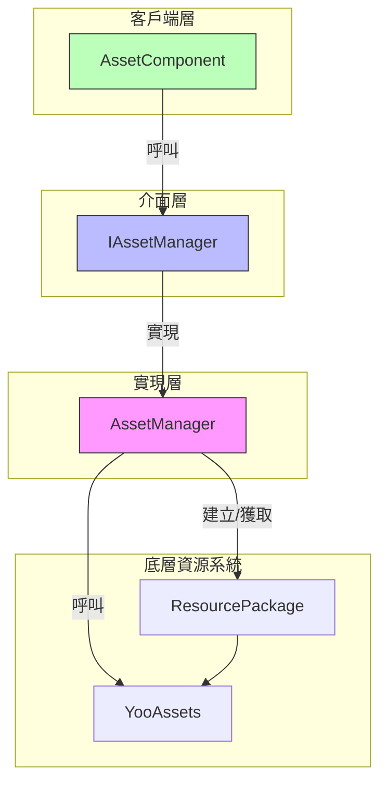
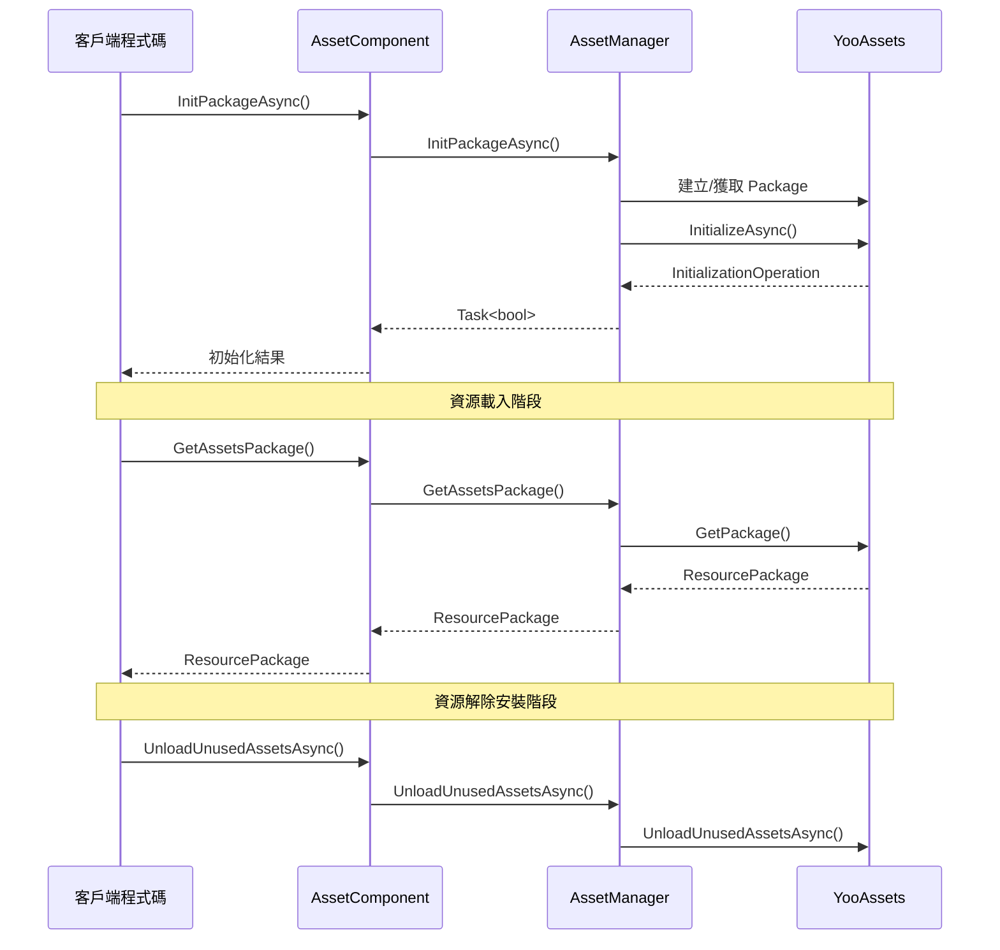

# 資源包管理

資源包管理 API 提供了對資源包（ResourcePackage）的完整生命週期管理能力，包括包的建立、初始化、獲取、解除安裝等操作。該模組基於 YooAssets 庫構建，為 GameFrameX 提供了統一且強大的資源包管理功能。

## 概述

資源包（ResourcePackage）是 GameFrameX 資源系統中用於組織和管理資源的核心概念。每個資源包代表一個獨立的資源集合，可以擁有自己的下載地址、初始化方式和資源載入規則。透過資源包管理 API，開發者可以：

- 建立多個獨立的資源包以實現資源的模組化管理
- 為每個資源包配置不同的遠端伺服器地址
- 設定預設資源包以簡化載入介面的使用
- 靈活地控制資源的載入和解除安裝時機

系統支援同時管理多個資源包，但同一時間只能設定一個預設包。預設包可以使用簡化的載入介面，無需顯式指定包名。

> 注意：預設資源包名稱為 `DefaultPackage`，定義在 `AssetManager.ConstDefaultPackageName` 常量中。

## 架構

資源包管理的架構採用了典型的分層設計模式，透過介面抽象實現了底層 YooAssets 的封裝：



**組件說明：**

| 組件 | 職責 |
|------|------|
| AssetComponent | Unity 組件層，提供公開的 API 介面 |
| IAssetManager | 定義資源管理的抽象介面 |
| AssetManager | 具體實現類，負責與 YooAssets 互動 |
| ResourcePackage | YooAssets 的資源包物件 |

## 核心功能

### 資源包初始化

資源包在使用前必須先進行初始化。初始化過程會根據執行模式（PlayMode）配置不同的檔案系統，並連線到遠端伺服器（如果需要）。

#### 非同步初始化資源包

```csharp
public async Task<bool> InitPackageAsync(string packageName, string host, string fallbackHostServer, bool isDefaultPackage = false)
```

> Source: [AssetComponent.cs](https://github.com/GameFrameX/com.gameframex.unity.asset/blob/main/Runtime/Asset/AssetComponent.cs#L80-L95)

**引數說明：**
- `packageName` (string): 資源包名稱，用於標識和獲取該資源包
- `host` (string): 主下載地址，用於下載遠端資源
- `fallbackHostServer` (string): 備用下載地址，當主地址不可用時使用
- `isDefaultPackage` (bool): 是否設定為預設包，預設為 false

**返回值：** 
- `Task<bool>`: 初始化是否成功

**使用示例：**

```csharp
var assetComponent = GameEntry.GetComponent<AssetComponent>();
bool success = await assetComponent.InitPackageAsync(
    "MyPackage", 
    "https://cdn.example.com/assets", 
    "https://backup.example.com/assets", 
    true
);
```

初始化過程會根據當前設定的執行模式（EPlayMode）選擇不同的初始化策略：

- **EditorSimulateMode**: 編輯器模擬模式，使用編輯器內的模擬資源
- **OfflinePlayMode**: 單機執行模式，僅使用內建資源
- **HostPlayMode**: 聯機執行模式，支援遠端資源下載和熱更新
- **WebPlayMode**: WebGL 執行模式，針對 Web 平臺最佳化

> 執行模式的詳細說明請參閱 [執行模式](./6-configuration.play-modes) 文件。

### 資源包建立與獲取

#### 建立資源包

```csharp
public ResourcePackage CreateAssetsPackage(string packageName)
```

> Source: [AssetComponent.cs](https://github.com/GameFrameX/com.gameframex.unity.asset/blob/main/Runtime/Asset/AssetComponent.cs#L471-L474)

建立一個新的資源包。如果包已存在，則返回已存在的包例項。

**引數：**
- `packageName` (string): 資源包名稱

**返回值：**
- ResourcePackage: 建立的資源包物件

#### 嘗試獲取資源包

```csharp
public ResourcePackage TryGetAssetsPackage(string packageName)
```

> Source: [AssetComponent.cs](https://github.com/GameFrameX/com.gameframex.unity.asset/blob/main/Runtime/Asset/AssetComponent.cs#L482-L485)

安全獲取資源包，如果包不存在則返回 null 而不會丟擲異常。

**引數：**
- `packageName` (string): 資源包名稱

**返回值：**
- ResourcePackage: 資源包物件，如果不存在則返回 null

#### 檢查資源包是否存在

```csharp
public bool HasAssetsPackage(string packageName)
```

> Source: [AssetComponent.cs](https://github.com/GameFrameX/com.gameframex.unity.asset/blob/main/Runtime/Asset/AssetComponent.cs#L493-L496)

檢查指定名稱的資源包是否已建立。

**引數：**
- `packageName` (string): 資源包名稱

**返回值：**
- bool: 是否存在

#### 獲取資源包

```csharp
public ResourcePackage GetAssetsPackage(string packageName)
```

> Source: [AssetComponent.cs](https://github.com/GameFrameX/com.gameframex.unity.asset/blob/main/Runtime/Asset/AssetComponent.cs#L504-L507)

獲取指定名稱的資源包。如果包不存在，將丟擲異常。

**引數：**
- `packageName` (string): 資源包名稱

**返回值：**
- ResourcePackage: 資源包物件

### 預設資源包

#### 設定預設資源包

```csharp
public void SetDefaultAssetsPackage(ResourcePackage assetsPackage)
```

> Source: [AssetComponent.cs](https://github.com/GameFrameX/com.gameframex.unity.asset/blob/main/Runtime/Asset/AssetComponent.cs#L581-L584)

設定預設資源包。設定後，載入資源時無需顯式指定包名，系統會自動從預設包中載入。

**引數：**
- `assetsPackage` (ResourcePackage): 要設定為預設的資源包

**使用示例：**

```csharp
var assetComponent = GameEntry.GetComponent<AssetComponent>();
var package = assetComponent.GetAssetsPackage("MyPackage");
assetComponent.SetDefaultAssetsPackage(package);
// 之後可以使用簡化的載入介面
var handle = await assetComponent.LoadAssetAsync("Prefabs/Player");
```

## 資源解除安裝與清理

GameFrameX 提供了多層次的資源解除安裝和清理機制，以滿足不同場景的需求。

### 解除安裝單個資源

```csharp
public void UnloadAsset(string assetPath)
public void UnloadAsset(string packageName, string assetPath)
```

> Source: [AssetComponent.cs](https://github.com/GameFrameX/com.gameframex.unity.asset/blob/main/Runtime/Asset/AssetComponent.cs#L602-L615)

解除安裝指定路徑的資源。

**引數：**
- `packageName` (string): 資源包名稱（可選，不指定則使用預設包）
- `assetPath` (string): 資源路徑

### 強制回收所有資源

```csharp
public void UnloadAllAssetsAsync(string packageName)
```

> Source: [AssetComponent.cs](https://github.com/GameFrameX/com.gameframex.unity.asset/blob/main/Runtime/Asset/AssetComponent.cs#L591-L594)

強制回收指定資源包中的所有已載入資源。此操作會立即釋放所有資源記憶體，應謹慎使用。

**引數：**
- `packageName` (string): 資源包名稱

### 解除安裝無用資源

```csharp
public void UnloadUnusedAssetsAsync(string packageName = null)
```

> Source: [AssetComponent.cs](https://github.com/GameFrameX/com.gameframex.unity.asset/blob/main/Runtime/Asset/AssetComponent.cs#L635-L638)

解除安裝未被引用的資源。這是推薦使用的資源釋放方式，系統會自動識別並釋放不再使用的資源。

**引數：**
- `packageName` (string): 資源包名稱，為 null 時清理預設包

### 清理資原始檔

```csharp
public void ClearAllBundleFilesAsync(string packageName = null)
public void ClearUnusedBundleFilesAsync(string packageName = null)
```

> Source: [AssetComponent.cs](https://github.com/GameFrameX/com.gameframex.unity.asset/blob/main/Runtime/Asset/AssetComponent.cs#L645-L658)

清理本地快取的資源包檔案。

- `ClearAllBundleFilesAsync`: 清理所有資原始檔
- `ClearUnusedBundleFilesAsync`: 僅清理未被使用的資原始檔

**引數：**
- `packageName` (string): 資源包名稱，為 null 時清理預設包

## 使用流程

以下是多資源包場景的典型使用流程：



## 典型使用場景

### 場景一：DLC 資源包管理

在遊戲釋出後需要動態載入額外的 DLC 內容時，可以使用獨立的資源包：

```csharp
var assetComponent = GameEntry.GetComponent<AssetComponent>();

// 初始化 DLC 資源包
await assetComponent.InitPackageAsync(
    "DLC_LevelPack1",
    "https://cdn.example.com/dlc/levelpack1",
    "https://backup.example.com/dlc/levelpack1"
);

// 獲取 DLC 包並載入資源
var dlcPackage = assetComponent.GetAssetsPackage("DLC_LevelPack1");
assetComponent.SetDefaultAssetsPackage(dlcPackage);

var levelHandle = await assetComponent.LoadAssetAsync<Scene>("Levels/Level01");
```

### 場景二：資源熱更新

使用聯機模式時，資源包用於管理熱更新資源：

```csharp
var assetComponent = GameEntry.GetComponent<AssetComponent>();

// 初始化預設包（用於熱更新）
bool success = await assetComponent.InitPackageAsync(
    "HotUpdate",
    "https://gamecdn.example.com/hotupdate",
    "https://backup.example.com/hotupdate",
    true
);

if (success)
{
    Debug.Log("熱更新資源包初始化成功");
}
```

### 場景三：資源清理

在切換遊戲場景或進入特定流程時清理不需要的資源：

```csharp
var assetComponent = GameEntry.GetComponent<AssetComponent>();

// 解除安裝未使用的資源（推薦）
assetComponent.UnloadUnusedAssetsAsync();

// 或者清理特定資源包的所有快取
assetComponent.ClearUnusedBundleFilesAsync("OldDLC");
```

## API 參考

### AssetComponent

| 方法 | 返回型別 | 描述 |
|------|----------|------|
| InitPackageAsync | Task\<bool\> | 非同步初始化資源包 |
| CreateAssetsPackage | ResourcePackage | 建立資源包 |
| TryGetAssetsPackage | ResourcePackage | 嘗試獲取資源包（安全） |
| HasAssetsPackage | bool | 檢查資源包是否存在 |
| GetAssetsPackage | ResourcePackage | 獲取資源包 |
| SetDefaultAssetsPackage | void | 設定預設資源包 |
| UnloadAsset | void | 解除安裝指定資源 |
| UnloadAllAssetsAsync | void | 強制回收所有資源 |
| UnloadUnusedAssetsAsync | void | 解除安裝無用資源 |
| ClearAllBundleFilesAsync | void | 清理所有資原始檔 |
| ClearUnusedBundleFilesAsync | void | 清理無用資原始檔 |

### IAssetManager

| 屬性 | 型別 | 描述 |
|------|------|------|
| DefaultPackageName | string | 預設資源包名稱 |
| PlayMode | EPlayMode | 當前執行模式 |
| VerifyLevel | EFileVerifyLevel | 檔案驗證等級 |
| Milliseconds | long | 非同步系統時間片 |

> 完整的介面定義請參閱 [IAssetManager.cs](https://github.com/GameFrameX/com.gameframex.unity.asset/blob/main/Runtime/Asset/IAssetManager.cs)

## 相關連結

- [資源載入介面](./5-api-reference.loading-api) - 瞭解如何在包中載入資源
- [執行模式](./6-configuration.play-modes) - 瞭解不同的執行模式配置
- [資源組件](./4-core-concepts.asset-component) - 瞭解 AssetComponent 組件
- [架構設計](./4-core-concepts.architecture) - 瞭解整體架構設計
