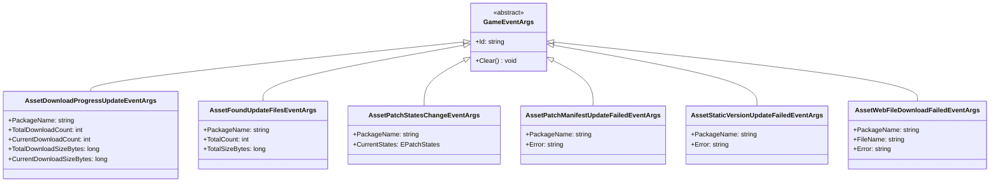
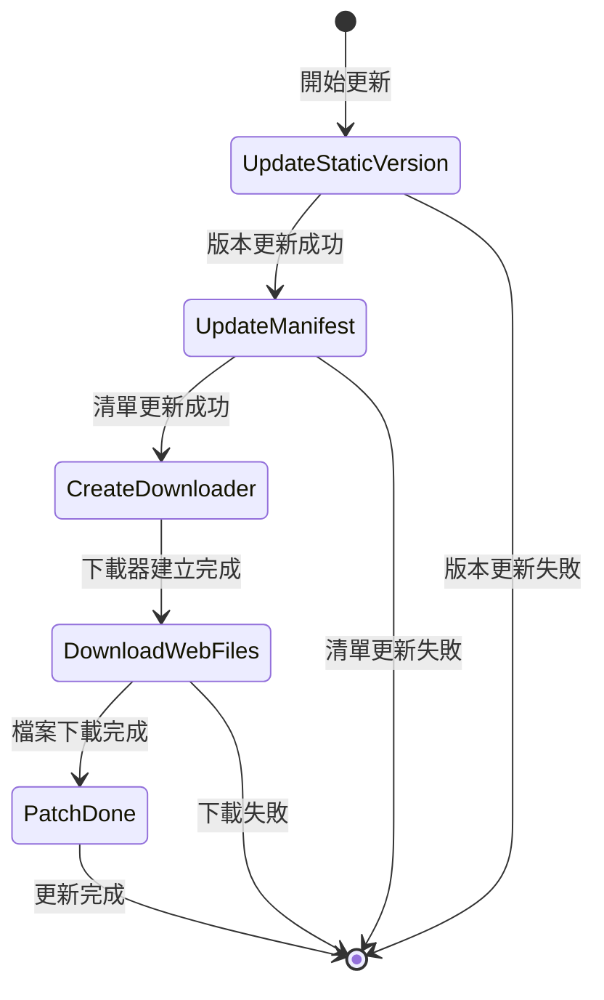

# 更新事件

資源系統提供的更新事件機制，允許開發者在資源熱更新過程中監聽關鍵節點並執行自定義邏輯。

## 概述

在資源熱更新流程中，系統會觸發多種事件來通知當前更新的進度和狀態。這些事件基於 GameFrameX 的事件系統構建，遵循釋出-訂閱模式。開發者可以透過訂閱這些事件來實現：
- 顯示更新進度 UI
- 統計下載資料
- 處理更新失敗情況
- 執行自定義業務邏輯

所有更新事件都繼承自 `GameEventArgs` 基類，每個事件具有唯一的事件 ID（EventId），用於事件訂閱和分發。

## 事件體系架構



## 更新流程狀態

更新流程由 `EPatchStates` 列舉定義，包含以下五個狀態：



| 狀態 | 描述 |
|------|------|
| UpdateStaticVersion | 更新靜態資源版本號 |
| UpdateManifest | 更新補丁清單檔案 |
| CreateDownloader | 建立下載器 |
| DownloadWebFiles | 下載遠端檔案 |
| PatchDone | 補丁流程完畢 |

## 事件詳細說明

### 下載進度更新事件 (AssetDownloadProgressUpdateEventArgs)

在資源下載過程中實時觸發，用於報告當前下載進度。

> Source: [Runtime/Update/EventArgs/AssetDownloadProgressUpdateEventArgs.cs](https://github.com/GameFrameX/com.gameframex.unity.asset/blob/main/Runtime/Update/EventArgs/AssetDownloadProgressUpdateEventArgs.cs#L1-L77)

**事件ID:**
```csharp
public static readonly string EventId = typeof(AssetDownloadProgressUpdateEventArgs).FullName;
```

**屬性說明:**

| 屬性 | 型別 | 描述 |
|------|------|------|
| PackageName | string | 資源包名稱 |
| TotalDownloadCount | int | 總下載數量 |
| CurrentDownloadCount | int | 當前已下載數量 |
| TotalDownloadSizeBytes | long | 總下載大小（位元組） |
| CurrentDownloadSizeBytes | long | 當前已下載大小（位元組） |

**建立方法:**
```csharp
public static AssetDownloadProgressUpdateEventArgs Create(
    string packageName, 
    int totalDownloadCount, 
    int currentDownloadCount, 
    long totalDownloadSizeBytes, 
    long currentDownloadSizeBytes)
```

### 發現更新檔案事件 (AssetFoundUpdateFilesEventArgs)

當系統掃描並發現需要更新的檔案時觸發，攜帶待更新檔案的統計資訊。

> Source: [Runtime/Update/EventArgs/AssetFoundUpdateFilesEventArgs.cs](https://github.com/GameFrameX/com.gameframex.unity.asset/blob/main/Runtime/Update/EventArgs/AssetFoundUpdateFilesEventArgs.cs#L1-L60)

**事件ID:**
```csharp
public static readonly string EventId = typeof(AssetFoundUpdateFilesEventArgs).FullName;
```

**屬性說明:**

| 屬性 | 型別 | 描述 |
|------|------|------|
| PackageName | string | 資源包名稱 |
| TotalCount | int | 需要更新的檔案總數量 |
| TotalSizeBytes | long | 需要更新的檔案總大小（位元組） |

**建立方法:**
```csharp
public static AssetFoundUpdateFilesEventArgs Create(
    string packageName, 
    int totalCount, 
    long totalSizeBytes)
```

### 補丁流程狀態變更事件 (AssetPatchStatesChangeEventArgs)

當資源更新流程進入新的狀態階段時觸發，用於通知當前更新進度。

> Source: [Runtime/Update/EventArgs/AssetPatchStatesChangeEventArgs.cs](https://github.com/GameFrameX/com.gameframex.unity.asset/blob/main/Runtime/Update/EventArgs/AssetPatchStatesChangeEventArgs.cs#L1-L49)

**事件ID:**
```csharp
public static readonly string EventId = typeof(AssetPatchStatesChangeEventArgs).FullName;
```

**屬性說明:**

| 屬性 | 型別 | 描述 |
|------|------|------|
| PackageName | string | 資源包名稱 |
| CurrentStates | EPatchStates | 當前更新狀態 |

**建立方法:**
```csharp
public static AssetPatchStatesChangeEventArgs Create(
    string packageName, 
    EPatchStates currentStates)
```

### 補丁清單更新失敗事件 (AssetPatchManifestUpdateFailedEventArgs)

當補丁清單檔案更新失敗時觸發，包含錯誤資訊。

> Source: [Runtime/Update/EventArgs/AssetPatchManifestUpdateFailedEventArgs.cs](https://github.com/GameFrameX/com.gameframex.unity.asset/blob/main/Runtime/Update/EventArgs/AssetPatchManifestUpdateFailedEventArgs.cs#L1-L52)

**事件ID:**
```csharp
public static readonly string EventId = typeof(AssetPatchManifestUpdateFailedEventArgs).FullName;
```

**屬性說明:**

| 屬性 | 型別 | 描述 |
|------|------|------|
| PackageName | string | 資源包名稱 |
| Error | string | 錯誤資訊 |

**建立方法:**
```csharp
public static AssetPatchManifestUpdateFailedEventArgs Create(
    string packageName, 
    string error)
```

### 資源版本號更新失敗事件 (AssetStaticVersionUpdateFailedEventArgs)

當資源版本號更新失敗時觸發，包含錯誤資訊。

> Source: [Runtime/Update/EventArgs/AssetStaticVersionUpdateFailedEventArgs.cs](https://github.com/GameFrameX/com.gameframex.unity.asset/blob/main/Runtime/Update/EventArgs/AssetStaticVersionUpdateFailedEventArgs.cs#L1-L52)

**事件ID:**
```csharp
public static readonly string EventId = typeof(AssetStaticVersionUpdateFailedEventArgs).FullName;
```

**屬性說明:**

| 屬性 | 型別 | 描述 |
|------|------|------|
| PackageName | string | 資源包名稱 |
| Error | string | 錯誤資訊 |

**建立方法:**
```csharp
public static AssetStaticVersionUpdateFailedEventArgs Create(
    string packageName, 
    string error)
```

### 網路檔案下載失敗事件 (AssetWebFileDownloadFailedEventArgs)

當某個資原始檔下載失敗時觸發，包含檔名和錯誤資訊。

> Source: [Runtime/Update/EventArgs/AssetWebFileDownloadFailedEventArgs.cs](https://github.com/GameFrameX/com.gameframex.unity.asset/blob/main/Runtime/Update/EventArgs/AssetWebFileDownloadFailedEventArgs.cs#L1-L60)

**事件ID:**
```csharp
public static readonly string EventId = typeof(AssetWebFileDownloadFailedEventArgs).FullName;
```

**屬性說明:**

| 屬性 | 型別 | 描述 |
|------|------|------|
| PackageName | string | 資源包名稱 |
| FileName | string | 下載失敗的檔名 |
| Error | string | 錯誤資訊 |

**建立方法:**
```csharp
public static AssetWebFileDownloadFailedEventArgs Create(
    string packageName, 
    string fileName, 
    string error)
```

## 使用示例

### 訂閱更新狀態變化事件

```csharp
// 訂閱補丁流程狀態變更事件
GameEntry.Event.Subscribe(AssetPatchStatesChangeEventArgs.EventId, OnPatchStatesChange);

private void OnPatchStatesChange(object sender, AssetPatchStatesChangeEventArgs e)
{
    switch (e.CurrentStates)
    {
        case EPatchStates.UpdateStaticVersion:
            Debug.Log("正在更新資源版本號...");
            break;
        case EPatchStates.UpdateManifest:
            Debug.Log("正在更新補丁清單...");
            break;
        case EPatchStates.CreateDownloader:
            Debug.Log("正在建立下載器...");
            break;
        case EPatchStates.DownloadWebFiles:
            Debug.Log("正在下載遠端檔案...");
            break;
        case EPatchStates.PatchDone:
            Debug.Log("更新完成！");
            break;
    }
}
```

> Source: [Runtime/Update/EventArgs/AssetPatchStatesChangeEventArgs.cs](https://github.com/GameFrameX/com.gameframex.unity.asset/blob/main/Runtime/Update/EventArgs/AssetPatchStatesChangeEventArgs.cs#L35-L47)

### 訂閱下載進度更新事件

```csharp
// 訂閱下載進度更新事件
GameEntry.Event.Subscribe(AssetDownloadProgressUpdateEventArgs.EventId, OnDownloadProgress);

private void OnDownloadProgress(object sender, AssetDownloadProgressUpdateEventArgs e)
{
    float progress = (float)e.CurrentDownloadCount / e.TotalDownloadCount;
    long downloadedSize = e.CurrentDownloadSizeBytes / 1024 / 1024; // MB
    long totalSize = e.TotalDownloadSizeBytes / 1024 / 1024; // MB
    
    Debug.Log($"下載進度: {progress * 100:F1}% ({e.CurrentDownloadCount}/{e.TotalDownloadCount}) - {downloadedSize}MB / {totalSize}MB");
}
```

> Source: [Runtime/Update/EventArgs/AssetDownloadProgressUpdateEventArgs.cs](https://github.com/GameFrameX/com.gameframex.unity.asset/blob/main/Runtime/Update/EventArgs/AssetDownloadProgressUpdateEventArgs.cs#L60-L75)

### 訂閱發現更新檔案事件

```csharp
// 訂閱發現更新檔案事件
GameEntry.Event.Subscribe(AssetFoundUpdateFilesEventArgs.EventId, OnFoundUpdateFiles);

private void OnFoundUpdateFiles(object sender, AssetFoundUpdateFilesEventArgs e)
{
    long totalSizeMB = e.TotalSizeBytes / 1024 / 1024;
    Debug.Log($"發現 {e.TotalCount} 個需要更新的檔案，總大小: {totalSizeMB}MB");
}
```

> Source: [Runtime/Update/EventArgs/AssetFoundUpdateFilesEventArgs.cs](https://github.com/GameFrameX/com.gameframex.unity.asset/blob/main/Runtime/Update/EventArgs/AssetFoundUpdateFilesEventArgs.cs#L44-L58)

### 訂閱錯誤事件

```csharp
// 訂閱版本號更新失敗事件
GameEntry.Event.Subscribe(AssetStaticVersionUpdateFailedEventArgs.EventId, OnStaticVersionUpdateFailed);

// 訂閱清單更新失敗事件
GameEntry.Event.Subscribe(AssetPatchManifestUpdateFailedEventArgs.EventId, OnManifestUpdateFailed);

// 訂閱檔案下載失敗事件
GameEntry.Event.Subscribe(AssetWebFileDownloadFailedEventArgs.EventId, OnFileDownloadFailed);

private void OnStaticVersionUpdateFailed(object sender, AssetStaticVersionUpdateFailedEventArgs e)
{
    Debug.LogError($"資源版本號更新失敗: {e.Error}");
    // 可以在這裡顯示錯誤提示或執行重試邏輯
}

private void OnManifestUpdateFailed(object sender, AssetPatchManifestUpdateFailedEventArgs e)
{
    Debug.LogError($"補丁清單更新失敗: {e.Error}");
}

private void OnFileDownloadFailed(object sender, AssetWebFileDownloadFailedEventArgs e)
{
    Debug.LogError($"檔案下載失敗: {e.FileName}, 錯誤: {e.Error}");
}
```

> Sources:
> - [Runtime/Update/EventArgs/AssetStaticVersionUpdateFailedEventArgs.cs](https://github.com/GameFrameX/com.gameframex.unity.asset/blob/main/Runtime/Update/EventArgs/AssetStaticVersionUpdateFailedEventArgs.cs#L38-L50)
> - [Runtime/Update/EventArgs/AssetPatchManifestUpdateFailedEventArgs.cs](https://github.com/GameFrameX/com.gameframex.unity.asset/blob/main/Runtime/Update/EventArgs/AssetPatchManifestUpdateFailedEventArgs.cs#L38-L50)
> - [Runtime/Update/EventArgs/AssetWebFileDownloadFailedEventArgs.cs](https://github.com/GameFrameX/com.gameframex.unity.asset/blob/main/Runtime/Update/EventArgs/AssetWebFileDownloadFailedEventArgs.cs#L44-L58)

## 事件使用注意事項

1. **事件訂閱時機**：建議在遊戲啟動時或資源系統初始化前訂閱事件，確保不會遺漏任何更新事件。

2. **事件取消訂閱**：在合適的時機（如場景切換或組件銷燬）取消事件訂閱，避免記憶體洩漏。

3. **物件池機制**：所有事件引數類都實現了物件池模式，使用 `Create` 方法從池中獲取例項，使用後會自動回收。開發者無需手動管理其生命週期。

4. **錯誤處理**：強烈建議訂閱錯誤型別的事件，以便在更新失敗時能夠及時感知並做出相應處理（如提示使用者重試）。

5. **進度計算**：`AssetDownloadProgressUpdateEventArgs` 提供了位元組級別的下載進度，可用於實現精細的下載進度顯示。

## 相關連結

- [資源載入介面](./5-api-reference.loading-api)
- [資源包管理](./5-api-reference.package-management)
- [執行模式](./6-configuration.play-modes)
- [核心概念 - 資源管理器](./4-core-concepts.asset-manager)
