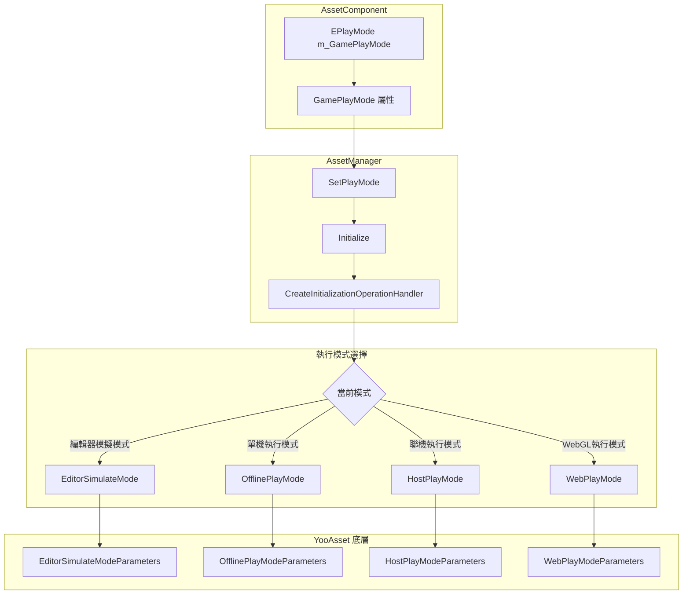
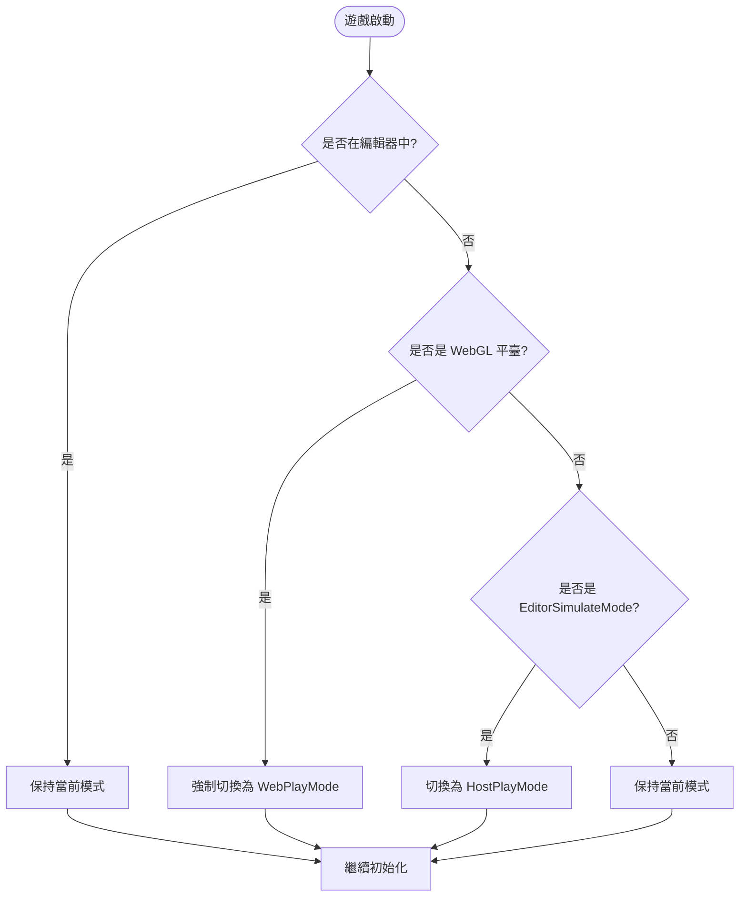

# 執行模式

執行模式定義了資源系統在遊戲啟動時如何初始化和載入資源。根據不同的開發和部署場景，GameFrameX 提供了四種執行模式供選擇。

## 概述

資源系統的執行模式決定了資源的載入方式和資料來源。正確選擇執行模式對於遊戲的開發和釋出至關重要：

- **EditorSimulateMode**：僅在 Unity 編輯器中使用，用於快速開發和除錯
- **OfflinePlayMode**：單機遊戲模式，無需網路連線
- **HostPlayMode**：熱更新模式，支援從遠端伺服器更新資源
- **WebPlayMode**：WebGL 及小遊戲平臺專用模式

> **注意**：當目標平臺為 WebGL 時，系統會自動將執行模式強制設定為 `EPlayMode.WebPlayMode`，無法手動更改。

## 架構設計



### 組件職責

| 組件 | 職責 |
|------|------|
| AssetComponent | 儲存執行模式配置，在執行時自動檢測平臺並調整模式 |
| AssetManager | 根據執行模式建立相應的初始化引數，並完成資源系統初始化 |
| YooAsset | 底層資源系統，根據不同的引數型別執行對應的初始化邏輯 |

## 各執行模式詳解

### 1. 編輯器模擬模式 (EditorSimulateMode)

編輯器模擬模式僅在 Unity 編輯器環境中執行，不打包到最終釋出的遊戲包中。該模式使用 `EditorSimulateModeParameters` 進行初始化：

```csharp
// Source: Runtime/Asset/AssetManager.Initialization.cs#L55-L60
private InitializationOperation InitializeYooAssetEditorSimulateMode(ResourcePackage resourcePackage)
{
    var simulateBuildResult = EditorSimulateModeHelper.SimulateBuild(nameof(EDefaultBuildPipeline.BuiltinBuildPipeline), ConstDefaultPackageName);
    var createParameters = new EditorSimulateModeParameters();
    createParameters.EditorFileSystemParameters = FileSystemParameters.CreateDefaultEditorFileSystemParameters(simulateBuildResult);
    return resourcePackage.InitializeAsync(createParameters);
}
```

**特點**：
- 不需要執行資源打包操作
- 直接從編輯器中的源資原始檔載入
- 載入速度最快，適合快速迭代開發
- 打包釋出時會自動切換到其他模式

**使用場景**：
- 編輯器下的功能開發和除錯
- 快速驗證資源載入邏輯

### 2. 單機執行模式 (OfflinePlayMode)

單機執行模式用於完全離線的遊戲場景，所有資源都打包在遊戲安裝包內。該模式使用 `OfflinePlayModeParameters` 進行初始化：

```csharp
// Source: Runtime/Asset/AssetManager.Initialization.cs#L69-L74
private InitializationOperation InitializeYooAssetOfflinePlayMode(ResourcePackage resourcePackage)
{
    var buildinFileSystem = FileSystemParameters.CreateDefaultBuildinFileSystemParameters();
    var initParameters = new OfflinePlayModeParameters();
    initParameters.BuildinFileSystemParameters = buildinFileSystem;
    return resourcePackage.InitializeAsync(initParameters);
}
```

**特點**：
- 無需網路連線
- 資源從應用內建的只讀區域（StreamingAssets）載入
- 不支援執行時資源更新
- 適合單機遊戲或網路環境不穩定的場景

**使用場景**：
- 單機遊戲
- 無需熱更新的獨立遊戲
- 網路環境受限的釋出平臺

### 3. 聯機執行模式 (HostPlayMode)

聯機執行模式（熱更新模式）是大型遊戲最常用的模式，支援資源的熱更新。該模式使用 `HostPlayModeParameters` 進行初始化：

```csharp
// Source: Runtime/Asset/AssetManager.Initialization.cs#L155-L163
private InitializationOperation InitializeYooAssetHostPlayMode(ResourcePackage resourcePackage, string hostServerURL, string fallbackHostServerURL)
{
    var remoteServices = new RemoteServices(hostServerURL, fallbackHostServerURL);
    var createParameters = new HostPlayModeParameters
    {
        BuildinFileSystemParameters = FileSystemParameters.CreateDefaultBuildinFileSystemParameters(),
        CacheFileSystemParameters = FileSystemParameters.CreateDefaultCacheFileSystemParameters(remoteServices),
    };
    return resourcePackage.InitializeAsync(createParameters);
}
```

**特點**：
- 支援資源的熱更新功能
- 優先從遠端伺服器下載最新資源
- 內建資源作為後備方案
- 支援斷點續傳和快取管理

**使用場景**：
- 需要持續更新內容的網路遊戲
- 需要分批下載資源的大型遊戲
- 希望透過熱更新修復 bug 或新增新內容的遊戲

### 4. WebGL 執行模式 (WebPlayMode)

WebGL 執行模式專門為 WebGL 平臺和小遊戲平臺設計，支援多種小遊戲平臺的檔案系統：

```csharp
// Source: Runtime/Asset/AssetManager.Initialization.cs#L85-L145
private InitializationOperation InitializeYooAssetWebPlayMode(ResourcePackage resourcePackage, string hostServerURL, string fallbackHostServerURL)
{
    var initParameters = new WebPlayModeParameters();
    FileSystemSystemParameters webFileSystem = null;
#if UNITY_WEBGL
#if ENABLE_DOUYIN_MINI_GAME
    // 位元組小遊戲檔案系統
    webFileSystem = ByteGameFileSystemCreater.CreateByteGameFileSystemParameters(hostServerURL);
#elif ENABLE_WECHAT_MINI_GAME
    // 微信小遊戲檔案系統
    webFileSystem = WechatFileSystemCreater.CreateWechatPathFileSystemParameters(hostServerURL);
#elif ENABLE_KUAISHOU_MINI_GAME
    // 快手小遊戲檔案系統
    webFileSystem = KuaiShouFileSystemCreater.CreateKuaiShouPathFileSystemParameters(hostServerURL);
#else
    // 預設 WebGL 檔案系統
    webFileSystem = FileSystemParameters.CreateDefaultWebFileSystemParameters();
#endif
#else
    webFileSystem = FileSystemParameters.CreateDefaultWebFileSystemParameters();
#endif
    initParameters.WebFileSystemParameters = webFileSystem;
    return resourcePackage.InitializeAsync(initParameters);
}
```

**支援的平臺**：
- WebGL 瀏覽器平臺
- 抖音小遊戲 (ByteDance Mini Game)
- 微信小遊戲 (WeChat Mini Game)
- 快手小遊戲 (Kuaishou Mini Game)

**特點**：
- 自動檢測目標平臺並選擇合適的檔案系統
- 針對小遊戲平臺的特殊最佳化
- 支援小遊戲平臺特有的預載入機制

## 平臺自動切換邏輯

系統在執行時自動處理平臺相容性問題：

```csharp
// Source: Runtime/Asset/AssetComponent.cs#L42-L63
protected override void Awake()
{
#if !UNITY_EDITOR
    if (GamePlayMode == EPlayMode.EditorSimulateMode)
    {
        GamePlayMode = EPlayMode.HostPlayMode;
    }
#if UNITY_WEBGL
    GamePlayMode = EPlayMode.WebPlayMode;
#endif
#endif
    // ... 其他初始化程式碼
    _assetManager.SetPlayMode(GamePlayMode);
}
```



## 配置說明

執行模式透過 Unity 場景中的 AssetComponent 組件進行配置：

```csharp
// Source: Runtime/Asset/AssetComponent.cs#L18-L31
[Tooltip("當目標平臺為Web平臺時，將會強制設定為 WebPlayMode")] [SerializeField]
private EPlayMode m_GamePlayMode;

/// <summary>
/// 資源的執行模式
/// </summary>
public EPlayMode GamePlayMode
{
    get { return m_GamePlayMode; }
    set { m_GamePlayMode = value; }
}
```

### 配置屬性

| 屬性 | 型別 | 說明 |
|------|------|------|
| GamePlayMode | EPlayMode | 資源的執行模式 |

### EPlayMode 列舉值

| 列舉值 | 說明 |
|--------|------|
| EditorSimulateMode | 編輯器模擬模式，僅編輯器可用 |
| OfflinePlayMode | 單機執行模式 |
| HostPlayMode | 聯機執行模式（熱更新模式） |
| WebPlayMode | WebGL 執行模式 |

## 使用建議

### 開發階段

- 在 Unity 編輯器中使用 **EditorSimulateMode**，可以快速迭代開發
- 配合資源打包工具進行完整的打包測試

### 測試階段

- 使用 **OfflinePlayMode** 進行完整的離線功能測試
- 使用 **HostPlayMode** 測試熱更新流程

### 釋出階段

- 根據目標平臺選擇合適的執行模式
- WebGL 平臺會自動使用 WebPlayMode，無需手動設定
- 移動端網路遊戲建議使用 HostPlayMode

## 相關連結

- [資源組件](./4-core-concepts.asset-component)
- [資源管理器](./4-core-concepts.asset-manager)
- [架構設計](./4-core-concepts.architecture)
- [組件配置](./6-configuration.component-settings)
- [WebGL 平臺配置](./7-platforms.webgl)
