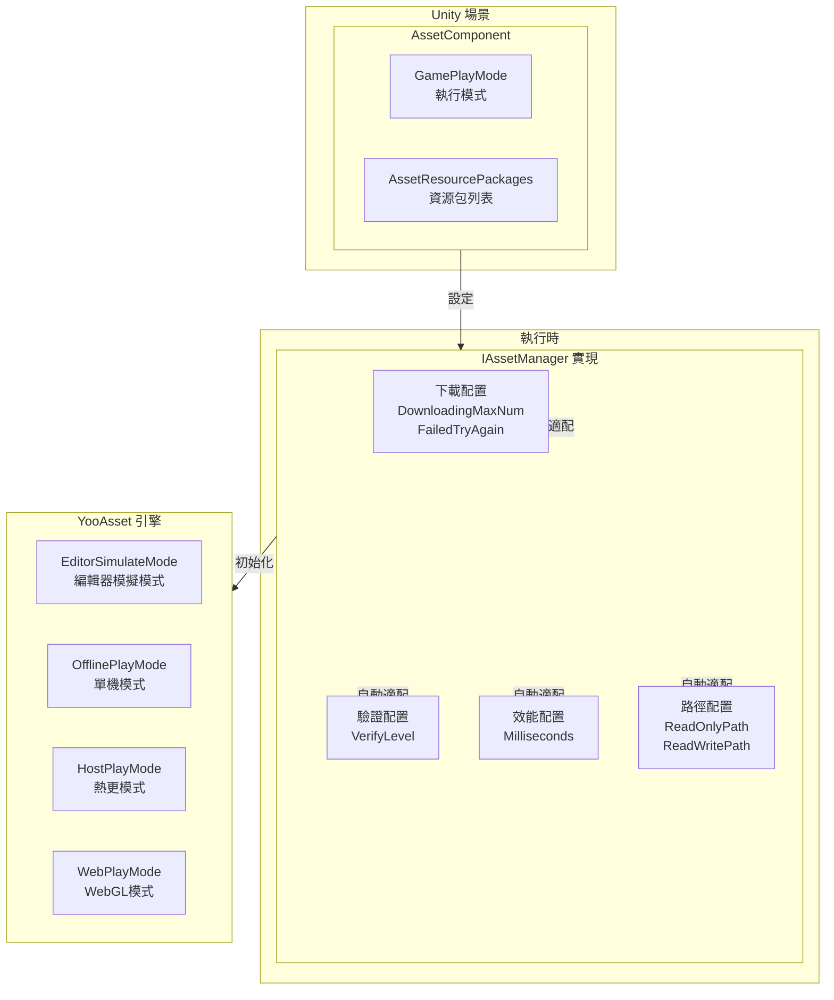
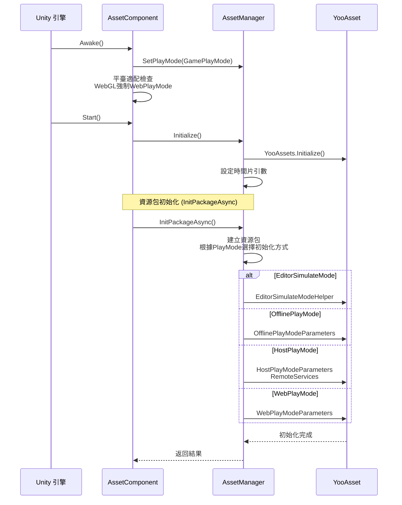

# 組件配置

AssetComponent 是 GameFrameX 資源系統的核心 Unity 組件，負責配置和管理資源的執行時行為。透過該組件，開發者可以靈活配置資源載入模式、下載引數、資源包資訊等關鍵配置。

## 概述

AssetComponent 繼承自 GameFrameworkComponent，是 Unity 場景中的核心組件，用於初始化和管理資源系統。該組件透過 Unity Inspector 面板進行配置，支援多種執行模式，能夠根據不同平臺自動適配最佳的資源載入策略。



**配置流程說明：**
1. 在 Unity Inspector 中配置 AssetComponent 的執行模式和資源包資訊
2. AssetComponent 在 Awake 階段獲取配置並傳遞給 AssetManager
3. AssetManager 根據配置初始化 YooAsset 引擎
4. 系統根據執行模式選擇合適的資源載入策略

## 核心配置屬性

### 執行模式配置

AssetComponent 提供了 `GamePlayMode` 屬性，用於設定資源的執行模式：

```csharp
[Tooltip("當目標平臺為Web平臺時，將會強制設定為" + nameof(EPlayMode.WebPlayMode))] [SerializeField]
private EPlayMode m_GamePlayMode;
```
> Source: [Runtime/Asset/AssetComponent.cs](https://github.com/GameFrameX/com.gameframex.unity.asset/blob/main/Runtime/Asset/AssetComponent.cs#L20-L21)

**執行模式說明：**

| 模式 | 列舉值 | 說明 | 適用場景 |
|------|--------|------|----------|
| 編輯器模擬模式 | `EPlayMode.EditorSimulateMode` | 在 Unity 編輯器中使用模擬方式載入資源，無需打包即可測試 | 開發除錯階段 |
| 單機執行模式 | `EPlayMode.OfflinePlayMode` | 使用本地內建資原始檔，無需網路下載 | 純單機遊戲 |
| 聯機執行模式 | `EPlayMode.HostPlayMode` | 支援熱更新，從遠端伺服器下載資源 | 需要熱更的遊戲 |
| WebGL執行模式 | `EPlayMode.WebPlayMode` | 針對 WebGL 平臺的特殊最佳化模式 | WebGL 平臺 |

**平臺自動適配機制：**

```csharp
protected override void Awake()
{
#if !UNITY_EDITOR
    if (GamePlayMode == EPlayMode.EditorSimulateMode)
    {
        GamePlayMode = EPlayMode.HostPlayMode;
    }
#if UNITY_WEBGL
    GamePlayMode = EPlayMode.WebPlayMode;
#endif
#endif
    // ... 後續初始化邏輯
}
```
> Source: [Runtime/Asset/AssetComponent.cs](https://github.com/GameFrameX/com.gameframex.unity.asset/blob/main/Runtime/Asset/AssetComponent.cs#L42-L64)

**自動適配規則：**
- 在非編輯器環境下，`EditorSimulateMode` 會被自動轉換為 `HostPlayMode`
- 在 WebGL 平臺環境下，無論配置何種模式，都會被強制設定為 `WebPlayMode`

### 資源包配置

在編輯器環境下，可以透過 `AssetResourcePackages` 配置多個資源包資訊：

```csharp
#if UNITY_EDITOR
[SerializeField] private List<AssetResourcePackageInfo> m_assetResourcePackages = new List<AssetResourcePackageInfo>();
#endif
```
> Source: [Runtime/Asset/AssetComponent.cs](https://github.com/GameFrameX/com.gameframex.unity.asset/blob/main/Runtime/Asset/AssetComponent.cs#L33-L34)

**資源包資訊結構：**

```csharp
[Serializable]
public sealed class AssetResourcePackageInfo
{
    [SerializeField] public string PackageName;
    [SerializeField] public string DownloadURL;
    [SerializeField] public string FallbackDownloadURL;
}
```
> Source: [Runtime/Asset/AssetComponent.cs](https://github.com/GameFrameX/com.gameframex.unity.asset/blob/main/Runtime/Asset/AssetComponent.cs#L661-L667)

| 配置項 | 型別 | 說明 |
|--------|------|------|
| PackageName | string | 資源包名稱 |
| DownloadURL | string | 主下載地址 |
| FallbackDownloadURL | string | 備用下載地址 |

## 執行時配置介面

IAssetManager 介面提供了豐富的執行時配置屬性，可在程式碼中動態調整：

```csharp
public interface IAssetManager
{
    /// <summary>
    /// 同時下載的最大數目。
    /// </summary>
    int DownloadingMaxNum { get; set; }

    /// <summary>
    /// 失敗重試最大數目。
    /// </summary>
    int FailedTryAgain { get; set; }

    /// <summary>
    /// 獲取或設定資源包名稱。
    /// </summary>
    string DefaultPackageName { get; set; }

    /// <summary>
    /// 獲取或設定下載檔案校驗等級。
    /// </summary>
    EFileVerifyLevel VerifyLevel { get; }

    /// <summary>
    /// 獲取或設定非同步系統引數，每幀執行消耗的最大時間切片（單位：毫秒）。
    /// </summary>
    long Milliseconds { get; set; }

    /// <summary>
    /// 獲取資源只讀區路徑。
    /// </summary>
    string ReadOnlyPath { get; }

    /// <summary>
    /// 獲取資源讀寫區路徑。
    /// </summary>
    string ReadWritePath { get; }
}
```
> Source: [Runtime/Asset/IAssetManager.cs](https://github.com/GameFrameX/com.gameframex.unity.asset/blob/main/Runtime/Asset/IAssetManager.cs#L13-L76)

### 下載配置

| 配置項 | 型別 | 預設值 | 說明 |
|--------|------|--------|------|
| DownloadingMaxNum | int | - | 同時下載的最大數量，建議根據網路狀況設定 |
| FailedTryAgain | int | - | 下載失敗後的重試次數，建議設定為 3-5 次 |

### 驗證配置

| 配置項 | 型別 | 說明 |
|--------|------|------|
| VerifyLevel | EFileVerifyLevel | 檔案校驗等級，用於確保下載檔案的完整性 |

**校驗等級說明：**
- `None` - 不進行校驗
- `Low` - 輕度校驗，僅校驗檔案是否存在
- `Medium` - 中度校驗，校驗檔案大小和部分雜湊
- `High` - 高度校驗，校驗完整檔案雜湊

### 效能配置

| 配置項 | 型別 | 預設值 | 說明 |
|--------|------|--------|------|
| Milliseconds | long | 30 | 非同步系統每幀執行的最大時間切片（毫秒），用於控制每幀的資源載入時間，避免卡頓 |

### 路徑配置

| 配置項 | 型別 | 說明 |
|--------|------|------|
| ReadOnlyPath | string | 資源只讀區路徑，通常指向 StreamingAssets |
| ReadWritePath | string | 資源讀寫區路徑，用於儲存下載的資源和快取 |

## 配置初始化流程



**初始化程式碼示例：**

```csharp
public void Initialize()
{
    BetterStreamingAssets.Initialize();
    Log.Info($"資源系統執行模式：{PlayMode}");
    YooAssets.Initialize();
    YooAssets.SetOperationSystemMaxTimeSlice(30);
    Log.Info("Asset Init Over");
}
```
> Source: [Runtime/Asset/AssetManager.cs](https://github.com/GameFrameX/com.gameframex.unity.asset/blob/main/Runtime/Asset/AssetManager.cs#L46-L56)

## 編輯器配置介面

AssetComponent 提供了自定義的 Unity Inspector 編輯器介面：

```csharp
[CustomEditor(typeof(AssetComponent))]
internal sealed class AssetComponentInspector : ComponentTypeComponentInspector
{
    public override void OnInspectorGUI()
    {
        // 執行模式配置（播放時不可修改）
        EditorGUI.BeginDisabledGroup(EditorApplication.isPlayingOrWillChangePlaymode);
        {
            EditorGUILayout.PropertyField(m_GamePlayMode, m_GamePlayModeGUIContent);
            GUI.enabled = false;
            EditorGUILayout.PropertyField(m_AssetResourcePackages, m_AssetResourcePackagesGUIContent);
            GUI.enabled = true;
        }
        EditorGUI.EndDisabledGroup();
    }
}
```
> Source: [Editor/Inspector/AssetComponentInspector.cs](https://github.com/GameFrameX/com.gameframex.unity.asset/blob/main/Editor/Inspector/AssetComponentInspector.cs#L39-L79)

**配置介面特性：**
- 執行模式配置：下拉選擇框，可在編輯器中直觀選擇
- 包列表配置：顯示已配置的資源包資訊（播放時禁用）
- 播放保護：進入播放模式後無法修改配置項

## 配置示例程式碼

### 基礎配置

```csharp
// 獲取 AssetComponent
var assetComponent = GameEntry.GetComponent<AssetComponent>();

// 獲取當前執行模式
var playMode = assetComponent.GamePlayMode;
Debug.Log($"當前執行模式: {playMode}");
```
> Source: [Runtime/Asset/AssetComponent.cs](https://github.com/GameFrameX/com.gameframex.unity.asset/blob/main/Runtime/Asset/AssetComponent.cs#L27-L31)

### 執行時配置調整

```csharp
// 獲取資源管理器
var assetManager = GameFrameworkEntry.GetModule<IAssetManager>();

// 配置下載引數
assetManager.DownloadingMaxNum = 10;  // 最多同時下載10個資源
assetManager.FailedTryAgain = 3;       // 失敗重試3次

// 配置效能引數
assetManager.Milliseconds = 30;        // 每幀最多30毫秒

// 配置驗證等級
assetManager.VerifyLevel = EFileVerifyLevel.Medium;

// 配置路徑
assetManager.SetReadOnlyPath(Application.streamingAssetsPath);
assetManager.SetReadWritePath(Application.persistentDataPath);
```
> Source: [Runtime/Asset/AssetManager.cs](https://github.com/GameFrameX/com.gameframex.unity.asset/blob/main/Runtime/Asset/AssetManager.cs#L24-L39)

### 資源包初始化

```csharp
// 初始化預設資源包
var success = await assetComponent.InitPackageAsync(
    "DefaultPackage",                      // 包名稱
    "https://cdn.example.com/assets/",      // 主下載地址
    "https://backup.example.com/assets/",  // 備用下載地址
    true                                    // 是否為預設包
);

if (success)
{
    Debug.Log("資源包初始化成功");
}
else
{
    Debug.LogError("資源包初始化失敗");
}
```
> Source: [Runtime/Asset/AssetComponent.cs](https://github.com/GameFrameX/com.gameframex.unity.asset/blob/main/Runtime/Asset/AssetComponent.cs#L80-L95)

## 平臺特殊配置

### WebGL 平臺

在 WebGL 平臺下，系統會自動處理不同小遊戲平臺的適配：

```csharp
// 位元組小遊戲
#if ENABLE_DOUYIN_MINI_GAME
GameEntry.GetComponent<AssetComponent>().gameObject.GetOrAddComponent<DouYinConfigHandler>();
#endif

// 微信小遊戲
#if ENABLE_WECHAT_MINI_GAME
GameEntry.GetComponent<AssetComponent>().gameObject.GetOrAddComponent<WeChatConfigHandler>();
#endif

// 快手小遊戲
#if ENABLE_KUAISHOU_MINI_GAME
GameEntry.GetComponent<AssetComponent>().gameObject.GetOrAddComponent<KuaiShouConfigHandler>();
#endif
```
> Source: [Runtime/Asset/AssetManager.Initialization.cs](https://github.com/GameFrameX/com.gameframex.unity.asset/blob/main/Runtime/Asset/AssetManager.Initialization.cs#L90-L126)

**小遊戲平臺特殊處理：**
- **位元組小遊戲**：使用位元組專用檔案系統，自動控制併發數量
- **微信小遊戲**：使用微信檔案系統，快取到使用者資料目錄
- **快手小遊戲**：使用快手檔案系統

## 配置最佳實踐

### 開發階段

```csharp
// 開發階段推薦配置
assetManager.DownloadingMaxNum = 5;
assetManager.FailedTryAgain = 3;
assetManager.VerifyLevel = EFileVerifyLevel.Low;
assetManager.Milliseconds = 20;
```

### 生產階段

```csharp
// 生產階段推薦配置
assetManager.DownloadingMaxNum = 10;
assetManager.FailedTryAgain = 5;
assetManager.VerifyLevel = EFileVerifyLevel.High;
assetManager.Milliseconds = 30;
```

### 網路環境適配

```csharp
// 弱網環境
if (Application.internetReachability == NetworkReachability.NotReachable)
{
    assetManager.GamePlayMode = EPlayMode.OfflinePlayMode;
}

// 行動網路
else if (Application.internetReachability == NetworkReachability.ReachableViaCarrierDataNetwork)
{
    assetManager.DownloadingMaxNum = 3;
}

// WiFi環境
else if (Application.internetReachability == NetworkReachability.ReachableViaLocalAreaNetwork)
{
    assetManager.DownloadingMaxNum = 10;
}
```

## 常見配置問題

### 問題 1：編輯器模式無法正常執行

**原因**：在非編輯器環境下使用了 `EditorSimulateMode`

**解決方案**：確保在打包釋出時將執行模式改為 `HostPlayMode` 或 `OfflinePlayMode`

### 問題 2：WebGL 平臺資源載入失敗

**原因**：WebGL 平臺被強制設定為 `WebPlayMode`，需要配置正確的下載伺服器

**解決方案**：確保在 `InitPackageAsync` 中提供正確的 `DownloadURL` 和 `FallbackDownloadURL`

### 問題 3：資源下載速度慢

**原因**：`DownloadingMaxNum` 配置過低

**解決方案**：在 WiFi 環境下適當增大 `DownloadingMaxNum` 的值

## 相關連結

- [執行模式](./6-configuration.play-modes) - 詳細瞭解各種執行模式的區別
- [資源載入介面](./5-api-reference.loading-api) - 資源載入 API 文件
- [資源包管理](./5-api-reference.package-management) - 資源包管理文件
- [AssetComponent API](./4-core-concepts.asset-component) - 組件核心概念
