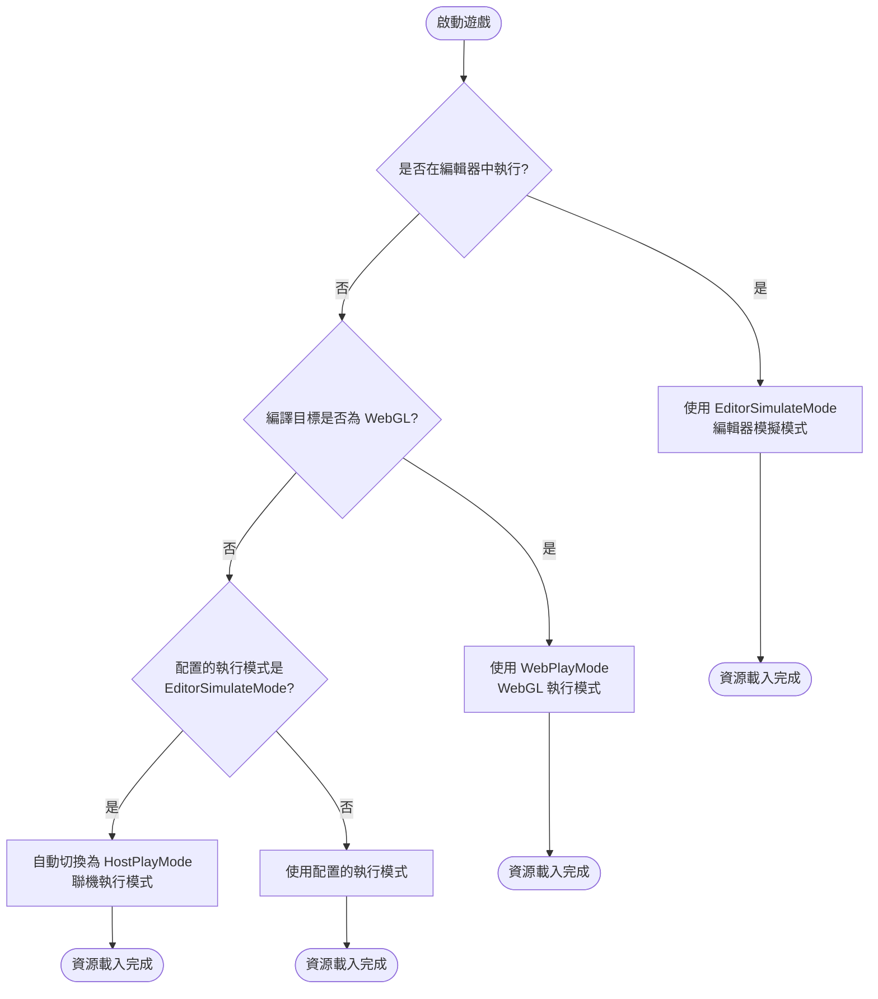
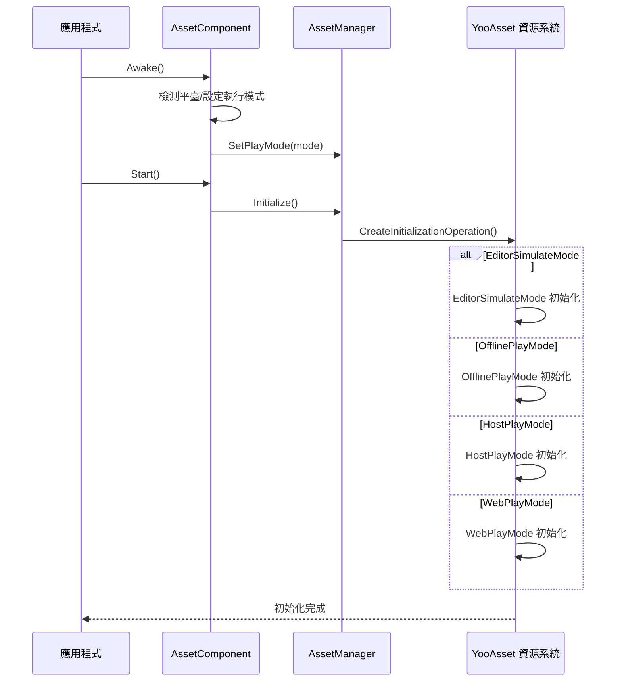

# 平臺支援概覽

GameFrameX Asset 組件支援多種 Unity 平臺，並提供了靈活的執行模式來適配不同的部署場景。本文件概述了系統支援的平臺、執行模式以及平臺自動檢測機制。

## 概述

GameFrameX Asset 組件基於 [YooAsset](https://www.yooasset.com/) 資源系統構建，提供了統一的資源載入介面，同時支援多種 Unity 平臺和執行模式。系統設計考慮了不同平臺的差異性，透過執行模式（Play Mode）來適配各種部署場景，包括編輯器開發、單機遊戲、熱更新遊戲以及 WebGL 平臺。

執行模式是理解平臺支援的核心概念。不同的執行模式決定了資源的載入方式和更新策略，開發者需要根據目標平臺選擇合適的執行模式。系統還提供了平臺自動檢測功能，在某些情況下會根據編譯目標平臺自動選擇最合適的執行模式。

## 支援的平臺

GameFrameX Asset 組件支援的平臺可分為以下幾類：

| 平臺分類 | 具體平臺 | 推薦執行模式 | 說明 |
|---------|---------|-------------|------|
| 編輯器 | Unity Editor | EditorSimulateMode | 用於開發階段的快速迭代 |
| PC平臺 | Windows, macOS, Linux | HostPlayMode / OfflinePlayMode | 支援熱更新或單機部署 |
| 移動平臺 | iOS, Android | HostPlayMode / OfflinePlayMode | 支援熱更新或單機部署 |
| Web平臺 | WebGL | WebPlayMode | 專門最佳化的 Web 平臺模式 |
| 小遊戲 | 抖音、快手、微信小遊戲 | WebPlayMode | 基於 WebGL 的小遊戲平臺 |

### 執行模式詳解

系統提供了四種執行模式，每種模式適用於不同的場景：

```csharp
// 執行模式定義 (來自 YooAsset)
public enum EPlayMode
{
    EditorSimulateMode,  // 編輯器模擬模式
    OfflinePlayMode,    // 單機執行模式
    HostPlayMode,       // 聯機執行模式（熱更新）
    WebPlayMode         // WebGL 執行模式
}
```

> Source: [AssetManager.Initialization.cs](https://github.com/GameFrameX/com.gameframex.unity.asset/blob/main/Runtime/Asset/AssetManager.Initialization.cs#L20-L46)

## 平臺選擇流程

系統在不同環境下會自動選擇合適的執行模式。以下是執行模式的選擇邏輯：



### 自動平臺檢測實現

在 `AssetComponent` 中，系統會在執行時自動檢測平臺並調整執行模式。以下是核心實現邏輯：

```csharp
protected override void Awake()
{
#if !UNITY_EDITOR
    // 在非編輯器環境下，如果配置了 EditorSimulateMode，自動切換為聯機模式
    if (GamePlayMode == EPlayMode.EditorSimulateMode)
    {
        GamePlayMode = EPlayMode.HostPlayMode;
    }
    
    // WebGL 平臺強制使用 WebPlayMode
#if UNITY_WEBGL
    GamePlayMode = EPlayMode.WebPlayMode;
#endif
#endif
    // ... 後續初始化邏輯
}
```

> Source: [AssetComponent.cs](https://github.com/GameFrameX/com.gameframex.unity.asset/blob/main/Runtime/Asset/AssetComponent.cs#L42-L64)

這種設計確保了：
- 開發階段可以使用模擬模式快速迭代
- 打包釋出後自動切換到合適的執行模式
- WebGL 平臺始終使用專門最佳化的 WebPlayMode

## 執行模式與初始化

不同的執行模式對應不同的資源初始化方式。系統在 `AssetManager` 中根據選定的執行模式呼叫相應的初始化方法：



### 各模式的初始化方法

系統在 `AssetManager.Initialization.cs` 中為每種執行模式提供了專門的初始化方法：

```csharp
private InitializationOperation CreateInitializationOperationHandler(
    ResourcePackage resourcePackage, 
    string hostServerURL, 
    string fallbackHostServerURL)
{
    switch (PlayMode)
    {
        case EPlayMode.EditorSimulateMode:
            return InitializeYooAssetEditorSimulateMode(resourcePackage);
        case EPlayMode.OfflinePlayMode:
            return InitializeYooAssetOfflinePlayMode(resourcePackage);
        case EPlayMode.HostPlayMode:
            return InitializeYooAssetHostPlayMode(resourcePackage, hostServerURL, fallbackHostServerURL);
        case EPlayMode.WebPlayMode:
            return InitializeYooAssetWebPlayMode(resourcePackage, hostServerURL, fallbackHostServerURL);
    }
}
```

> Source: [AssetManager.Initialization.cs](https://github.com/GameFrameX/com.gameframex.unity.asset/blob/main/Runtime/Asset/AssetManager.Initialization.cs#L18-L47)

## WebGL 與小遊戲平臺

WebGL 平臺是該組件的重點支援物件，除了標準的 WebPlayMode 外，還支援多種小遊戲平臺：

```csharp
private InitializationOperation InitializeYooAssetWebPlayMode(
    ResourcePackage resourcePackage, 
    string hostServerURL, 
    string fallbackHostServerURL)
{
    var initParameters = new WebPlayModeParameters();
    FileSystemParameters webFileSystem = null;
    
#if UNITY_WEBGL
#if ENABLE_DOUYIN_MINI_GAME
    // 抖音小遊戲特殊處理
    TTSDK.TT.PreloadConcurrent(10);
    // ... 建立 ByteGame 檔案系統
#elif ENABLE_WECHAT_MINI_GAME
    // 微信小遊戲特殊處理
    WeChatWASM.WXBase.PreloadConcurrent(10);
    // ... 建立 Wechat 檔案系統
#elif ENABLE_KUAISHOU_MINI_GAME
    // 快手小遊戲特殊處理
    KSWASM.KSBase.PreloadConcurrent(10);
    // ... 建立 KuaiShou 檔案系統
#else
    // 預設 WebGL 檔案系統
    webFileSystem = FileSystemParameters.CreateDefaultWebFileSystemParameters();
#endif
#else
    webFileSystem = FileSystemParameters.CreateDefaultWebFileSystemParameters();
#endif
    
    initParameters.WebFileSystemParameters = webFileSystem;
    return resourcePackage.InitializeAsync(initParameters);
}
```

> Source: [AssetManager.Initialization.cs](https://github.com/GameFrameX/com.gameframex.unity.asset/blob/main/Runtime/Asset/AssetManager.Initialization.cs#L85-L146)

### 支援的小遊戲平臺

| 平臺 | 預定義符號 | 特點 |
|-----|----------|------|
| 抖音小遊戲 | `ENABLE_DOUYIN_MINI_GAME` | 使用 ByteGameFileSystem |
| 微信小遊戲 | `ENABLE_WECHAT_MINI_GAME` | 使用 WechatFileSystem |
| 快手小遊戲 | `ENABLE_KUAISHOU_MINI_GAME` | 使用 KuaiShouFileSystem |

## 配置執行模式

在 Unity 編輯器中，可以透過 `AssetComponent` 組件配置執行模式：

```csharp
[Tooltip("當目標平臺為Web平臺時，將會強制設定為 WebPlayMode")]
[SerializeField]
private EPlayMode m_GamePlayMode;
```

> Source: [AssetComponent.cs](https://github.com/GameFrameX/com.gameframex.unity.asset/blob/main/Runtime/Asset/AssetComponent.cs#L20-L21)

配置步驟：
1. 在場景中建立或選擇帶有 `AssetComponent` 的 GameObject
2. 在 Inspector 面板中找到 "Game Play Mode" 屬性
3. 選擇適合的執行模式
4. 構建專案時，系統會自動根據目標平臺調整模式

## 執行模式選擇指南

根據不同的專案需求，選擇合適的執行模式：

| 場景 | 推薦模式 | 原因 |
|-----|---------|------|
| 編輯器開發除錯 | EditorSimulateMode | 快速載入，無需打包 |
| 單機獨立遊戲 | OfflinePlayMode | 資源內建，無需網路 |
| 需要熱更新的遊戲 | HostPlayMode | 支援資源更新 |
| WebGL 網頁遊戲 | WebPlayMode | 針對 Web 平臺最佳化 |
| 微信/抖音小遊戲 | WebPlayMode + 平臺符號 | 平臺原生支援 |

## 相關連結

- [WebGL 平臺配置](./7-platforms.webgl) - 詳細的 WebGL 平臺配置說明
- [執行模式](./6-configuration.play-modes) - 執行模式的詳細配置選項
- [資源載入介面](./5-api-reference.loading-api) - 資源載入 API 參考
- [組件配置](./6-configuration.component-settings) - AssetComponent 配置說明
