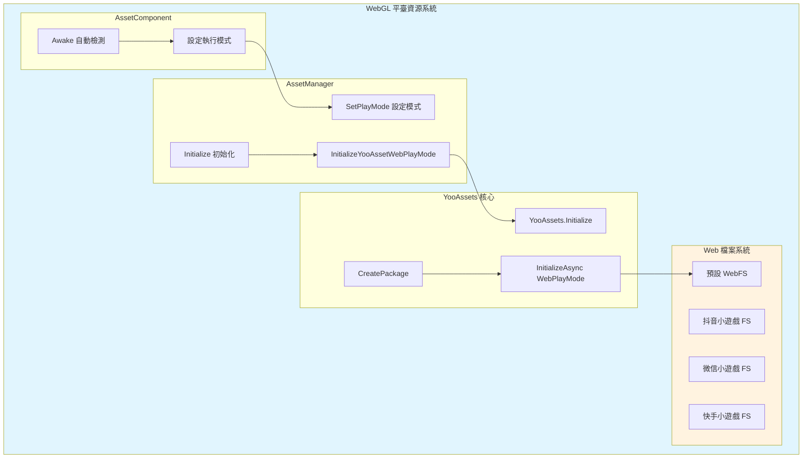
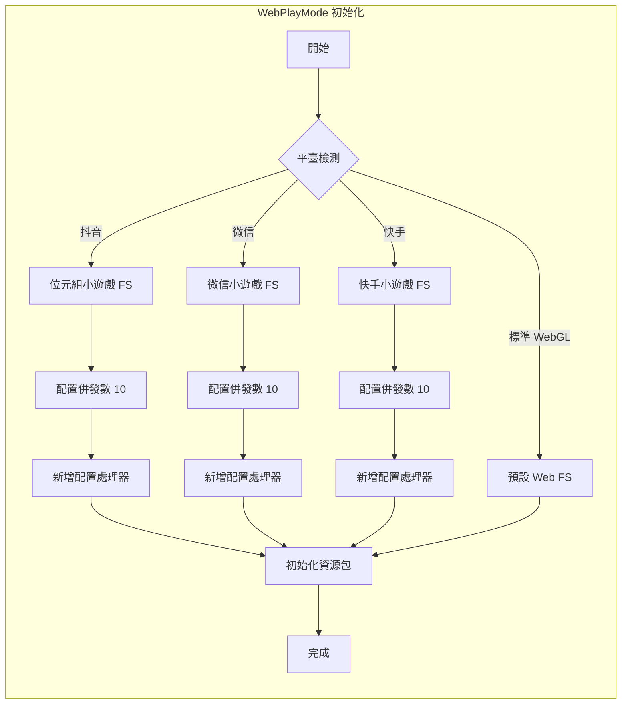

# WebGL 平臺

本文件介紹 GameFrameX Asset 資源組件對 WebGL 平臺的支援和配置。

## 概述

WebGL 平臺是 Unity 部署到 Web 瀏覽器的重要目標平臺。GameFrameX Asset 組件基於 YooAssets 框架，提供了完整的 WebGL 資源載入解決方案。該方案支援標準 WebGL 構建以及多種小遊戲平臺（抖音小遊戲、微信小遊戲、快手小遊戲）。

WebGL 平臺的主要特點包括：
- **瀏覽器環境限制**：無法使用傳統的檔案系統，需要特殊的資源載入機制
- **單執行緒執行**：JavaScript 環境下資源載入需要非同步處理
- **快取機制**：依賴瀏覽器快取儲存下載的資源
- **小遊戲平臺支援**：針對國內主流小遊戲平臺進行了專門適配

## 架構設計



### 核心組件說明

| 組件 | 職責 |
|------|------|
| AssetComponent | 在 Awake 時自動檢測 WebGL 環境並設定執行模式 |
| AssetManager | 管理資源初始化和載入，呼叫 YooAssets |
| YooAssets | 底層資源系統，提供 WebPlayMode 初始化 |
| Web 檔案系統 | 處理 Web 環境下的資源載入和快取 |

## 自動平臺檢測

GameFrameX 實現了智慧的自動平臺檢測機制。在非編輯器環境下構建時，AssetComponent 會自動識別目標平臺並選擇合適的執行模式。

```csharp
using GameFrameX.Asset.Runtime;
using UnityEngine;

[DisallowMultipleComponent]
[AddComponentMenu("GameFrameX/Asset")]
public sealed class AssetComponent : GameFrameworkComponent
{
    [Tooltip("當目標平臺為Web平臺時，將會強制設定為WebPlayMode")]
    [SerializeField]
    private EPlayMode m_GamePlayMode;

    protected override void Awake()
    {
#if !UNITY_EDITOR
        if (GamePlayMode == EPlayMode.EditorSimulateMode)
        {
            GamePlayMode = EPlayMode.HostPlayMode;
        }
#if UNITY_WEBGL
        GamePlayMode = EPlayMode.WebPlayMode;
#endif
#endif
        base.Awake();
        _assetManager.SetPlayMode(GamePlayMode);
    }
}
```

> Source: [AssetComponent.cs](https://github.com/GameFrameX/com.gameframex.unity.asset/blob/main/Runtime/Asset/AssetComponent.cs#L42-L64)

### 檢測邏輯說明

| 條件 | 行為 |
|------|------|
| 編輯器環境 | 使用配置的 GamePlayMode |
| 非編輯器 + EditorSimulateMode | 轉換為 HostPlayMode |
| 非編輯器 + UNITY_WEBGL | 自動切換為 WebPlayMode |
| 其他情況 | 保持配置的執行模式 |

## WebPlayMode 初始化流程

當設定為 WebPlayMode 時，AssetManager 會呼叫 `InitializeYooAssetWebPlayMode` 方法進行初始化。該方法支援多種 Web 環境配置。

```csharp
/// <summary>
/// 初始化YooAsset WebGL執行模式
/// </summary>
private InitializationOperation InitializeYooAssetWebPlayMode(
    ResourcePackage resourcePackage,
    string hostServerURL,
    string fallbackHostServerURL)
{
    var initParameters = new WebPlayModeParameters();
    FileSystemParameters webFileSystem = null;

#if UNITY_WEBGL
#if ENABLE_DOUYIN_MINI_GAME
    // 抖音小遊戲配置
    TTSDK.TT.PreloadConcurrent(10);
    GameEntry.GetComponent<AssetComponent>().gameObject
        .GetOrAddComponent<DouYinConfigHandler>();
    
    if (hostServerURL.IsNullOrWhiteSpace())
    {
        webFileSystem = ByteGameFileSystemCreater.CreateByteGameFileSystemParameters();
    }
    else
    {
        webFileSystem = ByteGameFileSystemCreater.CreateByteGameFileSystemParameters(hostServerURL);
    }
#elif ENABLE_WECHAT_MINI_GAME
    // 微信小遊戲配置
    WeChatWASM.WXBase.PreloadConcurrent(10);
    GameEntry.GetComponent<AssetComponent>().gameObject
        .GetOrAddComponent<WeChatConfigHandler>();
    
    string packageRoot = $"{WeChatWASM.WXBase.env.USER_DATA_PATH}/__GAME_FILE_CACHE/{YooAssetSettingsData.Setting.DefaultYooFolderName}";
    
    if (hostServerURL.IsNullOrWhiteSpace())
    {
        webFileSystem = WechatFileSystemCreater.CreateWechatFileSystemParameters();
    }
    else
    {
        webFileSystem = WechatFileSystemCreater.CreateWechatPathFileSystemParameters(hostServerURL);
    }
#elif ENABLE_KUAISHOU_MINI_GAME
    // 快手小遊戲配置
#if !UNITY_EDITOR
    KSWASM.KSBase.PreloadConcurrent(10);
#endif
    GameEntry.GetComponent<AssetComponent>().gameObject
        .GetOrAddComponent<KuaiShouConfigHandler>();
    
    if (hostServerURL.IsNullOrWhiteSpace())
    {
        webFileSystem = KuaiShouFileSystemCreater.CreateKuaiShouFileSystemParameters();
    }
    else
    {
        webFileSystem = KuaiShouFileSystemCreater.CreateKuaiShouPathFileSystemParameters(hostServerURL);
    }
#else
    // 標準 WebGL 檔案系統
    webFileSystem = FileSystemParameters.CreateDefaultWebFileSystemParameters();
#endif
#else
    // 非 WebGL 環境回退
    webFileSystem = FileSystemParameters.CreateDefaultWebFileSystemParameters();
#endif

    initParameters.WebFileSystemParameters = webFileSystem;
    return resourcePackage.InitializeAsync(initParameters);
}
```

> Source: [AssetManager.Initialization.cs](https://github.com/GameFrameX/com.gameframex.unity.asset/blob/main/Runtime/Asset/AssetManager.Initialization.cs#L85-L146)

## 小程式平臺支援

GameFrameX Asset 組件針對國內主流小程式平臺提供了專門的適配支援。

### 支援的平臺

| 平臺 | 預定義符號 | 特性 |
|------|-----------|------|
| 抖音小程式 | ENABLE_DOUYIN_MINI_GAME | 位元組小遊戲檔案系統 |
| 微信小程式 | ENABLE_WECHAT_MINI_GAME | 微信快取目錄配置 |
| 快手小程式 | ENABLE_KUAISHOU_MINI_GAME | 快手檔案系統適配 |

### 平臺初始化差異



### 配置處理器說明

每個小程式平臺都需要新增對應的配置處理器：
- **DouYinConfigHandler**：處理抖音小遊戲配置
- **WeChatConfigHandler**：處理微信小遊戲配置
- **KuaiShouConfigHandler**：處理快手小遊戲配置

這些處理器負責平臺特定的檔案系統配置和資源路徑對映。

## 資源包初始化

在 WebGL 平臺上使用資源包時，需要正確配置初始化引數：

```csharp
using UnityEngine;
using GameFrameX.Runtime;

public class WebGLBootstrap : MonoBehaviour
{
    private async void Start()
    {
        var assetComponent = GameEntry.GetComponent<AssetComponent>();
        
        // 初始化預設資源包
        bool success = await assetComponent.InitPackageAsync(
            "DefaultPackage",           // 包名稱
            "https://cdn.example.com/", // 主伺服器地址
            "https://backup.example.com/", // 備用伺服器地址
            true                        // 設為預設包
        );
        
        if (success)
        {
            Debug.Log("WebGL 資源包初始化成功");
        }
    }
}
```

## 執行模式配置

GameFrameX Asset 組件支援多種執行模式，WebGL 平臺主要使用 WebPlayMode：

| 模式 | 適用場景 | WebGL 支援 |
|------|----------|------------|
| EditorSimulateMode | 編輯器開發除錯 | ❌ 不支援 |
| OfflinePlayMode | 單機執行 | ⚠️ 有限支援 |
| HostPlayMode | 熱更新模式 | ⚠️ 有條件支援 |
| WebPlayMode | WebGL 執行環境 | ✅ 完全支援 |

> 關於執行模式的詳細配置，請參考 [執行模式](./6-configuration.play-modes) 文件。

## 常見問題

### Q1: WebGL 構建後資源載入失敗

**可能原因**：
- 伺服器地址配置錯誤
- CORS 跨域策略問題
- 資源包未正確構建

**解決方案**：
1. 檢查資源伺服器是否支援 CORS
2. 確認資源包已使用 WebGL 平臺構建
3. 驗證 hostServerURL 配置正確

### Q2: 小程式平臺資源載入緩慢

**可能原因**：
- 併發下載數過高
- 資源未進行分包處理

**解決方案**：
1. 在程式碼中調整 PreloadConcurrent 引數
2. 使用資源標籤進行按需載入
3. 啟用資源壓縮和合並

### Q3: 記憶體佔用過高

**可能原因**：
- 同時載入過多資源
- 未及時釋放資源控制代碼

**解決方案**：
1. 使用 `UnloadAsset` 及時釋放已使用完的資源
2. 合理設定 `DownloadingMaxNum` 控制併發
3. 定期呼叫 `UnloadUnusedAssetsAsync` 清理無用資源

## 相關連結

- [執行模式配置](./6-configuration.play-modes) - 詳細的執行模式說明
- [組件配置](./6-configuration.component-settings) - AssetComponent 配置詳解
- [資源載入介面](./5-api-reference.loading-api) - 非同步/同步載入 API
- [資源包管理](./5-api-reference.package-management) - 資源包操作
- [Asset 組件介紹](./1-overview.introduction) - Asset 組件概述
- [功能特性](./1-overview.features) - 完整功能列表
