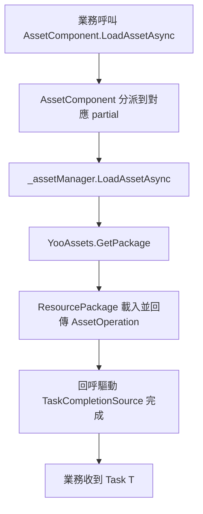

# 工作原理:資源元件與 YooAsset 的協作流程

`AssetComponent` 是框架在 Unity 一側對外暴露的資源門面,`AssetManager` 是它的執行期實作，二者均把 YooAsset 作為底層載入引擎。本頁解釋三者是如何銜接、初始化、分派任務並最終把資產交付給業務程式碼的。

## 角色分層

| 層 | 類型 | 職責 |
|----|------|------|
| 元件層 | `AssetComponent : GameFrameworkComponent` | 掛載於場景、序列化執行模式、把外部呼叫轉發到管理器層 |
| 管理器層 | `AssetManager : GameFrameworkModule, IAssetManager` | 面向業務提供 `LoadAsset` / `UnloadAsset` / `InitPackageAsync` 等 API,持有 `PlayMode` |
| 引擎層 | YooAsset(`YooAssets`、`ResourcePackage`) | 真正完成資源套件初始化、檔案定址、載入/卸載、快取 |

`AssetComponent` 在 `Awake` 中按 `ImplementationComponentType = Utility.Assembly.GetType(componentType)` 反射取得實作類別，並透過 `GameFrameworkEntry.GetModule<IAssetManager>()` 取得管理器單例，後續所有呼叫都經由 `_assetManager`。

## 啟動與初始化流程

1. `AssetComponent.Awake()` 讀取 `m_GamePlayMode`,在非編輯器或 WebGL 下把模式強制糾正後，呼叫 `_assetManager.SetPlayMode(GamePlayMode)`。
2. `AssetComponent.Start()` 觸發 `_assetManager.Initialize()`。
3. `AssetManager.Initialize()` 呼叫 `YooAssets.Initialize()`,並按需設定 `SetOperationSystemMaxTimeSlice`。
4. 業務呼叫 `AssetComponent.InitPackageAsync(packageName, host, fallback, isDefaultPackage)`,逐層轉發到 `AssetManager.InitPackageAsync`。

```csharp
// 摘錄自 AssetManager.cs:66-97
public Task<bool> InitPackageAsync(string packageName, string hostServerURL, string fallbackHostServerURL, bool isDefaultPackage = false)
{
    var taskCompletionSource = new TaskCompletionSource<bool>();
    // ... 參數驗證 ...

    var resourcePackage = YooAssets.TryGetPackage(packageName);
    if (resourcePackage == null)
    {
        resourcePackage = YooAssets.CreatePackage(packageName);
        if (isDefaultPackage)
        {
            YooAssets.SetDefaultPackage(resourcePackage);
        }
    }

    var initializationOperationHandler = CreateInitializationOperationHandler(resourcePackage, hostServerURL, fallbackHostServerURL);
    initializationOperationHandler.Completed += asyncOperationBase =>
    {
        if (asyncOperationBase.Error == null && asyncOperationBase.Status == EOperationStatus.Succeed && asyncOperationBase.IsDone)
        {
            taskCompletionSource.TrySetResult(true);
        }
        else
        {
            taskCompletionSource.TrySetException(new Exception(asyncOperationBase.Error));
        }
    };
    return taskCompletionSource.Task;
}
```

關鍵點:`TaskCompletionSource<bool>` 把 YooAsset 的回呼式 `InitializationOperation` 包裝成可 `await` 的 `Task<bool>`。

## 執行模式分派

`CreateInitializationOperationHandler` 是一個 switch 分派器，把 `EPlayMode` 對應到 YooAsset 的四種初始化參數：

| `EPlayMode` | YooAsset 初始化參數 | 典型用途 |
|-------------|---------------------|----------|
| `EditorSimulateMode` | `EditorSimulateModeParameters` + `CreateDefaultEditorFileSystemParameters` | 編輯器內直接以建置產物模擬載入 |
| `OfflinePlayMode` | `OfflinePlayModeParameters` + `CreateDefaultBuildinFileSystemParameters` | 單機/純本機 |
| `HostPlayMode` | `HostPlayModeParameters` + 內建檔案系統 + `RemoteServices` 快取檔案系統 | 需要熱更新 |
| `WebPlayMode` | `WebPlayModeParameters` + WebGL/小遊戲檔案系統 | WebGL、微信、抖音、快手小遊戲 |

```csharp
// 摘錄自 AssetManager.Initialization.cs:18-47
switch (PlayMode)
{
    case EPlayMode.EditorSimulateMode: return InitializeYooAssetEditorSimulateMode(resourcePackage);
    case EPlayMode.OfflinePlayMode:    return InitializeYooAssetOfflinePlayMode(resourcePackage);
    case EPlayMode.HostPlayMode:       return InitializeYooAssetHostPlayMode(resourcePackage, hostServerURL, fallbackHostServerURL);
    case EPlayMode.WebPlayMode:        return InitializeYooAssetWebPlayMode(resourcePackage, hostServerURL, fallbackHostServerURL);
    default: throw new ArgumentOutOfRangeException(nameof(PlayMode), PlayMode, $"Unsupported play mode: {PlayMode}");
}
```

`HostPlayMode` 還負責把主備兩個下載位址打包成 `RemoteServices`,分別作為 `CacheFileSystemParameters` 的下載來源與備援：

```csharp
// 摘錄自 AssetManager.Initialization.cs:155-164
var remoteServices = new RemoteServices(hostServerURL, fallbackHostServerURL);
var createParameters = new HostPlayModeParameters
{
    BuildinFileSystemParameters = FileSystemParameters.CreateDefaultBuildinFileSystemParameters(),
    CacheFileSystemParameters   = FileSystemParameters.CreateDefaultCacheFileSystemParameters(remoteServices),
};
```

## 載入與卸載的轉發路徑

各資源類型的便捷 API(`LoadAssetAsync<T>`、`LoadSceneAsync` 等)由 `AssetComponent` 的 partial 類別提供(例如 `AssetComponent.Prefab.cs`、`AssetComponent.Texture2D.cs`),它們最終都呼叫 `_assetManager` 上的同名方法;`_assetManager` 再用 `YooAssets.GetPackage(packageName)` 取得 `ResourcePackage`,執行 `LoadAssetAsync` / `TryUnloadUnusedAsset` / `UnloadAllAssetsAsync` 等操作。

卸載時，`AssetManager.UnloadAsset(string assetPath)` 預設作用於 `DefaultPackageName`,而帶套件名稱的多載則按指定套件名稱取得套件：

```csharp
// 摘錄自 AssetManager.cs:104-124
public void UnloadAsset(string assetPath)
{
    var package = YooAssets.GetPackage(DefaultPackageName);
    package.TryUnloadUnusedAsset(assetPath);
}

public void UnloadAsset(string packageName, string assetPath)
{
    var package = YooAssets.GetPackage(packageName);
    package.TryUnloadUnusedAsset(assetPath);
}
```

## 協作時序



## 背景

- 之所以把 YooAsset 嵌入 `GameFrameworkModule`,是為了讓框架上層元件和熱更新/多套件邏輯保持引擎無關；只有 `AssetManager` 直接 `using YooAsset`。
- `AssetComponent` 的 `Awake` 把 `EditorSimulateMode` 在非編輯器下改寫為 `HostPlayMode`,並把 `WebGL` 一律改為 `WebPlayMode`,防止打包設定錯誤。
- 多平台小遊戲支援(`ENABLE_DOUYIN_MINI_GAME` / `ENABLE_WECHAT_MINI_GAME` / `ENABLE_KUAISHOU_MINI_GAME`)在 `InitializeYooAssetWebPlayMode` 內透過編譯巨集分別建立對應的檔案系統，同時限制並行數，避免被平台底層限制拖垮。

## 相關連結

- [AssetComponent.cs](https://github.com/GameFrameX/com.gameframex.unity.asset/blob/main/Runtime/Asset/AssetComponent.cs)
- [AssetManager.cs](https://github.com/GameFrameX/com.gameframex.unity.asset/blob/main/Runtime/Asset/AssetManager.cs)
- [AssetManager.Initialization.cs](https://github.com/GameFrameX/com.gameframex.unity.asset/blob/main/Runtime/Asset/AssetManager.Initialization.cs)
- [AssetComponent.Prefab.cs](https://github.com/GameFrameX/com.gameframex.unity.asset/blob/main/Runtime/Asset/AssetComponent.Prefab.cs)