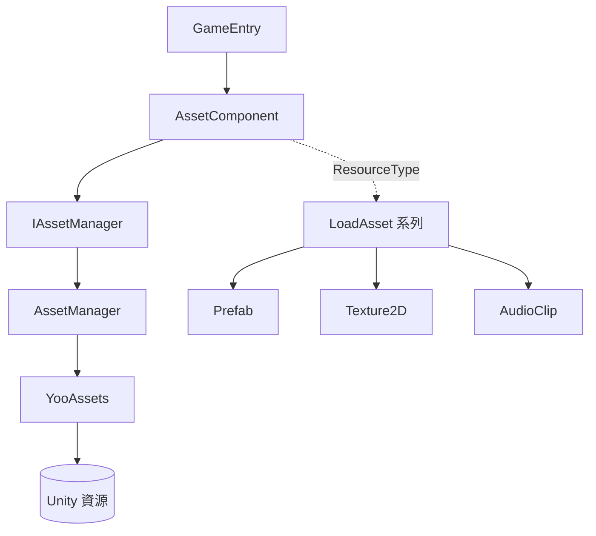

# 認識 GameFrameX Asset

GameFrameX Asset 是基於 GameFrameX 框架封裝的 Unity 資源管理元件,以 [YooAsset](https://github.com/tuyoogame/YooAsset) 為底層引擎,提供統一的資源載入、卸載與分包管理介面,讓遊戲執行時按路徑或類型安全地取得 `Prefab`、`Texture2D`、`AudioClip` 等 Unity 資源。

## 快速開始

1. 在 Unity 專案的 `Packages/manifest.json` 中加入 scoped registry,然後在 `dependencies` 節點下宣告相依性：

```json
{
  "scopedRegistries": [
    {
      "name": "GameFrameX",
      "url": "https://gameframex.upm.alianblank.uk",
      "scopes": ["com.gameframex"]
    }
  ],
  "dependencies": {
    "com.gameframex.unity.asset": "3.0.1"
  }
}
```

`scopes` 控制只有 `com.gameframex` 開頭的套件走這個登錄檔，其他套件仍走 Unity 官方來源。也可以直接把 Git URL 寫到 `dependencies`,或放進 `Packages` 目錄離線載入。

2. 在場景中確認 `AssetComponent` 已掛上(自動註冊到 `GameEntry`)。然後從 `GameEntry` 取得元件，呼叫載入介面：

```csharp
// 標準方式:透過 GameEntry(不依賴 com.gameframex.unity.entry)
var assetComponent = GameEntry.GetComponent<AssetComponent>();
assetComponent.LoadAsset("AssetPath");
```

## 工作原理速覽



- `AssetComponent` 是 `GameFrameworkComponent`,自動註冊到 GameFrameX 框架，在編輯器裡透過 `AssetComponentInspector` 進行設定。
- `IAssetManager` 是介面，預設實作 `AssetManager` 持有 YooAssets 的初始化操作 `InitializationOperation`、套件資訊清單以及載入/卸載任務佇列。
- 每種 Unity 資源類型對應一個 partial 檔案(如 `AssetComponent.Prefab.cs`、`AssetComponent.Texture2D.cs`),提供 `LoadAssetAsync` 等強型別介面。

## 接下來

- 安裝相依性與登錄檔設定：見 `README.zh-CN.md` 中的安裝章節。
- 各類型資源的載入介面：見 `Runtime/Asset/AssetComponent.*.cs` 系列檔案。
- 編輯器側 Inspector 設定：見 [AssetComponentInspector.cs](https://github.com/GameFrameX/com.gameframex.unity.asset/blob/main/Editor/Inspector/AssetComponentInspector.cs)。

## 相關連結

- 儲存庫位址：https://github.com/GameFrameX/com.gameframex.unity.asset
- 文件站：https://gameframex.doc.alianblank.com
- 問題回報：https://github.com/GameFrameX/com.gameframex.unity.asset/issues
- 原始碼主入口:[AssetComponent.cs](https://github.com/GameFrameX/com.gameframex.unity.asset/blob/main/Runtime/Asset/AssetComponent.cs)、[AssetManager.cs](https://github.com/GameFrameX/com.gameframex.unity.asset/blob/main/Runtime/Asset/AssetManager.cs)