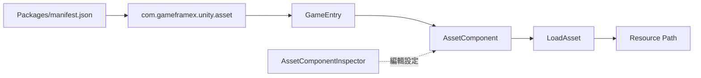

# 快速上手:安裝並載入第一個資源

安裝 `com.gameframex.unity.asset` 後，可透過 `GameEntry` 取得 `AssetComponent`，再用 `LoadAsset` 載入指定路徑的資源。本頁提供儲存庫 README 中可直接複製的安裝與呼叫路徑。

## 快速開始

### 前置條件

- Unity `2019.4`。
- 專案已安裝 GameFrameX 核心套件；目前套件清單宣告相依於 `com.gameframex.unity: 1.1.1` 和 `com.gameframex.unity.event: 1.1.0`。
- 準備一個可用的資源路徑，範例使用佔位字串 `AssetPath`；實際位址需替換為你的資源位址。

### 操作步驟

1. 在 Unity 中開啟 `Packages/manifest.json`，將套件加入 `dependencies`：

```json
{
  "dependencies": {
    "com.gameframex.unity.asset": "3.0.1"
  }
}
```

> Source: [README.zh-CN.md](https://github.com/GameFrameX/com.gameframex.unity.asset/blob/main/README.zh-CN.md#L32-L63)

2. 等待 Unity Package Manager 解析並載入套件。也可以選擇 README 列出的 scoped registry、Git URL 或直接放入 `Packages` 目錄的安裝方式。

3. 在專案程式碼中透過 `GameEntry` 取得 `AssetComponent`：

```csharp
var assetComponent = GameEntry.GetComponent<AssetComponent>();
assetComponent.LoadAsset("AssetPath");
```

> Source: [README.zh-CN.md](https://github.com/GameFrameX/com.gameframex.unity.asset/blob/main/README.zh-CN.md#L64-L70)

4. 將 `AssetPath` 替換成你的資源位址，然後實際執行你的資源載入流程。儲存庫目前套件版本為 `3.1.1`；README 的安裝範例使用 `3.0.1`，使用時應以專案鎖定版本為準。

```json
{
  "name": "com.gameframex.unity.asset",
  "version": "3.1.1",
  "unity": "2019.4",
  "dependencies": {
    "com.gameframex.unity": "1.1.1",
    "com.gameframex.unity.event": "1.1.0"
  }
}
```

> Source: [package.json](https://github.com/GameFrameX/com.gameframex.unity.asset/blob/main/package.json#L1-L25)

## 常見變體

| 安裝方式 | 設定 |
|------|------|
| Scoped registry | 註冊表 URL 為 `https://gameframex.upm.alianblank.uk`，scope 為 `com.gameframex` |
| Git URL | `https://github.com/gameframex/com.gameframex.unity.asset.git` |
| 本機目錄 | 將儲存庫直接放入 Unity 專案的 `Packages` 目錄 |

## 常見錯誤

| 症狀 | 原因 | 修正 |
|------|------|------|
| Package Manager 找不到套件 | `scopedRegistries`、scope 或版本不一致 | 檢查 `manifest.json` 的 `scopes` 是否為 `com.gameframex`，並確認 Unity 使用目標版本 |
| `GetComponent<AssetComponent>()` 無法編譯 | GameFrameX 核心相依套件未安裝，或未參考對應命名空間 | 安裝 `com.gameframex.unity: 1.1.1`；儲存庫原始碼未提供可安全照抄的完整命名空間用法，原始碼中未找到實作細節 |
| 無法載入資源 | 傳入的路徑不是有效資源位址，或元件/套件尚未準備完成 | 使用實際資源位址，並檢查套件載入與資源建置設定；儲存庫 README 未提供更具體的載入前置步驟 |

## 運作原理速覽

安裝完成後，Unity 透過套件清單載入 `com.gameframex.unity.asset`；執行時從 `GameEntry` 取得 `AssetComponent`，由該元件呼叫 `LoadAsset` 載入資源。編輯器側還提供 `AssetComponentInspector`，用於顯示 `资源运行模式` 和 `包列表` 設定。



> Source: [README.zh-CN.md](https://github.com/GameFrameX/com.gameframex.unity.asset/blob/main/README.zh-CN.md#L26-L29)；[README.zh-CN.md](https://github.com/GameFrameX/com.gameframex.unity.asset/blob/main/README.zh-CN.md#L64-L70)；[Editor/Inspector/AssetComponentInspector.cs](https://github.com/GameFrameX/com.gameframex.unity.asset/blob/main/Editor/Inspector/AssetComponentInspector.cs#L32-L40)；[Editor/Inspector/AssetComponentInspector.cs](https://github.com/GameFrameX/com.gameframex.unity.asset/blob/main/Editor/Inspector/AssetComponentInspector.cs#L73-L78)

## 接下來

- 關於資源套件的安裝、載入和執行時設定，優先參考 [專案 README](https://github.com/GameFrameX/com.gameframex.unity.asset/blob/main/README.zh-CN.md#L30-L80)。
- 關於套件版本和相依性約束，參考 [package.json](https://github.com/GameFrameX/com.gameframex.unity.asset/blob/main/package.json#L1-L25)。
- 關於 `AssetComponent` 的編輯器設定入口，參考 [AssetComponentInspector.cs](https://github.com/GameFrameX/com.gameframex.unity.asset/blob/main/Editor/Inspector/AssetComponentInspector.cs#L39-L78)。
- 官方文件入口：[GameFrameX 文件](https://gameframex.doc.alianblank.com)。